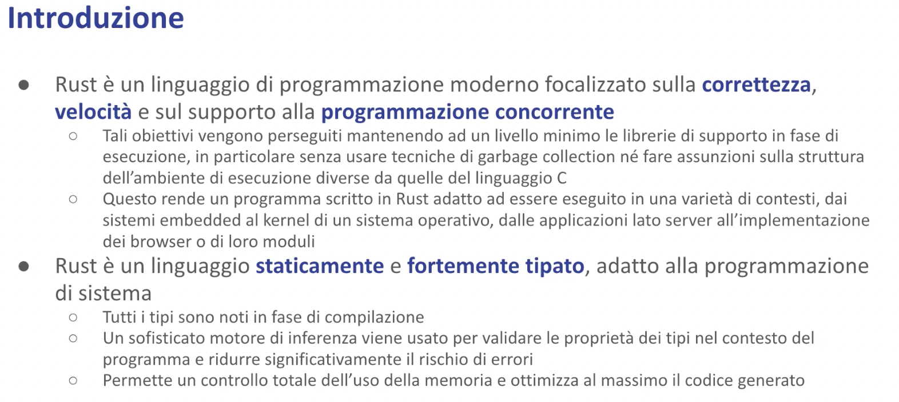

# Introduzione al linguaggio - Malnati 4 <!-- omit in toc -->

# Indice <!-- omit in toc -->
- [1. Introduzione](#1-introduzione)
  - [1.1 Storia](#11-storia)
- [2. Obiettivi del linguaggio](#2-obiettivi-del-linguaggio)
- [3. Confronto con altri linguaggi](#3-confronto-con-altri-linguaggi)
- [4. Caratteristiche](#4-caratteristiche)
  - [4.1 Sicurezza](#41-sicurezza)
  - [4.2 Prestazioni](#42-prestazioni)
  - [4.3 Linguaggio moderno](#43-linguaggio-moderno)
  - [4.4 Sicuro per definizione](#44-sicuro-per-definizione)
  - [4.5 Controllo a basso livello](#45-controllo-a-basso-livello)
- [5. Installare Rust](#5-installare-rust)
- [6. Cargo](#6-cargo)

# 1. Introduzione

Rust parte con il principio di garantire la correttezza del programma e contemporaneamente la velocità, che sono due argomenti che vanno diametralmente opposti.

Vedremo con un confronto con gli altri linguaggi di programmazione, che noi abbiamo dei linguaggi molto veloci ad alte prestazioni come C e C++, che però fanno poco sulla correttezza, e dei linguaggi ad alta correttezza come Haskell che però sulla velocità sono molto limitati.

E poi una serie in mezzo lungo la diagonale che unisce questi due estremi, dove si collocano i vari C#, Java, Python, etc..

In questa distribuzione Rust sta lassù in alto e contemporaneamente veloce e corretto.

E questo perché è stato scelto attentamente garantendo che tutte le feature del linguaggio devono impedire la presenza di undefined behaviours.

E contemporaneamente è costruito sul principio della ***zero cost abstraction***, ovvero se tu una certa feature non la usi non la devi pagare.

In C++ esiste ad esempio il polimorfismo, il problema è che il polimorfismo ti costa.
Ti costa il fatto che le tue chiamate diventano chiamate indirette, quindi tu non chiami più la funzione. Accedi a una zona di memoria dentro cui c'è un puntatore che punta alla tua funzione, e quindi devi fare due letture.

Lo devi fare sempre? Se dichiari un metodo virtual sì, però puoi anche non dichiararlo virtual.
In Java invece questa scelta non ce l'hai. Tutte le tue chiamate sono virtuali, che ti piaccia o no, che ti serva o che non ti serva, e quindi comunque tu hai sempre un costo più alto, eccetera..
Ci sono n posti dove questo principio vale.

Rust nasce con l’obiettivo di mantenere al minimo le librerie di supporto in fase di esecuzione.
Abbiamo detto la volta scorsa che l’esecuzione di un programma è data dal **compilato**, l’assembler che viene generato a partire da una istruzione, più la **RTL**, la runtime library.

L’obiettivo di Rust è tenere la runtime library microscopica, giusto quelle quattro funzioni minime che servono per copiare la memoria quando io ho bisogno di spostare un pezzo da una parte all’altra, fare il check dello stack overflow, vedere che non sto traboccando, e poco altro.
E questo gli garantisce grande cose.

E lo fa garantendo che la memoria venga correttamente gestita, rilasciata nel momento in cui si deve rilasciare, senza far ricorso a un garbage collector.
E quindi evitando tutte quelle situazioni di cui abbiamo parlato, in cui nel momento in cui non mi basta più la memoria che ho a disposizione, blocco tutto per fare spazio.

Questo rende un programma scritto in Rust adatto a funzionare in contesti molto eterogenei.

Da quelli molto piccoli, tipo compilare un programma in Rust per l’Arduino, a quelli molto grandi, magari su cloud, dove pensate di avere decine o centinaia di laboratori connessi insieme.

Va bene per fare il kernel del sistema operativo, Linux Torvald ci ha messo un po’, poi nel 2021, in qualche modo dopo essersi completamente sempre opposto all’uso del c++ per la scrittura dei moduli all’interno del kernel di Linux, invece ha riconosciuto che va bene scrivere dei moduli in Rust.

Rust è un linguaggio che è staticamente e fortemente tipato.

Staticamente tipato vuol dire che le variabili nascono legate a un tipo.
A differenza di quello che succede in Python o in JavaScript, dove io posso scrivere let v = “ciao” e poi una riga dopo scrivere v = 23, e quindi in momenti diversi quella variabile contiene dati di tipo diverso, in Rust quando introduco una variabile la introduco legata a un tipo.

Questo tipo lo posso dichiarare esplicitamente oppure semplicemente lo lascio dedurre al compilatore alla luce del valore di inizializzazione.
Quando dico let i = 10, il compilatore deduce che verosimilmente i è un i32, cioè un intero a 32 bit consegno.

Va bene per la programmazione di sistema perché tutti i tipi sono noti in fase di compilazione.

Il fatto che questi tipi, che sono molto ricchi perché il sistema dei tipi è un sistema di tipi generici, con i tratti, permette sostanzialmente al compilatore di dedurre tutto quello che esplicitamente non viene scritto nella maggior parte delle situazioni e di conseguenza poter intervenire e garantire che il codice che viene scritto sia sostanzialmente coerente.

La memoria è completamente sotto il controllo del programmatore che deve scegliere come usarla. 
E al programmatore sono dati gli strumenti potenti perché di puntatori ce ne sono un po’: ci sono i puntatori che possiedono, ci sono i puntatori che non possiedono, ci sono i puntatori mutabili (che permettono di andare a cambiare il dato che stanno puntando), e i puntatori a dati immutabili.
E queste informazioni il compilatore le usa e le propaga.

Ma vedremo che anche le stringhe sono una cosa ricchissima.
Se in C una stringa equivale a const char* e finisce lì, perché il linguaggio non ci dà altri supporti, il C++ aggiunge std string e poi finisce lì, vediamo che in Rust abbiamo una sacco di stringhe diverse, ognuna *tailored*, ritagliata su un bisogno.
Per cui certamente c’è il tipo ***std string*** che rappresenta una stringa generica mutabile, c’è il tipo ***ref str*** che invece rappresenta una stringa immutabile, visibile soltanto.
C’è il tipo ***os string*** che rappresenta una stringa così come la rappresenta il sistema operativo, c’è il tipo ***c string*** che rappresenta una stringa così come la vorrebbe vedere un programma scritto in C per poterci fare l’interoperabilità e altre..

E tocca al programmatore saper scegliere e destreggiarsi in questo mondo qua.

## 1.1 Storia

La versione 1.0 è del maggio 2015. La versione corrente è la 76, 1.76.0, uscita a febbraio.

Giusto per dare due cifre, all’interno di Firefox ci sono circa 3 milioni di righe scritte in Rust, che rappresentano il 9% del contenuto di Firefox.
Dropbox usa Rust nel suo motore di sincronizzazione, Amazon Web Services usa abbondantemente Rust all’interno di tutti i suoi motori di esecuzioni per le lambda function, per il database, eccetera.
Microsoft ha portato tutte le API di Windows all’interno di Rust, per cui tutte le system call di Windows sono chiamabili direttamente da Rust.
Google predilige l’uso di Rust per lo sviluppo di codice nativo in Android.

Giusto la settimana scorsa è uscito un annuncio della Casa Bianca “*White House urges devs to switch to memory safe programming languages, such as Rust*”.

Quando nasce Rust?
Dimenticando i primissimi anni che era un giocattolo, comincia a diventare significativo intorno al 2015, dove prende forma.

Allora, qui vi ho messo a confronto la crescita di progetti Rust all’interno di GitHub, in particolare il numero di stelle che sono state conferite ai progetti Rust all’interno di GitHub, confrontandole con quelli di Kotlin, che è un linguaggio che nasce più o meno negli stessi anni.

Vediamo che Kotlin ha un grosso impulso tra il 2017 e il 2018, quando Google decide che Kotlin diventa il linguaggio di Android, ed improvviso, boom, fa un salto.
Dopodiché non è che lo prende, continua a divergere. E Rust invece va su.

# 2. Obiettivi del linguaggio

Il linguaggio nasce per creare un linguaggio per la **programmazione di sistema**, quindi ad alte prestazioni, dove il programmatore abbia il controllo di quello che succede, ma privo di comportamenti non definiti.

Quindi esclude a priori, by design, tutte quelle situazioni nelle quali è possibile creare un undefined behaviour, e quindi generare del comportamento non ripetibile.

E contemporaneamente con un **supporto corretto all’esecuzione concorrente**.

Insieme all’enorme mole di problemi che nascono dall’uso scorretto della memoria, di cui abbiamo avuto abbondantemente modo di raccontarci, che sono poi alla fine tre o quattro casi, che però sono così frequenti da potersi mescolare ovunque, ci sono tutti i problemi che nascono dalla concorrenza.

L’**accesso concorrente** è un grosso casino: se io scrivo qua e tu nel frattempo stai leggendo, potrebbe darsi che leggi sbagliato perché io nel frattempo ti ho cambiato le carte in tavola.
Quindi bisogna metterci d’accordo, tu leggi quando io non scrivo, ma bisogna che ci parliamo perché questo succeda.
Bisogna concepire i programmi che avvengano in questo modo.

Rust nasce avendo sott’occhio che quella è un’altra fonte di guai grandissima, e ci dà una serie di strumenti precisi per gestire questo genere di situazioni, by design.

Terza cosa: **un linguaggio pratico**.
L’obiettivo di Graydon non era fare l’ennesimo linguaggio accademico, ce ne sono miliardi, inutile.
Include un compilatore robusto, che quando becca un errore ti spiega che errore ha preso.
Ma il compilatore è solo un pezzo, un linter che a priori ti dice “*guarda che qui c’è una cosa che puzza, non capisco. Di solito chi fa così sta scrivendo una schifezza*”.
Un **supporto alle dipendenze**: con Cargo, che è un sistema ispirato a npm, che invece gestisce centralmente le librerie.
Faccio un programma e scrivo che dipendo della libreria *vattelapesca* e lui automaticamente se la scarica e me la mette a disposizione, la verifica, controlla la versione e così via.

Mentre in C se volete includere una libreria, dovete andarvela a cercare, la scaricate. Che versione è questa libreria? Boh, è quella che ho sul disco, ma è l’ultima? Boh..

Offrire **astrazioni a costo nullo**.
Cioè dire che il linguaggio può darti un boost extra. Ma tu non sei obbligato a pagarlo.
Lo paghi solo se ne hai strettamente bisogno. E quindi se ne hai strettamente bisogno, vale la pena.Ma se non hai bisogno non lo paghi.

Sempre tornando all’esempio del polimorfismo, in C++ il polimorfismo noi lo otteniamo grazie al fatto che tutti gli oggetti si trovano in un campo nascosto, la Vtable, un puntatore alla Vtable che permette di gestire queste chiamate indirette.
Anche quando uso un oggetto che di per sé potrebbe essere polimorfico, ma io lo uso in modo non polimorfico, pago il costo, che mi piaccia o meno.

In Rust questa cosa non c’è, l’oggetto è nudo.
Se tu hai bisogno di usare polimorfico, è il tuo puntatore che diventa grasso: invece di avere un 64 bit come puntatore ne hai 128 perché diventa un doppio puntatore. Metà punta all’oggetto, metà punta alla Vtable.
Se tu invece hai bisogno di accedere in modo non polimorfico, ti resta il tuo puntatore slim.

Quindi offre al programmatore una pluralità di stili nel redigere i propri algoritmi.
Quindi supporta gli algoritmi iterativi, la ricorsione, le chiusure, supporta in generale il modello funzionale della programmazione, dà supporto a delle idee dell’Object Orientation senza essere un linguaggio ad oggetti.

Garantisce la generazione del miglior codice assembler possibile al momento in cui è stato realizzato il compilatore, ma loro ogni sei settimane te ne danno uno nuovo un po’ più performante senza introdurre costi aggiuntivi per quello che non ti interessa.

L’obiettivo è supportare la produttività del programmatore offrendo contemporaneamente costrutti di alto livello e un ecosistema di compilazione fortemente integrato che contiene il compilatore, la gestione delle dipendenze, i test e così via.

Tutto insieme facile da gestire.

Nasce con alcune scelte precise.

Una delle prime cose è stato dire “No Byte Code”. L’esperienza di Java molto utile, interessante. Compile once, run everywhere. Qualcuno l’ha tradotto “compile once, debug everywhere”.
Però non va bene perché? Perché l’uso del By Code mi allontana dal metallo. Byte Code è una macchina astratta. Rust si chiama Rust perché vuol dire *ruggine* e la ruggine è quello straterello sottile che si deposita sul metallo vivo.
L’idea è che è pensato per girare sul bare metal, non dentro una macchina astratta.
E quindi deve essere compilabile nel miglior modo possibile per processori completamente eterogenei. 

Abbiamo già detto che è fortemente tipizzato in fase di compilazione.
Il compilatore usa questi tipi tantissimo per anticipare tutta una serie di cose. Di base usa uno stile imperativo ma è fortemente influenzato dal modello funzionale e supporta completamente tutta una serie di comportamenti di alto livello.

Non dispone di garbage collector, non ha una runtime library specifica come può avere C# o JavaScript o qualcosa del genere e il sistema dei tipi è molto sofisticato.

# 3. Confronto con altri linguaggi

Questo era il disegno di parlavamo prima.

Sui due assi ci sono da un lato le prestazioni che equivalgono un po’ al livello di controllo che il programmatore ha sul codice che viene generato. Siccome io ho un alto livello di controllo posso ottenere delle prestazioni alte.

C e C++ mi danno con un piccolo delta un alto livello sulle prestazioni, su un alto livello di controllo, un alto livello di prestazioni e mi danno una scarsissima sicurezza.
Altre linguaggi, Go, Java, Python eccetera si mettono lì in mezzo.
Le prestazioni sono progressivamente più basse, il livello di sicurezza è progressivamente più alto. Haskell mi dà il massimo livello di sicurezza, prestazioni infime.

Rust è lassù. E’ un po’ meno del C. E se la gioca col C++.
Dipende quale aspetto guardate.
Su certe cosine il C++ va un po’ meglio, su certe altre va un po’ meglio il Rust.
On the average sono alla pari.

Rispetto a Python è decisamente più **veloce**. 
Però è pensato proprio per obiettivi totalmente distinti. Consuma molto meno in termini di memoria. È in grado di implementare il vero **multithreading**.

In Python a partire dalla versione 3.12 c’è un multithreading un pochino più vero, prima era proprio solo fake. Adesso è parzialmente più furbo.

Dispone dei **tipi algebrici**. Cos’è un tipo algebrico?
Tipi algebrici sono i tipi somma e i tipi prodotto.
Una struct, ad esempio, è un tipo prodotto — immaginate di avere una struct che contiene un campo stringhe e un campo numero: il suo dominio è fatto di tutte le coppie possibili tra stringhe e numero.
Quindi è il prodotto della cardinalità delle stringhe per la cardinalità dei numeri.
Viceversa un enum è un tipo somma perché è l’insieme delle cose che possono stare nel caso 1 unito all’insieme delle cose che possono stare nel caso 2.

Supporta l’**ereditarietà** in modo completamente differente. Cioè Rust non supporta l’ereditarietà in quanto tale: non c’è il concetto di classe e quindi non c’è il concetto di ereditarietà.
C’è però il concetto di ***tratto*** e i tratti vivono tra loro in una relazione di dipendenza.

Dispone di un meccanismo sofisticato di **pattern matching**, che è stato introdotto in Python nella versione 3.10 e rispetto a Python, Rust è staticamente orientato ai tipi.
Cioè il compilatore sa a priori che una certa variabile contiene solo valori di quel tipo lì, invece il compilatore Python non lo sa.
Questo fa sì che ci siano molti meno arresti anomali in fase di esecuzione proprio perché il compilatore può predire un mucchio di cose.

Rispetto a Java non c’è nessun overhead dovuto alla Java Virtual Machine e non ci sono le pause del garbage collector in quanto non c’è il garbage collector.

Consuma molto di meno la memoria quindi otteniamo degli eseguibili che in termini di fabbisogno sono molto più ridotti.

Non crea nessun costo di estrazione.

L’ereditarietà di nuovo è completamente distinta.
Java è un linguaggio basato sull’ereditarietà singola.

La programmazione generica è totalmente diversa.
Java realizza la programmazione generica con una tecnica che si chiama Type Erasure.
Quando in Java scrivete list<String> state semplicemente dicendo che voi avete una lista di oggetti. Che il compilatore sa che casualmente sono stringhe. Ma lo sa solo il compilatore poi se lo dimentica. Il tipo viene cancellato perché l’oggetto list è implementato per gli object.
Siccome tutto deriva da object, list di string è semplicemente un caso particolare di list di object.
Siccome però poi se lo dimentica, a runtime non c’è più traccia di questo, non ci può essere nessuna ottimizzazione che deriva dal fatto che io so che quelle sono proprio stringhe e che le stringhe sono grosse 20 byte e gli object sono grossi di un’altra cosa.

In Rust invece si usa un approccio che non è quello della Type Erasure ma è quello della **monomorfizzazione**. Che vuol dire che lui quando incontra list di string dice “ah questo è list di string”. Quindi fa una versione particolare del set di algoritmi di list tarata per le stringhe.
E quando dopo facciamo una la list di i32, che è la lista dei numeri interi con segno, ne fa una versione diversa, ottimizzata per il fatto che quelli sono interi a 32 bit.
E’ lo stesso approccio che segue anche il C++.

Questo permette ai tipi generici fatti in questo modo di essere molto più performanti rispetto a quello che succede in Java.

Dispone del Pattern Matching che in Java è stato introdotto solo parzialmente con la versione 21. C’è un unico sistema di compilazione mentre in Java compilate con Java che poi avete la Just-in-Time Compilation nel momento in cui viene fatto loading, cioè ci sono un po’ di differenze.

E Java non ha nessun sistema di gestione delle dipendenze suo del linguaggio.
Potete usare Maven, potete usare Gradle, ma non sono del linguaggio, sono della comunità che li ha adottati.
E la comunità non è sempre così allineata sulle cose.

Rispetto al C++ e al C non ci sono segmentation fault. Non ci sono segmentation fault perché non esiste il NULL. In C++ esiste NULL PTR, qua non c’è.
I puntatori, almeno i puntatori safe, non possono semplicemente essere nulli perché non fa parte del linguaggio.

Non ci sono buffer overflow, non ci sono corse critiche dovute al fatto che in due cerchiamo in contemporanea di accedere alla stesso dato.

Il sistema dei tipi è molto più elaborato, l’eredità in Rust non c’è, in C neanche, e in C++ invece c’è un’ereditarietà multipla.

Il processo di costruzione è unificato, e la gestione delle dipendenze è integrata.

Go è un linguaggio che come Java adotta un bytecode intermedio, usa la memoria managed, e quindi abbiamo un garbage collector che comporta le pause.

In Go esistono i puntatori nulli e quindi possono esistere null pointer exception.

La gestione degli errori è fatta in modo completamente diverso, Go usa il throw e di qua invece il concetto di throw e catch non c’è, è sostituito dall’idea che una funzione ritorna una monade, che è un tipo algebrico, di result, che incapsula o il risultato o il fallimento.

E quindi non c’è rischio di perderseli.

La programmazione concorrente è sicura, Go ha questa idea delle goroutine, che è una forma di implementare l’esecuzione asincrona in contesti multi-threaded, che però richiedono che il programmatore comprenda alcuni punti e si sforzi di mettere i costrutti di sincronizzazione là dove servono.

In Rust non potete fare una cosa non sincronizzata, il compilatore vi blocca.

L’approccio all’ereditarietà è diverso, non ci sono costi di estrazione e la gestione delle dipendenze è diversa.

# 4. Caratteristiche

## 4.1 Sicurezza

Cosa non può esserci in Rust?

Non ci possono essere dangling pointer.
A differenza di quello che succede in C e C++, una famiglia di puntatori di Rust si porta dietro il concetto di **tempo di vita**.
Il puntatore ha associato un tempo di vita, il compilatore conosce quel tempo di vita e usa l’informazione del tempo di vita per poter dire se è lecito o non è lecito accedervi.

Ricordate quando abbiamo parlato quali sono i problemi dei puntatori in C? Dato un puntatore posso sapere se è valido o meno? La risposta è no.

Qui invece sì, perché io non posso assegnare a un puntatore null se non derivandolo da un dato esistente.
E in più, questi puntatori si portano dietro l’etichetta del tempo di vita, che il compilatore valida, per cui non posso accedere né prima né dopo della loro validità.
Se provo a farlo il compilatore mi blocca. Non il runtime, il compilatore!

Non ci sono corse critiche, cioè l’accesso contemporaneo da parte di due thread a un certo dato.

Non ci sono buffer overflow, perché le strutture la cui dimensione è variabile sono tutte rappresentate con dei ***fat pointer***, ovvero dei puntatori che si portano insieme non solo l’inizio, come succede in C, ma anche la dimensione.
Questo mi costa un po’ di più, ma mi garantisce che nel momento in cui accedo io so che quello lì in questo momento è 32 byte, oppure 65, oppure 1900.

Uno dei grossi problemi, mentre io visito una lista, una struttura dati complessa e lo faccio guardando gli elementi uno per volta, è che potrei trovarmi nella situazione che mentre osservo cosa c’è lì dentro, vorrei dire “butta via un pezzo”.
In Java hanno dovuto costruire un’astrazione un po’ stramba per cui l’oggetto iterator vi dà il metodo delete, ad esempio, per dire “mentre scorri questa lista, questo buttalo via”.
In C++ non c’è questa faccenda, quindi l’iterator funziona a modo suo. Se cancelli mentre iteri, il comportamento dell’iteratore è ignoto.Può capitare di tutto.
Qua non può succedere.

C’è il controllo dell’overflow aritmetico per cui se fate 2 miliardi più 2 miliardi il risultato non vi fa a meno 294 mila, come invece succede in C++.

In più, viene favorito l’uso dell’immutabilità per evitare di compromettere i dati.

## 4.2 Prestazioni

Uno degli aspetti interessanti è che il compilatore ottimizza in modo aggressivo sia la dimensione del codice che viene generato che la velocità.
Potreste non notarlo all’inizio perché quando compilate il vostro exe, lui si porta dentro tutto quello di cui ha bisogno a supportare poi la sua effettiva esecutiva, a differenza di quello che capita in C++ dove buona parte delle librerie sono caricate dinamicamente.
Quindi se voi guardate la dimensione dell’exe, vedete che l’hello world di C++ rischia di essere 50 byte, l’hello world di Rust rischia di essere 500 kilobyte.

Voi dite “che schifo”. No, attenzione. Vai a vedere l’impronta runtime.
Cosa c’è nel processo mappato lì dentro? C’è il tuo hello world e una paccata di DLL.
Nel processo Rust c’è tutto quello che c’è scritto nel suo exe.
È tanto, sì, ma intanto è quella roba lì. La vedi tutta.

Quindi, fatto salvo questo che è giusto metterlo in evidenza, le singole funzioni sono aggressivamente ottimizzate, cioè cercando davvero di togliere tutto e di garantire il massimo livello della funzionalità.

Tutto è stato pensato sapendo che l’architettura degli elaboratori è basata sulla cache e quindi sono state scelte delle implementazioni che sono *cache aware*, che cercano di ridurre ad esempio il doppio salto, perché il doppio salto molto probabilmente provoca un cache miss.
Un cache miss, abbiamo visto nella tabellina dell’altro giorno, che se il cache di primo livello costa due secondi, accedere alla RAM costa quattro minuti. È un delta significativo.

La maggior parte delle invocazioni sono basate su **indirizzi statici** che permettono l’ottimizzazione in line e quindi io il più delle volte non chiamo una funzione.
Se quella funzione lì è piccola, il codice di quella funzione viene direttamente incastrato là dove c’è la chiamata, perché mi costa di meno.
Il mio programma resta pulito lo stesso, non me ne accorgo, ma alla fine il compilatore può scegliere di fare le cose in questo modo se lo ritiene opportuno.

La gestione di cargo, quindi il sistema per la gestione delle dipendenze, la suddivisione dei moduli, la presenza del sistema di test integrato e così via, garantisce non solo la qualità di quello che stiamo facendo, ma anche l’accesso a una vasta serie di librerie open source che il più delle volte ci danno delle soluzioni veramente di alto livello per quello che abbiamo bisogno di fare.

## 4.3 Linguaggio moderno

Quindi c’è la gestione dei tipi generici basato sulla monomorfizzazione e non quella della Type Erasure di Java.

Supporta tipi algebrici e i pattern, quindi supporta sia le struct e le tuple sia le enum che sono invece tipi di somma.

Match è una particolare istruzione che non ha nessun correlazione con altri linguaggi, l’unico che gli assomiglia molto lontanamente è il when di Kotlin, che dà la possibilità di esprimere in modo sintetico un branching dell’esecuzione tenendo conto che tutte le possibili alternative devono essere necessariamente rappresentate.

C’è una strumentazione moderna associata al programma che ci consente di fare il linting, cioè controllare che non ci siano code smell, di fare la formattazione in automatico in modo tale che il codice risulti scritto secondo un unico standard che facilita la lettura da parte delle persone, che facilita l’integrazione con moduli esterni, la gestione delle dipendenze e così via, la profilazione e altro.

## 4.4 Sicuro per definizione

Il pezzo più primo con cui andremo a scontrarci nel parlare di Rust è il concetto di “***possesso***”.

Abbiamo già detto che alcuni puntatori “posseggono” il loro valore, altri non posseggono il loro valore.
E quando abbiamo parlato di possesso, come l’abbiamo definito il possesso?
Il possesso è un *diritto-dovere*.
È il diritto di accedere al dato, è il dovere di rilasciarlo alla fine della mia vita.

Questi però, in C e C++, sono concetti che non sono espliciti e non sono neanche dati a tutti.

In Rust, viceversa, ogni valore è posseduto da una e una sola variabile.
Quando quella variabile cessa di esistere, il valore viene rilasciato.

“Ah, ma allora non è possibile passarsi delle cose?”
Sì, è possibile.

Perché Rust unisce al concetto di possesso il concetto di ***movimento***.
Non solo un dato è posseduto da una e una sola variabile, ma quando io, ad esempio, invoco una funzione e passo un dato come parametro, quello che sto facendo è che sto cedendo quel dato alla funzione.

Quel dato lì fisicamente perde il suo indirizzo, stava allocato a 3b7f, e viene ceduto e va nella locazione 7c49 o qualcosa altro. Si è mosso.

“Eh, ma se c’era qualcuno che lo conosceva?” 
E qui interviene il controllo dei tipi. Dice “Tu puoi muoverlo se non c’è nessuno che lo conosce. E se c’è qualcuno che lo conosce invece non lo muovi, guarda un po’ perché…”.
E ti obbliga a scrivere le giuste le cose.

I puntatori sono tutti controllati in fase di compilazione.

I thread possono essere, fanno parte del linguaggio, il linguaggio ha std sync thread come parte della libreria standard, quindi non è stato aggiunto a posteriori, e soprattutto ha un insieme di tratti che determinano per ciascun tipo se è lecito o meno che quel tipo lì sia passabile da un thread all’altro o se il puntatore a quel tipo lì sia passabile da un thread all’altro.

I tratti si chiamano sync e send e rispettivamente se un dato è send quel dato può essere ceduto a un altro thread, se non è send non può essere ceduto, ti blocca.
Al contrario, nel caso di un dato di tipo sync, l’indirizzo di quel dato lì può essere ceduto a un altro thread, altrimenti non può essere ceduto.

Il compilatore verifica nel momento in cui scriviamo del codice multithread che cosa stiamo facendo conoscere da un thread all’altro e ci blocca quando facciamo delle operazioni sbagliate.

Non ci sono stati nascosti.
Perché a differenza di quello che capita in C++, ad esempio con la gestione delle eccezioni, in C++ una funzione come in Java, come in JavaScript, come in altri linguaggi, potrebbe non arrivare al fondo, potrebbe lanciare un’eccezione: bloccarsi a metà.
Cosa succede quando si lancia un’eccezione? Si lancia un’eccezione e quella funzione lì ritorna.
Ma ritorna in un modo diverso dal ritorno normale, perché non atterra nel chiamante.
A meno che il chiamante non l’abbia racchiuso in un blocco try-catch.
Se il chiamante non c’è al blocco try-catch il chiamante viene allegramente saltato, si torna al chiamante del chiamante, si torna al chiamante del chiamante, fino a che non si atterra in un blocco try-catch.

E quindi io mi trovo in situazioni dove so di aver iniziato una cosa ma non la posso finire.
Perché per via dell’eccezione che si è verificata da qualche parte, in qualcuno che ho chiamato, che io non vedo, di cui non ho nessuna percezione, non sono arrivato al fondo.
E questo rende scrivere degli algoritmi coerenti molto complicato.

Oppure porta a scrivere degli algoritmi vomitevoli, cioè pieni di try-catch, che però rendono illeggibile il codice.

Rust da questo punto di vista dice “le eccezioni non ci sono”. Dopodiché la computazione può fallire. Non vuol dire che non ci sono fallimenti, ma non implementati col concetto di eccezione.

Le funzioni che possono fallire ritornano un tipo algebrico, ***result***, che può valere ***Ok***, e se vale ok racchiude quello che vi pare, x, dove x è di tipo che vi fa piacere, oppure ***error***, e se vale error racchiude il tipo y, che è la tipologia di dato che volete usare per rappresentare il vostro error. Può essere una stringa, può essere un’altra cosa che vi fa capire che cosa è successo.

Ma la funzione chiamata ritorna sempre.
E quindi il chiamante ha il compito poi di guardare cosa è diventato dentro.

Quel tipo lì è una monade, ovvero è una cosa che incapsula il suo contenuto e te lo fa vedere, non ti lascia accedere direttamente, ti obbliga a sbustarlo, e quindi richiede un’operazione conscia al programmatore: *Che cosa mai mi è tornato da sta roba qua?* If result is error ci faccio certe cose, if result is Ok ce ne faccio delle altre. Questo obbliga a essere consapevoli di quello che succede.
In più ci sono una serie di syntactic sugar che rendono la scrittura del codice molto snella, nella maggior parte dei casi: *se è un errore non posso farci niente* → Questo viene risolto allegramente con una notazione sintattica che dice “oh beh, ritorna questo stesso errore al chiamante che lo gestirà lui”, ma lo faccio in modo esplicito.
Mentre in Java, o anche in C++, questo avviene implicitamente, senza che io me ne renda conto. E questo può portare a delle situazioni molto brutte.

## 4.5 Controllo a basso livello

C’è un controllo a basso livello per cui la memoria viene rilasciata non appena una variabile esce di visibilità. Ogni valore è posseduto da una variabile. Quando quella variabile lì esce di visibilità il valore viene liberato, la memoria viene buttata via.

In alcuni casi questo vuol dire che lo stack si contrae, in altri casi vuol dire che lo heap riprende possesso di un buchino nel cui era stato allocato quel valore.

Questo fa sì che non ci siano sprechi di memoria, dovuti al fatto che io ho montagne di cose che sono lì pendenti in attesa che il garbage collection scatti e vada a raccogliere.

Posso chiamare direttamente le system call.
Tra le tante system call che posso chiamare ci sono quelle ad esempio per la creazione di nuovi processi come *fork*.
Nei linguaggi dove invece c’è la garbage collection io non posso chiamare la fork perché il nuovo processo che si verrebbe a creare ha dei presupposti diversi da quello originale.

Può essere eseguito su dispositivi senza sistema operativo, tanto che lo posso compilare per Arduino. Non ha bisogno dell’esistenza del sistema operativo.

E poi ha un sistema chiamato ***FFI***, *foreign function interface*, che mi garantisce la chiamabilità di funzioni C. Per cui se ho bisogno, ho già una libreria fatta, che so che funziona, che ha tutte le sue caratteristiche, la posso invocare.
E al contrario posso esporre un modulo Rust dicendo che è il binding per il C, in modo tale che la mia libreria scritta in Rust sia chiamabile dal C o dal C++.

# 5. Installare Rust

Se lo scaricate oggi è verosimile che tra dieci giorni possiate fare la start update e lui si scarica automaticamente la versione nuova.

Ci sono una serie di toolchain differenti, alla fine il compilatore Rust è distribuito, va compilato anche lui, e produce dei moduli eseguibili che devono essere linkabili con il resto del vostro sistema operativo per poter chiamare le system call.
Per farlo c’è bisogno che sulla vostra macchina ci sia un linker opportuno e eventualmente un compilatore C opportuno.
Chi ha la macchina Windows può scegliere se prendere la versione basata su MSWC, quindi Microsoft Visual C, senza bisogno di installarsi Visual C, scarica solo i compilatori, sono gratuiti, se lo fa lui per i fatti suoi.
Dovete solo scegliere se volete quella toolchain lì o se volete quella su sigwin, che è il porting di GCC su Windows. Normalmente quella di MSWC è un po’ più performante.

Viceversa, se avete un Mac o un Linux, nel caso del Mac viene fatto per Clang e se avete un Linux il supporto è quello di GCC all’ultima versione.

Nel momento in cui scaricate, fate Rustup, non solo vi ritrovate il programma Rustc che è il vero compilatore, ma vi ritrovate anche il programma Cargo che è il gestore dei progetti.

Notate che Rustc probabilmente non lo chiamerete mai direttamente voi, perché è molto più semplice creare un progetto con Cargo, *Cargo init*, fa esattamente come npm init, vi crea una directory nuova dentro cui deporita un file Cargo.toml e ci mette all’interno un primo main.rs che poi voi potete estendere con le vostre cose.

Quando avete una configurazione di quel genere il comando Cargo build automaticamente compila, linka le librerie che deve linkar, cioè fa tutto quello di cui avete bisogno.
Cargo check viceversa vi esegue il linting e controlla che non ci siano schifezze e così via.
Cargo profile vi fa il profiling del vostro programma.

# 6. Cargo

Quindi Cargo è realmente il vostro amico principale, lo usate per gestire il vostro progetto.
Rust usa una sua terminologia a cui bisogna un po’ adattarsi.

Il progetto si chiama **package**, perché lo impacchettate.
All’interno di questo del vostro package, tipicamente il package sta in una cartella all’interno della quale ci mettete il file Cargo.toml, che è un file di testo scritto o indentato in qualche modo con delle sezioni che descrive che versione di Rust usate, quali sono le dipendenze, se volete mettere un copyright, se volete mettere degli altri metadata associati etc...

E quando l’avete fatto potete compilare direttamente con Cargo build e Cargo run.

Eseguendo `cargo init rust1` ci pensa un po’ e mi dice “*created binary package*”.
Visto che non mi hai detto nient’altro, penso che tu voglia fare un programma, un eseguibile, una cosa che puoi lanciare direttamente.

L’alternativa era dire Cargo init, nome del mio programma, - - library.
E allora lui mi creava lo scheletro di una libreria.

La differenza tra un programma e una libreria è che il programma ha un main, la libreria non ce l’ha. 
Perché la libreria deve essere usata da qualcun altro.

Adesso faccio ls e vedo che mi ha creato una cartella che si chiama Rust 1. E dentro trovo il file Cargo.toml e un’altra cartella che si chiama source.

All’interno della cartella source al momento c’è un unico file, main.rs.

Vediamo prima cosa c’è dentro Cargo.toml:

Name Rust 1, il nome del progetto che ho creato. Lui ce l’ha come metadato.
Versione 0.1.
Edizione 2021. L’edizione 2021 ha a che fare con quale versione del linguaggio Rust stiamo compilando.

Ci sono tre edizioni principali al momento: l’edizione 2015, la più antica. L’edizione 2018. E qui abbiamo l’edizione 2021.
Ha a che fare con i costrutti del linguaggio che sono supportati.
Ogni tre anni c’è un’edizione nuova.

Quindi tra un po’ uscirà l’edizione 2024 che aggiornerà ulteriormente la sintassi. Semplificandola probabilmente.

Poi c’è un commento.

Fin qua è tutta la sesione [package], dove scrive tutte le cose che riguardano il progetto.

Poi, sotto, c’è la sezione [dependencies], ma ora è vuota quella sezione lì perché non stiamo usando nessuna libreria esterna.

Se qui dentro noi ci aggiungessimo dei riferimenti a una libreria esterna, io magari gli scriverei che ne so, che dipendo dalla libreria Tokyo versione 1.37, dopo aver scritto quella cosa lì, se faccio Cargo Build lui dice “ah caspita ma tu mi hai detto questo, io non ce l’ho ancora, aspetta, me la vado a scaricare, te la salvo in una cartella nascosta che è la tua home/.cargo, non è importante, da qualche parte, e poi te la compilo anche, dopodiché ce l’hai nel tuo progetto”.

Andiamo a vedere cosa c’è dentro src:

Il minimo che sia possibile scrivere.

Facciamo Cargo Build:

E’ lenta la compilazione, per fare Low Word ci mette 2,28 secondi.
E’ lenta perché in realtà fa un mucchio di cose in compilazione. Vi salva un mucchio la vita, e quindi alla fine perlomeno debuggerete molto meno grazie al fatto che quella compilazione lì è lenta.

Se vado a vedere che cosa è successo, vedo che sono cresciute le cose.

Lui automaticamente, quando ho fatto `cargo init`, ha già fatto una cartella .git, c’è già un commit lì sopra dell’initial version.

Mi ha già creato un git ignore, dicendo “Guarda che sono dei file che non servono, cioè che non devi, se mai vai a mettere un origin remota, non devi salvarli dall’altra parte, perché sono legati alla tua implementazione”.

Mi ha aggiunto, accanto al file Cargo.toml, il file Cargo.lock.

Che differenza c’è tra il file Cargo.toml e il file Cargo.lock?

Come qualcuno di voi che ha un po’ di conoscenze su JavaScript sa che i progetti JavaScript hanno del NPM la versione base e la versione con lock.

La versione con lock è una versione verbosa della versione base che è esplicita di tutte le dipendenze, è la versione effettiva, mentre di solito nelle dipendenze raccontiamo la versione minima necessaria, che garantisce la riproducibilità del processo di compilazione in ambienti diversi.

Accanto alla cartella source è comparsa la cartella target.

Se vado a vedere cosa c’è, vedo che all’interno è comparsa un file CACHEDIR.TAG che serve a lui per ricordarsi a che versione della compilazione è andata, c’è un hash lì dentro che gli serve.

E poi c’è debug, cioè la versione debug del nostro programma. Vediamo cosa c’è dentro:

All’interno ci trovo il risultato della compilazione, tra cui rust1 che è il mio programma.

Vedete che è vomitevole? 460k era quello che vi dicevo prima, perché dentro ha tutte le librerie che gli servono per l’esecuzione. Quella è l’immagine del processo.
Dentro ci troviamo delle altre cose che sono i vari pezzi di cui lui ha bisogno durante la compilazione.
Questa cartella qua è tutta cancellabile, la potete pulire quando volete.

Se voi fate `cargo clean`, rimorsi i 27 file ha pulito un megabyte di schifezze.

Se io scrivessi cargo run, lui adesso si accorge “caspita ma mi ha appena cancellato l’eseguibile”. Lo rifà e poi lo lancia.

Cargo check, checking. E’ sufficientemente piccolo che non ci sono schifezze. Se no qua in mezzo ci avrebbe scritto “alla riga 75 ho visto sta roba che non mi piace, alla riga 89 c’è quest’altro aggeggio un po’ strano” e così via.

Posso usare librerie, come?
Posso aggiungerci delle librerie nella sezione “dependency” del Cargo.toml, o posso farlo automaticamente con “cargo add”.

Va bene, qui ho citato un po’ di ambienti che potete scaricarvi, vedete un po’, “vs code”, “rastrover”, che è quello che uso io, potete fare con “eclipse”, potete fare con “sublime”, potete fare con “atom”, potete fare “neoveam”, un po’ a piacimento.

Il **package** è il progetto.

Il progetto contiene uno o più “**crate**”, che significa contenitore.
C’è il “crate” principale, che è il vostro main, e poi ci possono essere altri contenitori: sono le librerie di cui si serve.

Il vostro “crate” principale viene chiamato “crate root”, coincide col codice che è scritto nel file “main.rs” o quello che è presente nel file “lib.rs”, se state facendo una libreria.

Notate che il punto di ingresso del vostro programma, a livello sorgente, si deve chiamare “main.rs”, se lo state facendo come eseguibile.

Rust ha il concetto di **modulo**.
Il modulo è un blocco di funzioni e strutture dati tra loro coerente.
Il vostro programma può essere suddiviso in molti moduli.

I moduli sono o blocchi dentro il file “main.rs” o file a parte.
In quel caso lì, se sono file a parte, si devono chiamare come il nome del modulo.

Se avete fatto il modulo “paghe_stipendi”, ecco, il modulo “paghe stipendi” sta nel file “paghe_stipendi.rs”.

Quindi c’è una corrispondenza tra il nome del modulo e il file che lo contiene.

Oppure il modulo “paghe_stipendi” sta nella cartella “paghe_stipendi” e allora il suo codice principale si chiama “mod.rs”.

Ma poi in realtà non vale la pena dispenderci più di tanto perché lo faremo concretamente e vedrete che vi viene abbastanza naturale fare delle cose.

Questo è un esempio di un progetto che contiene un main che contiene dentro di sé due diversi moduli.

Allora, contiene il modulo “othermods.rs” e contiene un “main” module che a sua volta si suddivide a una parte principale o un sottomodulo chiamato “innermods.rs”.

Qui c’è invece la struttura di una libreria che è più o meno simile e qui c’è un esempio di un programma che ha più eseguibili.

Per stampare si usa print o println con il punto esclamativo.

Perché col punto esclamativo?
Perché quella non è una funzione, è una ***macro***.

Quella roba lì viene scompattata in fase di compilazione e genera del codice ulteriore ottimizzato per quello che volete stampare.
E genera un’unica system call per tutta l’operazione, invece di appiccicare dei pezzi.

Le variabili si introducono con la parola chiave “let” e le funzioni si introducono con la parola chiave “fn”.