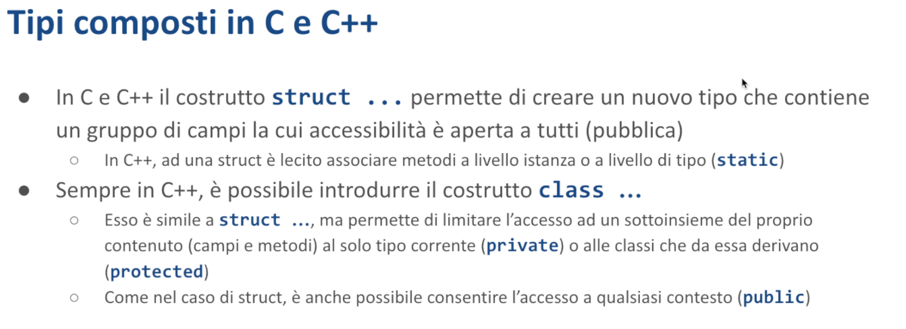

# Tipi composti - Malnati 10 <!-- omit in toc -->

# Indice <!-- omit in toc -->
- [1. Introduzione](#1-introduzione)
- [2. Struct](#2-struct)
  - [2.1 Rappresentazione in memoria](#21-rappresentazione-in-memoria)
  - [2.2 Visibilità](#22-visibilità)
    - [2.2.1 Esempio](#221-esempio)
  - [2.3 Metodi](#23-metodi)
  - [2.4 Costruttori](#24-costruttori)
  - [2.5 Distruttori](#25-distruttori)
  - [2.6 Metodi statici](#26-metodi-statici)
- [3. Enum](#3-enum)
  - [3.1 Rappresentazione in memoria](#31-rappresentazione-in-memoria)
  - [3.2 Enum e clausole match](#32-enum-e-clausole-match)
    - [3.2.1 Destrutturazione nei costrutti `if let` e `while let`](#321-destrutturazione-nei-costrutti-if-let-e-while-let)
  - [3.3 Enum generiche](#33-enum-generiche)
    - [3.3.1 Option](#331-option)
    - [3.3.2 Result](#332-result)

# 1. Introduzione

L'obiettivo di questa lezione è cominciare a costruire dei tipi un pochino più complessi di quelli che abbiamo visto fino adesso. Ora sappiamo che esistono i tipi elementari, gli interi, i numeri di vario tipo, i booleani, eccetera. Abbiamo scoperto che ci sono alcuni tipi precostituiti alquanto utili come le stringhe e i Vec.

Abbiamo visto che le stringhe hanno anche associato il concetto di `&str`, che ci dà la possibilità di rappresentare uno slice di byte sostanzialmente e quindi di poter avere accesso in sola lettura dei contenuti, ma nel momento in cui realizziamo dei programmi che hanno una qualche funzionalità abbiamo bisogno di poter rappresentare dei dati più elaborati e questi dati più elaborati li facciamo aggiungendo dei tipi al sistema.

Oggi parliamo di ***struct*** e se ce la facciamo di ***enum*** e la settimana successiva introdurremo i tratti come strumento per arricchire la definizione dei nostri tipi.



In C e in C++ al canto ai tipi elementari noi sappiamo che possiamo creare le struct come modo per aggregare delle informazioni eterogenee tra di loro dando un nome ai campi. In C questo è l'elemento di base che ci permette di definire un nuovo tipo. Ci sono alcuni altri pezzi che adesso vedremo ma sostanzialmente il grosso delle cose le facciamo in quel modo lì.

In C++ ammette le struct parimenti, dicendo che una struct è semplicemente un blocco di memoria dove si trovano consecutivamente una serie di sottocampi e questi sottocampi hanno un nome e noi possiamo accedere. L'accesso alle struct è sempre completamente libero quindi se io conosco l'indirizzo di una struct posso accedere a qualunque campo al suo interno.

Nel C++ le cose sono un pochino più elaborate, perché? Perché il concetto di struct viene esteso passando alla **classe**. 

*Cos'è una classe?* 
È sempre una struct né più né meno, cioè un blocco di byte consecutivi dentro cui ci sono dei campi ma quei campi non sono necessariamente tutti visibili.

Alcuni sono disponibili a tutti e sono ***public***, alcuni sono disponibili solo al codice della classe stessa e sono ***private***, alcuni sono disponibili al codice della classe stessa o delle sue sottoclassi se ne ha e sono ***protected***. 
In Java le cose sono in qualche modo simili.


Qui ci sono degli esempi in C e in C++ delle varie parti. 
Pezzo interessante nel C++ è che il blocco class ha al suo interno delle sottoparti che sono delimitate dalle parole chiare `public:`, `protected:`, o `private:`, che radunano le varie parti. In questo è una sintassi un po' diversa da Java dove invece ogni singolo campo ha il modificatore e quindi io posso dire che `private int`, `public void f` e cose del genere…

Quindi ho la possibilità di definire i vari elementi. 

A parte il fatto della visibilità che è una questione puramente sintattica che il compilatore ascrive a sé dicendo *“io non ti lascio accedere a un campo se non hai il livello di accesso necessario”* non c'è nessun'altra differenza tra `struct` e `class`. Sono blocchi di byte.


Oltre a questo sia in C++ che in C sono presenti anche altri modi di estendere, di creare dei tipi custom. 
Esiste il tipo ***enum*** che fondamentalmente mi dà la possibilità di rappresentare un gruppo di identificatori. Ad esempio posso dire:

```rust
enum Days {Sunday, Monday, Tuesday, Wednesday, Thursday, Friday, Saturday};
```

*Che cosa diventa quella faccenda lì?* 
Il compilatore la trasforma in un intero dove sunday sarà 0, monday sarà 1 e così via… 
Ma mi permette di lavorare con delle costanti esplicite che hanno più senso perché quando io leggo 3 devo farmi conto di a quale giorno corrisponde, mentre se leggo `Tuesday` dovrei capirlo più facilmente. Quindi il vantaggio di lavorare con l'enum è quello.

L'enum più semplice che noi conosciamo è il booleano. Il booleano ha due solo possibili valori true e false. Di fatto è un intero, non è niente altro che un intero un booleano. Ok? Ma poiché è definito in quella maniera lì noi riusciamo a trattarlo in modo più semplice. Per cui true è più ovvio di uno.

Esiste poi un tipo particolare che è `union` che è fonte di casino eccetera. Lo vediamo più avanti. 
Union sostanzialmente è strutturalmente scritta come una struct. Quindi così come faccio `struct S { int A, float B, char* C }`. Quindi ho questi 3 pezzettini A, B e C che sono un intero, un float e un puntatore.

Una union sintatticamente si presenta nello stesso modo. Ma dal punto di vista dell'organizzazione in memoria è **totalmente diversa**. Perché mentre nella struct i primi 4 byte sono occupati dall'intero, i secondi 4 byte sono occupati dal float, i prossimi 8 byte sono occupati dal puntatore, nella union tutto è insieme.

Quindi negli stessi 8 byte ci sono il puntatore, l'intero o il float. 
*E come è possibile?* 
Sono in alternativa: `union` dice *“qua dentro ci posso mettere di volta in volta, secondo sulla base di quello che mi pare, o un intero o un float o un puntatore”*. 

*Ah e come faccio a sapere cosa ci ho messo?* 
Se ne occupa il programmatore. *“Io, compilatore, ti do il permesso di farlo. Tu, caro programmatore, troverai un modo intelligente di ricordarti cosa c'hai messo dentro.”*

*“Io ti garantisco che la union è grande come il più grande dei pezzi che ci sono. In modo da farci ristare qualunque altra cosa.”* 

Quindi, quando io ho le union in C e in C++ sto definendo un pezzo di memoria che ha interpretazioni alternative.

Questa cosa qua è un obbrobio: serve soltanto in situazioni vicino all'hardware dove necessariamente ho bisogno di farmi piacere una cosa che posso guardare in modo distinto. Perché spesso e volentieri l'hardware mi dà dei bit che possono essere interpretati a volte come numeri, a volte come flag singoli, a volte in un'altra maniera. Se non ci fosse questo la `union` di suo non avrebbe ragione di esistere.

# 2. Struct


*Cosa capita in Rust?* 
La prima cosa è che in Rust abbiamo le `struct`, in modo analogo a quello che succede in C.

In questo caso qui abbiamo `Player` che ha `name` che è una stringa, `health` che è i32, `level` u8. 

*Cosa succede quando io dichiaro una struct?* 
Succede che viene allocata tanta memoria quanto ne serve per la somma di tutti i campi più un delta eventuale se ho bisogno di garantire dell'allineamento.

L'allineamento nasce dal fatto che se il compilatore deve poi impaccare tante di queste struct una a fianco all'altra, ad esempio in un array, e il primo campo deve iniziare un indirizzo pari, la struct non può avere una lunghezza dispari perché quella successiva nell'array si troverebbe nel posto sbagliato e quindi mi mette del padding ulteriore.

*Dove lo mette il padding?* 
Di solito al fondo, però a noi interessa abbastanza poco perché tanto il compilatore sceglie lui come organizzarsi la memoria, noi sappiamo semplicemente che la userà nel modo più conveniente possibile.

Quindi una struct è un costrutto che ci permette di rappresentare un blocco in memoria che ha un certo numero di informazioni. 


Come usiamo una struct? In modo semplicissimo: dopo averla dichiarata, la utilizziamo per dichiarare delle variabili.

`let player1 = Player { ... }` e poi elenchiamo i suoi campi dandogli un valore. 

Quindi banalmente io quando istanzio una struct sono chiamato a dare un valore a ciascuno dei suoi campi. Se ometto qualcuno dei suoi campi il compilatore mi blocca e mi dice.

La struct la uso esattamente come la userei in C, con la notazione punto. Quando scrivo [`s.name`](http://s.name/) vedrò `mario`, quando faccio `s.earth` vedrò `25`, etc…

Posso accedere in lettura ai singoli campi, se la struct è mutabile posso accederci in scrittura, quindi posso scrivere `s.level += 3` e così via.

Tutte le volte che noi definiamo una struct stiamo introducendo, arricchendo il sistema dei tipi di Rust, che quindi si trova un oggetto in più.

*Perché ci si interessa aumentare il sistema dei tipi?* 
Perché i tipi ci aiutano ad arricchire il vocabolario con cui noi ci esprimiamo. Se stiamo parlando di un problema che riguarda la pianificazione dei lavori per lo stretto di Messina, allora abbiamo bisogno di rappresentare una serie di concetti che sono tipici di quel dominio lì, per cui c'è la *commessa*, per cui c'è il *progetto esecutivo*, per cui c'è lo *studio ambientale*, la *valutazione di impatto ambientale* e così via.

Allora poter definire dei tipi che usano come nome un nome preso dal dominio ci rende più facile capire cosa stiamo facendo.

In realtà in Rust le struct possono essere definite in due modi:

- La prima è quella più simile al C, che abbiamo visto prima, dove i campi hanno tutti un nome esplicito.
- La seconda è un ibrido con le tuple, ovvero posso definire la mia struct, in questo caso `Playground`, invece che con aperta graffa, con aperta tonda.

*Cosa vuol dire fare struct aperta tonda?* 
Vuol dire che questa struct continuerà ad avere un certo numero di campi, ma a questi campi non sento il bisogno di dare un valore, un nome. Semplicemente gli dico che cosa contiene.

Questa struct `Playground` contiene il primo campo è una stringa e poi ha due interi a 32 bit.

*Come farò a riferirmi a questi campi?* 
Come farei con una tupla, e quindi lo chiamerò, se io ho la variabile `P` di tipo `Playground` potrò fare `P.0` e lì vedrò il nome, cioè vedrò la stringa `P.1` e vedrò il primo intero, `P.2` e vedrò il secondo intero.

Quindi di fatto le struct scritte con le tonde sono come delle tuple, semplicemente sono delle **tuple con un nome**.

Se io avessi fatto la tupla e basta mettendo le tonde senza mettere nome, quella era una tupla anonima. Facendo, mettendogli davanti la parola chiave struct con un nome ho dato un nome al mio tipo.

È anche possibile definire una struct che non ha nessun campo. Lì vedete `Empty`. 
Quella struct lì è particolare, è un esempio di ***zero size type***, cioè un tipo che occupa zero byte. Rust è molto sofisticato e ad esempio vi permette di gestire un vettore di cose di quel tipo. 

*E come è fatto un vettore di cose di dimensione zero?* 
È solo un contatore. Non alloca memoria, perché non ne ha bisogno, ma ha il conteggio di quante sono.

## 2.1 Rappresentazione in memoria


*Come è fatta la struttura* `Player` *all'interno della mia memoria?* 
Allora, come è fatta esattamente lo decide il compilatore e se voi cambiate versioni del compilatore potrebbero venire anche versioni diverse, perché il compilatore sceglie (in funzione dell'architettura per cui sta compilando e di parametri suoi di qualche tipo) qual è la disposizione migliore.

Qui c'è una differenza importantissima rispetto al C. Il C vi garantisce che se voi avete definito la struct con i campi A, poi B e poi C, in memoria prima trovate i byte di A, poi i byte di B, poi i byte di C. Quindi il C da questo punto di vista è fedele nella sequenza. Se tu hai scelto di scriverli in quell'ordine, lui li mette in quest'ordine.

Il compilatore Rust dice: *"A meno che tu non mi chieda di fare diversamente, io li metto nell'ordine che mi viene più comodo".* 

*Perché?* 
Perché alcuni tipi hanno un bisogno di allineamento e quindi se io posso scambiare l'ordine posso ottimizzare. In questo caso avevamo una stringa (24 byte: 8 di puntatore, 8 di capacity, 8 di size), un intero a 32 bit (4 byte), e un intero a 8 bit (1 byte). Totale: 29 byte. 29 è un numeraccio, soprattutto perché è dispari. Se ci appiccico un altro `Player`, mi viene scomodissimo perchè questo altro `Player` deve cominciare con un indirizzo multiplo di 8. Quindi Rust aggiunge 3 byte di padding, probabilmente al fondo, ma potrebbero anche essere messi in mezzo, se volesse metterli a metà tra `health` e `level` potrebbe anche andare bene lo stesso. 

Quindi è il compilatore che sceglie come organizzarsi la memoria per quello che riguarda. Noi in prima battuta possiamo ragionare sul fatto che probabilmente li metterà nell'ordine che gli hanno detto. 
In realtà il motivo, come dicevamo, è legato al fatto che lui deve garantire che i singoli campi rispettino i vincoli di allineamento. 

Quindi un vettore, una stringa può solo cominciare a indirizzi che sono multipli di 8. 
Un intero a 32 bit può solo iniziare a indirizzi che sono multipli di 4. 
Un intero a 16 bit può iniziare solo a multipli di 2 e così via. 

E di conseguenza deve aggiustare. 
Se io ho bisogno per qualche motivo di garantirmi il controllo su come è veramente disposta la memoria posso anteporre alla definizione della struct la parola chiave `#[repr(C)]`. 
Questa annotazione chiede *"caro compilatore, stante che puoi fare un po' come ti pare, non fare come ti pare e invece fai come farebbe il C".* 
In questo modo io sono tranquillo che quella struct così fatta, se dovessi passarla a una libreria scritta in C, il C capirebbe cosa c'è scritto dentro. 

<aside>
⚠️

La struct è un blocco, che in quanto blocco può vivere dovunque (stack o heap, e in particolare: di norma starebbe sullo stack, ma nulla mi vieta di boxarla, il che significherebbe allocare la struct sullo heap).

</aside>

## 2.2 Visibilità


Sia la struct nel suo complesso che i singoli campi possono essere preceduti dalla parola chiave `pub`, che ne cambia la visibilità. Per default le struct nel loro complesso e i campi al loro interno sono considerati **privati**, ma con un'accezione di privato diversa da quella che potete avere da un linguaggio come Java. 

In Java privato vuol dire *“appartiene alla classe”*. 
Qua le classi non esistono, non può appartenere alla classe. Privato qui vuol dire *“appartiene al modulo”*. 

Fintanto che il mio programma è tutto acchiuso in un unico modulo, il concetto di privacy non esiste, perché ho solo quello. Ma se io comincio a dire che il mio programma è fatto di due blocchi, che chiamo modulo 1 e modulo 2, quello che è descritto dentro modulo 1 non è direttamente visibile da modulo 2, a meno che io non lo renda pubblico. 

Facciamo una prova. 

### 2.2.1 Esempio


In questo caso, nel `main` posso usare la struct dichiarata senza problemi, e quindi posso dire `let t = Test { a: 12, b: false };`. 
Sono nello stesso modulo, quindi la vedo e posso usarla. 


Se io invece la Struct `Test` la racchiudo all'interno di `module1`, cosa è capitato? 
La Struct esiste ancora, ma non è nel mio stesso **namespace**, il suo nome completo non è più Test, ma è `module1::Test`. 

È diventata un pezzettino di una parte. Perché mai io vorrei fare una cosa del genere? Perché questo mi aiuta a dividere il mio programma, che potrebbe diventare a un certo punto troppo grande, in blocchi elementari dove ciascun blocco, **modulo**, è responsabile di un pezzettino e per cui in un'applicazione ipotetica per le paghe e per gli stipendi ho un modulo utenti che contiene la storia di tutti i miei dipendenti della mia azienda, ho il modulo cedolini che invece si occupa di calcolare la paga etc…

In questo modo riesco a separare logicamente le parti. 

Nel momento in cui io dichiaro una struct dentro un modulo, al suo interno è raggiungibilissima, non mi dà nessun fastidio. Se io in questo modulo, quindi dentro le graffe del modulo, mi creo una funzione `f` : 

```rust
mod module1 {

	struct Test {
		a: i32,
		b: bool
	}
	
	fn f() {
		let t = Test { a: 1, b: false}; // This is fine
	}
	
}
```

Questa cosa funziona, perché sono dentro il modulo, quindi la struct di default ha visibilità dentro il modulo in cui compare. 


Nel main viceversa, `Test` è segnato in rosso e se vengo sopra col mouse mi dice *“non trovo un tipo test in questo scope”*. 
Ok, proviamo ad importarlo: `use module1::Test`. 


Adesso ha capito di che `Test` parliamo, peccato che `module1::Test` è **private**, lo possiamo usare. Ok, questo mi dà la possibilità di creare del codice che è incapsulato. 


*Come posso fare?* 
Beh, possiamo rendere pubblica la struct `Test`. 

Ma mi resta un altro problema. Adesso mi sottolinea `a`. 
`Test` come struttura è pubblica, quindi la puoi vedere, sai che c'è e quindi la usi, ma non sai com'è fatta, perché i suoi campi dentro per default sono **privati** e quindi qui vedete che nel main sia `a` che `b`, mi li sottolinea in rosso. 

Se voglio rendere visibili anche i campi, devo dichiarare `pub a` e `pub b`. In questo modo ho reso la struct completamente pubblica. Questo mi permette di controllare cosa rendere visibile all'esterno e cosa no.

Ma se è così, sembrerebbe che o la struct è tutta pubblica o non è utilizzabile. 

*Come posso manipolare una struct* `Test` *nel main se non ho accesso ai suoi campi? 
A cosa servono i campi se non posso leggerli?* 
Se fosse una struct come in C, dove c'è solo spazio per i dati, sarebbe effettivamente inutile.

Tuttavia, proprio come le classi in C++, le struct possono avere dei metodi associati. Con i metodi associati, ha senso avere una parte privata che solo i metodi della struct possono manipolare.

Quando inizializziamo la struct così (cioè senza rendere i campi pubblici) abbiamo un problema, quindi dobbiamo creare qualcosa di pubblico per l'inizializzazione. 


Per esempio, possiamo creare una funzione `f` che restituisce un `Test`.


Possiamo quindi scrivere `let t: Test = module1::f()`. 
Vediamo che ci dà un errore sull’invocazione di `f` perchè è privata, ma possiamo renderla pubblica. 


Dunque nel modulo possiamo creare un **inizializzatore**.
In questo momento, questa funzione `f` così com'è serve a poco, ma potremmo modificarla per accettare solo un intero (`i32`) da usare per il campo `a`. Questo garantisce che i `Test` costruiti in questo modo possano essere creati con un numero qualsiasi (per esempio `f(42)`), ma avranno sempre `false` come valore di `b`.

Oppure posso metterci **qualunque logica** mi pare all'interno della funzione `f` per farmeli costruire come mi pare. Sapendo che a questo punto fuori dal modulo io manipolo dei `Test`, perché il Test come concetto è pubblico, ma non ho possibilità di sporcarlo più di tanto. Questo addirittura mi lascerebbe togliere il `pub` anche da `a`.


Quindi, il fatto che io possa dichiarare come pubblico, oppure non dichiarare e di conseguenza lasciare **privato**, mi dà uno modo per realizzare quel meccanismo di **incapsulamento** che spesso è considerato alla base dell'*object orientation*, ma di suo non è dell'object orientation, è semplicemente un meccanismo di **data hiding**. Nascondo un pezzo di informazione, te la rendo inaccessibile.

Nella maggior parte dei linguaggi a oggetti, il **data hiding** si lega al concetto di *classe*. Rust ci fa vedere che è possibile ottenere il meccanismo del data hiding senza fare riferimento a una classe. Lui dice *"io suddivido il mio codice in unità più o meno grosse, chiamate **moduli**, e il livello di incapsulamento è legato al modulo".*

Se nel modulo 1 io avessi creato un sottomodulo, quindi all'interno delle graffe `module1` avessi messo `module2`, `module2` in quanto sottomodulo di `module1`, fatto dentro, vede tutto quello che si può vedere in `module1`. Viceversa, se il `module2` fosse fuori, parallelo a `module1`, invece è come se fosse fuori da tutto. Quindi vede le cose sue e degli altri solo la parte pubblica.

Per essere efficace però, l'**incapsulamento** richiede che possiamo associare dei ***comportamenti*** (quelli che noi in altri linguaggi chiameremmo *metodi*) alla nostra struct.

```java
class Point {
    private int x, y, z;
    
    public Point() {
        // costruttore
    }
    
    public double distance() {
        // calcola distanza
    }
    
    public void whatever() {
        // altro metodo
    }
}
```

Mentre in Java i metodi vengono definiti contestualmente alla classe, e questi sono dentro il blocco `class`, in Rust le cose sono separate, nel senso che noi definiamo la struct e poi, normalmente lì vicino, in un blocco ci permette di definire quali sono le strutture associate.

## 2.3 Metodi


Qui vediamo per confronto dal punto di vista strutturale come stanno le cose. In C++, ma anche in Java, JavaScript, sono tutti uguali da questo punto di vista, io ho `class Something` che ha l'insieme degli attributi al suo interno e, sempre nel blocco delle graffe, l'insieme dei metodi.

In Rust io ho la definizione della classe che contiene solo i dati che contiene, e poi separato, di solito messo lì vicino, ho il blocco `impl`, `impl struct_name`, che dice *“per questa struct implemento i seguenti metodi”*.

Nel blocco `impl`, tra graffe, indico una serie di cose, di funzioni. Queste funzioni sono caratterizzate dall'avere tra gli argomenti dei valori di tipo `self`. I valori di tipo `self` ci rendono esplicito come quel particolare metodo accede alla struct da cui piglia le sue informazioni.

In questo caso vedo che la mia struct `Something` ha un metodo chiamato `process` che prende `ref self` e ne ha un altro che si chiama `implement` che prende `ref mut self`. Potrei avere altre combinazioni, adesso le vediamo.

*Cosa vuol dire?* 
Vuol dire che quando io, avendo la variabile `s` di tipo `Something`, invocherò uno di questi metodi e scriverò ad esempio `s.process()`, quello che succederà è che sulla variabile `s`, di cui io sono il possessore, verrà preso un **reference**, e questo reference verrà passato in sola lettura alla funzione `process`, quindi la funzione `process` potrà sì accedere alla mia struct, ma solo leggere.

Viceversa, se io su quella variabile `s`, che dovrà essere mutabile, facessi `s.increment()`, quello che succederà è che il compilatore, a partire da quella variabile `s`, si piglia il `ref mut`, lo passa alla funzione `increment`, che quindi ha la possibilità di manipolare, di cambiare il contenuto della mia variabile `s`, e poi lo rilascia, perché finita l'esecuzione, quello `ref mut` viene buttato via.

I metodi possono essere dichiarati con diverse capacità di accesso alla **struct** a cui si applicano:

- in sola *lettura*
- in *scrittura* (e quindi anche in scrittura)
- oppure, invece di usare `ref self` o `ref mut self`, possono prendere semplicemente `self`.

Se un metodo prende semplicemente `self`, questo significa che il metodo prende il **possesso** della variabile. Di conseguenza, dopo aver chiamato tale metodo, la variabile originale non sarà più utilizzabile, avendo ceduto la sua *sovranità*.

*Perché cedere la sovranità?* 
Ci sono diversi motivi - ad esempio il metodo potrebbe dover trasformare la struct in qualcos'altro, utilizzando le sue componenti per creare qualcosa di diverso.

Un esempio pratico: quando lavoriamo con un vettore e iteriamo al suo interno. Il vettore offre due modi per estrarre i suoi elementi:

- il metodo `.iter()` (definito con `ref self`) che permette di guardare dentro
- il metodo `.into_iter()` (che prende `self`) che rimuove gli elementi uno alla volta, non prendendone solo un riferimento ma *"strappandoli via"*, lasciando il vettore vuoto alla fine.

Questo meccanismo ci permette di specificare cosa succede alla struttura originale quando invochiamo i metodi:

- Con `ref self`: la struttura rimane immutata, ma non modificabile durante l'esecuzione del metodo (prestito in sola lettura)
- Con `ref mut self`: nessun altro può accedere alla struttura durante l'esecuzione, ma il metodo può modificarla

Per esempio, quando usiamo `string.append()` o `string.push()`, questi metodi sono di tipo `ref mut`. Lo stesso vale per i `Vec`. Se invece il metodo è definito con solo `self`, prende possesso della struttura che non esisterà più dopo l'esecuzione - rimarrà solo il risultato del metodo.


In essenza, i metodi sono **funzioni** legate a un'istanza di un certo tipo. Questo legame si manifesta sia a livello *sintattico* che *semantico*:

- **Sintatticamente**: l'invocazione segue sempre il pattern `variabile.metodo()`, come nella maggior parte dei linguaggi (es. `s.toUpperCase()`)
- **Semanticamente**: possiamo specificare come il metodo tratta la struttura in input (il "ricevitore" del metodo, ciò che precede il punto, quindi per esempio `s`, in `s.toUpperCase()`). Questo è definito dal primo parametro del metodo che può essere `self`, `ref self`, o `ref mut self`.

In realtà esistono anche altre combinazioni più avanzate: il ricevitore potrebbe essere un `Box<self>`, `Pin<self>`, `Rc<self>`, `Arc<self>`, e altre… 
Rust gestisce ciascuna di queste varianti con un significato specifico.


Il primo parametro di ciascun metodo indica come il metodo accederà all'istanza.

Se il primo parametro è `self` scritto minuscolo, vuol dire che il metodo **prende possesso** del ricevitore. Quindi il ricevitore viene mosso dentro il metodo e il metodo ci fa quello che gli pare. Prendendone possesso può leggerlo, scriverlo o distruggerlo come preferisce.

Se il primo parametro è `ref self`, il metodo accede in **prestito** alla struct e la legge. Se il primo parametro è `ref mut self`, il metodo accede in **lettura-scrittura** tramite un prestito.

Queste tre notazioni - `self`, `ref self`, `ref mut self` - sono semplicemente una contrazione di un'espressione più estesa. All'interno del metodo, il ricevitore si chiama sempre `self`, perché quando scriviamo `self` minuscolo è come se scrivessimo un parametro `self` minuscolo di tipo `Self` maiuscolo.

*E cos'è il tipo* `Self` *maiuscolo?* 
È una **parola chiave riservata** che rappresenta il tipo che stiamo implementando. Quando facciamo `impl Player`, `Self` maiuscolo diventa `Player`. Quindi nei blocchi `impl`, la parola chiave `Self` maiuscolo rappresenta il tipo che stiamo implementando.

Quindi `self` minuscolo è un modo conciso per dire *"ho un primo parametro* `self` *minuscolo di tipo* `Self` *grande",* cioè prendo possesso del ricevitore. Analogamente, `ref self` è una contrazione di `self: &Self`, cioè la variabile `self` è un riferimento al tipo che stiamo implementando. E `ref mut self` è `self: &mut Self`. Queste tre forme sono così frequenti che il compilatore le riconosce e gestisce automaticamente.

In situazioni più complesse, come quando vogliamo operare su un `Box` o simili, non avremo una sintassi analoga e dovremo scriverlo esplicitamente. Ad esempio, se volessimo che il nostro metodo operasse solo su istanze *boxed* di un certo dato, dovremmo scrivere `self: Box<Self>`. Questo funziona tecnicamente, ma rende il codice più difficile da gestire, specialmente quando si introducono i tratti.

È importante notare che il parametro `self`, se presente, **deve essere il primo**. Se lo mettiamo come secondo, terzo o quarto parametro, il compilatore non lo accetta. Ma perché *"se presente"*? Perché potremmo anche avere un metodo che non prende `self` - questo sarebbe un **metodo statico**, che possiamo cioè chiamare senza un ricevitore.

*Qual è l'utilità di un metodo senza ricevitore?* 
Il caso più comune è quello del **costruttore**. Serve per creare un'istanza. Nell'esempio precedente abbiamo usato una funzione `f` per creare oggetti. Ma quella era una funzione slegata dalla classe che casualmente ritornava un oggetto di tipo `Test` - si può fare, ma non mi fa capire bene come stanno le cose.

È pratica comune, quando dichiariamo una struct, aggiungere nel blocco `impl` uno o più metodi costruttori. Come nei tipi predefiniti del linguaggio: per un nuovo vettore scriviamo `let v` o `let mut v = Vec::new()`. Cos'è `new`? È un metodo che non ha argomenti (quindi non ha `self`) e ritorna `Self`. La classe `Vec` lo fornisce per creare un vettore vuoto. Ma `Vec` offre anche il metodo `with_capacity` - anch'esso senza `self`, ma con un parametro `usize` che specifica quanta memoria pre-allocare.


Vediamo alcuni esempi. La struct `Point` è molto semplice: rappresenta un punto geometrico con due coordinate `x` e `y` numeriche. Possiamo aggiungere metodi utili per calcoli in un'ipotetica applicazione grafica.

Con `impl Point` aggiungiamo metodi alla struct. All'interno del blocco `impl`, il tipo `Self` significa `Point`. Questo vale fino alla chiusura del blocco - fuori dal blocco `impl`, il tipo `Self` non esiste più.

La funzione `mirror` prende un `self` e produce un nuovo `Self`. Trasforma un punto in un altro punto, **consumando** l'originale — che non c’è più! 
Il nuovo punto ha le coordinate scambiate: la `x` diventa `y` e viceversa. È un esempio di metodo che consuma il ricevitore per produrre qualcosa di diverso.

La funzione `length` prende `&self` e calcola la distanza del punto dall'origine usando il teorema di Pitagora: radice quadrata di `x²+ y²`. Per accedere a `x` e `y` dobbiamo usare la notazione completa: `self.x`, `self.y`.

A differenza di Java o C++, dove il compilatore aggiunge automaticamente `this`, in Rust dobbiamo essere espliciti. In Java, nella classe `Point` con campi `x` e `y`, possiamo scrivere direttamente `x` o `return x` e il compilatore capisce che si tratta di `this.x`. In Rust dobbiamo sempre usare il nome completo: `self.x`, `self.y`.

Infine, `scale` è un metodo che allontana il punto dall'origine moltiplicando le coordinate per un fattore di scala. Prende `&mut self` (per modificare l'istanza) e il fattore di scala come parametri. Modifica l'istanza moltiplicando sia `self.x` che `self.y` per il fattore di scala.

Quindi quando io come primo parametro ho `self` e basta consumo il ricevitore, quando ho `&self` leggo dal ricevitore, quando ho `&mut self` leggo e scrivo sul ricevitore.


Dopodichè lo uso: `let p1 = Point{ x: 3, y: 4 }`, l'ho inizializzato. Arrivo, `p2 = p1.mirror()` e quindi `p1` adesso non c'è più - `p1` è stato consumato da `mirror`, quindi ho creato `p2` che contiene questa volta `(4,3)`. Poi faccio il conto `l1 = p2.length()`, ok, `length` non sporca `p2`, lo lascia integro e alla fine ci troverò `(4,3)` e `5` come distanza per interno di Pitagora. `p2.scale(2)`, adesso `p2` è cambiato: prima c'erano `(4,3)`, dopo ci sono `(8,6)`. A questo punto ricalcolo la `length` e chiaramente con `(8,6)` per il teorema di Pitagora mi viene `10`. 

## 2.4 Costruttori


In C++ come in Java come in tanti altri linguaggi le classi contengono dei *costruttori*. I costruttori sono dei metodi particolari che in C++ e in Java vengono riconosciuti per via del loro **nome**, si chiamano esattamente come la classe e hanno la responsabilità di creare delle versioni inizializzate, delle istanze debitamente inizializzate, riempiendo tutti i campi con dei valori appropriati.

In Rust non viene definito una funzione costruttrice in modo esplicito. Semplicemente, siamo noi che siamo liberi di definire all'interno della nostra `struct`, un metodo (o più di uno) che ritorna `Self` maiuscolo, perché ritorna una nuova istanza di `self` che prima non esisteva. Normalmente si chiama `new`.

Siccome in Rust non esiste l'*overloading*, (in Java, in C++ io posso avere più costruttori, basta che i parametri siano distinguibili e quindi da quel tipo `String`, ad esempio, posso fare una `String` che prende un'altra `String` come parametro, una `String` che prende un numero e quindi mi crea una `String` che alloca quel numero di byte nel suo buffer, etc…), i metodi devono chiamarsi tutti diversi: non posso avere due versioni di `new`, una con un parametro, e una senza parametro, ad esempio.

Di conseguenza io posso fare più funzioni costruttrici inventandomi dei nomi diversi. È esattamente quello che succede con i `Vec`. `Vec::new()` mi crea un vettore vuoto, `Vec::with_capacity()` mi crea un vettore sempre vuoto ma con preallocato un buffer di una certa dimensione.

La nomenclatura standard che trovate nelle classi della libreria e che siete invitati a usare, perché così la gente capisce grossomodo, è che il costruttore, diciamo, quello più semplice possibile si chiama `new`, quelli che invece hanno una serie di particolarità sono introdotti dalla parola chiave `with`, perché? Perché questo io lo leggo come `nome_struct::with_something()` e quindi ad esempio posso avere il mio `Point::with_position(7,5)`, che mi crea un punto alla posizione `(7,5)`.

## 2.5 Distruttori


Abbiamo avuto modo di vedere all'inizio del corso come il C++ oltre al concetto di costruttore introduca il concetto di *distruttore*, ovvero dice *“se nel momento in cui tu hai creato un'istanza ti sei procurato delle risorse di qualche tipo, quando sarà ora di buttarla via questa istanza dovrai liberarti di queste risorse”* e quindi ci offre un metodo particolare il cui nome comincia con `~` ed è seguito dal nome della classe stessa che viene invocato esclusivamente dal compilatore stesso nel momento in cui quel dato giunge alla fine del suo ciclo di vita.

C++ è unico da questo punto di vista nel senso che in Java c'è una cosa che gli assomiglia lontanamente che è il metodo `finalize` che però è deprecato e quindi sarà tolto, forse è già stato tolto dall'ultimo versione di Java. In Rust non c'è il concetto di distruttore come in C, scritto così, ma c'è il tratto `Drop` che fa le veci. Se io ho bisogno di rilasciare qualcosa devo implementare per il mio tipo il tratto `Drop`. Il tratto `Drop`, se presente, mi garantisce che quando il mio valore è giunto alla fine della sua vita viene invocato e provoca l'azione necessaria.

Detto questo, il fatto che non sia esplicitamente chiamato distruttore non impedisce che un paradigma di programmazione estremamente potente elaborato in C++ non sia stato sposato nel mondo di Rust. Questo paradigma estremamente potente si chiama **RAII**, il nome è poco utile, letteralmente è un acronimo di *Resource Acquisition Is Initialization*. Vi dice poco, l'acquisizione di risorse è l'inizializzazione. Il vero motivo è che avrebbe dovuto chiamarsi al contrario, *Resource Finalization Is Destruction*. Cioè, se è vero che nell'inizializzazione le risorse le prendi, è vero soprattuto che quando vieni distrutto le risorse le devi rilasciare, finalizzare.

Indica sostanzialmente il fatto che un oggetto che possiede qualcosa ha la responsabilità di rilasciarlo. L'abbiamo già raccontato tante volte, se ho aperto un `File`, nel momento in cui la mia variabile file è giunta alla fine del suo ciclo di vita, devo andare dal sistema operativo e dire *"sto file non mi serve più, lo chiudo".* Se ho acquisito un `Mutex`, devo andare dal sistema operativo e dire *"sto mutex non mi serve più, lo rilascio".* Se ho aperto un `Socket`, vado al sistema operativo e gli dico *"non mi serve più, chiudo anche il socket"* e così via.

C'è questa responsabilità. La responsabilità la si spartisce un po' nel punto in cui costruisco, un po' nel punto in cui distruggo. Questo ha fatto sì che in C++ siano nate un certo numero di classi estremamente utili e che hanno una corrispondenza pressoché uno a uno, e lo incontreremo un po' più avanti appena facciamo le cose di programmazione concorrente, classi che apparentemente sono stranissime. Sono classi che non hanno metodi, se non un costruttore o un distruttore. E che noi a un certo punto dichiariamo in un punto del nostro codice e non usiamo.

Diciamo *"sei scemo, perché hai preso questa scatola che non ti serve a niente e te la sei messa qua?"* 
E' come se nel mio blocco di codice da qualche parte io creo l'oggetto `pippo`. Poi non lo guardo e dice *"che ti serve?"* In realtà serve molto, perché quell'oggetto `pippo` nel momento in cui l'ho creato il suo costruttore può aver fatto certe cose, ma soprattutto quando io avrò finito e quell'oggetto `pippo` verrà eliminato, il suo distruttore ne farà delle altre. E la garanzia di quello che succede lì in mezzo è legata al fatto che il costruttore aveva iniziato e il distruttore ha chiuso.

Ad esempio se io devo scrivere su un database un oggetto di questo tipo, nel suo costruttore inizia la transazione. Nel suo distruttore fa il commit della transazione. E di conseguenza tutte le operazioni che io posso aver fatto, scrivi, leggi, inserisci e cancella, sono garantite a venire tutte in modo transazionale, cioè tutte insieme oppure nessuna. Se io non avessi neanche allocato questo oggetto, non ci sarebbe stato il concetto di transazione. Lui in modo silenzioso, nel suo costruttore ha creato la transazione, se l'ha tenuta in pancia, non l'ha detto nessuno, tanto va bene così. Nel suo distruttore fa il commit e io sono più che contento. Ho garantito che il mio codice esegui in modo coerente.

Ma se io leggo il codice e non so cosa fa il suo costruttore e il suo distruttore, dico *"No, ma non serve a niente, è un orpello inutile”*, magari lo butto anche via e il programma non funziona più. Paradigma importantissimo, Rust lo sposa pienamente. Ricordatevi, si chiama **RAII**, lo richiameremo più volte, tutte le volte che lo incontriamo lo andiamo a riprendere. 


Qui è descritto in ulteriore dettaglio. 


Qui racconta i distruttori del C++.


Allora, la **distruzione in Rust** è un'istruzione che consta di due pezzi. A un certo punto io dovrò *liberare* la memoria che sto occupando. Ma prima di averla liberata devo essere sicuro che quello che c'è scritto in quella memoria non abbia un significato ulteriore, perché se ha un significato ulteriore devo *liberare il significato ulteriore*.

Per questo esiste il **tratto `Drop`**. Il tratto Drop consiste di un unico metodo che si chiama `drop` minuscolo. 

*Come lo si implementa?* 
In generale i tratti si implementano in un blocco `impl`. 
Solo che il blocco impl normale è `impl Nome_struttura`. 
Per i tratti è `impl Nome_Tratto for Nome_struttura`.

Qui vedete una struttura chiamata `Shape`. E quello che faccio è `impl Drop for Shape`. 

Quindi la struttura `Shape` viene con i suoi campi e metodi, quindi `struct shape`, campo `position`, `size` e `type`. Va bene, tutto fatto così. 
Poi avrò il blocco `impl Shape` e dentro avrò il metodo `new`, avrò il metodo `reposition`, `reposition_size`, `translate`, `rotate`, etc… tutto quello di cui può aver bisogno una Shape. 
E lì c'è un bloccone impl con 200 metodi.

Poi separato c'è un blocchettino, che è quello scritto nella parte in basso a destra della slide, `impl Drop for Shape`. 

*E cosa fa* `impl Drop for Shape`*?* 
Dentro di sé contiene semplicemente il metodo drop, che ha questa signature particolare, `&mut self`. 
Riceve un puntatore, perché `mut`? Perché io devo smontarlo probabilmente il contenuto di `Shape`, cioè se `Shape` possedeva qualcosa devo avere la possibilità di farci delle cose.

Dopo che questo metodo ritorna, la memoria in cui stava la `Shape` viene mandata via. 
Lo stack si contrae, se era solo heap viene rilasciato etc… non c'è più.
**Drop è l'ultima cosa che una struct fa nel suo ciclo di vita**, se viene implemento.


La presenza di `Drop` dà la possibilità di implementare il concetto di RAII all'interno di Rust. Proprio per poter implementare correttamente il concetto di RAII io devo essere sicuro però che per ogni costruzione ci sia **una sola invocazione a `Drop`**. Per questo motivo `Copy` non può esistere con `Drop`. Perché se potesse esistere con `Drop` io a seguito del `Copy` avrei una costruzione originale, poi ho fatto la copia, a questo punto avremo due entità separate, ed entrambe distruggerebbero. Ma distruggerebbero un'unica cosa, perché nel `Copy` io ho fatto una copia bit-a-bit di ciò che ho sullo stack, ma non di ciò che ho sullo heap! E quindi non va.

Questo è il motivo per cui **`Drop` e `Copy` non possono stare insieme, sono mutuamente esclusivi**. Questo è garantito da un vincolo per cui il tratto `Drop` è implementabile solo per un tipo T che non sia `Copy`. Non c'è invece nessuna restrizione sul tratto `Clone`. `Drop` e `Clone` vivono benissimo insieme. Tanto che sia `Vec` che `String`, tanto per fare due esempi semplici, implementano sia `Drop` che `Clone`.

## 2.6 Metodi statici


Notate che il metodo `new`, oltre a essere pensato come costruttore, può anche essere pensato in generale come **metodo statico**. 

*Perché?* 
Perché non ha un ricevitore. Siccome la signature di `new` è aperta tonda e chiusa tonda, non c'è ricevitore, non c'è scritto `&self`, `&mut self` o qualcosa del genere, quindi come facciamo a invocarlo? Lo invochiamo a partire dal nome della struct. `Vec::new()`, ad esempio, appunto. 

Che è la stessa cosa che succede in Java o negli altri linguaggi con i metodi statici (cioè metodi che appartengono direttamente alla classe, e che possono essere invocati dunque senza un’istanza della classe, ma da questa stessa). Quando in Java voi avete il metodo statico `log`, lo chiamate `Math.log()`.

Allora, in Rust i **metodi statici** sono semplicemente dei metodi che: 

- sono stati definiti nel blocco `impl`
- non hanno né un Self di qualunque genere come parametro (`&self`,  `&mut self`, o `self`)
- non ritornano neanche un Self

# 3. Enum


Le struct sono una cosa potentissima, estremamente utile e adesso avendo imparato a scriverle ci danno un boost perché possiamo cominciare a scrivere delle cose un pochino più sensate. Ma c'è un concetto altrettanto potente, anzi più potente, che ci abilita a fare delle cose estremamente interessanti ed è il concetto di **enum**.

Nella sua versione *semplice* l'enum (come in C) è semplicemente una sequenza di etichette a cui io posso associare dei valori dicendo *“è più facile mnemonicamente capire cosa vuol dire l'etichetta piuttosto che ricordare il singolo valore”*. Per cui è più facile dire `standard_out` che non `1` o `standard_error` piuttosto che `2`. Ma di fatto `standard_error` non è nient'altro che `2` e `standard_out` vale sempre `1`, e `standard_in` vale sempre `0` (quantomeno sulle macchine di tipo POSIX). Per cui il nome è più chiaro che non il numero perché se io vedo `0` posso avere il dubbio *“ma zero cos'è?”* — se io vedo scritto `standard_in` sono tranquillo, non mi confondo, quello è il nome di un file da cui voglio leggere.

Quindi io posso introdurre in per esempio l’enum `HTTPResponse` — il protocollo HTTP genera una serie di risposte, posso dire che le risposte sono dei numeri a tre cifre, potrei tenerlo come intero ma non capisco bene cosa vuol dire e allora posso elencarli.
`200` è in realtà la stringa "Ok". Benissimo allora faccio l'enum `HTTPResponse { Ok = 200, NotFound = 400, InternalError = 500 }`, per cui io quando nel mio codice scrivo `return HTTPResponse.Ok` poi questo  diventerà `200`. 

Analogamente con `HTTPResponse.NotFound`, e così via..

Ma fin qua non mi è cambiato molto — se io non gli dessi un uguale con un valore lui li chiama `0,1,2` nel modo più tranquillo possibile.

Dove **Rust** si differenzia in modo massiccio da tante altre cose è nel darmi la possibilità di dire che le mie alternative non sono solo delle *etichette* — `not_found`, `ok`, `internal_server_error`, ma sono delle intere **struct** che in alternativa si **pongono una rispetto all'altra**.

Ad esempio possiamo pensare ad una cosa del tipo:

- `Ok` è una struct vuota - è andato tutto bene, non c'è bisogno che aggiunga altro.
- `NotFound` — *va bene, ma cosa non hai trovato?* 
Te lo passo come stringa. In questo caso ti ho dato una struct di tipo tupla che ha un unico campo: il campo `0` che conterrà una stringa.
- `InternalServerError` — magari qui posso passarti una cosa più ampia: ti passo una struct dettagliata che ha due campi nominati, uno si chiama `desc` che è una stringa e l'altro `data` che contiene un array di byte dentro cui ci sarà qualcosa che mi aiuta a capire cosa si è rotto dentro il server.

Quindi le mie **enum** non sono più solo delle etichette che posso usare (che certamente già migliorano tantissimo il mio modo di scrivere) ma **si possono portare dietro delle informazioni** e quelle informazioni lì io le posso usare facilmente. 


La cosa più simile che avete le enum la incontrate con i ***tipi somma*** di **TypeScript**. I tipi somma sono quelli **il cui dominio è l'unione dei domini delle parti che lo costituiscono**. 

Nel caso precedente se andiamo a vedere il dominio di `HTTPResponse` è fatto dall'unione del dominio vuoto di `Ok` (Ok vale solo Ok, non contiene nient'altro), unito all'insieme di tutte le stringhe racchiuse dentro `NotFound`, unito all'insieme di tutti gli `InternalError` che sono costituiti dal prodotto di tutte le stringhe con tutti i vettori di byte.

Quindi quello che io ottengo è la capacità di poter tenere in una variabile di tipo **enum** cose molto diverse tra di loro ma, a differenza della `union` del C che mi dava la possibilità di tenere cose diverse ma non sapevo cosa ci stavo mettendo dentro, qua le enum vengono tutte con un prefisso: se `Ok` non c'è niente, se è un `NotFound` c'è una stringa, se è un `InternalServerError` c'è una stringa e un array di byte. Quindi io sono certo di che cosa trovo.

## 3.1 Rappresentazione in memoria


*Come le rappresento le **enum**?* 
Internamente sono rappresentate così: normalmente le enum hanno un primo byte che mi indica in quale delle alternative sono e poi hanno dei byte successivi in cui viene racchiusa la struttura. Ad esempio qui viene introdotta un enum `Shape` che può essere o uno `Square` che contiene la dimensione del lato o un `Point` che contiene le coordinate `x` e `y` (che qui sono immaginate molto piccole intese come numero a 8 bit) oppure potrebbe essere `Empty`.

Allora banalmente Rust dice ho tre cose le chiamo `0`, `1`, `2` quindi mi preparo una struttura dove il primo byte è già indicativo: se comincia con `0` vuol dire che è uno `Square`, se comincia con `1` è un `Point`, se comincia con `2` è un `Empty`.

*Cosa contiene uno* `Square`*?* 
Uno Square contiene un numero `u32`, ma `u32` che allineamento ha? Allineamento è 32 bit, vuole un multiplo di 4 byte, quindi non posso metterlo alla posizione dispari e quindi mi faccio un po' di padding — sicuramente questa roba deve cominciare ad un multiplo di 4 e quindi io mi faccio un po' di spazio e vado a finire, cioè mi sposto di 3 byte di padding e poi ci metterò il mio intero.

*Cosa contiene un* `Point`*?* 
In quel caso abbiamo 2 byte, benissimo quelli non hanno vincoli di allineamento quindi vicino all'`1` che mi dice che sono nel caso `Point` mi mette il primo e il secondo `u8`. 

Cosa contiene un `Empty`?
Non c'è niente, c'è solo il tag.

Quindi quanto consuma complessivamente un enum di questo tipo? È la più grande di tutte: è la prima che sono 8 byte e io alternativamente ci metto cose. 
Non è un esempio particolarmente felice perché spreca un mucchio di memoria, spesso volentieri Rust fa un mucchio di ottimizzazioni e riesce a compattare queste cose alquanto. 

In quelle situazioni in cui ha certezza che sia possibile sempre capire può anche decidere che il primo byte, quello che mi dice in quale dei casi sono caduto, lo toglie. È la cosa che succede ad esempio quando io creo dei *puntatori opzionali*. Se il puntatore è presente non è nullo, se il puntatore non c'è posso usare il valore `null` per rappresentarlo e di conseguenza io un puntatore opzionale lo rappresento su 8 byte esattamente come un puntatore non opzionale. Sapendo che tanto il valore nullo con tutti i 0 non potrebbe essere mai generato e quindi se viene scritto tutti i 0 allora vuol dire che quello lì era *non presente*. Questo lascia un mucchio di libertà al compilatore di fare le cose.

## 3.2 Enum e clausole match


L'uso degli **enum** si sposa tantissimo con l'uso del **match** . 

*Perché?* 
Se io qui ho un altro enum, posso avere una forma che può essere un quadrato, un cerchio o un rettangolo. Se è un quadrato ha un lato, se è un cerchio ha un raggio, se è un rettangolo ha una base o un'altezza. Supponiamo di fare la funzione calcola l'area. 

*Come scrivo la funzione calcola l'area?* 
La funzione calcola l'area prende come parametro uno `Shape`, qui lo prende per movimento, potrebbe anche prenderlo per riferimento, cambierebbe poco. 

*Come lo tratta?* 
Fa un match. Ricordate che match confronta il suo valore, il valore che riceve, con un set di alternative verificando che abbiamo coperto tutte le possibili. In questo caso le alternative sono tre: abbiamo detto che `Shape` è uno `square`, o un `circolo`, o un `rectangle`.

E allora io scrivo `match shape`: 

- se è uno `Square`, questo conterrà il campo `s`, e l'area sarà `s * s`
- se è un `Circle`, questo conterrà il campo `r`, e l'area sarà `r * r * 3,14`
- se è un `Rectangle`, questo conterrà i campi `w` e `h`, e l'area sarà `v * w`.

In un unico costrutto ho espresso tre computazioni disgiunte in modo molto compatto facendo leva sul *destructuring*. Cioè, contemporaneamente lui ha matchato `Square` e ha legato alla variabile `s` il valore che c'era dentro lo `Square` che quindi posso usare per dare risposta alla mia funzione.

### 3.2.1 Destrutturazione nei costrutti `if let` e `while let`


Questa cosa qua la posso usare anche in altri modi. Quando non ho bisogno di provare tutte le strade possibili posso usare il costrutto `if let`. 

`If let` prova a vedere se è possibile destrutturare quello che sta dopo l'uguale col pattern che viene prima. Quindi se dentro `Shape` c'era uno `Square` che conteneva un `s`, dentro `s` mi finisce il valore che mi interessava. 

Lo posso fare con `if let`, lo posso fare con `while let`. In entrambi i casi quel `if` ha successo se è possibile la destrutturazione, e cioè se quello che viene dopo l'uguale ha la forma di ciò che è scritto prima dell'uguale, riempiendo quindi tutte le variabili. A volte viene anche utile per capire come è costruita una struttura, come vedremo in un esercizio.

## 3.3 Enum generiche


Ci sono due enum essenziali da conoscere. Una si chiama `Option` e l'altra si chiama `Result`. La maggior parte delle funzioni di sistema ritornano o degli `Option` o dei `Result`. 

### 3.3.1 Option

`Option` ha solo due alternative:

- `None` — non c'è niente
- `Some<T>` — c'è qualcosa di tipo generico `T`

### 3.3.2 Result

`Result` ha due alternative:

- `Ok` — contiene un valore
- `Err` — contiene un altro valore che però descrive l'errore

`Result` si usa per tutte le volte in cui fate qualcosa che può rompersi, ad esempio leggere dal disco. Se io leggo dal disco l'operazione potrebbe rompersi e quindi mi arriva un `Result`. Se va bene c'è `Ok` e dentro `Ok` c'è scritto quello che ha letto. Se va male c'è `Err` e dentro `Err` c'è scritto perché si è rotto, ad esempio non hai diritti di accesso, il file non esiste o qualcosa del genere...