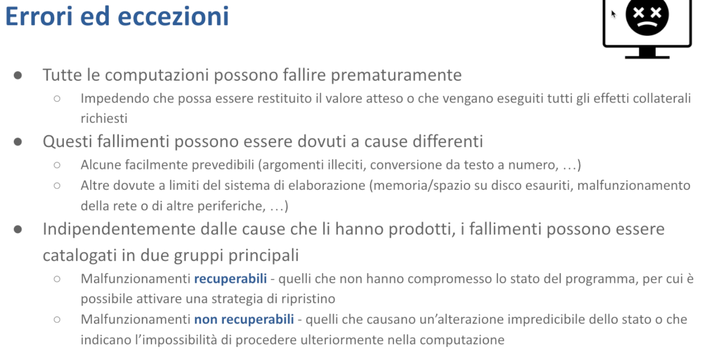

# Gestione degli errori - Malnati 16 <!-- omit in toc -->

# Indice <!-- omit in toc -->
- [1. Introduzione](#1-introduzione)
    - [1.1 Due Tipi di Errori](#11-due-tipi-di-errori)
    - [1.2 Come Gestire gli Errori](#12-come-gestire-gli-errori)
    - [1.3 Strategie di Ripristino](#13-strategie-di-ripristino)
    - [1.4 Rilevamento degli Errori](#14-rilevamento-degli-errori)
    - [1.5 `Result`](#15-result)
    - [1.6 `Option`](#16-option)
    - [1.7 `panic!`](#17-panic)
- [2. Supporto sintattico alla gestione degli errori](#2-supporto-sintattico-alla-gestione-degli-errori)
  - [2.1 Eccezioni in C++](#21-eccezioni-in-c)
  - [2.2 I limiti della gestione delle eccezioni in C++](#22-i-limiti-della-gestione-delle-eccezioni-in-c)
- [3. Gestione delle eccezioni in Rust](#3-gestione-delle-eccezioni-in-rust)
  - [3.1 Elaborare i risultati](#31-elaborare-i-risultati)
    - [3.1.1 `.is_ok()` e `is_err()`](#311-is_ok-e-is_err)
    - [3.1.2 `.ok()`](#312-ok)
    - [3.1.3 `.map()`](#313-map)
    - [3.1.4 `.contains()`](#314-contains)
    - [3.1.5 `.unwrap()`](#315-unwrap)
  - [3.2 La macro `panic!()`](#32-la-macro-panic)
  - [3.3 Ignorare gli errori](#33-ignorare-gli-errori)
  - [3.4 Propagare gli errori](#34-propagare-gli-errori)
  - [3.5 Propagare errori eterogenei](#35-propagare-errori-eterogenei)
    - [3.5.1 `Box<dyn error::Error>`](#351-boxdyn-errorerror)
    - [3.5.2 Enum di errore custom](#352-enum-di-errore-custom)
    - [3.5.3 `thiserror` e `anyhow`](#353-thiserror-e-anyhow)
- [4. Riferimenti](#4-riferimenti)
- [5. Live coding 24/04/2024](#5-live-coding-24042024)
    - [Creiamo una funzione che può fallire](#creiamo-una-funzione-che-può-fallire)
    - [Modelliamo l'errore](#modelliamo-lerrore)

# 1. Introduzione

L'argomento è relativamente facile dal punto di vista strettamente tecnico, perché sono due stupidaggini in croce, ma in realtà è complesso dal punto di vista operativo, perché affronta come gestire gli impossibili errori che si verificano durante lo svolgimento di un programma. Qui la difficoltà non è banalmente cosa faccio per segnalare l'errore o cosa faccio per farci delle cose, ma è: *se il mio programma arriva a un punto e si blocca, che strategia metto in atto per farlo funzionare?* 

Che se volete è un po' il problema che ha uno che parte per un viaggio e buca una gomma. E a quel punto lì il viaggio non può continuare subito. Deve decidere se quella gomma lì la può riparare, ammesso che abbia la ruota di scorta e quindi riesce a cambiarla, oppure se ha il kit per il gonfiaggio, che forse va bene, ma in quel caso lì tiene finché il buco non si dilata e non si sgonfia di nuovo. Oppure la gomma è così lacerata che non c'è verso, non è sostituibile facilmente e quindi bisogna essere trainati via. Questo tipo di situazione che di per sé si può verificare richiede una gestione e quella gestione lì non ha delle soluzioni preconfezionate facili.

Allora, la difficoltà della gestione degli errori è legata a **capire cosa faccio quando capitano delle cose.** 
Poi chiaramente c'è un pezzo di tecnicismo che adesso affronteremo e vediamo di sviscerare.

In generale noi sappiamo che una computazione, cioè l'invocazione di una funzione, può risultare con successo, e quindi dar origine al risultato della funzione stessa, oppure può arrestarsi in qualche punto perché capita un evento inatteso. I diversi linguaggi offrono vari tipi di supporto per intervenire e innanzitutto segnalare che è successo qualcosa di strano, e separatamente mettere in atto delle strategie di ***recovery***, cioè cerco di aggiustare le cose in qualche maniera.

Allora, il principio di fondo è che di per sé tutte le computazioni possono fallire. Il fatto che falliscano vuol dire che non solo non ci danno il risultato atteso (se quella è una funzione che dovrà calcolare un dato, beh, il dato non ce l'abbiamo perché mi son fermato prima), ma hanno un secondo problema. 
Se questa computazione produceva degli effetti collaterali, ad esempio se stavo scrivendo un file sul disco, io so che se va tutto bene, e ho scritto la funzione in modo corretto, al termine della funzione il file è sul disco, tutto intero. Ma se la funzione si blocca per qualche motivo, cioè incontra una qualche difficoltà, *cosa posso dire del file?* Di per sé niente, dipende da dove si è bloccata, magari prima ancora di crearlo e quindi non c'è niente, magari mentre lo sta scrivendo e quindi quel file lì è incompleto, o magari si è rotta dopo, quando quel file lì è già tutto buono. Non so dire di per sé, in assenza di contratti di qualche forma, cosa succeda.

Questo problema è assolutamente presente, ad esempio, nel mondo dei database. I database correggono questo genere di situazione con il concetto di ***transazione***. 
*Cosa succede?* Se io devo fare delle operazioni su un database, posso demarcarle con una transazione. La transazione comincia, faccio le mie operazioni, che possono aver successo o fallire. Se falliscono, quello che succede è che la transazione viene *rolled back*, viene annullata. L'effetto di annullare la transazione è che nel database si mette in atto una qualche strategia che permette di buttare via le modifiche che sono state fatte dall'inizio di questa transazione fino al momento attuale e rimettere come minimo le cose come erano in origine. Che è molto meglio che non lasciarle spaccate a metà.

Questo però è un concetto che nei sistemi operativi di base non esiste. Il fatto che voi iniziate a scrivere un file non è compreso come pezzo di una transazione. E banalmente voi aprite il file, il sistema operativo ve lo apre, voi scrivete sul file, via via che scrivete, il sistema operativo ci aggiunge delle cose, a un certo punto dite che avete finito e chiudete il file, e va bene. Però il sistema operativo non ha nessuna consapevolezza del fatto che questo file sia in divenire, che sia parte di un'azione più o meno lunga. 
Quando però voi avete bisogno di garantire che quel file lì o c'è tutto o non c'è per niente, allora bisogna mettere in atto qualche meccanismo. Chiaramente con uno sforzo in termini di progetto del vostro codice. Cioè siete voi che dovete pensarci prima, perché né il sistema operativo né i linguaggi vi danno supporto per questa cosa.

*Perché mai una computazione dovrebbe fallire?* 
Le cause possono essere molto diverse. Alcune sono in qualche modo prevedibili. Nel senso che, se ad esempio l'utente è coinvolto in un'operazione, banalmente perché l'utente deve inserirmi un dato, e quindi nell'ambito della mia operazione chiedo all'utente di darmi questo dato qui, l'utente potrebbe darmi un dato sbagliato. Ad esempio, quando gli chiedo un numero, lui potrebbe scrivere una cosa che non è un numero. Quando cerco di leggerla come numero, l'operazione di parsing fallisce. Ci sta: errare è umano, quindi ci sta, devo prevederlo e in qualche modo monterò un loop che dice *"provo a leggere, se questa cosa qua non è un numero ti dico che non è un numero, e te lo chiedo di nuovo".* Che chiaramente ha un senso nel momento in cui sono sicuro che c'è l'utente davvero davanti alla tastiera. Perché se il mio programma sarà invece eseguito `qualcosa | mio_programma` (pipe), e quindi il mio programma non sta leggendo dalla tastiera, ma sta leggendo dall'output di qualche altro programma, perché l'ho montato così con la pipe, e beh, lui potrà anche dire "non è un numero”, ma chi gli sta mandando i dati non è che lo capisce. Quindi da lì in avanti succedono dei mostri.

Quindi questi li posso in qualche modo immaginare e posso cercare di costruire il mio software affinché possa essere in qualche modo robusto. Altri invece no, cioè possono anche essere immaginati, ma esattamente come ciascuno di noi ha presente che potrebbe morire tra un nanosecondo perché gli viene un coccolone, mediamente non agisce sulla base di questo. Il fatto che quella cosa sia di per sé possibile non vuol dire che viviamo con un'angoscia di questa cosa.

Nel nostro contesto, *che cosa potrebbe capitare?* 
Ad esempio, banalmente sto scrivendo sul disco e il disco si riempie.

Noi siamo abituati ormai ad avere dischi che sono molto grossi, per cui è normalissimo, comprate un PC che ci sia un tera di disco, anche di più. Ma nonostante questo ci troviamo a gestire spesso e volentieri montagne di dati. Un po' perché scarichiamo film a destra manca, un po' perché magari siamo appassionati di Big Data e tritiamo delle cose di qualche tipo, e quindi, nonostante il fatto che abbiamo dei dischi via via sempre più grossi, li riempiamo facilmente. 

A volte può essere un problema magari di rete. Il mio programma tinge per una parte dei suoi dati da delle informazioni che arrivano dalla rete, in modo più o meno conscio. Perché magari io sono convinto di leggere dal file che si chiama pippo.txt, ma quel file lì, pippo.txt, è servito da un driver remoto. E cosa succede? Succede che magari la rete si interrompe. Qualcuno ha spento l'access point e all’improvviso quello che mi sembrava essere un file locale, non c'è più. È andato via. Oppure leggevo da una chiavetta USB e qualcuno l'ha tirata via. Lì non c'è il recovery che tenga, non ci possiamo fare niente.

### 1.1 Due Tipi di Errori

Indipendentemente dalla causa che ha prodotto questo errore, posso dividere i nostri errori in due famiglie:

- **Errori Recuperabili:** quelli per i quali sono in grado di mettere in atto una strategia di ripristino. Ci posso fare qualcosa.
- **Errori Irrecuperabili:** quelli per cui non ci posso fare nulla.

E se non ci posso fare nulla, l'unica alternativa che ho è piantarla lì. Fermarmi. Perché qualunque cosa cercassi di fare di seguito, mancherebbe dei presupposti e quindi sarebbe potenzialmente anche dannosa.

"*Ex falso, sequitur quodlibet*" — si può dedurre qualsiasi cosa da premesse false. Per esempio, potrei dimostrarvi che 1=2 usando semplici passaggi matematici. Il problema è che per farlo dovrei dividere per zero — un'operazione matematicamente illecita. Questa manipolazione invalida tutto il ragionamento successivo. È per questo che devo fermarmi: proseguire significherebbe solo produrre conclusioni prive di senso.

### 1.2 Come Gestire gli Errori

La scelta di ciò che è recuperabile o irrecuperabile non può derivare dal linguaggio, dal sistema operativo o dall'intelligenza artificiale. Può nascere solo dal buonsenso di chi analizza attentamente il proprio problema, lo comprende a fondo e ne valuta tutte le possibili conseguenze.

In caso di errore irrecuperabile, l'azione tipica è terminare il processo. Mi fermo, lasciando che qualcuno intervenga in seguito per risolvere il problema. La questione è che la terminazione può avvenire in due modi: brusca e immediata, oppure graduale, eseguendo una serie di operazioni per lasciare tutto in ordine prima di fermarsi.

### 1.3 Strategie di Ripristino

Quando sono di fronte a errori che reputo di tipo recuperabile, allora posso provare una qualche strategia di ripristino. 

*Quali sono le strategie di ripristino?* 
Alla buona ce ne sono quelle legate al *"ci provo ancora".* Alcuni mali si guariscono in questa maniera.

Esempi:

- **Retry con l'utente:** L'utente ha scritto una cosa sbagliata, gli dico *"no, è sbagliato, dimmelo di nuovo".* Se lì davvero c'è l'utente, può dar sì che ce la faccio.
- **Retry di rete:** Una connessione di rete andata in timeout. Posso sperare che la rete non sia definitivamente rotta, ma che sia stata solo parzialmente intasata. E quindi anche in questo caso posso riprovare, magari mettendoci una pausa in mezzo. Dico *"aspettiamo 10 secondi, poi ci riprovo".* Magari si ripiglia.

Buona parte dei malfunzionamenti nascono in realtà da congestioni temporanee o meccanismi che hanno un auto recovery indipendente da me, che fa sì che se io riprovo la stessa azione dopo tempo, può dar sì che quella cosa lì vada a posto.

In altri casi posso invece provare a invocare un amministratore, cioè a coinvolgere un utente in qualche modo. Gli mando una mail dicendo *"attenzione, io mi devo fermare, magari invece che spegnermi mi blocco e non vado avanti fino a che tu, caro amministratore, non fai una certa cosa".*

In alcuni casi posso provare a fare quella cosa che stavo facendo in un modo diverso. Se ce l'ho, magari per certi tipi di operazione ammettono due o più approcci, uno dei quali efficiente, interessante, simpatico, che quindi normalmente scelgo, e uno brutto, noioso e lento, che però in mancanza d'altro va anche bene.

### 1.4 Rilevamento degli Errori

Piccolo problema. *Dov'è che mi accorgo che si è rotto qualcosa?* 
Tipicamente nel provare a fare una qualche operazione, dove è coinvolto un pezzo di sistema che si può rompere. Ad esempio, dove faccio qualche operazione di I/O, che normalmente è embedded in una system call. Quel punto lì preciso potrebbe non saperne a sufficienza di che cosa realmente sto facendo.

Supponiamo di scrivere su un file e che il disco sia pieno. L'operazione di scrittura sul file la fa il sistema operativo, che riceve la system call `write` che è responsabile di andare e aggiungere nel file quello che sto scrivendo.

*Chi è che chiama questa system call?* 
Non sono certo io programmatore applicativo. Io programmatore applicativo chiamo la libreria del linguaggio, che avrà il metodo `write_file`, supponiamo, che è responsabile di scrivere. Il metodo `write_file` chiama la system call, la system call dentro si accorge che c'è qualcosa di rotto, restituisce un codice di errore, e poi il metodo `write_file` prende atto di questo codice d'errore, ma non sa che cosa farsene. Perché il metodo `write_file` è genericissimo, me l'ha scritto qualcuno che ha fatto la libreria standard del linguaggio, qualunque esso sia, e non può sapere minimamente che file sto scrivendo, perché lo sto scrivendo, che tipo di assunzioni ci voglio fare. E quindi, sebbene lui se ne sia accorto che c'è stato un errore, non ci può fare niente. E quindi deve passare questa informazione al suo chiamante. 

Questo vuol dire che l'operazione `write_file` deve essere congegnata in modo tale che se il sistema operativo gli dice di no, supponendo che `write_file` debba fare più pezzi, se in uno qualunque dei suoi passaggi si accorge che quel passaggio lì non può essere fatto, deve tornare al chiamante. **Ma deve tornare al chiamante con l'indicazione che è andato qualcosa storto.**

Il sistema operativo nelle system call definisce, in modo molto puntuale, come ritorna i codici di errore. Ogni system call è documentata e ti dice "io ho un valore di ritorno", se ritorno un numero 0 vuol dire che è andato bene, un numero diverso da 0 è un codice d'errore, dove 35 vuol dire questo, -2 vuol dire quell'altro, e così via. E quindi lì c'è un'interfaccia predefinita, ben fatta.

Se tu chiami la system call, non è detto che quell'interfaccia lì possa essere propagata così com'è, perché quello che ha senso a basso livello non ha necessariamente senso in contesti diversi. E quindi devo trovare un modo di segnalare al mio chiamante che si è rotto qualcosa. Anzi, devo segnalare al mio chiamante *cosa* si è rotto. Quindi non solo che si è rotto qualcosa, ma possibilmente anche cosa si è rotto, perché solo sapendo cosa si è rotto il chiamante potrà decidere se ha una strategia da mettere in atto oppure no.

Chiaramente noi potremmo usare un approccio simile a quello delle system call restituendo un numero. Un numero però è un problematico, perché supponiamo che 27 voglia dire *"File not found".* *Quale* file non hai trovato? Io so solo "File not found", ma non so *quale* file. Al chiamante magari questa informazione gli potrebbe servire. Oppure potrei volergli dire *"non ho scritto tutto".* Ma *quanto* hai scritto? Mi servono dei dettagli. Ogni errore viene con delle informazioni, possibilmente aggiuntive, che fanno capire al chiamante che cosa possa essere successo.

*Come trasporto queste informazioni aggiuntive?* 
Questo può dare origine a strategie diverse, e qui nella storia dei linguaggi di programmazione sono successe cose varie, dove abbiamo assistito a un movimento prima in un senso, poi nel senso opposto. In ogni caso, val la pena rendersi conto che qualunque cosa io faccio, il mio programma si complica tantissimo.

Se prima ho una semplice operazione che legge dal file 1, riempie un buffer, scrive sul file 2 e chiude entrambi i file — quindi una funzione basilare con `read`, `write`, `close`, `close` — nel momento in cui tutte e quattro queste funzioni possono fallire, il mio codice si trasforma in "*if* fallisce read, fai questo, *else if* fallisce write, fai quello, *else if* fallisce la prima close, fai quest'altro, *else if* fallisce l'altra close, fai quell'altro ancora, *else* finalmente tutto è andato bene, ritorna il successo". E così quel programma, che prima era chiarissimo da leggere, è diventato un gineprario.

Perché si hanno "if" annidati uno dentro l'altro, e se le azioni invece di essere quattro fossero 40 — cosa del tutto plausibile — il codice diventa illeggibile. Se poi queste azioni sono dentro un loop, è un vero disastro: diventa impossibile da mantenere. Chi lo legge si mette le mani nei capelli, e rischia di fare anche danni nel tentativo di modificarlo, perché perde completamente il filo della logica.

Se poi qualche programmatore un po' creativo, a volte dice *"if è andato bene”*, e altre volte dice *"if è andato male”*, lì è la disperazione. Perché quello che prima almeno in un caso aveva una struttura standard, e quindi avevo sempre il ramo del "then" che mi indicava una condizione sbagliata, e sempre il ramo dell’ "else" che mi indicava una condizione giusta, o viceversa, se io comincio a fare certe volte il check positivo, certe volte il check negativo, non so più qual è il ramo giusto su cui devo muovermi. Disastro.

Per questo motivo, a un certo punto nella storia, si è iniziato a mettere in discussione l'approccio in cui le funzioni restituivano semplicemente un codice d'errore, senza regole chiare sul suo significato. Poteva essere un numero, un booleano o una stringa, ma come si potevano comunicare dettagli aggiuntivi sull'errore? Nel linguaggio C, storicamente, non esisteva alcun meccanismo per farlo.

Se voi prendete la definizione di Windows, che è pure un sistema operativo che ha i suoi 30 anni di storia, e andate a guardare come Windows segnala i suoi errori, allora Windows non vi lascia accedere alle system calls. Le system calls di Windows sono tutte schermate da funzioni, scritte in C, esportate dal file che si chiama `system.dll`, piuttosto che `gdi.dll`, piuttosto che `user.dll`. Quindi voi accedete alle system calls solo chiamando funzioni di quel tipo lì, contenute in quelle dll lì.

Quelle funzioni sono funzioni tipo `create_file`, questa prende 27 parametri e ti restituisce qualche cosa, per dire se l'ha creato o meno. Un'altra è `write_file`. 

Come sono congegnate queste funzioni? Disperazione: alcune tornano un booleano. Di solito con la convenzione che se è true l'operazione è andata bene, se è false è andata male. E se è andata male, *come* è andata male? Boh.

Altre funzioni ritornano un intero, con la convenzione che zero indica successo, mentre altri valori indicano errori. *E come si interpreta questo codice?* Si esamina il bit più significativo: se è 1, indica un errore del kernel. Se è 0, si controlla il secondo bit più significativo: se è 1, significa che l'errore è avvenuto nel wrapper tra il codice utente e il kernel. Se entrambi i bit sono 0, si tratta di un errore applicativo che il programmatore deve gestire autonomamente. I bit rimanenti specificano il tipo specifico di errore verificatosi.

Ma è anche possibile che la funzione restituisca non un numero ma un handle, definito come `void*`, quindi un puntatore, con la convenzione che se non è `NULL` l'operazione è andata bene, mentre se è `NULL` è fallita. Siamo alla convenzione opposta di prima — un vero disastro! Il programmatore che deve scrivere codice per Windows si trova quindi completamente disorientato.

**È difficilissimo capire**, data una funzione, che tra l'altro non sai neanche bene che è di sistema, perché si maschera, siccome non è una system call ben definita, cioè che ha una sua cosa, ma è semplicemente il nome di una funzione che sai a memoria che `create_file` te la dà il sistema operativo, ma nessuno ti impedirebbe di fartene tu una che si chiama `create_file`, cioè non ha una evidenza del suo comportamento. E devi andare a cercare tu, il tapino che l'ha inventata, quale strana idea si è messo in testa come logica di gestione degli errori.

Per questo motivo a un certo punto nella storia la gente ha cominciato a rifletterci e dire bisogna che il linguaggio mi dia un modo preciso per distinguere i comportamenti corretti dai comportamenti non corretti. E così è nata l'idea delle ***eccezioni***. 

Le eccezioni sono state introdotte in C++ e sono state abbracciate da Java che le ha poi propagate quasi come un'infezione alla maggior parte dei linguaggi moderni. Per cui trovate le eccezioni in JavaScript, trovate le eccezioni in Python, trovate le eccezioni da altre parti. **Disastro.**

*Perché è disastro?* Perché il concetto di eccezione, su cui vale la pena di spenderci due minuti per la sua onnipresenza nella maggior parte dei linguaggi e per il fatto che spesso e volentieri i programmatori, soprattutto quelli junior, non ci riflettono abbastanza, nascondono una serie di problemi.

I signori che hanno progettato Rust avendo imparato la lezione che le eccezioni **non sono la soluzione migliore**, hanno fatto un mezzo passo indietro, tornando all'idea dei codici di ritorno, ma con un'importantissima differenza, dicendo "*non è che lo definisce il programmatore a caso, a volte true, a volte false, a volte uno, a volte zero, o cose del genere. Guarda, io ti metto a disposizione **nel linguaggio** una struttura dati, una **enum** fatta apposta, col quale descrivi se la tua cosa è andata bene o è andata male. Se è andata bene mi descrivi il suo **risultato**, se è andata male mi descrivi **perché***".

### 1.5 `Result`

Questa enum si chiama **`Result`**, ed è un tipo generico perché dipende da due sottotipi. `T`, che è il tipo che descrive se la cosa è andata bene qual è il vero risultato della funzione. Per cui posso avere funzioni che ritornano `String`, e quello lì sarà un **`Result<String, E>`**. O delle funzioni che ritornano dei booleani, e quello lì sarà un `Result<Boolean, E>`.

Quindi il primo parametro di Result serve a descrivere quella particolare funzione, che cosa ritorna se va bene. Il secondo parametro di `Result` serve a dirmi se quella funzione invece ritorna perché qualcosa è andato storto, che cosa mi devo aspettare? Ed è il tipo `E`. Tipo `E` che può essere di per sé qualunque cosa, proprio come il tipo `T`, ma che normalmente si sceglie che sia un tipo che implementa il tratto `Error`. Perché implementando il tratto `Error` ci dà alcune garanzie sulla describilità e sulla utilizzabilità dell' `Error` stesso. Dopodiché non c'è un vincolo che sia un oggetto che implementa il tratto `Error`. Ma è molto conveniente se gli facciamo implementare il tratto `Error`.

In alcuni casi io posso semplicemente dire che non ho potuto fare quanto atteso, e quindi è possibile, in alternativa a usare **`Result`**, segnalare gli errori con il concetto di **`Option`**. 

### 1.6 `Option`

`Option` vuol dire: può darsi che ti dia il tuo risultato; se per qualche motivo non riesco a calcolarlo sappi che ti ritorno `None`. 
`None` ti fa capire che il risultato non ce l'hai, ma non *perché* non l'hai avuto. Va bene in quelle situazioni più semplici in cui in fondo non ci importa sapere perché non è stato possibile, ci basta sapere che non è stato possibile.

### 1.7 `panic!`

E poi ci dà ancora un altro pezzo che è la macro `panic` che abbiamo in qualche modo già incrociato nel codice che abbiamo scritto. 

# 2. Supporto sintattico alla gestione degli errori

Prima di vedere però i dettagli di cosa ci dà Rust facciamo uno zoom sui costrutti che sono presenti nella maggior parte degli altri linguaggi che si chiamano `try`, `catch`, `throw` e in alcuni casi `finally`. Nel senso che `finally` non è presente ovunque, ma è presente uniformemente dalle varie parti.

## 2.1 Eccezioni in C++

Allora, detto che il C come linguaggio non vi dà nessun supporto — quindi né modi per indicare che cosa è andato bene e che cosa è andato male (lo scegliete voi a vostro piacimento) né modi per forzare una terminazione avanzata se non l'istruzione `return` in quanto tale, il C++ invece ha cominciato a introdurre il concetto di **eccezione**. 

In C++ un'eccezione è un dato qualunque: potete usare un numero, potete usare una stringa, potete usare la classe `std::exception` o una sua derivata, potete usare una lista, potete usare quello che vi pare. Dovete scegliere un tipo di dato per descrivere cosa si è rotto.

Dopodiché una funzione al suo interno può contenere, in mezzo alle altre istruzioni, l'istruzione `throw`. 

*Cosa fa l'istruzione* `throw`*?* Quando viene eseguita prende il suo parametro (che può essere un dato qualunque), se lo segna e forza il ritorno dalla funzione stessa. Quindi per certi aspetti assomiglia a un `return`: smetto in questo momento di eseguire questa funzione.

Con una differenza però importante: il `return` può solo prendere come parametro un dato che abbia come tipo il tipo di ritorno della funzione stessa: se ho dichiarato che questa funzione mi ritornava dei numeri, `return` può solo prendere un numero. Invece con `throw`, nel contesto di una funzione che ritorna numeri posso fare `throw "ciao"`. 
Quindi si slega completamente il tipo ritornato che è noto come firma (quindi il chiamante sa cosa aspettarsi se va tutto bene nel chiamare quella funzione) dal tipo usato per descrivere qualche errore.

Questa è la **prima grande differenza**: il chiamante non sa nel caso in cui si verifica un errore come quell'errore sarà descritto. Non lo può sapere, **la firma della funzione non lo codifica**. 

**Secondo differenza importantissima**, `return` mi fa tornare alla riga dove c'era la call. Anzi, alla riga successiva. `throw` mi fa passare da quella riga lì, quindi atterro nella funzione che mi ha chiamato e mi guardo intorno dicendo *“questo punto in cui è avvenuta la chiamata era chiuso in un blocco di tipo* **`try`***?”*, se sì salto tutte le istruzioni che vengono dopo di me fino a raggiungere la fine del blocco `try` e guardo le sezioni che seguono `try`, che si chiamano **`catch`** e guardo se per caso il tipo dell'errore che è stato lanciato corrisponde a qualcuno dei `catch` che sono indicati.

Se è così, eseguo il codice contenuto nel `catch`, dopodiché dico *“a posto, allarme cessato”*. Notate che ho **saltato completamente tutte le righe che venivano dal punto in cui ho fatto la chiamata del posto in cui si è rotto**, quindi le cose che dovevo ancora fare **non** le faccio, atterro sul `catch`, e se il `catch` corrisponde faccio quello che c'è scritto dentro il `catch`, che deve prendersi la briga di rimettere a posto. Tutto quello che potrebbe essersi rotto nella funzione che ha segnato l'errore e anche tutto quello che non ho fatto, perché non c'è verso di rifarlo. E poi proseguo da lì in avanti, quello che viene dopo viene dopo. Quindi, mettendo non poca complessità nella gestione.

Però potrebbe anche darsi che quando io faccio `throw` in una funzione, torno al mio chiamante, ma il mio chiamante non abbia racchiuso l'invocazione dentro un blocco try-catch, e quindi non posso fermarmi lì, quindi torno al chiamante del chiamante e di nuovo mi guardo intorno. Sono caduto dentro un try-catch? No, allora torno al chiamante del chiamante del chiamante, e così via. Può darsi che in questa storia, io torno indietro, e indietro, e indietro fino all'inizio del thread. **Se torno fino all'inizio del thread, in C++ il programma si arresta.**

Tipicamente un blocco try-catch ha una struttura come quella in slide:

- `try` che racchiude un certo numero di istruzioni che possono fallire loro direttamente o che possono chiamare qualcuno che fallisce a cascata
- uno o più blocchi `catch` che introducono il tipo possibile di eccezione e racchiudono le cose da fare se quel tipo di eccezione si verifica

Questo mi dà dei **vantaggi**, sicuramente rispetto al niente del C. Mi dà un **modo pulito** di interrompere l'esecuzione, non solo della funzione corrente, ma anche della sua chiamante, della chiamante della chiamante e così via, perché devo atterrare in un blocco catch, quindi evito di andare avanti a fare cose strane.

Mi dà anche un modo di poter veicolare dei **dettagli maggiori**, proprio perché l'eccezione può essere una cosa qualunque, quindi certamente posso usare un numero, posso usare una stringa, ma posso anche usare una classe, una struttura con tanti campi, dentro cui mi segno tutti i dettagli che mi possono interessare. Mi sono rotto scrivendo un file e ci posso descrivere dentro che file stavo scrivendo, fin dove l'ho scritto, che tipo di rottura si è verificata, eccetera eccetera.

Questo permette al blocco `catch` di avere una migliore comprensione dell'errore. Inoltre, evita la frustrazione di dover consultare interminabili tabelle di codici (come capire che 0xfffffDC significa "File not found"). È molto più pratico! In questo modo la gestione degli errori diventa più semplice.

**Però ha delle turbe**. Prima di tutto, la funzione che chiama qualcun altro non ha la possibilità di sapere se questo qualcun altro può solo andar bene oppure può rompersi. Non c'è nella firma di una funzione l'indicazione di una possibile rottura. Per questo motivo, a un certo punto, nel C++ hanno aggiunto un modificatore. Al termine del nome di una funzione, dove la definisco, posso aggiungere la parola chiave `noexception`. 

`noexception` vuol dire *"io mi impegno a non lanciare eccezioni e a chiamare solo altre funzioni che a loro volta sono* `noexception`*".* In questo modo so almeno che lì un'eccezione non nasce. Ma tutte quelle che non hanno la clausola `noexception` potrebbero lanciare eccezioni. Quali? Non lo sappiamo.

I signori di Java, 1993-94, ci riflettono un po' su e dicono *"troppo casino, il fatto che uno possa lanciare cose a caso non va bene"*. Java, gerarchia di classi ben definita, tutto nasce da `Object`, facciamo una classe comoda per descrivere le eccezioni. E sotto `Object` mettono `Throwable`. Dopodiché dicono *"le eccezioni sono di due famiglie"*. Sotto `Throwable` mettono due ulteriori sottoclasse `Error` e `Exception`.

`Error` serve in tutte quelle situazioni in cui **non c'è altro da fare che morire**. StackOverflow, OutOfHeap, tutti quei problemi legati alla macchina virtuale interna che ha raggiunto uno stato instabile etc... Quelle cose lì non posso fare altro che fermarmi. Quindi se mai viene lanciato un `Error`, non c'è niente da fare. Si muore e basta. 

`Exception` lo uso invece per descrivere tutte quelle cose in cui posso pensare di farci qualcosa.
E mettono in un **vincolo:** se una funzione può lanciare un'eccezione, **deve dichiararla**. Per cui ad esempio le operazioni sul file system di Java, nella classe `j[ava.io](http://java.io/)`, sono tutte operazioni che nella loro firma contengono `throws IOEexception`.

Con una fregatura in più: non solo quelle funzioni sono obbligate a dire che lanciano un'eccezione, ma chi le chiama è obbligato o a dire che anche lui può lanciare quell'eccezione, oppure deve costruire un blocco try-catch. Posso solo chiamarti dentro un try-catch. E bisogna che il `catch` contenga l'eccezione che prendi, altrimenti non va bene.

**Questa cosa qua** che sembrava pulire meglio concettualmente la cosa per cui il programmatore diventava conscio che stava chiamando un pezzo che poteva rompersi e quindi doveva gestire le eventuali rotture, o segnalare che lui stesso di conseguenza si sarebbe potuto rompere, ha portato però alla scrittura di codice immantenibile. Perché è diventato un *coacervo di try-catch, catch*, di vario tipo. **Ingestibilissimo**.

In realtà i signori di Java avevano detto *"*`Exception`*, se lanci exception o una sua sottoclasse, devi dichiararlo. E chi ti chiama deve farlo in un blocco try-catch”.* 

Ma c'è una sottoclasse di `Exception`, che si chiama `RuntimeException`, che è esentata. Perché è esentata? Perché se no il codice diventerebbe ingestibile. Poiché in Java **tutti i puntatori possono essere nulli**, `NullPointerException` ti può saltare fuori dovunque. Ma se tutte le volte che tu scrivi qualcosa, punto, qualcos'altro, dovessi farlo in un blocco tra i catch, il tuo codice diventa inscrivibile. E quindi la `NullPointerException` è in realtà una sottoclasse di `RuntimeException`.

**Quello che doveva diventare un'eccezione alla regola generale, però è diventata la regola**. Perché i programmatori ne avevano le scatole piene di mettersi lì a scrivere blocchi try-catch, e compagnia bella. E quindi hanno cominciato a modellare esclusivamente le loro eccezioni come `RuntimeException`. Il risultato è che si è perso tutto il valore della cosa. Altri linguaggi hanno fatto scelte diverse, ma non troppo dissimili.

Java aveva un'altra differenza importante rispetto al C++. Il blocco `try-catch` poteva terminare con `finally`. In C++ `finally` non esiste. A cosa serve `finally`? Serve a dire, “*comunque sia andata sta roba, bene o male, al termine esegui quello che c'è scritto dentro* `finally`*”*.

Questo è utile per implementare i concetti simili alle transazioni di database. Cioè io voglio avere un punto di controllo da cui comunque passo. Questo però di fatto ha voluto dire che la maggior parte del codice, ad esempio, che trattava la IO in Java, è diventato un codice del tipo `try-catch`, che chiama un `try-finally`, che chiama effettivamente la cosa. **Confusionario**. 

C++ non ha il `finally`. Ha solo i `catch`.

Vediamo cosa succede. Abbiamo un esempio della funzione `f1` che chiama la funzione `f2`, la quale potrebbe fallire. Quando `f1` viene invocata, C++ ha dovuto implementare un meccanismo speciale per gestire il ritorno. Ha stabilito che *"nello stack non metterò solo le variabili locali e l'indirizzo di ritorno, ma anche un dato aggiuntivo: l'ultimo blocco try attraverso cui sono passato"*. Nella **ABI** (Binary Interface) è stato specificato che *"il processore deve dedicare un registro specifico per ricordare dove si trova questo punto di passaggio"*. Questo viene chiamato **Exception Context**.

Nel caso degli x86 c'è uno dei registri estesi che è **dedicato a tenere questa exception**.

Quando entro in un ulteriore blocco try, nello stack viene inserito un nuovo Exception Context che viene fatto puntare all'Exception Context precedente. Dopodiché il registro dedicato viene aggiornato. In questo modo sono sicuro che nel registro dedicato ho sempre il più recente Exception Context, mantenendo anche il resto.

Una volta entrato nel blocco try, *cosa contiene l'Exception Context?* **Mi segno dove comincia la parte dei catch che mi riguardano**. Così posso trovarla facilmente, evitando confusione sulla posizione del catch.

A questo punto chiamo la funzione `f2`. La chiamata avviene normalmente: salvo nello stack l'indirizzo di ritorno per quando tutto andrà bene. 

`f2` esegue le sue operazioni, in questo caso crea `i`, che va anche lui nello stack.

Dopo aver eseguito tutte le operazioni necessarie, `f2` valuta se il risultato è corretto. Supponiamo che qualcosa non vada bene — ho rilevato un problema che comprometterà l'esecuzione. **Come segnalo questo errore?** Uso `throw` e lancio un'eccezione.

In questo esempio si usa una delle classi predefinite del C++. Queste sono solo consigliate, non obbligatorie (a differenza di Java dove si possono lanciare solo `Throwable`). In C++ si può lanciare qualsiasi cosa, ma è consigliato usare classi derivate da `std::exception`. `std::logic_error`, che deriva da `std::exception`, serve a descrivere possibili problemi logici del programma. Accetta una stringa come parametro per includere dettagli sull'errore.

*Cosa succede quando lanciamo* `logic_error`*?* **Le istruzioni seguenti di `f2` vengono ignorate**. Non torno semplicemente al chiamante — faccio di più: comincio a svuotare lo stack. Invoco tutti i distruttori degli oggetti che incontro finché lo stack non raggiunge l'Exception Context più recente (la cui posizione è salvata nel registro dedicato). Quindi, finché lo stack pointer è diverso dal registro dell'Exception Context, continuo a rimuovere e distruggere elementi: la variabile `i` viene rimossa, l'indirizzo di ritorno viene rimosso, fino ad arrivare all'Exception Context.

**Una volta raggiunto l'exception context**, il programma salta al primo blocco `catch` per verificarne la compatibilità. Il blocco `catch` controlla se il tipo dell'eccezione lanciata (salvato in un registro del processore) coincide con il tipo specificato. Se c'è corrispondenza, viene eseguito il blocco `catch`.

Quando si entra nel blocco `catch`, il codice al suo interno dovrebbe teoricamente sistemare gli errori riscontrati. *Se questo non avviene, i problemi persistono*, anche se per il programma tutto appare normale. È come ignorare un allarme antincendio dicendo *"ma si, è solo un test"* — se poi l'edificio brucia, le conseguenze sono nostre per non aver prestato attenzione.

Nel blocco catch abbiamo la **responsabilità di risolvere il problema**. Se siamo capaci di "spegnere l'incendio", allora possiamo procedere — ma dobbiamo essere certi che sia davvero risolto, altrimenti il problema potrebbe ripresentarsi.

Se tutto va bene, l'Exception Context viene consumato dopo aver gestito l'errore. Il programma prosegue normalmente fino alla fine della funzione `f1`, che termina senza segnalare problemi.

Se invece l'eccezione non corrisponde a nessuno dei blocchi catch disponibili, il programma li esamina tutti, verifica che non ci sono corrispondenze, e utilizza il riferimento all'exception context precedente per continuare lo svuotamento dello stack (*"svuota e distruggi"*) fino a raggiungere il context precedente, ripetendo poi il processo.

Questo meccanismo funziona perché **ogni thread viene creato con un exception context iniziale**. Sia il thread principale (con la sua particolare genesi) che i thread secondari nascono con un blocco try-catch, garantendo che tutto il codice che scriviamo abbia sempre un try a monte.

Il blocco catch alla “base”, che troviamo alla radice dello stack ha un comportamento speciale: per il thread principale esegue una `exit`, mentre per i thread secondari esegue una `terminate`. La differenza sta nel codice di **errore restituito**, ma in entrambi i casi il processo termina.

Lo svuotamento automatico dello stack dopo un `throw` (il meccanismo di "svuota e distruggi") è alla base del pattern **"RAII" (Resource Acquisition Is Initialization)**, che permette di utilizzare i distruttori degli oggetti come meccanismo per sistemare le risorse.

L'abbiamo già incontrato quando abbiamo parlato di `Box` e di `Vec`: il distruttore di `Vec` rilascia l'array che lui ha allocato sullo heap. Questo vuol dire che, se il `Vec` viene distrutto normalmente perché la funzione che l'ha dichiarato finisce, lui rilascia la memoria. Ma anche se dovesse finire abnormalmente, a seguito di un arresto anomalo, **il fatto che lo stack venga svuotato con questo meccanismo fa sì che verrà invocato il distruttore del `Vec` e la memoria sarà effettivamente rilasciata**. Non c'è leakage.

Questo meccanismo lo possiamo usare a nostro beneficio anche in altre situazioni. Ad esempio, possiamo creare un oggetto che ha solo un costruttore e un distruttore. Nel caso di **Rust**, avrà il metodo `new` e poi implementa il tratto `Drop`, dandoci quindi il metodo `drop`. Questi due metodi saranno congegnati in modo tale da garantirci un comportamento duale: *se tutto va bene o se tutto va male, in ogni caso, sono sicuro che le azioni del distruttore vengano eseguite*. Questo supplisce il problema del non avere il `finally`.

## 2.2 I limiti della gestione delle eccezioni in C++

Il problema legato al C++, ma in generale a tutti i linguaggi che hanno le eccezioni, è che **il compilatore non è in grado di identificare *dove* vengano restituite eccezioni**. In C++ specifico, ho solo il `nothrow`, che mi dice *"sono certo che questo non lancia"*. Tutte le altre possono lanciare, e siccome tutte possono lanciare, non c'è obbligo di chiamare dentro `try-catch`. In Java sarebbe un po' meglio, ma per via del meccanismo delle `RuntimeException`, tutti le usano e quindi il compilatore di nuovo non forza i controlli.

In secondo luogo, l'eccezione che lancio è una sola. A volte però mi trovo nella situazione di lanciare un'eccezione in conseguenza di un'altra eccezione. In Java questo viene risolto perché la classe `Exception` ha dentro di sé un puntatore (che può essere nullo) ad un'altra eccezione chiamata `cause` (causa). Questo permette di risalire alla causa dell'eccezione.

Per esempio, l'eccezione *"non ho creato il file, perchè? Perché il disco è pieno"* non richiede necessariamente di notificare che il disco è pieno - al programma è utile sapere che il file non è stato creato, e **separatamente** il motivo. Questo è diverso dal caso *"non l'ho creato perché non ho i diritti di scrittura"*. L'effetto è lo stesso (il file non c'è), ma la causa è distinta. **Sapere la causa mi permette di correggere l'errore**.

Se io non riesco a distinguere il caso per cui non l'ho creato perché il disco era pieno, dove l'eventuale cura è *"faccio spazio su disco"*, rispetto al *"non ho i diritti"* dove la cura è *"devo fare privilege escalation e acquisirli"*, non potrò mai aggiustarlo questo tipo di errore.

**Se un errore può essere generato in tanti posti diversi, ma viene gestito solo centralmente, in alto**, chi gestisce l'errore potrebbe avere difficoltà a scegliere la contromisura appropriata senza tutti i dettagli necessari. Inoltre, quando l'errore viene catturato in alto, viene saltata l'esecuzione di molto codice sottostante. Se l'errore si verifica in un punto, non vengono eseguite certe operazioni; se si verifica in un altro punto, ne vengono saltate altre. Anche se riesco a gestire l'errore, non ho modo di sapere quali operazioni specifiche sono state saltate nei diversi scenari possibili.

**Ultimo, ma non ultimo**, il fatto che per poter gestire questa cosa, C++ (come anche Java e altri), è obbligato a sporcarmi lo stack, cioè a dire che nello stack ci stanno anche gli exception context. Questo è un problema, ed è il motivo per cui **non si può usare C++ nel kernel di Linux**. Perché altrimenti il kernel di Linux, che non è costruito sull'assunzione che i thread hanno comunque uno stack che comincia con un exception context, non possono convivere agilmente con questa cosa qui, perché nel kernel i thread si scambiano gli stack con una certa facilità, avvengono delle cose poco belle a vedersi, ma estremamente efficaci dal punto di vista pratico. Ma la presenza di questo exception context rompe le scatole. E quindi nello kernel di Linux non si mette il C++. 

# 3. Gestione delle eccezioni in Rust

**Come si fanno le cose in Rust?** 
Rust ci mette a disposizione un costrutto specifico e ci dice *“se devi gestire qualcosa che può fallire, non inventare niente, usa* `Result`*"*. 

`Result` è un tipo sufficientemente versatile che va bene per tutte le situazioni di cui abbiamo bisogno. `Result` accetta il tipo che descrive cosa ritorniamo se va bene e accetta il tipo che descrive cosa ritorniamo se va male. Diremo semplicemente che la nostra funzione, se può fallire, ritorna un `Result`.

Nell’esempio in slide abbiamo `read_file` che riceve una stringa col nome del file da leggere e deve ritornarci delle cose. 
*Come è fatta?* Comincia a fare `File::open`, di cui non abbiamo ancora visto i dettagli, ma comunque `File::open` ritorna un `Result`. 

Può darsi che quel nome lì esista e quindi apre il file. E quindi nella parte, diciamo, positiva, io avrò un `Ok` con la handle di quel file lì. 
Oppure può darsi che quel file non esista e allora avrò un `Error` che mi dirà *"File not found"* o qualcosa di simile. Oppure può darsi che il file esista ma io non abbia i diritti per leggerlo e allora mi dirà *"Permission denied".* 

A questo punto, dopo aver chiamato la funzione per aprire il file, devo leggerlo. Usando `match r1 { ... }`, verifico il risultato. 
Se è un `Error`, all'interno troviamo il motivo `why`, quindi processo questo caso e restituisco semplicemente un messaggio che indica che non sono riuscito a leggere il file, spiegando il motivo dell'interruzione. Se invece l'operazione va a buon fine, nell' `Ok` trovo la handle del file, che mi segno.

A questo punto creo una `String` e provo a leggere il contenuto del file mettendolo dentro questa stringa usando `file.read_to_string(&mut s)`. 
Di nuovo, questa operazione può andare a buon fine oppure no. Usando `match r2 { ... }`, se non sono riuscito, ritorno il motivo. Se sono riuscito, ritorno `Ok` e passo la stringa stessa che contiene quello che volevo. Questa è l'idea base. Si potrebbe dire che questo approccio è verboso, ma i signori di Rust, per fortuna, ci danno una serie di cose. Adesso, tra un attimo, le vediamo.

## 3.1 Elaborare i risultati

Prima diciamo due cose. Questo `Result` che noi torniamo è un oggetto ricco di metodi che rende facile la vita per chi ne ha uno tra le mani a fare dei ragionamenti. Certamente noi possiamo guardare cosa c'è in un `Result` usando `match` e andando a chiedere se match ha `Ok` di qualcosa o `Err` di qualcos'altro. 

### 3.1.1 `.is_ok()` e `is_err()`

Ma possiamo anche andare sull'oggetto `r`, di tipo `Result`, e chiedere `if r.is_ok()` e in questo caso avrà successo se lui contiene il dato buono oppure `if r.is_err()` in questo caso ritornerà `true` se invece racchiude un errore, senza dirci quale errore, ma semplicemente ci permette di capirlo in fretta.

### 3.1.2 `.ok()`

`r.ok()` *sbriciola* il `Result` — vedete: prende `self`, quindi consuma l'oggetto. 
`r.ok()` mi ritorna un `Option`  — se il risultato non è `Ok` mi ritorna `None`, se invece va bene mi ritorna un `Some<T>`.

### 3.1.3 `.map()`

`map()` è utile, viceversa, per quelle situazioni in cui io voglio dire *“se c'era un dato buono, trasformamelo in quest'altra maniera”*. Quindi se ad esempio mi aspettavo una stringa, posso fare `r.map(|s| s.to_uppercase())`. Se la lettura del file è andata a buon fine, la funzione specificata dentro map viene applicata. Se invece c'è un errore non fa niente, perché non c'è bisogno di mappare. Questo mi permette di descrivere cosa voglio fare senza doverlo fare subito.

### 3.1.4 `.contains()`

`.contains()` mi permette di controllare se per caso all'interno c'è qualcosa che matcha il parametro che gli sto passando.

### 3.1.5 `.unwrap()`

Infine `unwrap()` mi permette di dire *“io assumo che questo risultato sia buono”*. 
Se non è buono panica, che vuol dire mi arresto e la pianto lì. Se invece è buono allora prendo il contenuto, il `Result` viene sbriciolato e mi prendo direttamente il suo contenuto.

## 3.2 La macro `panic!()`

**Perché viene chiamato "panic"?** Perché smettere brutalmente un programma è più complicato di quel che sembra. Nel momento in cui io scopro che un'operazione che ho fatto è andata male e il *tipo di male* che si è verificato è di quelli *"unrecoverable",* allora devo smettere. Ma smettere potrei farlo con `exit()` (`std::process::exit`). Il problema è che smetterei di botto lasciando tutte le cose a caso. In alcuni casi non è detto che questo approccio vada bene. Quindi sarebbe meglio cercare di terminare **disfacendo quello che si può ancora disfare**, quindi **eseguendo i distruttori**.

Se io invoco `process::exit()` smetto su due punti. È come quando viene il coccolone, non avete possibilità di fare altro. Bang! 

`panic!()` viceversa forza il ritorno al chiamante, al chiamante, al chiamante, e così via fino ad esaurire lo stack. Facendo questo, se ci sono dei distruttori pendenti che avevano segnato delle azioni per disfare qualcosa, questi verranno eseguiti. 

<aside>
💡

**Distruttori e ritorno al chiamante**

Ricorda che i distruttori vengono invocati quando la corrispondente variabile associata arriva alla fine del suo scope. Quindi, forzando il ritorno al chiamante (e quindi forzando ad uscire dallo scope corrente), i distruttori vengono chiamati.
E continuando a forzare il ritorno al chiamante fino ad esaurire lo stack possiamo invocare i distruttori di tutto ciò che avevamo allocato.

</aside>

In più, se il thread che ha invocato `panic!()` è il thread principale, il processo cessa, indipendentemente da quanti altri thread secondari ci siano. Se il thread che ha invocato `panic!()` è un thread secondario, di quelli che avete creato voi, solo lui termina. Gli altri continuano a fare quello che dovevano.

Per questo motivo, la scelta generale di tutte le API è usare `panic!()` e non fare `exit`. 

**Panic è una macro** che accetta degli argomenti simili a `println!()` e quindi voi potete mettere, con la stessa sintassi di `println!` ad esempio `panic!("Panic, error: {}", err)`, quindi potete creare dei messaggi d'errore. 

*Perché potete passargli un messaggio d'errore?* Perché quel thread lì si svuoterà e quando lo stack sarà vuoto stamperà quel messaggino che gli avete messo. Che è utile perché in questo modo potete comunicare in modo più strutturato all'utente o potenzialmente a un altro programma (se siete connessi tramite pipe o qualcosa del genere) cosa è andato male.

## 3.3 Ignorare gli errori

A volte noi vogliamo scrivere un programma veloce dove sappiamo che anche se la funzione nominalmente potrebbe fallire non ci importa troppo che fallisca, cioè diamo per buono che non fallirà. **Attenzione, questo va fatto con molta attenzione**. 

Per questo motivo il tipo `Result` offre `unwrap`. Il metodo `unwrap` forza a dire *"ma io sono praticamente certo che è andato bene quindi prendi”*, se non c'era un `Ok` dentro quel `Result` panica. **Il problema è che panica dandoci un messaggio anonimo.** 

Per questo motivo `Result` ci offre anche `expect` che è come `unwrap` ma accetta un parametro simile a quello che possiamo dare a `panic!`, che è una descrizione, dice *"prendilo, ma se non riesci a prenderlo stampa questa cosa",* almeno se l’operazione è andata storta capiamo qualcosa. 

Quindi, sostanzialmente `expect` ci permette di *customizzare* la stringa di errore che viene stampata nel caso in cui non ci sia ciò che vogliamo.

## 3.4 Propagare gli errori

Nell'esempio che abbiamo visto prima il codice di `read_file` non è proprio bello. 

Perché di fatto noi qui dobbiamo fare due operazioni: `open` e `read_to_string`, ma le abbiamo dovuto mettere dentro due match. È un po' una seccatura.

I creatori di Rust ci dicono *"sì, hai ragione. Ti diamo una soluzione più elegante".*
Se hai una funzione che ritorna un `Result` (quindi la funzione deve avere come tipo di ritorno `Result` o eventualmente un `Option`) e vuoi evitare di scrivere quel codice verboso di prima, puoi fare così: aggiungi semplicemente un punto interrogativo dopo le singole righe che possono fallire.

**Cosa vuol dire quel punto interrogativo messo al fondo?** 
Per esempio, con `File::open(name)?`, viene chiamata la `open` e internamente viene verificato il risultato: se `open` ha restituito `Ok`, viene estratto e restituito il contenuto; se invece ha dato un errore, quell'errore viene propagato.
La notazione con il punto interrogativo dopo uno statement significa quindi "se il risultato è di tipo `Error`, propaga quell'`Error`".

<aside>
💡

**Riassunto**

</aside>

**Il vincolo** però perché questa cosa funzioni è che la funzione che contiene i punti interrogativi ritorni un `Result`, perché se non ritorna un `Result` non va bene: quel punto interrogativo lì non sa che cosa ritornare. 
Non solo, ma deve ritornare un `Result` che abbia come `Error` lo stesso `Error` che si è verificato: se io ho chiamato `File::open`, che mi ritorna un errore di tipo `io::Error`, non posso dire che la mia funzione ritorna un `Result` che nel caso di errore ci mette una `String`, perché non va bene — non matchano i tipi.

Quindi nel caso specifico dell’esempio, in effetti la funzione `read_file` annuncia che se va bene mi dà una `String`, e se va male mi da un `io::Error`.

<aside>
💡

**Ok(s)**

</aside>

In alcuni casi potrei anche dire se non mi interessa il dettaglio del perché è non è andata bene, e mi basta dire che non è andata bene, potrei dire che ritorna `Option` e il punto interrogativo fa la conversione automatica e riesce a gestirsela.

## 3.5 Propagare errori eterogenei

### 3.5.1 `Box<dyn error::Error>`

A volte però mi trovo nella situazione di dover ritornare errori diversi tra di loro, ad esempio quel file lì che legge la stringa potrebbe immaginare che dentro la stringa ci sia un numero, ad esempio è la chiave di un algoritmo di crittografia. 

Può darsi che quel file lì contenga veramente il numero, ma può anche darsi che non ci sia un numero e quindi nel momento in cui cerco di passarlo come numero venga fuori un errore. Peccato che l'errore è un `parse::Error`, non un `io::Error` — è un'altra cosa!

Quindi la mia funzione si può rompere con due tipologie: si può rompere dicendo `io::Error` perché il file non esiste e non lo posso leggere, o si può rompere con `parse::Error` perché il file pur esistendo non contiene un numero.

*Ma io non riesco a tornare una cosa che è contemporaneamente* `parse::Error` *e* `io::Error`*?*
Se sia `parse::Error` che `io::Error` implementano il tratto `Error` — e in questo caso è così — posso dire che la mia funzione esterna ritorna un `Box<dyn error::Error>`. 

Questo fa sì che il valore ritornato, in caso di errore, è automaticamente trasferito sullo heap e io restituisco il puntatore a questa cosa. 
*Questo perché?* Perché può darsi che `io::Error` sia grande 30 byte e `parse::Error` sia grande 12, quindi non posso tornare due cose che sono di dimensioni diverse. Viceversa se io dico che torno un `Box`, il `Box` è sempre solo un puntatore 8 byte, quindi va benissimo!

Un `Box` ha che cosa? Un `Box` ha un oggetto tratto `dyn`, in questo caso, di `Error` perché quell'oggetto lì implementa il tratto `Error`. 

*E com'è fatto il tratto* `Error`*?* 
Il tratto `Error` è un tratto sostanzialmente che ha alcuni vincoli: deve essere stampabile quindi implementa sia `Debug` che `Display` e in più ha una serie di `from` — riesce ad essere convertito da un tipo a un altro.

Quindi qui vediamo un esempio della funzione `sum_file` dove in alto c'è scritto che ritorno un `Box<dyn error:Error>`. 

Poi faccio la `File::open(path)?` con il **punto interrogativo**: quel punto interrogativo automaticamente fa sì che il mio `io::Error`, se mai si è verificato, viene boxato. 

Poi vado avanti e faccio `read_to_string(&mut contents)?` di nuovo con **punto interrogativo**: quel punto interrogativo fa sì che l'eventuale altro `io::Error` diventi un `Box<dyn error::Error>`. 

Poi più avanti ancora faccio `parse` della mia linea o qualcosa del genere per decodificare il numero che c'era scritto dentro — se mi viene un `ParseIntError` (che l'errore è che segnala che non era un numero) anche lui viene boxato e quindi la cosa funziona e va tutto bene!

**Il chiamante come fa a discernere le cose?** 
Lo vediamo nel blocco sotto: prova a chiamare questa cosa qua. Se ha bisogno di mettere in atto una strategia di qualche tipo (anche solo per spiegare all'utente che cosa ha fatto o meno), nel caso `Ok` fa una stampa, e tutto va bene. 

Nel caso si è verificato un `Error`, per dare dei messaggi significativi deve distinguere. 
E allora usa il meccanismo del `downcast_ref` e va a chiedersi: *"per caso il particolare* `Error` *che si è verificato è di tipo* `io::Error`*?".* 
Se è così allora do un messaggio opportuno, oppure vado a pescare dentro l'`io::Error` i dettagli del perché. 

Se invece `downcast_ref` posso ridurlo a un `ParseIntError` allora darò un altro messaggio d'errore, altrimenti `unreachable`.

**Unreachable perché?** 
L’ `else` dobbiamo metterlo per coprire tutte le possibilità del match, dentro mettiamo `unreachable` che è una macro che dice *"se arrivi qua rompiti"* perché vuol dire che non ho aggiornato il mio codice correttamente. Cioè al momento io vedo che la funzione `sum_file` può solo generarmi quei due tipi di errore — se mi esce un terzo tipo c'è un problema: qualcuno ha toccato e non ha messo a posto dove doveva. Quindi quell'`unreachable` lì va proprio bene, mi aiuta tantissimo perché mi garantisce che nel tempo il mio codice rimarrà coerente.

### 3.5.2 Enum di errore custom

In alternativa potrei dire che prendo, creo un `enum` che racchiude sia `io::Error` che `parse::Error` e quindi mi creo un mio tipo che può contenere due variazioni se è verificato l'errore tipo IO o l'errore tipo parse che racchiudono le varie informazioni. 

Questo va anche bene, ha solo una fregatura: bisogna che se voglio gestirmi questa cosa bene il mio tipo custom implementi il tratto `Error`. Ma implementare il tratto `Error` è una seccatura.

Per implementare il tratto `Error` devo implementare tutti i pezzi che mi mancano: devo implementare `From<io::Error>`, devo implementare `From<ParseIntError>`, devo implementare `Display`, devo implementare `error::Error` — ok vedete che viene una strafilata di cose, faticosissimo!

E c'è poi qui vediamo il codice sotto che matcha questo approccio. 

### 3.5.3 `thiserror` e `anyhow`

In realtà le librerie ci vengono in aiuto: ci sono due librerie fondamentali, una si chiama **thiserror** e l'altra si chiama **anyhow.** 

Si possono usare in congiunzione o separatamente. 

**thiserror** serve a implementare in modo semplice il tratto `Error` — prevalentemente viene usato da chi crea librerie. Si fa una `enum` che contiene `error1`, `error2`, `error3`, `error27` tutte le cose che possono capitare e poi, incorporando la libreria **thiserror,** si riesce a generare in automatico il tratto `Error` tramite la macro `derive`. 
Implemento `Error`, faccio implementare anche `Debug` dalla `derive` e poi mi resterebbe `Display` ma di nuovo il meccanismo `#[error]` permette di implementare facilmente il `Display` relativo.

E qui vedete degli esempi. 
`#[from]` mi genera in automatico il `from` lì dentro.

Quindi per descrivere cosa può succedere nella mia funzione dico: "guarda, nella mia funzione possono succedere due problemi — ho un errore di I/O che includo nell'opzione I/O, e ho un errore di parsing che includo nell'opzione di parsing." Faccio derivare automaticamente il tratto `Error` e il tratto `Debug`, il tratto `Display` lo implemento con `#[error]`, e il tratto `from` lo implemento mettendo `#[from]` nei relativi casi. Con poco sforzo documento tutto quello che mi serve!

**Anyhow** per contro permette di gestire in modo più semplice la gestione degli errori come? Andando a dire che una funzione genera semplicemente un `anyhow::Result`.

**Anyhow** è capace di convertirsi una serie di cose che mi dà la possibilità di aggiungere dei contesti. Quindi `file_open.with_context()` cosa succede? Se verrà mai generato un errore questo errore verrà sostituito da una stringa che contiene "missing path" e poi il path specifico che non riuscivamo a mettere. 

Se per qualche motivo non riesco a leggere la stringa genererò l'errore con `file read error`, se non riesco a fare il parsing dico *"mi hai passato questa schifezza che non è un numero".* 

Le due librerie possono essere usati insieme o separatamente, in ogni caso semplificano la vita tantissimo.

# 4. Riferimenti

# 5. Live coding 24/04/2024

Prima di tutto ho creato un progetto nuovo, apro `Cargo.toml` e mi aggiungo tra le dipendenze **thiserror**.

Qui mi propone la versione 1.0.59, ma per evitare di essere legato a questa particolare sottoversione, la 0.59, **siccome viene usato il semantic versioning** mi limito a dire che a me basta thiserror 1.0, perché se dopodomani esce la versione 1.0.60, automaticamente questa verrà incorporata, sapendo che mediamente chi rilascia nuove librerie, quando tocca soltanto il minor number, fa delle modifiche che sono retrocompatibili, e sono tendenzialmente solo migliorative di quello che esiste. 

Quindi è conveniente lasciare soltanto 1.0. Avendo aggiunto questa cosa, a questo punto lui dovrebbe avere a disposizione thiserror e quindi lo possiamo dare per disponibile.

### Creiamo una funzione che può fallire

Facciamo un'ipotetica funzione `leggi_file`, che non leggerà nessun file, ma ci serve per poter dire che ogni tanto fallisce. Questa funzione prenderà in ingresso un `filename: &str`, e dovrà ritornarci un `Result<String, FileError>`, in cui **`FileError`** al momento non esiste. 

### Modelliamo l'errore

Allora modelliamo `FileError`.

Questa cosa qua accetta una stringa costante come descrizione, per farla semplice. Detto così, è un possibile errore, ma non c'è evidenza che sia un errore, sì c'è scritto “Error” nel nome del tipo, ma non è molto utile. Affinchè sia ragionevolmente usabile e comprensibile da altri programmatori, è bene che questa cosa qua implementi il tratto `Error`.

Implementare il tratto `Error` a mano però è faticoso, da questo punto di vista il crate `thiserror` è particolarmente conveniente, perché ci ha aggiunto magicamente la possibilità di derivare `Error` tramite la macro `derive`, e noi vogliamo derivare anche `Debug`.

In più, per essere completo, ci serve che implementi anche il tratto `Display`.

Il tratto `Display` lo andiamo ad aggiungere qua con `#[error]` — il tratto `display` stampa una stringa, *"Problema con il file: {0}"*, e qua gli mettiamo 0, *perché?* 

Perché `FileError` è una struct di tipo tupla, vedete che i campi non hanno un nome, e quindi hanno al loro posto un indice, il messaggio che descrive il dettaglio di che cosa si è verificato è il campo 0 dentro cui c'è la descrizione di questa cosa.

A questo punto la nostra funzione `leggi_file` la possiamo implementare. Ovviamente la implementiamo alla buona, dicendo che:

- Se `filename.len` è minore di 3, ritorniamo un `FileError` con messaggio "Nome troppo corto"
- Altrimenti, ritorniamo una `String` contenente il contenuto del file

Nel nostro `main` possiamo verificare se la funzione `leggi_file` funziona:

Proviamo a eseguirlo e vediamo che:

- Con il file "abcd": funziona correttamente
- Con il file "a": otteniamo l'errore `C’è stato un problema: Problema col file: Nome troppo corto`

Notiamo che il tratto `Display` è stato implementato automaticamente, permettendoci di usare `{}` per la stampa. Se invece usiamo `:?`, otteniamo la stampa di debug che mostra `C’è stato un problema: FileError("Nome troppo corto")` .

La nostra struttura implementa quindi tre tratti fondamentali:

- Il tratto `Error` (derivato automaticamente)
- Il tratto `Debug` (verificato con la stampa `:?`)
- Il tratto `Display` (verificato con la stampa `{}`)

Potremmo complicare la logica aggiungendo un altro caso: se `filename.len` è maggiore di 5, ritorniamo un `FileError` "Nome troppo lungo". 

Finché i tipi di errori sono riconducibili a questa struttura, il nostro `FileError` funziona bene per rappresentare l’errore.

La struct potrebbe essere resa più complessa aggiungendo, ad esempio:

- Il nome del file problematico
- Un codice d'errore univoco per migliore gestione nel `match`

Ma anche così risulta molto agevole da gestire.

Adesso supponiamo di avere bisogno di costruire un'altra funzione che si chiama `elabora_contenuto`. Questa prende in ingresso una `String` e anche questa di per sé può fallire, può fallire in vari modi e quindi ritorna un `Result`: se va bene mi dà un `i32`, se va male invece mi vuol dare un errore di altro tipo — lo chiamerei invece che `FileError` un errore di `ContentError`.

`ContentError` al momento non esiste. 

Posso crearmelo allo stesso modo: `ContentError` mi porta dentro di sé altri tipi di informazione. `ContentError` è fatto di un paio di campi: un campo è di tipo `content: String` e l'altro campo è `code: i32`. Sono due pezzi di informazione, gli ho dato un nome così mi viene facile gestirli. Anche questo voglio che derivi `Error`, `Debug`, e anche qua vorrei mettermi un'indicazione che implementa `Display`.

In realtà anche in questo caso vorrei gestire dei possibili errori, e quindi nella funzione potrei scrivere:

Quindi nel mio `main`, dopo `match leggi_file`, potrei scrivere:

Output: `Problema: Contenuto non adatto: 1`

Quindi a questo punto abbiamo creato due descrizioni possibili di errore, ognuno che si porta dati diversi per i fatti suoi. 

Queste sono due operazioni disgiunte, ma tendenzialmente noi vogliamo una funzione vera che elabora il nostro file: prima lo legge poi lo elabora, quindi vogliamo che faccia in cascata delle cose. 

Dunque probabilmente noi vogliamo una funzione principale `fn combina_azioni` che prende in ingresso il nome di un file `filename: &str` e ci deve ritornare un `Result`.

La funzione `combinazioni` prima legge il file. Se il file va bene, quello che ha letto dentro il file lo passa a `elabora_contenuto`. Se `elabora_contenuto` va bene, ci restituisce il valore finale. `elabora_contenuto` alla fine, se tutto va bene, ci dà un intero, quindi questo qui è un `Result&lt;i32&gt;`.

Che tipo di errore può succedere? Ne possono succedere due:

- Se è andato male `FileError` (non sono riuscito a leggere il file), mi deve dare l'errore su `FileError`
- Se il file l'ho letto ma nell'elaborarmi il contenuto non mi andava bene, devo dare un `ContentError`

Quindi qui sono un po' in difficoltà: *che cosa scrivo nel campo Error del Result da ritornare?*

Allora qui mi devo inventare una classe ulteriore, un qualcosa che al momento non ho ancora presentato. Come lo faccio? Con un `enum`! 

Diamo un nome a questa cosa — questo è un `ProcessingError` che ha dentro di sé due campi possibili:

- Un campo `File` che contiene un `FileError`
- Un campo `Content` che contiene un `ContentError`

Sono le due alternative possibili.

Piccolo problema: `ProcessingError` non è noto che sia un errore. Anche qua mi viene in aiuto `thiserror`: `#[derive(Error, Debug)]`. E poi devo dare dei messaggi di qualche tipo — `#[error("Errore di elaborazione")]`.

Cosa scriviamo dentro `combina_azioni`? 

Allora qui di fatto, se io scrivessi `let c = leggi_file(filename)`, dentro quel `c` avrei un `Result`. Per gestirlo dovrei fare `match` eccetera, ma abbiamo visto ieri che posso usare il punto interrogativo. 

Però questa cosa qui potrebbe darmi un errore. Il problema è che l'errore che mi dà, se viene, è un errore di tipo `FileError`, ma questa dice che mi dà un `ProcessingError`. 

*Come converto il* `FileError` *in un* `ProcessingError`*?* 

Allora, nella `enum` io ho la possibilità di aggiungermi ancora un'altra annotazione che dice `from`. Questa annotazione serve a dire: *"se per caso ti passa tra le mani un* `FileError` *e hai bisogno di creare un* `ProcessingError`*, guarda, è facilissimo: quel* `FileError` *diventa un* `ProcessingError` *creando un* `ProcessingError` *che ha come valore dell'enum il campo `file`".* E analogamente posso dire: *"Se hai bisogno di creare un* `ProcessingError` *a partire da un* `ContentError`*, fai quest'altra cosa".* E quindi ci rimetto `from`.

Quindi il mio `combina_azioni` al momento dice: prova a leggere il contenuto. Se ci riesci va bene, se non ci riesci `?` ritorna (ovvero l'errore che `leggi_contenuto` genererebbe, che è un `FileError`, lo converte automaticamente in un `ProcessingError` creandomi l'opportuno tratto `from`). Se invece è andato bene, io dentro `c` ho già la stringa. A questo punto posso passare questa stringa al `let r = elabora_contenuto(c)`. Anche qua `elabora_contenuto` può andare bene o male, di nuovo ci metto il `?`. Questo `?` automaticamente fa sì che se mi venisse un errore di tipo `ProcessingError`, lo genererebbe. Se tutto va bene ho il risultato, e a questo punto lo ritorno con `Ok(r)`.

Vediamo cosa succede nel momento in cui io lo chiamo: invece di chiamare `match leggi_file(a)` faccio `match combina_azioni(a)` e tolgo il pezzo sotto. 

Quindi a questo punto lui proverà ad aprire il file chiamato `a`. Se ci riesce, proverà a elaborare il contenuto. 

In questo modo io ho potuto facilmente combinare errori molto diversi, ognuno dei quali si portava dietro le informazioni che ritenevo opportuno. Li ho modellati semplicemente con una `struct` in cui ho messo i pezzi che ritenevo interessanti per far capire che cosa è successo lì dentro. Ciascuno di questi l’ho marcato, gli ho fatto implementare il tratto `Error` tramite la macro `derive` grazie al crate `thiserror`, e gli ho fatto implementare anche il tratto `Display` corrispondente così li posso stampare.

Poi, dovendo creare una funzione che chiama altre funzioni (ciascuna delle quali fallisce per modi distinti), ho preparato un `enum` che me li metteva insieme. Questo `enum` è anche lei un `enum` che descrive un errore, quindi gli ho fatto implementare il tratto `Error`, il tratto `Debug` e il tratto `Display` in modo opportuno. Ho detto che delle varie alternative erano del tipo 1, del tipo 2, del tipo 3, dandogli anche un nome (File e Content). E poi però ho dovuto dare istruzioni su come passare dall'errore specifico (che potrebbe essere un `FileError` o un `ContentError`) all'errore generico (quello che ne comprendeva potenzialmente tanti). E l’ho fatto aggiungendo questa annotazione `from` che ha fatto sì che dove usavo il `?` lui dicesse *"aspetta, qui potrebbe andar male, ho bisogno di tornare".* Se il risultato è `is_error` (cioè conteneva qualcosa che non andava bene) devo ritornare, ma non posso ritornare direttamente il `FileError` perché questa vuole il `ProcessingError`. Ma grazie alla macro `from` lui mi sa estendere: partendo dal `FileError` mi sa generare il `ProcessingError` relativo e quindi il codice diventa smooth.

Quindi questa soluzione è assolutamente facile se uno sa dove mettere le mani — si riesce a costruirsi una cosa che è al tempo stesso **descrittiva a sufficienza**. In ciascuna classe di errore mi posso portare dietro tutti i dettagli necessari per permettere un recovery di qualche tipo. Al momento non abbiamo fatto nessun recovery, ma potenzialmente ci siamo scritti tutto quello che è andato male, dandoci gli estremi per mettere in atto una strategia.

È facile perché posso arricchire la mia situazione a piacimento. Contemporaneamente posso gestirla agevolmente perché la sintassi del punto interrogativo mi dà la possibilità di avere uno shortcut. Quindi il metodo `combina_azioni` resta sostanzialmente leggibile: leggi file, processa contenuto e ritorna il risultato. È agevole da leggere, senza strani accumuli di `if`, `match` o costrutti simili.

La strada prediletta — quella dove tutto va bene — è quella che leggo. Tutte le altre sono strade potenzialmente storte che provocano una *uscita rapida* grazie al punto interrogativo. Questa uscita rapida mi garantisce di non perdere dettaglio, mantenendo il livello di dettaglio che avevo semplicemente racchiudendolo dentro una struttura un pochino più grande.

Nel `main` sono in grado di provare le mie strategie di qualche tipo. Qua di strategia non ne provo nessuna — mi limito a verificare se le cose sono andate bene. Se le cose sono andate male, dico perché e poi la pianto lì.