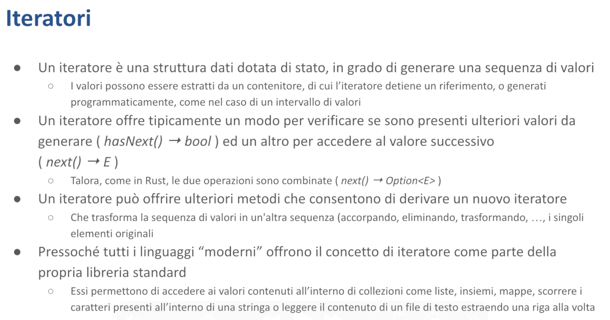

# Iteratori - Malnati 17 <!-- omit in toc -->

# Indice <!-- omit in toc -->
- [1. Introduzione](#1-introduzione)
  - [1.1 Iteratori in C++20](#11-iteratori-in-c20)
- [2. Iteratori in Rust](#2-iteratori-in-rust)
  - [2.1 Esempio](#21-esempio)
  - [2.2 Adattatori](#22-adattatori)
  - [2.3 Consumatori](#23-consumatori)

# 1. Introduzione

Un iteratore è una struttura dati che è specializzata nell'offrirci un metodo `next` che ci permette di sapere se c'è qualcosa ancora da leggere oppure no. 

Quindi una struttura dati che ci aiuta a visitare una collezione tirando fuori gli elementi uno alla volta. 

Quella collezione lì, di solito, l'iteratore **non la possiede** — la guarda e quindi ci ritorna un reference ai suoi contenuti. 
In alcuni casi l'iteratore **può prendere possesso** della collezione smontandola, e ce la smonta non tutta di colpo ma ce la smonta un pezzettino alla volta finchè non l'abbiamo visitata tutta.

Quindi l'iteratore è una **struttura dotata di stato.** 

Tipicamente un iteratore prende questi valori che tira fuori uno alla volta da un contenitore, in alcuni casi potrebbe prenderli in realtà da una funzione che li genera di volta in volta.

Normalmente da un punto di vista concettuale l'iteratore deve permettermi di sapere *se ce ne sono ancora*, cioè prima di chiederti qual è il prossimo ti chiedo *“ma ce l'hai un prossimo?”* e questa è una domanda che ha risposta sì o no. Nel caso in cui tu mi dica no è inutile che ti chieda altro, nel caso in cui tu invece mi dica sì allora ti chiedo anche qual è, e a quel punto ho un secondo metodo, `next`, che mi permette di estrarlo. 

A secondo di che cos'era la collezione da cui sto partendo `next` mi può ritornare un numero, una stringa, etc…

Diversi linguaggi implementano questa cosa in modo vario. In **Java**, esiste l'interfaccia del package `java.util.Iterator` che contiene tre metodi:

- `hasNext()` che ritorna un booleano
- `next()` che ritorna il tipo dell'iteratore
- un metodo per cancellare l'elemento corrente

In **Rust**, i due metodi sono combinati: c'è un unico metodo `next()` che ritorna una `Option`. Se l' `Option` contiene `Some`, vuol dire che un altro elemento c'era (e dentro `Some` c'è anche scritto qual è). Se l' `Option` è `None`, vuol dire che non ce ne sono più. Puoi chiamare `next()` infinite volte, ma dopo `None` riceverai sempre `None`.

A partire da un iteratore possiamo creare altri iteratori. Possiamo:

- Concatenare iteratori in sequenza
- Filtrare elementi con certe caratteristiche
- Trasformare gli elementi in qualcos'altro

Questo concetto è presente in tutti i linguaggi moderni.

Un esempio pratico: quando scriviamo un ciclo `for` in Rust stiamo usando un iteratore (il compilatore trasforma il ciclo for in uso di iteratore). Ad esempio:

- Abbiamo un vettore `v1` con numeri da 1 a 6
- Un vettore `v2` destinato a contenere stringhe
- Un ciclo for che itera su `v1.len()`, controlla se ogni elemento è multiplo di 2, e se lo è inserisce una stringa derivata in `v2`

Il risultato: `v2` contiene tre stringhe: "a2", "a4", "a6".

**Questa stessa cosa** è scritta in modo imperativo, con una serie di comandi che accedono al vettore tramite le parentesi quadre con l'indice `i`. Questo approccio funziona, ma presenta dei rischi: se per errore assegnassimo a `i` un valore fuori range, il programma potrebbe andare in panic. Anche se questo codice è semplice e intuitivo, possiamo scriverlo in un modo alternativo ed equivalente.

Vediamo cosa potremmo inserire in `v2`. Dentro `v2` ci metto `v1.iter`, ovvero vado da `v1` e dico “*senti me li dai i tuoi numeri uno alla volta?”*. `v1.iter` si prepara a dare i numeri uno alla volta ma non fa niente a parte prepararsi.

Poi gli dico “*guarda una volta che avremo questi numeri uno alla volta, guardaci dentro e passami avanti solo quelli pari”* — `.filter` — e qui ti passo una lambda per fare questa cosa. 

`.filter` accetta una lambda che ritorna un booleano: se quel booleano è **true** lo tengo, se il booleano è **false** lo butto. 

E quindi se `v1.iter` voleva dire "dammeli tutti", `v1.iter.filter` vuol dire *"dammi solo alcuni, quelli che mi piacciono".* Va bene, ma ancora non ha fatto assolutamente niente, si è solo preparato.

Successivamente consideriamo: se qualcosa esce dal filter (anche se non è garantito), cosa ne facciamo? Abbiamo un numero, ma ci serve una stringa! La soluzione è *mappare* ogni elemento che esce usando una lambda che trasforma il numero in stringa. Come? La lambda prende il numero e usa `format` per creare una stringa che combina "a" con il numero stesso.

E poi c'è quello che veramente fa partire la macchina, la mette in moto: **collect**! 
`collect` dice *"ok parti e raccogli il tutto, raccoglilo e mettilo nel risultato, cioè* `v2`*"*. 

`collect` si comporta diversamente in base a dove deve mettere le cose: se devi metterlo dentro un `Vec` farà certe operazioni, se deve metterlo dentro una `VecDeque` (che non sappiamo ancora cos'è ma lo scopriamo tra breve) ne farà degli altri, se deve metterlo dentro una linked list ne fa delle altre ancora — quindi sulla base di dove deve inserire i suoi risultati, agisce.

`collect` inizia a chiamare chi sta a monte: si rivolge a `map` e chiede "Hai qualcosa?". `map` risponde "Aspetta, devo chiedere" e va da `filter`. `filter` a sua volta chiede a `iter`: "Hai qualcosa?". `iter` risponde "Sì, dovrei avere 6 elementi in `v1`".

Quindi `iter` comincia a restituire 1. `filter` lo esamina e dice *"No, è dispari, non mi piace".* `iter` passa al successivo, 2. "Bello, questo 2 mi piace!" e lo passa a `map`. `map` dice "Ok, devo trasformarlo in stringa: 'a2'" e lo passa a `collect`. `collect` lo salva nel risultato, dentro `v2`.

Si torna da `map`: *"Altri elementi?".* 
Arriva 3: *"No, è dispari".* 
Poi 4: *"Sì, è pari, mi piace!".* "a4" viene salvato. 
Avanti col prossimo... 5, 6... 
*"Altri elementi?". "No, non ce ne sono più"* 
Fine. Questa è la storia dell'iteratore.

L'iteratore **non fa niente** se al fondo non ci attacco qualcosa che **consuma**. Questo è molto diverso da quello che succede in JavaScript: se voi in JavaScript avete un array `[1,2,3,4,5,6]` e fate `[1,2,3,4,5,6].filter().map()`, **immediatamente parte il filter** che da quell'array lungo 6 ne crea subito uno lungo 3. Immediatamente dopo che filter ha creato il suo array lungo 3, parte map, che fa le stringhe "a2", "a4", "a6", e poi quello viene salvato come risultato.

Quindi abbiamo tre concetti fondamentali:

- Gli iteratori sono un modo per **navigare una collezione** facendoci dare quello che c'è dentro un pezzo alla volta
- Gli iteratori sono **pigri** — da soli non fanno niente, aspettano che qualcuno gli chieda *"ce l'hai il prossimo?"* — se nessuno glielo chiede, non succede nulla
- Un iteratore può essere attaccato in cascata a un altro iteratore (modificatore) per arricchire la selezione

Lo possiamo fare con una serie di operatori — qui ne abbiamo visti due fondamentali:

- `filter`: quando non tutti gli elementi mi interessano
- `map`: quando ho bisogno di una derivazione del valore, lo mappo/trasformo in qualcos'altro

Quindi di base noi usiamo gli iteratori perché sono **versatili**: siamo partiti da un vettore che conteneva `[1,3,4,5,6]`, ma fossimo partiti da una lista il codice era lo stesso, se fossimo partiti da un range `1..=6` il codice restava uguale (a parte il pezzo iniziale da dove prendiamo le cose). Indipendentemente dalla sorgente, noi usiamo l'iteratore per farci dare uno alla volta che cosa c'è lì dentro. Da questo punto di vista ci aiuta a scrivere del codice più semplice: non abbiamo bisogno di sapere troppi dettagli di *come* è fatta quella sorgente — l'iteratore ce li prende uno alla volta.

Gli operatori sono **pigri** — gli iteratori sono pigri solo se noi gli chiediamo. Se non glielo chiediamo non fanno assolutamente niente. 

Potenzialmente gli iteratori possono operare in **parallelo** — notate che bisogna chiederlo in modo esplicito. Noi adesso qui stiamo operando in modo strettamente sequenziale: *"dammi il prossimo, dammi il prossimo, dammi il prossimo".* In alcune situazioni noi possiamo dirgli *"dammi tutti i prossimi che riesci in contemporanea".* Poiché possiamo derivare da un iteratore un altro iteratore applicandogli le funzioni (come `filter`, `map`, `reduce`, `fold`, `first`, `last`, `reverse` eccetera), il nostro codice diventa molto più flessibile perché possiamo aggiustare un mucchio di cose facilmente. 

Gli iteratori esistono in tutti i linguaggi, anche in C++, solo che in C++ sono stati modellati con un'idea un po' così — piuttosto che un approccio funzionale come abbiamo visto in Rust basato sulla *monade* `Option` che contiene `Some` con un valore, o `None`, e quindi mi permette con un singolo metodo `next` di governare tutto, in C++ sono stati modellati pensando ai puntatori e all'aritmetica dei puntatori, che è un disastro.

Per cui di fatto quello che succede è che in C++ gli iteratori viaggiano sempre in coppia `begin`/`end` e vanno confrontati l'uno con l'altro. Non abbiamo troppo tempo da dedicarci, sappiate però che questo è un grosso problema del C++ che è stato un po' aggiustato solo nel 2020 con l'introduzione dei `range`. Un range in realtà in C++ è un oggetto che dentro di sé contiene i due iteratori ma ti dà un'interfaccia pulita simile a quella di Rust o degli altri linguaggi, altrimenti era un grosso casino. 

## 1.1 Iteratori in C++20

C'è un altro problema degli iteratori in C++. È legato al fatto che alcuni iteratori hanno **capacità più grandi di altre** che dipendono sostanzialmente dal posto dove sono stati acquisiti. Di conseguenza c'è tutta una gerarchia concettuale:

- Iteratori di **ingresso**: capaci di leggere un valore
- Iteratori di **uscita**: capaci di scrivere un valore
- Iteratori **forward**: leggono solo in avanti, dall'inizio alla fine
- Iteratori **bidirectional**: permettono di andare anche all'indietro, dal fondo all'inizio
- Iteratori **ra ndom access**: consentono di saltellare avanti e indietro di n posizioni
- Iteratori **contiguous**: assumono che i dati siano adiacenti in memoria, trattandoli come array

Tutto questo però rende l'uso degli iteratori complicato. È vero che la standard library del C++ è tutta basata sull'uso degli iteratori e offre metodi che ti consentono, data una coppia di iteratori, di farci operazioni sopra. 

Ad esempio, la funzione `sort` permette di ordinare un contenitore sotto certe condizioni. Il problema è che alcune funzioni della standard library presuppongono che l'iteratore sia di una particolare categoria — se ne passate uno più generico, si spacca dando errori di compilazione illegibili. 

Il grande sforzo fatto nel C++20 con l'introduzione dei `concept` è stato quello di fare in modo che questa cosa (nonostante si spacchi sempre), dia un errore leggibile: *"Non posso ordinare questa cosa perché non è ordinabile, in quanto l'iteratore non è quello buono"*. Ad esempio, una linked list non è sortabile perché ha i suoi pezzi sparpagliati in memoria.

# 2. Iteratori in Rust

Vediamo invece cosa succede in Rust, che è quello che ci interessa. 

Gli iteratori in Rust sono **molto semplici**: sono oggetti qualunque (struct, enum o tuple) che implementano il trait `Iterator`. Il trait `Iterator` ha:

- Due componenti **essenziali**:
    - Il tipo di dato (`Item`) che l'iteratore produce
    - Il metodo `next` che restituisce una `Option<Self::Item>`

Oltre al metodo obbligatorio `next`, l'iteratore ha una trentina di metodi ulteriori con implementazione di default. 
Questi metodi ci consentono di derivare `filter`, `map`, `reduce`, `fold`, `reverse` e così via. 

Se un tipo permette di essere esplorato elemento per elemento, implementa il trait `Iterator`. Se il contenitore di partenza aveva delle stringhe, l'iterator ci dà dei riferimenti alle stringhe — cioè permette di guardare dentro senza modificare, ritornando normalmente il reference non mutabile al dato contenuto.

Un tipo però potrebbe anche dire *"guarda io ho dei dati miei e sono pronto a sbriciolarmi per dare uno alla volta i miei dati a chi gli interessa”*. In questo caso non implementerà il tratto `Iterator` o non implementerà solo il tratto `Iterator`, ma implementerà il tratto `IntoIterator`. 

Il tratto `IntoIterator` fondamentalmente prende possesso della sua sorgente, e quindi non dà il reference ai singoli dati che la sorgente contiene, ma dà i dati che la sorgente contiene, perché quando l'iteratore sarà stato eseguito (anche solo parzialmente) l'intera struttura originale verrà sbriciolata. 
Il tratto `IntoIterator` sostanzialmente ha un'unica funzione che è `into_iter` che trasforma quella cosa lì.

Gli iteratori non hanno niente di magico dentro di sé, si limitano a contenere qualcosa — sono degli oggetti che hanno quello che gli serve per ricordarsi a che punto sono arrivati. Se io dovessi iterare su un vettore, com’è fatto l'iteratore che è capace di iterare su un vettore? Ricorda un indice! Ricorda il riferimento al vettore a cui può chiedere delle cose, un indice, e dice *"fintanto che il mio indice è minore del size del vettore, alla richiesta di un nuovo elemento gli rispondo sì e dò l'elemento i-esimo, e poi incremento l'indice.”*

Qui c'è l'esempio di un iteratore che permette di iterare su un range in modo bidirezionale, ovvero una struttura `MyRange` con due limiti. Il range può andare, ad esempio, da 7 a 25, oppure da 25 a 7. Nel caso di un range da 7 a 25, l'iteratore restituisce in sequenza 7, 8, 9,…, 24 (l'ultimo numero è escluso). Nel caso inverso, da 25 a 7, l'iteratore restituisce in sequenza 25, 24, 23,…,8.

*Come funziona questa cosa?* 
Banalmente dichiaro la struttura `MyRange` che prenderebbe come parametro del template direttamente gli estremi, quindi di per sé non ha bisogno, in quanto range, di contenere niente altro perché sigillo nel tipo i suoi estremi che sono costanti. Dopodiché posso dire che questa struttura implementa il tratto `IntoIterator` per esempio, *e cosa fa?* Banalmente tiene traccia di sé, di un contatore.

Restituisco un `MyRangeIterator` da `FROM` a `TO`, e questo `MyRangeIterator` contiene un solo valore numerico. Quando viene richiesto il prossimo elemento, restituisco il valore di `self.val`. Se sto procedendo in ordine crescente, poi incremento `self.val` di 1; se in ordine decrescente, lo decremento di 1. Questo meccanismo mi permette di esplorare l'intero range. Quando raggiungo la fine, restituisco `None` e l'iterazione termina. Questo è il funzionamento essenziale dell'iteratore.

Se questo invece di essere un oggetto che parte da due estremi costanti fosse legato a un vettore, avrebbe avuto dentro di sé banalmente il riferimento al vettore, aveva lo stesso indice e si ricordava banalmente se a che punto era arrivato. La risposta a *"c'è il prossimo?"* è sì, fin tanto che il mio indice è più piccolo del vettore.

Notate che quando noi scriviamo un ciclo `for`, il compilatore ci espande il nostro ciclo for con gli iteratori.

Cosa succede se noi andiamo a vedere questa cosa qua in una delle tante versioni del compilatore? Può darsi che quella che usiamo oggi sia diventata un po' diversa, perché ogni volta che viene rilasciato un nuovo compilatore questi migliorano e affinano il codice generato perché sia più robusto, più efficiente. etc… Comunque in una delle *n* versioni che ha avuto questa cosa qui, questo è quello che veniva generato: quindi si prendeva in questo caso `values` che era trasformato in un `IntoIter` e quindi io lo sbriciolo il mio vettore perché `for x in values` vuol dire che io li tiro fuori direttamente tutti. 

*E che cosa faccio?* 
Ciclo finché ce n'è un prossimo, e questo prossimo contiene `Some` di qualcosa, assegno a `next` il valore e poi uso questo valore per legarlo a `x`. Dopodiché, dopo averlo legato a `x`, eseguo l'azione che era contenuta dentro il `for` e proseguo in questo modo finché ce n'è. Quando arrivo a vedere che dall'iteratore non mi esce più niente, `break`: esco da questo ciclo infinito e me ne vado. 

Ok, è un po' illegibile scritto così il codice ma è come una delle tante versioni del compilatore ha deciso di farlo. Quello che ci interessa è che noi scriviamo `for x in values` e lì abbiamo chiaro cosa vuol dire. Poi il fatto che lui generi questo o meno è utile da sapere semplicemente perché alla base di tutto il funzionamento di Rust ci sono gli iteratori: sono degli elementi fondanti.

Tutti i contenitori presenti nella libreria standard ci mettono a disposizione una serie di metodi. 

Ce ne sono tre fondamentali che hanno a che fare con gli iteratori:

- **`iter**`
Ci dà un iteratore che guarda e ci restituisce un riferimento a ciò che è contenuto, quindi un riferimento **non mutabile**. 
Noi possiamo sapere che dentro quella cosa lì c'è un certo dato: uno alla volta ne abbiamo un riferimento, lo possiamo leggere, non lo possiamo modificare. `iter` **prende a prestito la struttura**, quindi fin tanto che iteriamo sulla struttura la struttura non è modificabile.
- **`iter_mut`** 
È simile a `iter`, ma prende a prestito il dato mutabile, quindi mi lascia non solo esplorare cosa c'è dentro ma quello che mi dà è un riferimento mutabile quindi io posso cambiarlo. 
Potrei fare `for x in v.iter_mut`, a questo punto potrei dire `x += 1`: il mio vettore che conteneva inizialmente `[1,2,3,4,5]` dopo un ciclo del genere contiene `[2,3,4,5,6]`. Cioè mentre esploravo ho avuto la possibilità di cambiare i singoli pezzi uno per volta. I pezzi sono rimasti di proprietà del vettore originale, ma siccome lui me li ha dati in modalità mutabile io ho avuto la possibilità di cambiarli.
- **`into_iter`** 
È la versione dell'iteratore che prende possesso della struttura, la sbriciola. Quindi al termine dell'esecuzione di `into_iter` la struttura non c'è più. In compenso io ho preso possesso delle singole parti. Questo mi ha dato la possibilità ad esempio di salvarle altrove, senza doverne fare una copia.

Tipicamente questi tre metodi sono coadiuvati da un dall'implementazione del tratto `IntoIterator`. Noi possiamo scrivere `for x in v` perché in realtà `v` — che non è un iteratore è un contenitore — implementa il tratto `IntoIterator`.

`for x in v` vuol dire: *"prendi* `v`*, derivami un iteratore e per tutti gli elementi che questo iteratore restituisce assegnali a* `x`*, fai delle cose".* 

Tipicamente ci sono **tre implementazioni del tratto** `IntoIterator`. 
Se io lo faccio su `v`, `for x in v` sto chiamando `v.into_iter()`, che sbriciola `v`. 
Se faccio `for x in &v` sto dicendo *"fammi leggere il contenuto di* `v` *e dammi dei riferimenti non mutabili al suo contenuto”*. 
Se io faccio `for x in &mut v` gli chiedo *"dammi accesso alle parti con possibilità di modificare".*

## 2.1 Esempio

Provando ad eseguire, il compilatore ci segnala un errore. **Perché?** Perché avviene un "move" del vettore di `i32`, che non implementa il tratto `Copy`. Quando scriviamo "`for x in v`", `v` viene consumato da `IntoIterator` e di conseguenza viene sbriciolato. Al termine dell'iterazione `v` non esiste più, quindi le istruzioni successive che tentano di accedere a `v` non possono funzionare.

*Come possiamo correggerlo?* 
Non scrivendo `for x in v`, ma `for x in &v`! 

In questo modo quello che riceviamo sono dei riferimenti. Infatti vedete che qui `x` è `&i32` - ottengo riferimenti alle parti che `v` contiene. Se scrivessi `for x in &v`, `x` diventa un riferimento a `i32`. 

Se scrivo `for x in &mut v`, `x` diventa `&mut i32`. Chiaramente per poter usare `mut` devo dichiarare che `v` è mutabile, altrimenti non funziona. A questo punto, invece che stampare `x`, potrei fare `*x = 2`.

Se eseguo questo codice mi stamperà `[2,4,6,8,10,12]`. 

Questo dimostra che posso non solo iterare e leggere il contenuto, ma se ottengo una versione mutabile (un riferimento mutabile) ho la possibilità di modificare la struttura di `v`. 
**Non posso però rimuovere elementi da `v`.**

**Notate** ancora una cosa: se `x > 4`, allora `break` — questo significa che ottengo l'1 che diventa 2, ottengo il 2 che diventa 4, ottengo il 3 che diventa 6 e poi mi fermo. 
Ho parzialmente svuotato `v` — ho consumato solo i primi 3 elementi perché poi mi sono fermato.

Cosa contiene `v`? Niente: lo stesso problema persiste anche se non ho estratto tutti gli elementi da `v` — siccome ho iniziato a prenderli (è come se avessi tolto 2-3 mattoni da un muro), il compilatore ci dice *"No no,* `v` *non è più valido, va eliminato".*

Per capire meglio, creiamo una struttura `P` che implementa il tratto `Drop`.

Vediamo cosa succede. 

Eseguendo, vedremo "Consuming P(1)" — ho iniziato il `for`, ho estratto il primo elemento e stampo correttamente. Controllo l'`if` — non è soddisfatto, devo ottenere il prossimo. Questa `x` non serve più, va eliminata, quindi "Dropping P(1)". L'ho rimosso dal vettore, l'ho usato e lo elimino. Ottengo il prossimo: "Consuming P(2)", lo controllo, non serve, lo elimino. "Consuming P(3)", lo controllo — è troppo grande, `break`!

A questo punto sembrerebbe che ho finito. Certo, ho ancora questo `x` che non serve e che elimino (quindi "Dropping P(3)"). Nel vettore dovrebbero esserci ancora 4, 5, 6. Cosa succede però? Prima che il `break` mi porti alla prossima istruzione, il compilatore vede che ho iniziato a smontare il vettore e dice *"non puoi andartene lasciandomelo mezzo fatto, quindi anche se non ti interessa, smonto tutto perché hai iniziato a smontarlo.”* 

Quando esco, `v` non esiste più.

Se invece avessi iterato `for p in &v`, non succederebbe nulla di tutto ciò. 
Estraggo il riferimento al primo, lo controllo — ok, "Consuming P(1)". 
Estraggo il secondo, lo controllo, "Consuming P(2)". 
Estraggo il terzo, lo controllo, mi fermo. Perfetto, non ho eliminato nulla. 

`v` continua ad esistere. Dopo aver fatto tutto, arrivo alla fine del `main` — a questo punto devo eliminare il vettore, quindi lo svuoto completamente.

Quindi gli iteratori ci permettono di muoverci all'interno dei contenitori in diversi modi:

- `for x in contenitore`: smonto il contenitore
- `for x in &contenitore`: leggo il contenuto senza modificarlo, e mentre lo leggo nessuno può modificarlo (ho un prestito sul contenitore)
- `for x in &mut contenitore`: prendo in prestito temporaneamente ogni elemento come mutabile, quindi posso modificarlo. Mentre ci lavoro, nessuno può accedere al contenitore in alcun modo. Quando ho finito, il contenitore contiene ancora gli stessi elementi, possibilmente modificati.

Notate che non solo posso scrivere `for x in v` (dove `v` è un vettore, un `Vec` che ha `Iterator`), ma potrei anche scrivere `for x in v.iter()`. Posso utilizzare un `for` direttamente su un iteratore perché tra i metodi di default che tutti gli iteratori già implementano, c'è anche il metodo `into_iter`. 

Questo dice che se hai già un iteratore e vuoi usarlo in un `for`, non devi fare nulla — hai già l'iteratore pronto. Questo mi permette di scrivere in modo più esplicito: al posto di usare `for x in v`, posso scrivere `for x in v.iter()`, `for x in v.iter_mut()`, o `for x in v.into_iter()`. Questo è un modo più esplicito per capire cosa sta succedendo.

## 2.2 Adattatori

E poi c'è una **carrellata di adattatori**. 

*Cosa sono gli adattatori?* 
Sono queste funzioni ulteriori che noi possiamo applicare in cascata a un iteratore per derivarci delle cose: `filter`, `map`, `sum`.

Gli adattatori sono fatti di un certo numero di cose intermedie fino ad arrivare a dei **terminali** — solo il terminale fa scattare le cose. 

In generale tutti gli adattatori sono *pigri* e non fanno nient'altro che rivolgersi a *chi hanno alla propria sinistra*, a monte, per dire *"mi dai il prossimo?"* e ci fanno eventualmente qualcosa se questo prossimo esiste. Se il prossimo non c'è più dicono a loro volta *"non c'è più niente".*

Sono tantissimi ma li citiamo soltanto perché poi li si imparano usandoli:

- **`map`**: trasforma una cosa in un'altra
- **`filter`**: permette di capire se questa cosa che ho ricevuto tra le mani mi piace oppure meno
    - Vuole una lambda che ritorna `true` se voglio far passare l'elemento, `false` se non voglio farlo passare
- **`filter_map`**: mette insieme le due cose — prima di tutto guarda se gli piace e poi, nel caso gli piaccia, mappa anche. Questo permette di ridurre un po' le chiamate.
- **`flatten`** permette di "spiaccicare" delle cose: io prendo in ingresso qualcosa che è iterabile e do in uscita i singoli pezzi. Per esempio, se ho un vettore che contiene due vettori di numeri e faccio `iter.flatten()`, (di fatto il vettore esterno avrebbe due soli pezzi: vettore 1 e vettore 2) facendo flatten, lui fa passare vettore 1, che viene *flattened* (quindi lo spezzo nei suoi elementi costituenti) e quindi alla fine mi viene una sequenza appiattita.
- **`flat_map`** fa contemporaneamente `flatten` e `map`, prima applica map, e se map ritorna una lista o qualcosa di iterabile, viene appiattita.
- **`take`**: mi permette di dire *"anche se potenzialmente la sorgente contiene tot cose, tu dopo che ne hai fatte passare n dici che non ce n'è più"*
- **`take_while`**: fa passare le cose fin tanto che la lambda che gli do ritorna true
- **`skip`**: il contrario di `take` — *“i primi n li salti”*
- **`skip_while`**: duale di take_while
- **`peekable`** consente sostanzialmente di guardare l'elemento senza consumarlo
- **`fuse`** permette di dire *"guarda cominci a chiedere a priori"*
- **`rev`** è un operatore che dice *"dammi gli elementi al contrario"*

*Nota importante*: tutti questi adattatori non fanno nulla, o meglio fanno solo delle cose se qualcuno a valle gliele chiede. Ne possiamo mettere quanti ne vogliamo, sapendo che non succederà nulla finché a valle dell'ultimo adattatore non attacchiamo un ***consumatore***. 

## 2.3 Consumatori

Ce ne sono una serie:

- **`for_each`**: per ciascuno di quelli che ti passa chiama questa funzione
- **`try_for_each`**: prova a chiamare questa funzione, non appena questa funzione, che ritorna `Result`, ti dà un `Error`, fermati
- **`collect`**: chiedigli tutti quelli che ha e inseriscili nella destinazione — è quello che abbiamo usato prima
    - cosa fa collect esattamente dipende da destinazione:
        - se la destinazione un `Vec` fa dei push dentro quel `Vec`
        - se la destinazione è una mappa cerca di inserire dentro la mappa
- **`nth`**: sono interessato solo al *n-esimo* valore, tutti gli altri non li voglio
- **`all`** è una funzione terminale che prova ad applicare una lambda a tutti gli elementi, e se a tutti quanti la lambda ritorna true, anche `all` ritorna true. Quindi verifica che tutti gli elementi su cui itera soddisfino quel predicato, e non appena ne incontra uno che non lo soddisfa si ferma e dice false
- **`any`** prova ad applicare la lambda, e se almeno uno gli dà true si ferma e ritorna true
- **`find`** applica la lambda e ritorna il primo elemento per cui la lambda ritorna true, permettendoci di cercare un elemento specifico nella sequenza.
- **`count`** conta tutti gli elementi nell'iteratore e ritorna il totale.
- **`sum`** calcola la somma di tutti gli elementi numerici nell'iteratore.
- **`product`** calcola il prodotto di tutti gli elementi numerici nell'iteratore.
- **`max`** ritorna il valore massimo come `Option` (`None` se l'iteratore è vuoto).
- **`max_by`** accetta una funzione di confronto personalizzata invece dell'operatore di comparazione standard, permettendo di specificare una chiave di confronto.
- **`min`**, **`min_by`** funzionano analogamente a `max` e `max_by`, ma cercano il valore minimo.
- **`position`** ritorna l'indice del primo elemento che soddisfa il predicato dato.
- **`reverse_position`** ritorna la posizione a partire dalla fine dell'iteratore.
- **`fold`** (noto anche come reduce) combina gli elementi usando un valore di accumulazione: parte da un valore iniziale, lo combina col primo elemento, poi combina il risultato col secondo elemento e così via, riducendo la sequenza a un unico valore finale.

Altri metodi: **`last`**, **`find_map`**, **`partition`**, **`reduce`**, **`compare`** eccetera…
Unico modo di conoscerli: provare ad usarli!