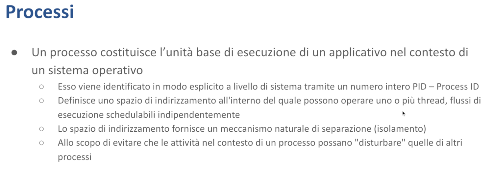

# Processi - Malnati 26 <!-- omit in toc -->

# Indice <!-- omit in toc -->
- [1. Introduzione](#1-introduzione)
  - [1.1 Processi in Windows](#11-processi-in-windows)
  - [1.2 Processi in Linux](#12-processi-in-linux)
  - [1.3 Creazione di processi](#13-creazione-di-processi)
    - [1.3.1 Esempio](#131-esempio)
  - [1.4 `fork()` e thread](#14-fork-e-thread)
    - [1.4.1 Esempio](#141-esempio)
- [2. Processi in Rust](#2-processi-in-rust)

La parte sui processi è assolutamente più semplice, perché in realtà la maggior parte della complessità deriva proprio dalla concorrenza, che però è stata già abbastanza vista nel momento in cui abbiamo trattato i thread. 

# 1. Introduzione

*Cos'è un processo?*
È lo strumento col quale il sistema operativo garantisce che possano essere eseguite applicazioni distinte senza che si pestino i piedi reciprocamente e lo fa fondamentalmente **isolando gli spazi di indirizzamento**. Quindi un processo è un programma in esecuzione che ha un suo spazio di indirizzamento all'interno del quale vengono ricavati gli stack, lo heap eccetera, e all'interno del quale sono presenti uno o più thread.

Il processo ha una sua identità a livello di sistema operativo garantito da un codice univoco, il **process ID (PID)**, e ha associato uno ***stato***, ovvero può essere in esecuzione oppure terminato. Quando un processo diventa terminato, questo processo restituisce un codice che ha una certa struttura. Tipicamente il codice di uscita di un processo viene utilizzato per comprendere se quel processo è morto bene o è morto male, quindi rappresenta sostanzialmente un codice d'errore.

Il principio di assegnare a ciascun processo uno spazio di indirizzamento è alla base dell'**isolamento**, che garantisce fondamentalmente che due processi non si impiccino troppo. Notate che l'isolamento offerto dai processi è **limitato**, *perché?* Perché in realtà è vero che nello spazio di indirizzamento ognuno fa quello che vuole e gli altri non possono vedere, ma tutti i processi hanno *risorse comuni*:

- **Tutti vedono lo stesso file system** 
Quindi se ad esempio il processo 1 crea un file e il processo 2 lo distrugge, si impicciano.
- **Tutti i processi vedono lo stesso stack di rete**
Quindi se il processo 1 crea una socket in ascolto sulla porta 80, il processo 2 non può creare un’altra socket sulla porta 80, e quindi si impicciano.

Tutti i processi vedono le stesse librerie condivise, ovvero il codice eseguibile che viene mappato all'interno di un processo in parte è l'eseguibile specifico, e in parte è contenuto in **librerie condivise** che si chiamano **DLL** dentro Windows, si chiamano **SO** (Shared Object) nel mondo Unix-like, ma sostanzialmente sono pezzi aggiuntivi che vengono messi insieme alla parte di codice nello spazio di indirizzamento.

Il problema è che queste librerie hanno una *versione*. Se io ho in esecuzione un programma che vuole caricare la libreria `libm`, responsabile della matematica, e ha bisogno della **versione 32**, ma poi ho un altro processo che quando si è installato mi ha caricato la **versione 35** che non è più compatibile con la 32, il file `libm[.](http://ibem.so/)so` viene trovato (nella relativa cartella di sistema, a seconda del sistema operativo), ma è la versione sbagliata e quindi quando poi vado a cercare dentro di mappare le funzioni che devo chiamare magari non le trovo, o le trovo fatte in un modo diverso da come me le aspetto, quindi si impicciano.

Quindi la vita dei processi non è così ben isolata, motivo per cui oggi giorno vengono distribuiti come unità di esecuzione i ***container*** piuttosto che i processi. Il container sfrutta la capacità che i kernel hanno di separare i diversi ambiti (l'insieme degli utenti, l'insieme del file system, lo stack di rete, l'uso delle risorse e così via) in **namespace indipendenti** e sfruttano del kernel del sistema operativo soltanto la sua capacità di scheduling, affidando poi a componenti totalmente disgiunti il resto delle astrazioni offerte dalla macchina. Questo permette di avere un insieme di processi apparentemente isolati, ognuno con il proprio *indirizzo IP* associato, indipendente l'uno dall'altro, ognuno con il suo insieme di *porte*, ognuno con le sue *DLL* e così via, che possono convivere sulla stessa macchina abbattendo i costi di configurazione, facilitando la convivenza tra cose molto eterogenee tra di loro.

Il criterio dell'**isolamento** dovuto al fatto che due processi hanno spazi di indirizzamento separati, in alcune situazioni è un impiccio, *perché?* Perché impedirebbe a due programmi distinti, ad esempio *Word* ed *Excel*, di scambiarsi dei dati, se non passando attraverso un file, che però è una cosa poco efficiente. Affinchè voi possiate fare **copia** su Word e **incolla** su Excel, bisogna che ci sia un pezzo di memoria condiviso, perché quando faccio *“copia”* devo scrivere da qualche parte questa cosa che sto copiando, e devo andare a finire su una qualche zona che Excel possa vedere, se no su Excel come ce lo faccio l'*“incolla”*?

Per questo motivo i sistemi operativi, se da un lato **isolano i processi** assegnando loro spazi di indirizzamento disgiunti, dall'altro offrono alcune **primitive** che permettono di muovere dei dati da uno spazio all'altro. Queste primitive hanno caratteristiche diverse e cadono dentro un nome più ampio che va sotto la sigla di **IPC** (*Inter Process Communication*). Qua le differenze tra sistemi operativi diventano molto grandi. Anche nel concetto stesso di processo le differenze sono molto grandi. E il modello adottato dai sistemi Unix ha poca analogia col modello adottato dal sistema Windows.

Ciò che rende un po' parenti il concetto di processo e il concetto di thread è che **ogni processo ha associato almeno un thread**. Nel momento in cui un processo non ha più nessun thread associato, quel processo è morto, e viene buttato via dal sistema operativo. All'atto della creazione di un processo, il sistema operativo si prende la responsabilità di allocare anche il **thread principale**. Questo thread principale potrà poi creare thread ulteriori a proprio piacimento.

Nei primi momenti di vita dei sistemi *multi-user*, quindi quando Unix è nato, negli anni '70, il processo era l'unità fondamentale anche di concorrenza. Se io dovevo creare un server di rete, dovevo necessariamente pensarlo multiprocesso. Oggigiorno noi troviamo ancora la programmazione multiprocesso in varie condizioni. In parte come scelta per facilitare la **system integration**, ovvero: *perché devo reinventarmi una cosa che già esiste e tanto comoda?* In fondo posso delegare un altro programma, fare un pezzo per me e poi prendermi il suo risultato. È quello che facciamo ad esempio quando compiliamo un programma: ci affidiamo al fatto che possiamo sfruttare il *compilatore* che traduce un file sorgente in un file oggetto e poi chiamare il *linker* che prende insieme vari file oggetto e ci produce un file eseguibile, senza bisogno di fondere queste cose in un unico oggetto. Quindi possiamo beneficiare col principio della **separazione delle responsabilità**, il compilatore è molto bravo a fare un pezzo, il linker è molto bravo a farne un altro e si appoggiano dei file intermedi per passarsi delle cose.

Altre volte sfruttiamo, come nel caso di **Chrome**, ad esempio, processi per motivi di **security**. Chrome, per ogni tab che voi create, crea un *processo separato*. Questo garantisce che eventuali vulnerabilità presenti all'interno delle librerie che usa (che potrebbero permettere potenzialmente a del codice malevolo di farsi i fatti del vostro pc), non possano fare danni. Semplicemente perché se anche a seguito di qualcosa io riesco a iniettare del javascript che lavora nel contesto di una delle tab, al meglio potrò sapere che cosa c'è in quella tab, ma non riesco a vedere le altre tab che cosa hanno, perché sono in **processi separati** e non ho l'accesso.

## 1.1 Processi in Windows

I processi si creano in modo molto distinto nei sistemi operativi, con filosofie distinte. In **Windows** si crea un processo con la system called `CreateProcess` o con la sua variante `CreateProcessEx`, che differiscono sostanzialmente nel numero di parametri che passiamo. Un processo creato in Windows richiede l'indicazione del eseguibile da caricare, quindi `CreateProcess` si prende la briga di fare diverse operazioni:

- Crea innanzitutto un nuovo *spazio di indirizzamento*, vuoto
- All'interno di quello spazio di indirizzamento mappa il *file eseguibile* il cui nome gli abbiamo passato come parametro della `CreateProcess`
- Poi crea il *thread principale* all'interno di quel processo e lo avvia

Quel thread principale punterà alla funzione `crt_startup` o alla funzione `_winmain` che saranno responsabili a loro volta di chiamare il `main` della nostra applicazione vera e propria. Quindi inizializzeranno le strutture di supporto e poi faranno partire il resto. Questo fa si che il processo parte pulito, immagine esatta di quello che c'è nell'exe che io ho caricato.

Questo processo troverà dentro la propria memoria alcune **handle già presenti**, in particolare potrà contenere dei riferimenti ad alcuni *file* che sono stati precedentemente aperti e che gli sono resi disponibili oppure potrà trovare riferimento rispetto a **oggetti kernel** come semafori, pipe, mutex, eventi. Potrà anche trovare inizializzate delle **variabili d'ambiente**. Le variabili d'ambiente sono una mappa di `string` in `string` per cui ad esempio io ho la variabile d'ambiente `PATH` che ha come valore ad esempio: `C:/Windows;C:/Windows/System32;` etc… 

Però quello che *non può condividere* un processo figlio sono riferimenti a thread presenti nel processo padre, non potrà contenere riferimenti a processi presenti nel processo padre, a librerie dinamiche o regioni di memoria presenti nel processo padre. Quindi c'è un **isolamento molto buono**. 

La funzione che crea un processo fa un po' di operazioni, e qua vediamo la `CreateProcess`, vedete che ha una valanga di parametri, ed è la versione semplice perché se avessimo mostrato `CreateProcessEx`, di parametri questa ne ha ancora di più. 

## 1.2 Processi in Linux

Nel mondo **Unix** (mettendo insieme **Linux** ma anche **BSD,** **macOS** e cose del genere) i processi si creano con una system call che si chiama `fork`.

A differenza della `CreateProcess`, `fork` di parametri ne ha **zero**. 

*Cosa fa fork?* ***Duplica lo spazio di indirizzamento corrente*.** 
Quindi nel contesto di un processo che già esiste e che ha il suo spazio di indirizzamento dentro cui c'è uno **stack** (uno o più stack), c'è lo **heap**, ci sono le **variabili statiche**, ci sono le **cose globali**, ci sono le **variabili di ambiente**, etc… questo processo viene duplicato: ne ho due copie totalmente indipendenti, ma identiche inizialmente.

`fork` lascia il processo padre inalterato, nel processo figlio inietta un unico thread che si trova lo stack già completamente popolato. *Perché?* Perché è duplicazione dello stack che aveva chi nel processo padre ha invocato `fork`. 

**`fork`** esce e nel processo figlio riprende l'esecuzione dal valore ritornato dalla funzione stessa — questo thread non parte da zero, ma nasce con una *storia pregressa*. Dopo essere uscito da fork, potrebbe eseguire un return e tornerebbe a un punto precedente del codice, potrebbe fare un altro return e tornerebbe ancora più indietro. *Perché?* Perché viene duplicato tutto, compreso lo stack.

Questa duplicazione è ottenuta in modo molto efficiente sfruttando una caratteristica dell'**MMU**: il nostro spazio di indirizzamento è uno spazio di indirizzamento *virtuale*. Abbiamo degli indirizzi che corrispondono alle pagine virtuali, poi la MMU ha le sue tabelle con cui mappa queste pagine virtuali in pagine fisiche. In questa tabella c'è un flag hardware che si chiama `cow`, *copy on write*.

Nel momento in cui viene eseguita la `fork`, all'interno della system call si vanno a settare nella pagina della MMU i bit `cow` di ciascuna pagina in uso. Da questo momento in avanti avrò due esecuzioni che proseguono: fin tanto che queste due esecuzioni non modificano niente, leggeranno le stesse pagine. La prima delle due che va a cambiare un byte qualunque provocherà una *trap* del sistema operativo che duplicherà fisicamente la pagina. L'originale resta di proprietà dell'altro, il flag `cow` viene resettato e viene allocata una nuova pagina fisica (inizialmente copia della precedente) su cui si va a fare la modifica. Da questo momento in avanti i due processi non si impicciano più.

Questo rende **efficace** ed **efficiente** il sistema di creazione dei processi, ma anche *complicato* perché non si parte da pulito, parto da sporco: in base a dove è avvenuta la `fork` nel processo — se nel `main`, o nella funzione A chiamata da B, che era stata chiamata da C, che a sua volta era stata chiamata dal main — ci si ritroverà in quel punto. Quindi chi si sveglia dalla `fork` come *child* deve capire *dove si trova.*

## 1.3 Creazione di processi

Per questo motivo nei sistemi **Unix**, subito dopo la `fork`, spesso, se si è *child*, si invoca `exec`.

*Cosa fa exec?* **Spiana completamente lo spazio di indirizzamento e lo sostituisce con il contenuto di un file eseguibile.** 
Notate che `exec` può essere chiamata da qualunque programma in qualunque momento. Io ho un programma che inizia a fare in un certo modo e poi invoco `exec ls`. *Cosa succede?* Che il mio programma ha fatto alcune cose e poi finisce come se avessi chiamato `ls`. Perché `exec` dice *“Ok, butta via tutto e riparti da zero”*.

`exec` qui è scritto con l'asterisco perché viene in tante diverse versioni (`execl`, `exece`, `execle` etc…), la differenza tra le versioni è solo sui parametri che mettiamo. Quelli che hanno una `e` al fondo hanno un parametro aggiuntivo che contiene un puntatore alle *variabili d'ambiente*. Quelli che prima della `e` hanno una `l` ricevono una *lista di parametri*. Quelli che prima della `e` hanno una `v` ricevono un *vettore*, cioè un array di parametri. Quindi la differenza è su *come io passo i parametri alla mia funzione*. Ma sostanzialmente, a parte questo, sono tutti uguali.

### 1.3.1 Esempio

Vediamo un esempio banale. Io qui in un `main` semplice scritto in C, la prima cosa che faccio all'interno del main è invocare `fork`. 

`fork` è una funzione che quando esce mi ritorna un numero. 

**`fork` viene chiamata una volta ma esce due volte:** una volta nello spazio di indirizzamento del processo *padre*, una volta nello spazio di indirizzamento del processo *figlio*. 
*Come le distinguo?* Se il valore che restituisce `fork` vale `0` sono il figlio, se non vale `0` sono il padre. 
Se non vale `0` quel numero che mi restituisce è il **PID**, il *process ID* del figlio. Questo mi permette di sapere che ho fatto un figlio e il sistema operativo me l'ha chiamato `77`. 

Il figlio stesso invece se vuole sapere come si chiama lui deve chiamare la system call `getpid` che gli restituisce il suo nome. Oppure può chiamare la funzione system call `getppid` che gli ritorna il *parent pid*, cioè il process ID del suo genitore. Questo perché in **Unix**, i processi mantengono una **forte relazione padre-figlio** proprio per via della `fork`. In **Windows** questa relazione è debolissima per cui non c'è un equivalente così, soprattutto non c'è l'equivalente della `fork`.

**`fork`** potrebbe anche restituire `-1` nel caso in cui il sistema operativo non avesse risorse necessarie a creare un ulteriore processo. Nell’esempio in slide viene fatto uno `switch` sul valore ritornato da `fork`: 

- Se viene ritornato `-1`, si pianta lì tutto dicendo che c'è stato un problema
- Se ritorna `0`, questa è l'istanza nel processo *figlio* e quindi ho la possibilità di fare cose diverse. 
In questo caso viene invocato un processo completamente diverso: il processo `ch.exe`. Quando viene invocato `execl`, lo spazio di indirizzamento viene completamente reinizializzato col contenuto dell'eseguibile, perdendo ogni altra cosa. Quindi alle righe dopo `execl` non ci arriviamo nemmeno.
- Se invece non ha ritornato né `-1` né `0`, vuol dire che questa è la copia del processo *padre*, nel qual caso stampa semplicemente come si chiama il processo figlio e ritorna.

## 1.4 `fork()` e thread

Questo aspetto è importante da capire: se il processo padre nel momento in cui chiama la `fork` avesse più di un thread, uno di questi è quello che chiama `fork`, ma gli altri che cosa stanno facendo? Boh, non lo sappiamo. In ogni caso nel processo padre rimangono **tutti i thread** che c'erano, mentre nel processo figlio **resta un solo thread**, che comincia dall'uscita della `fork` avendo la storia pregressa ricevuta dal padre.

**Questo può portare dei disastri**, perché se uno degli altri thread possedeva un mutex, nel padre tutto continua perfettamente, ma nel figlio il mutex rimane di possesso di qualcuno *che non c'è più*, di cui si è persa completamente traccia. E il thread unico che ha, se mai cercasse di chiedere l'accesso a quel mutex, non lo potrebbe ottenere, perché il mutex risulta occupato, ma *nessuno lo potrà mai rilasciare*.

Per questo motivo, quando sono stati introdotti i thread nella specifica **POSIX**, cercando di razionalizzare un po' le cose, è stata aggiunta una funzione che si chiama `pthread_atfork`, che serve a dire *“Che cosa bisogna fare con i thread nel momento in cui si fa la fork?”* 

Questa funzione riceve **tre parametri**, che sono tre puntatori a funzione:

- Il primo puntatore a funzione viene chiamato *prima* di fare la fork, serve a garantire che nel processo padre si faccia qualche forma di pulizia
- Le restanti due vengono eseguite in modo esclusivo solo nel figlio o solo nel padre:
    - Una si chiama `parent`, ovviamente va rieseguita solo nel padre
    - L'altra si chiama `child`, solo nel figlio

*A cosa servono?*

- Quella di preparazione serve a fermare tutti i thread, a fargli rilasciare le cose, eccetera, insomma aspettare che ci siano le condizioni per poter creare il nuovo processo
- Le altre due servono a rimettere a posto le cose come vanno rimesse a posto, una volta che si è creato il nuovo processo

### 1.4.1 Esempio

Qui vediamo cosa succede: il processo genitore chiama `fork` nel suo main, avendo precedentemente invocato `pthread_atfork(f1, f2, f3)`, dove `f1`, `f2`, ed `f3` sono tre funzioni che dobbiamo definire noi. 

Nel momento in cui chiamassimo `fork`, automaticamente, prima che avvenga qualunque cosa, verrebbe chiamato `f1`, che ha la possibilità di preparare le condizioni, dopodiché avverrebbe l'effettiva duplicazione del processo, e poi il processo padre continuerebbe invocando `f2`, e poi dalla `fork` esce con l'indicazione del *child*, `pid`.

Nel **figlio**, invece, quello che succede è che dalla `fork` esce un unico thread, che per prima cosa chiama `f3`. Quando `f3` ritorna, prosegue uscendo dalla `fork` col valore `0`, e poi di lì continua come gli pare.

**Questo è importante da capire** perché in un contesto di programmazione multiprocesso, se voi volete continuare in un processo figlio sfruttando il meccanismo della `fork`, quindi senza buttare via lo spazio di indirizzamento attuale e reinizializzarlo facendo un `exec`, ma volete semplicemente continuare, dovete tener conto che in un contesto multi thread questo può portare tutta una serie di problemi e dovete prendere necessarie contromisure.

I processi tendenzialmente, una volta creati, si svolgono fino a che il ***thread principale*** presente al loro interno non termina. Se il thread principale presente al loro interno genera uno o più thread, l'esecuzione continua fino a che esiste **almeno un thread**, oppure semplicemente fino a che il thread principale non muore del tutto, oppure fino a che uno dei thread secondari non muore in modo anomalo, e così via. Qui c'è tutta una casistica complicatissima dove sistemi operativi vari fanno cose diverse.

Un singolo thread, qualunque esso sia, sia esso il principale o il secondario, può in qualunque momento chiedere di piantarla lì. ***Come?***

- In **Windows** invocando `ExitProcess`
- In **Linux** invocando la system call che si chiama `_exit`

In entrambi i casi passa un numerino intero a 8 bit, che rappresenta il *codice di uscita*. Questo codice di uscita potrà essere usato da altri processi per capire se è morto bene o morto male. 

La convenzione che si usa:

- Se il codice di uscita è 0 tutto è andato per il meglio, il processo ha fatto quello che ci si aspettava facesse
- Se il codice di uscita è diverso da 0, quel codice rappresenta condizioni anormali, e non c'è nessuna convenzione: ognuno sceglie quel che gli pare. Ad esempio, termino con 32. *Che vuol dire 32?* Boh, bisogna leggere nella documentazione del programma, ammesso che ci sia.

La chiusura del processo, l'invocazione di `_exit` o di `ExitProcess`, comporta l'**immediata terminazione** di tutti i thread che sono presenti. Questi immediatamente vengono marcati come *"not runnable"* e poi buttati via, bruscamente e senza svuotare i loro stack, di conseguenza senza fare nessuna azione associata a eventuali distruttori presenti all'interno. Se ci sono dei file aperti, questi vengono marcati come "chiusi". Se, nel caso di **Windows**, sono state mappate all'interno di questo processo delle DLL, queste DLL vengono *"unmapped"*, vengono rilasciate.

In **Linux** noi possiamo chiamare la system call `_exit`, che viene riverberata anche nella libreria standard del C e del C++. La differenza è solo sintattica: in C si chiama solo `exit`, è una funzione semplice, in C++ si chiama `std::exit`. In entrambi i casi c'è la possibilità di registrare a priori una callback che sarà invocata per permettere qualche operazione di clean up generale. Lo si fa invocando la funzione `atexit` e passando il puntatore di una funzione da chiamare.

Quando il thread principale finisce, e quindi la funzione `main` (o chi per lei) ritorna al suo chiamante, il codice di startup aggiunge automaticamente una `exit`, passando come valore di ritorno il codice ritornato da `main`. Per cui in C dove `main` ha come signature `int main(int argc, char** argv)`, quell'`int` ritornato viene usato come codice di ritorno del processo. Quindi se `main` fa `return 5`, il processo termina col codice 5. Se `main` fa `return 0`, il processo termina ritornando 0. 

**Notate** che il fatto che `main` ritorni, quindi, vuol dire che chiamando `exit` e tutti i thread terminano.

I **thread secondari** sono tutti costruiti con un costrutto `try catch` che, in caso di eccezione non gestita, chiama la `exit`. A seconda del sistema operativo viene usato un codice diverso (-1, 17, 52), ma viene sempre chiamata `exit`. In realtà, viene invocata `terminate` che a sua volta esegue `exit` con un codice non zero. Se un thread secondario termina in modo anomalo, l'intero processo viene terminato restituendo un codice non zero. *Questo comportamento è presente in C e C++, ma non in Java né in Rust.*

**Vediamo cosa capita in Rust**. 

# 2. Processi in Rust

Prima di tutto Rust ci mette a disposizione un modulo che si chiama `std::process` che contiene un insieme di strutture dati mediante le quali possiamo:

- creare un processo
- attendere la terminazione di un processo
- chiedere informazioni al sistema operativo su quali sono i processi che esistono

Quindi ci mette a disposizione delle astrazioni che cercano di nascondere le differenze grandi che i diversi sistemi operativi hanno al loro interno.

In particolare, per poter creare un nuovo processo all'interno di Rust usiamo la struct che si chiama `Command`. Quindi `Command::new` ci permette fondamentalmente di creare un nuovo processo, passandogli dei parametri e quindi dicendo che questo processo deve:

- cominciare caricando un certo eseguibile
- ricevere determinati parametri che userà per comportarsi in modo opportuno

Inoltre potremo:

- customizzare l'insieme delle variabili d'ambiente
- aspettare che questo processo non solo parta ma anche che finisca
- indicargli un contenuto dello standard input a priori oppure fare in modo che il suo standard input venga prelevato da qualche fonte particolare
- prelevare il contenuto del suo **standard output** quando sarà terminato e leggerlo sotto forma di stringa o sotto forma di array, e lo stesso potremmo fare con **standard error**

In particolare, noi creiamo un nuovo processo con `Command::new` che è un *builder*: `Command::new` non ha ancora costruito il processo stesso. 

In questo caso `Command::new("cmd.exe")`, questo vuol dire che provo a creare un prompt dei comandi (se sono in Windows), *e cosa passo a questo prompt di command?* 
Ho la possibilità di farci delle cose: ad esempio `.args()` accetta un array di stringhe (di `str` in realtà), dove posso indicare quali argomenti voglio dare, se io sto compilando questo programma sotto Windows lancerò `cmd` e gli passerò `/C` maiuscolo e poi `echo hello`. Sto preparando l'esecuzione del nuovo processo, ma al momento non è ancora partito.

Per farlo partire davvero devo invocare `.output()`, o un altro metodo analogo. 
Questo fa sì che il processo parta e mi venga restituita una `struct` destinata a contenere i dettagli di questo processo, in particolare ci troverò il suo **standard input**, il suo **standard output**, il suo **standard error** e così via, e il suo codice d'errore. 

`output()` ritorna un `Result`, quindi di solito si fa l'`unwrap()` o l'`expect()`; se non è possibile creare il processo, `output()` torna un errore, altrimenti il processo torna normalmente.

Qua c'è un **`if`** che gestiva due casi: se siamo su **Windows** lancia `cmd`, altrimenti lancia `shell`. I comandi passati sono diversi: se devo lanciare `shell`, invece di usare `args()` che accetta un vettore di stringhe, uso più volte `.arg()`. 
Ogni chiamata a `.arg()` aggiunge un argomento per lanciare il programma — in questo caso passo prima `-c`, poi `echo hello`. Poi invoco `output()` per avviare effettivamente il processo e attendere. 

Dopo l'esecuzione, stampo il valore di uscita e posso verificare il codice di errore. 

*Nota*: questa riga è commentata perché `ExitStatus` qui è definito su **`unix_wait_status`**, ma su **Windows** va chiamata una funzione diversa.

Quando invoco il processo, oltre a configurare i parametri di ingresso con `arg()` o `args()`, posso utilizzare `env()` o `envs()` per passare **variabili d'ambiente**. Queste sono coppie chiave-valore (entrambe di tipo stringa) che forniscono parametri addizionali al programma. 

Tipicamente nelle variabili d'ambiente si trova:

- Il `PATH` - percorsi degli eseguibili
- I percorsi delle librerie
- Credenziali (es. password per database)
- Altri parametri configurabili

Ogni programma può utilizzare le variabili d'ambiente come preferisce, incluso il non usarle affatto.

All'interno dell'oggetto `output` io trovo tre oggetti che si chiamano **`stdin`**, **`stdout`** e **`stderr`**, che mi permettono di configurare quel processo che ho creato da dove legge per default (il suo standard input), dove scrive per default (il suo standard output) e dove scrive le indicazioni degli errori (il suo standard error), che corrispondono nel mondo di Unix in generale, a tre handle: tre file descriptor il cui valore è predefinito `0`, `1` e `2`. 

- `0` è standard input
- `1` è standard output
- `2` è standard error

In Windows non è così, ci sono tre handle predefinite che sono degli alias, degli handle di file veri e propri, che hanno un valore negativo.

Io posso inizializzare il contenuto di standard input, standard output e standard error con delle funzioni di inizializzazione. Posso dire `inherit` per dire *“Usa lo stesso standard input o lo stesso standard output o lo stesso standard error del processo creante”*, cioè di quello in cui sto facendo il mio figlio. Quindi condividiamo — se ad esempio qualcuno scrive sulla tastiera "ciao" lo potranno vedere sia il processo padre che il figlio. 

Standard output, anche qui se uso `inherit`, le righe stampate l'uno e dell'altro si mescoleranno, come fossero quelle di due thread.

Posso anche usare l'opzione **`piped`**: se la imposto su standard input, il processo leggerà da una *pipe* (una sorta di canale) di cui io ho a disposizione l'altro estremo, permettendomi di inviargli i dati da leggere. Se imposto `piped` su standard output o standard error, il processo scriverà su un canale da cui potrò prelevare l'output. 

In alternativa, posso usare l'opzione **`null`**: in questo caso, se il processo tenta di leggere troverà subito end of file, mentre se tenta di scrivere l'operazione fallirà.

Posso configurare il processo in diversi modi prima di avviarlo. Ad esempio, usando `current_dir()` posso specificare una cartella di lavoro diversa da quella del processo padre. Per quanto riguarda l'avvio, ho tre opzioni principali:

- **`output()`** → avvia e attende l'output completo
- **`status()`** → avvia e si blocca fino alla terminazione
- **`spawn()`** → avvia senza attendere la terminazione

Dopo lo `spawn()`, ottengo un oggetto `Child` che contiene i dettagli del processo creato. Questa struttura include anche il metodo `kill()` che permette di terminare forzatamente il processo figlio prima della sua naturale conclusione.