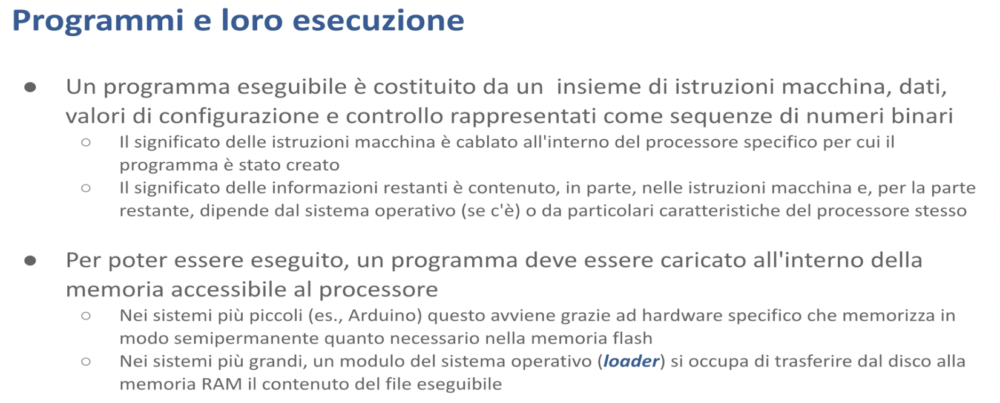

# Allocazione della memoria - Malnati 1

Un programma eseguibile non è nient’altro che un insieme di istruzioni macchina mescolate con dei dati mescolate con dei valori di configurazione e controllo tutti codificati sotto forma di sequenze di byte.

Il significato di questi byte è legato alla tipologia di informazione che mettiamo dentro — per la parte di istruzioni il significato è **cablato** dentro il processore.
Sui processori 8080 che venivano usati nel PC IBM originale, il byte 3E serviva a rappresentare l’istruzione `MOV A`, dove A era l’accumulatore (il registro principale della CPU): 3E 7B voleva dire *carica nel registro accumulatore il valore binario 7B*.

Quindi lì e nei processori moderni ci sono codifiche analoghe, quindi a ogni byte corrisponde una e una sola interpretazione come istruzione macchina.
Cambiando processore chiaramente cambiano le istruzioni e quindi bisogna generare delle sequenze diverse.

La presentazione dei dati o delle informazioni di controllo in parte è desunta dalle istruzioni macchine.
Io ho scritto un programma che legge una stringa e la trasforma in numero. La stringa è impiantata insieme al mio codice, mischiata lì dentro. L’interpretazione della stringa per trasformarla in un numero sta nelle istruzioni che ho generato. 
La parte dell’informazione di controllo è in realtà invece governata dal sistema operativo: il fatto che il mio programma inizia con una certa sequenza binaria, che il particolare sistema operativo riconosce e trasforma in qualcosa, dipende dal sistema operativo stesso.

Il programma normalmente vive dentro il disco, in un file. Tipicamente su una macchina Windows abbiamo i file .exe che rappresentano i binari eseguibili. Per poter essere eseguito in realtà occorre che questo file sia trasferito all’interno della RAM, dove il processore è in grado poi di andare a prendere le singole istruzioni.

Come avviene questa cosa qua?
Nei sistemi più banali, come l’Arduino, il disco neanche c’è, il programma è cablato dentro la flash e banalmente il modo per portarselo nella flash è grazie a un hardware specifico che fa da programmatore (mi dà la possibilità di andarci a scrivere dentro) e in qualche modo lo posso andare a pescare per essere eseguito.
Nei sistemi più grandi, in realtà, c’è un componente specifico del sistema operativo, il **loader**, che è responsabile di trasferire dal disco alla RAM per permettere l’esecuzione.

Una volta che il programma è in memoria, può essere eseguito.

Come avviene l’esecuzione?
Banalmente c’è un ciclare continuo.
Il processore preleva un’istruzione da una certa cella di memoria indirizzata da uno specifico registro contenuto al suo interno, negli x86 si chiama IP, instruction pointer, preleva il dato presente a quell’indirizzo, se lo porta in pancia, lo capisce e fa quello che c’è scritto lì dentro.
Poi ne prende un altro, poi ne prende un altro..
Questo alternarsi è chiamato il ciclo fetch, decode, execute — prelevo, capisco, faccio.

Il processore fa riferimento alla specifica cella in cui sta un’istruzione indicandone l’indirizzo.
L’indirizzo è l’offset all’interno della memoria del calcolatore dove quell’istruzione è memorizzata.

Il ***program counter*** (l’instruction pointer) è un registro che, a seguito dell’operazione fetch, viene automaticamente incrementato, in modo tale che la prossima volta che preleverà un’altra istruzione la prende dalla cella successiva. E se quella è un’istruzione multibyte l’instruction pointer viene incrementato di un offset corrispondente così da poter andare avanti a prelevare istruzioni successive.

Non solo l’instruction pointer ricorda qual è la prossima cella da cui prelevare un’istruzione, altri registri dedicati ricordano altri tipi di informazioni.
Ad esempio lo ***stack pointer*** è un altro registro presente nella maggior parte dei processori che si ricorda dove certi dati temporanei devono essere messi o da dove devono essere prelevati.

L’esecuzione del programma avviene nel contesto del suo spazio di indirizzamento.
Che cos’è lo **spazio di indirizzamento**?

Noi sappiamo che il nostro sistema di elaborazione ha un processore e della RAM. 
Ma al singolo programma non viene data visibilità dell’intera RAM, ma di una piccola porzione che costituisce lo spazio di indirizzamento di quel particolare processo.

Tutto quello che noi abbiamo nel nostro file EXE finisce dentro questa piccola porzione della RAM totalmente disponibile. 
Noi possiamo immaginare il nostro spazio di indirizzamento come fosse un array di byte consecutivi che parte da zero e va fino a un qualche livello.

Questo spazio di indirizzamento è composto da celle che a secondo del livello di parallelismo del processore sono lette un byte alla volta, due byte alla volta, quattro byte alla volta, otto byte alla volta.
Il numero di celle potenzialmente presenti nello spazio di indirizzamento dipende dal processore.

Nel caso dell’x86, nelle versioni a 64 bit, lo spazio di indirizzamento è limitato a 48 bit.
Quindi, di fatto, un x64 può indirizzare al massimo due alla 48 celle.
Altri tipi di processore fanno altre cose. Un ARM può estendersi su 64 bit o cose simili.
Nominalmente, quindi, i nostri programmi potrebbero accedere a qualunque indirizzo compreso tra zero e due alla qualcosa meno uno. 
Con l’x86 due alla 48 meno uno. Sul processore a 32 bit, lo spazio di indirizzamento varierà da zero a due alla 32 meno uno.

Nominalmente! Ma gli spazi di indirizzamento **non sono completi né contigui**. 
Cioè, all’interno dello spazio di indirizzamento, solo una piccola porzione di indirizzi è effettivamente presente.
Il nostro programma ha l’illusione di averceli tutti, ma non è vero: ne ha alcuni.
Se prova a leggere o scrivere fuori dal seminato, fuori di quelle piccole zone che gli sono date, il sistema operativo interviene e lo uccide.
Quest’operazione si chiama ***segmentation fault***. Sei uscito dal tuo segmento.

Questo non si vede nell’astrazione del linguaggio di programmazione.
Quando voi in C, in Java, in quello che volete, scrivete un programma, non avete la percezione che gli indirizzi possono solo stare in certi pezzi. Un indirizzo è un indirizzo, è un numero.
Ma in realtà, per il sistema operativo, non tutti i numeri vanno bene. Solo alcuni.

Non solo.
Gli indirizzi che il programma maneggia, quelli cioè che voi scrivete fisicamente dentro il vostro programma, che potete vedere se li stampate a video o cose del genere, non corrispondono al posto in cui il processore va a leggere o a scrivere. Cioè, gli indirizzi che voi maneggiate prendono il nome di **indirizzi virtuali**. E nominalmente possono assumere un range tra 0 e 2 alla n-1. 
Nella realtà, se noi attaccassimo un analizzatore di stati logici al bus di sistema per vedere nel momento in cui viene eseguita un’operazione di lettura dove vado a leggere, mi accorgerei che, anche se il programma era stato costruito per dire “vai a leggere alla cella al cui indirizzo è 3b7f”, attaccandomi al bus hardware, vedo che lui va a leggere alla cella 59472657.
Tutto un’altra parte.

Questa discrasia tra dove io gli dico di andare e dove lui va è ciò che permette ai sistemi operativi di avere più programmi che pensano di essere loro proprietari dell’intero sistema e non darsi fastidio.
È reso possibile del fatto che dentro le CPU moderne c’è un blocco che si chiama **MMU**, ***Memory Management Unit***, che ha il compito di tradurre gli indirizzi virtuali che il programma usa in indirizzi fisici, in quelli in cui effettivamente avviene la scrittura e la lettura.

È un po’ come se qualcuno mi dicesse “*metti questa tastiera nel terzo cassetto*” e io invece di infilarlo nel terzo cassetto lo infilassi nel cinquantaseiesimo.
Fintanto che io mi ricordo che quando lui mi parla del terzo cassetto devo andare nel cinquantaseiesimo, non fa nessuna differenza. 
Questo permette a uno di dirmi “*mettilo nel terzo cassetto*” e io lo infilo qua, e a un altro di dirmi “*metti questo microfono, sempre nel terzo cassetto*” e io posso ricordarmi che per quell’altro il terzo cassetto invece è il tredicesimo.

Tutti e loro sono contenti perché mi hanno detto il terzo cassetto quando loro mi chiedono il terzo cassetto all’uno dove ho la tastiera e all’altro dove ho il microfono ma in realtà i cassetti sono distinti e non si impicciano.

Quindi il sistema operativo al proprio interno sostanzialmente mantiene per ciascun processo in esecuzione questa tabella delle corrispondenze.
Questo fa sì ad esempio che io posso avere due notepad aperti ciascuno dei quali è convinto di andare a leggere all’indirizzo 7F793950000, ad esempio, ma in realtà vanno in posti diversi della RAM fisica.

Nella parte centrale dell’illustrazione sono riportati gli indirizzi fisici, quelli in cui effettivamente avvengono le scritture.
Nei due estremi ci sono le viste che ciascuna delle due istanze in funzione di notepad hanno della memoria.
Tutti e due sono convinti di andare a leggere in un certo posto ma il sistema operativo li devia e li fa andare tutti da un’altra parte.

Questo fa sì che un unico programma notepad possa essere instanziato 100 volte senza avere casino.

Sennò dovrei cambiare ogni volta il contenuto del programma per dire “*no ma tu sei un po’ più in qua, tu sei un po’ più in là*” invece loro sono tranquilli, sanno che in certi posti trovano certe cose e di fatto le trovano ma fisicamente quelle cose lì sono altrove di dove loro pensano.

La traduzione quindi garantisce che programmi diversi, o istanze diverse di uno stesso programma, mentre sono in esecuzione non possano interferire — non si danno fastidio perché il sistema operativo me li tiene lontani, e non ha bisogno di farmi sapere dove fisicamente li ha messi, basta che sia coerente: quando parla con uno gestisca le informazioni dell’uno e quando parla con l’altro gestisca le informazioni dell’altro.

Questo mapping tra l’indirizzo virtuale (che è l’unico che il nostro programma vede) e quello fisico è soggetto ad alcune annotazioni. Non solo il sistema operativo, attraverso l’opportuna configurazione del blocco MMU, mi mappa gli indirizzi da logico a fisico ma mi segna anche a quali vincoli quel mapping è soggetto: mi dice “guarda qui l’indirizzo 7F793950000 va là quando leggi e quando scrivi, ma se lui ti chiede invece di fare la fetch, bloccalo! Perché questa è un’area in lettura e scrittura, ma non in esecuzione”. O al contrario mi può dire “questa è un’area per l’esecuzione ma non può essere scritta”. 

Questo è prezioso perché vi para un po’ dai virus: il fatto che un programma sia mappato in una zona che è read and execute only impedisce a un virus di andare a cambiare le istruzioni e di far fare al vostro programma qualcosa di diverso. Protegge anche da voi stessi perché a volte quando usiamo i puntatori male uno potrebbe sporcare la propria area di memoria. 

C’è un fatto in più: l’esistenza di questa corrispondenza tra la memoria virtuale e la memoria fisica fa si che un programma possa allocare una quantità di memoria che può essere molto superiore alla memoria fisica effettivamente presente. E come?

Ci verrebbe da dire che, per via di questa partizione, ogni volta che un programma parte si mangia un po’ di memoria fisica e quindi io al massimo accedo a un ennesimo della quantità di memoria. 

In realtà il sistema operativo interviene in tanti modi. 
La riga sopra è l’immagine dello spazio di indirizzamento virtuale che un programma in esecuzione ha. Il programma lanciato pensa di poter accedere dalla cella numero 0 fino alla cella 2^n-1 — questa è la sua idea potenziale: siccome i puntatori sono grandi 64 bit io immagino di poter andare da 0 a 2^64-1. Questo è il mio spazio potenziale. 

In questo spazio potenziale alcuni blocchi sono quelli effettivamente presenti: sono evidenziati in un verde un pochino più scuro e mappano da qualche parte sulla memoria fisica, che invece è riportata sotto. Notate che questo mapping avviene a pagine, non a singolo byte (che sarebbe ingestibile) — si prende un blocco di 4096 byte piuttosto che 65.536 byte o comunque una potenza del 2 e si dice “*tutto questo blocco finisce in questa zona della memoria fisica”* così da rendere le tabelle un pochino più piccole.

Sono mappate con le loro relazioni: alcune sono mappate xr che vuol dire execute and read (posso leggere cosa c’è scritto lì e posso fare il fetch di quell’istruzione, ma non posso scrivere). 
Ma ci sono anche delle zone che non sono mappate sulla memoria fisica, ma **sono mappate sul disco** — i sistemi operativi diversi fanno cose leggermente diverse: su windows c’è il file page.sys (è un file nascosto che vive tipicamente in C:) dentro il quale vengono presi dei blocchi da 4k in cui temporaneamente tenere dei dati che il programma vuole poter usare ma che non mi stanno fisicamente nella ram fisica perchè in questo momento non ho nessuna pagina libera. Fin tanto che il programma non ha bisogno di andare a leggere adesso va benissimo che stiano lì. 

Siccome il vostro programma non legge contemporaneamente tutto, ma mentre guarda questa variabile qui non guarda quella lì, può lavorare in questo modo, dice “*guarda tu hai bisogno di tanta roba ok, un po’ te la do fisica, mentre quella che non riesco a darti fisica, te la salvo nel disco. Una volta che hai bisogno di andare a leggere quella cosa che è nel disco vado a vedere se c’è una pagina fisica libera, se c’è te la carico lì. Se non avessi nessuna pagina fisica libera ne prendo una delle tue occupate, la scarico sul disco e a questo punto quella è diventata una pagina libera e quindi prendo quella che vuoi leggere e te la piazzo lì*”.

Questo permette a un programma potenzialmente di manipolare una memoria virtuale molto più grande di quella fisica.
Con le stesse prestazioni? Ma manco per idea!
Ovvero, fin tanto che voi accedete alle pagine che sono mappate in memoria la lettura e la scrittura è bella veloce, ma nel momento in cui accedete a una pagina che sta sul disco, c’è da aspettare.. se per caso quella cosa che è finita sul disco è un pezzo di programma vuol dire che l’esecuzione del vostro programma, ad esempio chiama la funzione f che è finita sul disco, lì ha un salto! 
Perché mentre cerca di andare a prendere la funzione f, la funzione f non c’è aspetta, deve essere recuperata dal disco.. 

Le zone grigie dello spazio virtuale sono non accessibili: se il vostro programma prova ad andare a leggere, a scrivere o ad eseguire in una qualunque zona grigia, viene ucciso.

Le cose sono ancora più complicate.. perché nei sistemi non elementari (cioè non nell’arduino, ma già sul raspberry) il processore non legge direttamente dalla ram, perché se leggesse direttamente dalla ram andrebbe a manovella perché la ram è lenta. Tra il processore e la ram è interposta la memoria cache. La memoria cache che può essere a un livello, a due livelli a tre livelli.

*A cosa serve la memoria cache?*
A velocizzare l’accesso alle informazioni contenute nella ram. 

*E come fa a velocizzarlo?*
Con l’idea che in qualche modo io posso anticipare il bisogno di quell’altra 

*E sulla base di cosa?*
L’idea è che c’è un principio molto importante che è il principio di località.

Quando leggo la cella 100 mi conviene portarmi più vicino al processore, in un posto che leggo più agilmente, non solo la 100 ma anche la 101 e la 102 così le ho già lì pronte. La memoria cache si basa sull’uso di dispositivi che hanno poca capacità di memoria ma tempi di eccesso molto più rapidi della ram tradizionale. 

La memoria cache è spesso organizzata su livelli, che sono via via più capaci ma anche più lenti. Qui è schematizzata una CPU moderna con 4 core. 
I core sono queste unità di elaborazioni individuali che permettono di eseguire delle istruzioni; nascono dal fatto che non è possibile più di tanto velocizzare il clock, o non è conveniente velocizzare il clock perché questo porta a delle rese termodinamiche bassissime e il processore si scalda troppo e alla fine non dissipa a sufficienza, e quindi conviene usare la capacità di fare del silicio piccolo per far stare i transistor in spazi microscopici e permettere tante unità di elaborazione che possono svolgersi in parallelo così da avere più flussi di elaborazione.

Il singolo core legge e scrive direttamente da una quantità di memoria piccolissima: la cache di livello 1, che però è molto veloce. 
Se occorre riempire la cache di livello 1, la si va a riempire dalla cache di livello 2 che è un po’ più grande e anche un po’ più lenta. 
A sua volta, se occorre riempire la cache di livello 2 la si va a prendere dalla cache di livello 3 che è ancora più grande e ancora più lenta, e infine la cache di livello 3 prende i suoi dati dalla RAM.

Normalmente tutto questo voi non lo vedete: quando scrivete il vostro programmino hello world, non c’è scritto da nessuna parte che c’è la cache, ma c’è!
E il sistema operativo e l’hardware si occupano di nascondere tutto questo — voi non lo vedete!
Quasi, in realtà.. perchè incontrando la programmazione concorrente saremo obbligati a vederlo. 

Perché?
Perché se il core 0 sta incrementando una variabile, e quindi ha preso la variabile i e ha fatto i++ per farla diventare il valore successivo, beh, quell’i++ è finito scritto nella cache di livello 1 del core 0, ma se il core 3 anche lui volesse incrementare quella variabile non vedrebbe mica il valore incrementato perché quello che l’altro ha già scritto nel suo core 0 non è ancora risalito al livello 2, non è ancora risalito al livello 3 e non è ancora risalito nella RAM per permettere all’altro di vederlo! 
E quindi c’è un momento in cui uno ha già fatto una cosa e l’altro ancora non lo sa, e siccome non lo sa dice “allora lo faccio io”, e a quel punto l’hanno fatto in due ed è un disastro.

Questo simpatico giochetto che normalmente ci fa andare solo veloce e ci piace tanto dobbiamo vederlo e gestirlo..
Se un dato condiviso viene scritto da un core, e un altro core lo vuole leggere, devo prima invalidare la sua cache e dire “*vattelo a prendere dalla RAM*” oppure se lo vuole scrivere devo dirgli “*non fermarti lì dove ti fermeresti normalmente, propaga la scrittura fino alla RAM*”. 

Quelle operazioni lì diventano molto più costose ma necessarie per garantirmi la correttezza. Quindi programmare a livello di sistema vuol dire guardare questi fatti e rendersi conto che le cose avvengono in questa maniera.

Usando i programmi di alto livello tutte queste cose che abbiamo raccontate sono invisibili — non emergono assolutamente, ma ci sono! 
E quindi i programmi di alto livello sono obbligati a introdurre delle sovrastrutture che permettono di nasconderli. 
L’effetto che il programmatore trova è che è molto più facile scrivere il suo codice. Pari menti è che quel codice lì va a singhiozzo: si ferma ogni tanto. 
Possiamo prenderci la briga di garantire che se quello è il codice dell’ABS non ci schiantiamo?
No, perché avvengono delle cose che sono fuori dal nostro controllo. 
In più la presenza di queste varie sovrastrutture introducono una serie di vincoli e restrizioni di cui dobbiamo essere pienamente coscienti, ad esempio la restrizione del garbage collector che dice “*la memoria la libero io quando ho voglia*”.