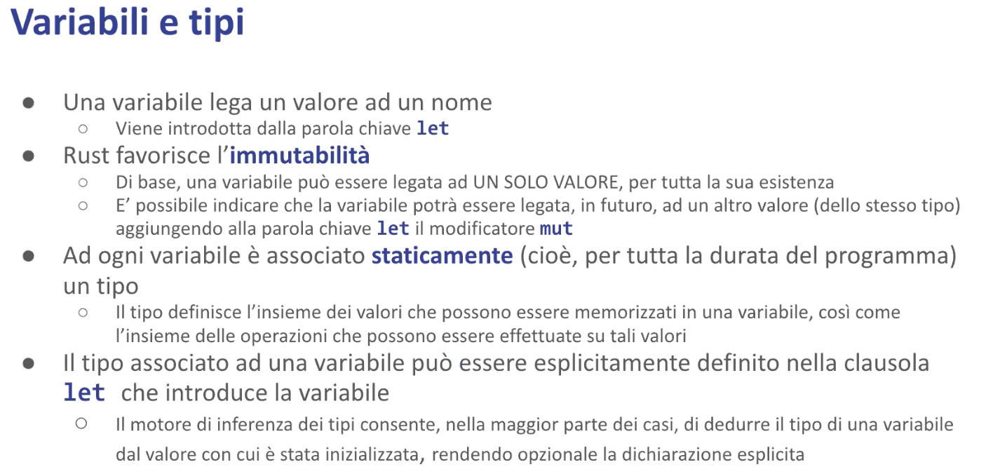

# Il Linguaggio - Malnati 5 <!-- omit in toc -->

# Indice <!-- omit in toc -->
- [1. Variabili e tipi](#1-variabili-e-tipi)
- [2. Tipi e tratti](#2-tipi-e-tratti)
	- [2.1 Tuple](#21-tuple)
	- [2.2 Puntatori](#22-puntatori)
		- [2.2.1 Ref](#221-ref)
		- [2.2.1 Ref mut](#221-ref-mut)
		- [2.2.3 Box](#223-box)
		- [2.2.4 Puntatori nativi C](#224-puntatori-nativi-c)
- [3. Riferimenti](#3-riferimenti)
	- [3.1 Esempi](#31-esempi)

# 1. Variabili e tipi



Le variabili vengono introdotte dalla parola chiave let.
Let, da sola, vuol dire “quello che segue è il nome di una variabile che ha bisogno di avere un valore iniziale” `let i = 25;` questa cosa qua dice “la variabile `i` contiene il valore 25”; siccome 25 è un intero, verosimilmente è un *intero a 32 bit con segno* perché è la cosa più probabile che sia. 

Se non ti piace che quel 25 sia un intero a 32 bit con segno hai due possibilità: 

- aggiungi un suffisso a 25 — `let i = 25 u32` o `u64` (che vuol dire un unsigned a 32 bit o un unsigned a 64 bit) o anche `u8` (che vuol dire un unsigned a 8 bit, cioè un byte)
- dove metti `let i` prima di dargli il valore scrivi `let i:il_suo_tipo`

Quando io scrivo `let i = 25` sto introducendo una variabile ***immutabile***, ******che vuol dire che non posso fare alla riga dopo `i = 26`, perché il compilatore non me lo consentirebbe. 

`let` introduce la variabile immutabile. 
La maggior parte delle variabili che noi trattiamo di fatto sono immutabili anche se buona parte dei linguaggi a cui siamo abituati vedono l'immutabilità come un caso particolare.
Rust adotta esattamente l'approccio opposto: il caso normale è l'immutabilità, e ogni tanto serve poter mutare.

*Come faccio a creare una variabile mutabile?*
Devo usare la sintassi `let mut i = 25`, che scritta così vuol dire che `i` è una variabile intera a 32 bit che contiene 25 ed è ***mutabile***, cioè nel tempo potrei assegnargli dei valori diversi. 

Il concetto di immutabilità non è solo legato al fatto che non posso riassegnarla, è legato al fatto che eventuali operazioni che riguardano quella variabile lì, se fosse una cosa un pochino più complessa invece di un semplice intero (che è un numero e basta), ad esempio una lista, se io la introduco con let sto dicendo che non solo quella è legata a quella lista particolare ma che in quella lista lì non faccio nessun cambiamento — non aggiungo e non tolgo. 

Per poter fare un cambiamento devo metterci per forza la parola chiave **`mut`** in modo tale che il compilatore possa farsi i suoi conti e se lo ricordi. Quindi di base una variabile può essere legata a un solo valore per tutta la sua esistenza in vita. 
Posso dire che la variabile può essere legata a valori successivi in futuro purché abbiano lo stesso tipo.

`mut` suona bene come *mutabile*, ma in realtà vuol dire ***mutuamente esclusivo***: non solo può cambiare le cose, ma mentre c'è uno che cambia nessun altro cambia! 
Non solo: mentre c'è uno che cambia, gli altri neanche possono guardare perché se gli altri possono guardare mentre io cambio potrebbero leggere potrebbero vedere delle cose sbagliate. 

*Quindi il **mut**, il diritto di cambiare, me lo prendo solo quando mi serve in quei precisi momenti e per il resto osservo*. 

Quest'idea che uno solo per volta ci mette le mani dentro per cambiare le cose è essenziale alla coerenza e la correttezza del programma. 
Ad ogni variabile è associato staticamente, quindi per tutta l'esistenza in vita di quella variabile che va dal punto in cui la dichiaro fino al punto in cui c'è la chiusa graffa corrispondente, resta legato quel tipo. 

Quindi, se ad esempio ho dichiarato `i`  di tipo i32, a differenza di quello che succede in C, in C++, in Java e in tanti altri linguaggi, io posso, in due righe successive dello stesso blocco, ridefinire la variabile: posso scrivere `let i = 25` e sotto posso scrivere `let i = “ciao mamma”` — notate il secondo let.
Che cosa fa il secondo let? Dice *“guarda, prima c'era una cosa che si chiamava* `i`*, te la nascondo! Adesso te ne faccio un’altra* `i`*, e questa è una stringa”.*

La presenza del secondo automaticamente nasconde il primo, che non si vedrà più! 
Questo in alcune situazioni è comodissimo, perché io ricevo un valore e poi per non impazzire col mio codice lo ribattezzo in qualcos’altro. 


Quando io introduco let, non solo metto il nome della variabile ma posso anche aggiungere il tipo.

`let v: i32 = 123` sto dicendo che `v` è immutabile e vale 123, e spiego esplicitamente che è un i32. 
Quindi se scrivessi `v = -5` la riga dopo, senza nessun let davanti, lui dice *“no, sta roba non ha senso perchè v è immutabile”.* 

Se scrivo `let mut w = v` sto introducendo una nuova variabile. 
Questa qui si, è cambiabile, e inizialmente ha lo stesso valore di v, quindi 123. 
Per il momento io sto **copiando** quel contenuto. `w` adesso lo posso cambiare: posso scrivere `w = -5` senza problemi. `v` è rimasto quello che era perché me lo sono **copiato**.

`let x = 1.3278` è sempre immutabile ma è un float questa volta, anzi un float 64 per default.

`let y = 13278f32`  è un float 32, cioè un floating point a singola precisione.

`let one_million = 1_000_000` è semplicemente un intero, però nei numeri potete usare l’underscore semplicemente come separatore della cifra. 


A una variabile dobbiamo assegnare un valore iniziale.
Quel valore può essere un **valore immediato**, cioè derivato direttamente (tipo un numero, per esempio 27) o può essere il risultato di un’**espressione**, come ad esempio `((3 * 5) + 9)`. 

Tutte le espressioni **producono un valore** — questo è molto diverso da quello che succede in C e C++, in cui la maggior parte delle cose sono degli ***statement*** ovvero sono costrutti che non producono niente: in C `if` non produce niente, in Rust `if` produce o quello che c’è nel then, se la condizione è vera, oppure quello che c’è nell’else se la condizione è falsa. 
Quindi è lecito scrivere `let max = if a>b a else b` .

C’è un’eccezione importante che è l’assegnazione. 
In C e in C++ l’assegnazione è vista come una **funzione**: voi potete scrivere `int i = j = k = 0`  — quella cosa lì parte dal fondo, prende lo 0 e lo scrive dentro `k` , dà come risultato 0 e lo scrive dentro j, dà come risultato 0 e lo scrive dentro i. 
In Rust questo non è possibile, quindi non potete fare l’assegnazione multipla, se ne avete bisogno lo spezzate su più righe.
Perché è così? Perché in realtà la presenza dell’assegnazione multipla mette in grossa difficoltà il sistema di deduzione automatica e quindi va gestito in modo più furbo perché vincola la validità del principio di transitività tra tipi che non è detto che esista.

# 2. Tipi e tratti


Di base tutte le espressioni vengono valutate, producono un valore e il valore ha un tipo. 
Ci sono tipi elementari, che sono quelli predefiniti nel linguaggio, come i numeri, che sono tanti e si dividono tendenzialmente in base alla loro dimensione e alla loro tipologia. 

I tipi che iniziano con `i` sono gli interi con segno, i8, i16, i32, i64, i128…
Quelli che iniziano con `u` sono gli interi senza segno, u8, u16, u32 etc…
Gli `f32` sono floating point a singola precisione, gli `f64` floating point a doppia precisione etc..

Il programmatore può aggiungere dei tipi attraverso tre costrutti: 

- le **tuple**
- le **struct**
- le **union**

Questi tre tipi permettono di creare qualcosa di nuovo. 
Tra i tipi predefiniti, oltre ai numeri, ci sono anche alcuni tipi di puntatori.
Ogni tipo di puntatore ha un uso particolare e ha dei vincoli legati al suo utilizzo. 

A ogni tipo è possibile associare zero o più ***tratti***. 
Un tratto è una *dichiarazione di impegno* a fornire un certo comportamento — tradotto in altre parole, assomiglia molto a quello che in Java si chiama **un’interfaccia**. Quando in Java create un’interfaccia state dicendo non come si comporta un oggetto, ma state dicendo che *l’oggetto che implementerà quell’interfaccia si impegna a mettere il codice per il metodo x, y e z*. 

Il tratto fa la stessa cosa dire: che il tipo `Int` gode del tratto `Copy` vuol dire che mette in atto il comportamento della **copia a fronte dell’assegnazione**, cioè quando io lo assegno il dato di destra viene duplicato nel dato di sinistra. 
Dire che il tipo `Int` gode del tratto `Eq` vuol dire che il tipo `Int` è confrontabile con un altro intero e quindi posso chiedermi se sono uguali.
Dire che il tipo `Int` gode del tratto `Ord` significa che posso valutare la relazione d’ordine cioè posso chiedermi se un intero è più piccolo di un altro o è più grande di un altro o è maggior uguale o cose del genere.

**Quindi il tratto esprime dei comportamenti**.
Questo non ci stupisce troppo: in Java, ad esempio, io posso confrontare col minore due cose solo se queste implementano l’interfaccia ***comparable***.

**I** **tipi sono tutti indipendenti tra di loro**: non c’è una relazione di ereditarietà, sono cose disgiunte. 
Ogni tipo può avere zero o più tratti. Spesso ne ha tanti. 

**I tratti invece sono legati tra di loro in una** **relazione di dipendenza**.
****A volte in una dipendenza negativa: chi gode del tratto `Drop` non può avere il tratto `Copy`, e viceversa. 
Chi ha il tratto `Copy` deve avere il tratto `Clone`. 
Serve a garantire la coerenza delle cose

Ci sono dei tratti che, come in Java, definiscono un gruppo di metodi.
Ad esempio in Java un’interfaccia nota è `runnable`, che contiene un unico metodo `void run()` senza argomenti. Ma in Java ci sono anche interfacce privi di metodi: l’interfaccia `serializable` non contiene nessun metodo, è un marker! 
Un oggetto che implementa `serializable` dice “*io posso essere serializzato*”, cioè trasformato in una sequenza di byte *spostabile* in un altro processo. 

Anche qua in Rust abbiamo dei tratti vuoti: sono i cosiddetti ***tratti marker***.
I tratti della concorrenza `Sync` e `Send` sono tratti marker. La maggior parte degli oggetti sono sia `Sync` e `Send`, alcuni sono esplicitamente non `Sync` oppure non `Send` oppure né `Sync` né `Send`. 

Quindi i tratti sono delle cose che si possono ***avere in positivo o avere in negativo***, cioè indicare che non mi può appartenere o non avere del tutto.
Quindi il tratto serve a descrivere dei comportamenti che un certo tipo implementa. 
Il compilatore si serve di questo fatto per capire come trattare le cose: ad esempio, quando vede `x > y` va a cercare il tipo di x, va a cercare il tipo di y e si chiede innanzitutto “S*ono dello stesso tipo? Se sono dello stesso tipo, quel tipo lì implementa il tratto Ord o implementa almeno il tratto PartialOrd?*”.
Se non è nessuno dei due allora si blocca, se invece sono tipi diversi allora da vedere: “*ma il tipo di sinistra implementa Ord del tipo di destra?*”, cioè posso confrontare pere con mele? In alcuni casi sì, in altri no, e quindi si serve di questa informazione.

Qualunque tipo che sia predefinito o che sia custom (cioè creato da voi) può implementare zero o più tratti. 


Mentre i tipi sono *disgiunti*, i tratti sono *legati tra di loro*. 
Ad esempio qui vediamo che il tratto `Copy` implica il tratto `Clone` — un dato come i32 gode del tratto `Copy` e di conseguenza deve anche godere del tratto `Clone`, se non fosse così non compilerebbe. 
Questi sono tipi predefiniti quindi non c’è problema, ma la cosa ci riguarda quando noi vorremmo attribuire uno di questi tratti ai tipi che noi creiamo e dobbiamo prenderci la briga di farlo a modo. Notate che quella relazione non vuol dire “*eredita da Clone*” vuol dire “*implica Clone*”, quindi chi implementa `Copy` deve anche implementare `Clone`, esattamente come in Java quando un’interfaccia estende un’altra interfaccia, chi implementa l’interfaccia più di dettaglio ha la responsabilità di implementare i metodi espliciti dell’interfaccia di dettaglio e tutti i metodi dell’interfaccia da cui deriva, e qui lo stesso. 

Il tratto `Drop` è ***mutuamente esclusivo*** a `Copy`: chi ha `Drop` non può aver `Copy` e viceversa. Infatti vedete che i tipi `String` e `Vec` hanno `Drop` ma non `Copy`, i32 ha `Copy` ma non `Drop`; `Display` lo possono avere in tanti e così via.. 


Breve rassegna dei tipi. 
Abbiamo già citato la famiglia degli interi i8, i16, i32, i64, i128, più isize, dove *size* è la dimensione naturale del processore, quindi su un processore 64bit isize vale 64 bit, su un processore 32 bit isize vale 32. 
La stessa cosa senza segno. 
I numeri a virgola mobile f32, f64. 
I valori logici bool. 

**Attenzione ai caratteri!** 
In Rust non sono la stessa cosa del C. Un carattere in Rust è un 32bit perché permette di rappresentare qualunque carattere unicode. 

I caratteri a 8bit sono una grossa fregatura perché ci scrivete le 26 lettere dell’alfabeto inglese maiuscole e minuscole, i 10 numeri, un po’ di parentesi, virgole, punti esclamativi etc.. e così avete consumato i primi 128. Poi vi restano altri 128 byte che potreste usare per certe lettere accentate, ma se fate così allora quando scrivete le lettere accentate dell’italiano non ci mettete le lettere greche, se ci mettete le lettere greche non ci mettete i caratteri cirillici.. casino! 
Per questo motivo Rust dice *“No! Il carattere è un 32 bit!”* perché adotta la codifica unicode dentro cui sono codificati tutti gli alfabeti presenti, passati e in parte futuri. 

Quindi il carattere singolo è un 32 bit, ma questo non vuol dire che le stringhe contengono degli array di 32 bit, perché Rust internamente sceglie, per le stringhe, di adottare la codifica UTF-8 (***Unicode Text Format a 8 bit***) che dice “*Se quello è un carattere frequente, cioè un ASCII, lo scrivo col carattere ASCII, che è un byte. Se quello è un carattere un po’ meno frequente lo scrivo su due byte, se quello è un carattere ancora meno frequente lo scrivo su tre byte, se quella è una faccina lo scrivo su 4 byte*” e questo gli permette di compensare. 

Piccolo problema: la `strlen()` implementata alla C non funziona più perché sapere che una stringa contiene 32 byte non vi dice niente su quanti caratteri sono: possono essere 8 faccine,  32 lettere semplici o qualunque combinazione che ci sta in mezzo. 
**Per cui l’oggetto `String` ha il suo simpatico metodo `length` che vi dice quanto è lungo, però se iterate sulla stringa dovete scegliere: o iterate sui byte o iterate sui caratteri**. 

Poi c’è un tipo che si chiama ***unit***, che si scrive si pronuncia unit ma si scrive `()` e rappresenta quello che in C e in Java si chiama ***void***. 
Serve per descrivere il comportamento di quelle funzioni che non ritornano un valore esplicito. Fisicamente rappresenta la tupla vuota, ovvero ci dice *“io ti restituisco un insieme di zero elementi”*, non consuma byte però quella è la sua notazione, quindi una funzione che ritorna void in realtà non ritorna niente ma viene segnata in questo modo. 

## 2.1 Tuple


Visto che parliamo di tuple introduciamo le tuple. 
È il modo più semplice con cui noi possiamo definire un **dato custom** —  in alcune situazioni potremo aver bisogno di rappresentare qualcosa che non si presta bene a essere un singolo valore (pensate ad esempio la posizione di un ristorante, quella cosa lì probabilmente vi conviene scriverla sotto forma di latitudine e longitudine, due numeri diversi che però devono andare insieme perché se ne sapete solo uno dei due ve ne fate assai poco). 
Per questo genere di cose si usano le tuple: un gruppo ordinato di valori che possono essere o meno omogenei. 
Potrebbero anche essere due cose molto distinte: io potrei darvi un voto, che è un Int, e poi darvi un flag che rappresenta se avete la lode o meno. 

*Quanti elementi può avere una tupla?* 
Da 0 (la tupla unit, non ne ha nessuno e non occupa byte), un solo valore (occupa la dimensione di quel valore lì), due valori (occupa la somma della dimensione del primo e del secondo), e così via.. 

Se avete una variabile che contiene una tupla accedete ai singoli campi con la notazione `variabile.0` per il primo campo, `variabile.1` per il secondo campo etc.. cioè accediamo in modo posizionale, ma non è un array perché i singoli pezzi **non sono omogenei**. 
Nella tupla io ho degli elementi che possono essere eterogenei e quindi nomino con questa notazione `variabile.posizione`, dove la posizione non mi garantisce automaticamente un offset standard come nel caso dell’array, il compilatore sa che per la tupla di tipo `(Int, Boolean)` il campo 0 ha offset 0 e il campo 1 ha offset 4. 

Le tuple, esattamente come qualunque altra cosa, possono essere immutabili o mutabili.
Le tuple sono comode in tante situazioni, soprattutto quando avete una funzione che ritorna più valori e li potete facilmente mettere insieme. 

## 2.2 Puntatori


Poi potete avere a disposizione dei puntatori — il mondo dei puntatori in Rust è variegato, ce ne sono tanti. 
Il tipo più frequente e all’inizio più acido da capire è il `ref` . 
Ad esempio ho la variabile `i` che contiene un i32, e voglio far avere il puntatore a questa variabile a qualcuno, quindi non voglio copiare quel 5, ma voglio fargli avere il puntatore in modo tale che quest’altro possa vedere cosa c’è adesso lì dentro e se in futuro io lo cambierò, avendo il puntatore e guardando in futuro vedrà il nuovo valore che c’è. 

### 2.2.1 Ref

Come faccio? Faccio come farei in C: a quell’altro gli dò `&i`, che si legge ***ref i***, è un riferimento — concretamente è semplicemente il puntatore, nient’altro. Con un vincolo però: quello lì è un riferimento **in sola lettura**. 
Chi lo riceve non può cambiarlo e farmi diventare `i` 6, perché è un riferimento in sola lettura.

I riferimenti in sola lettura io *li posso dare a chi voglio e quanti ne voglio*, perché tanto tutti guardate ma non modificate. 
Piccolo problema, o meglio grande opportunità: nel momento in cui io dò un riferimento a qualcuno Rust dice “*Caspita adesso siete in due a conoscere questa cosa, tu che hai la variabile e lui che comunque la può vedere, ergo adesso nessuno la tocca. Fintanto che siete in due a conoscere questa cosa col cavolo che chiunque ci mette le mani: lui no di sicuro perché ce l’ha in sola lettura, ma tu che ne saresti il possessore non la cambi perché siccome non sai che cosa sta facendo lui, se la cambiassi adesso lui potrebbe vedersela modificata sotto il naso*”, ad esempio ha appena preso una decisione chiedendosi se lì dentro c’è meno di 10, e al momento in cui ha guardato c’era meno di 10 ma tu subito dopo glielo cambi e quindi la decisione che prende è sbagliata. 

**Quindi mentre esiste in vita un riferimento il dato è congelato.**

*Quando riprenderò il pieno possesso del mio valore?* 
Quando tutti i riferimenti saranno andati via dai piedi. 

*Come fa il compilatore a sapere quando saranno andati via dai piedi?* 
Tracciando il tempo di vita. Non è una cosa che scrive a runtime, se lo segna nelle sue strutture dati perché va a guardare quella roba lì fino a che righe è visibile etc.. si fa tutte i suoi ragionamenti e deduce quando i pezzi sono visibili e quando non sono visibili. 
I riferimenti semplici sono danno ***l’accesso a un’informazione***, se io ti passo un intero quasi conviene che ti passi la copia piuttosto che il riferimento, perché l’intero vale 4 byte e il riferimento ne vale 8, quindi sarebbe più furbo. Ma se io avessi invece che un intero anche solo una tupla dentro cui ci sono 10 cose, beh passarti il riferimento è conveniente perché ti do solo quello e poi sei in grado di andarci a vedere i vari pezzi, però mentre tu hai un riferimento io mi impegno questa cosa qua a non toccarla, così non c’è rischio. 
Lo posso dare a tanti un riferimento di questo genere, il compilatore vigila e finché sa che ce n’è ancora uno vivo il dato non si tocca; quando il compilatore ha l’evidenza che non c’è più nessun riferimento vivo l’originale riprende il pieno possesso delle sue cose e, se era stato dichiarato mutabile, può essere mutato (se l’originale era stato creato non mutabile non può essere mutato a prescindere). 

Quindi di base sui riferimenti il compilatore verifica il ***possesso*** e il ***tempo di vita***. 
Lo divide in due modi il tempo di vita: non solo mentre esiste il riferimento l’originale non deve cambiare, ma devo garantire anche che l’originale viva più a lungo del riferimento, perché altrimenti quel riferimento lì mi diventa un **dangling pointer**.

### 2.2.1 Ref mut

Posso anche creare i ***ref mut***. 

*Come si fa un ref mut?* 
Se la mia variabile era `i` (che deve essere mutabile perchè se `i` è immutabile non posso ricavare un ref mut perché a priori era immutabile quindi di lì non ne ricavo niente che cambia) posso creare un refmut scrivendo `&mut i` e passando questa cosa qui a chi di dovere. 
A questo punto è stato creato un *riferimento mutabile*, ***riferimento mutuamente esclusivo***. Mentre esiste un riferimento mutabile, chi lo riceve può non solo leggere cosa c’è scritto dentro ma può anche cambiarlo perché ha ottenuto il permesso temporaneo di cambiare le cose.

Mentre esiste un refmut, l’originale è **inaccessibile** — nè lo leggo nè lo scrivo, e di refmut **ne può esistere uno solo**.

Questo garantisce al compilatore che non faccio casini: uno per volta, in questo è mutuamente esclusivo.

I ref e refmut sono esempi di puntatori ***privi di possesso***, li posso ricavare soltanto a partire da una variabile che già esiste. 
**Quindi necessariamente chi li riceve non ha la responsabilità del rilascio.** 
La responsabilità del rilascio è **del possessore originale**. 

Quindi alle tante domande attraverso il meccanismo del tempo di vita il compilatore mi sa dire *“posso in questo momento accedere o meno?”* e fa le verifiche, e mi lascia compilare il codice solo se effettivamente posso e se non posso o al dubbio che potrei non essere in grado mi stoppa e mi blocca lì.


>💡 **Nota**
>
>Dato che i **ref** e **ref mut** li posso solo costruire applicando l’operatore `&` o l’operatore `&mut` a una variabile esistente, sono certo che contengono un puntatore valido. 
>
>Al tempo stesso, poiché sono riferimenti, cioè puntatori privi di possesso, so per certo che non tocca a me rilasciarli, quindi chi si ritrova un ref o un refmut sa che ci può accedere ma non è compito suo occuparsi del rilascio, perché il rilascio è del proprietario. 
>
>
>
>


Su un’architettura 64 bit i puntatori sono 64 bit, ma a volte 128 perché a differenza del C, dove i puntatori sono tutti uguali, qua **in base a che cosa punto** posso ottenere un puntatore semplice (uno ***slim pointer***), o un ***fat pointer***. 
Se punto un dato la cui lunghezza non è nota a tempo di compilazione, il compilatore lo fa diventare un fat pointer e ci mette insieme in una tupla (cioè uno a fianco all’altro) il **puntatore** e la **lunghezza**, in modo tale che il destinatario sappia regolarsi. Se quello è un dato di tipo polimorfico il compilatore ci mette un fat pointer e mi dice “*guarda il destinatario non sa esattamente questa roba qui che cosa sia, quindi io gli aggiungo una tabellina a lato che lo disambigua*”.

Quindi la dimensione dei puntatori effettiva minima è quella dell’architettura, a volte è il doppio dell’architettura, ma è molto meglio così perché lui in questo modo sa gestirsi e può rispondere all’ulteriore domanda che era nell’elenco “*posso accedere solo all’indirizzo indicato o posso accedere anche più avanti?*” — per quei tipi la cui dimensione è nota a priori non ho bisogno di aggiungere nient’altro perché il compilatore si è già scritto quello lì è una roba da 7 byte, da 32, da 44 etc.. per i tipi invece la cui dimensione è decisa a runtime necessariamente il compilatore mi include la lunghezza così che chi la riceve possa regolarsi.

### 2.2.3 Box<T>

A volte ho dei puntatori che invece **possiedono la memoria**, quando prima con C++ abbiamo visto che facevamo `new Int`, fare `new Int` significa che ci facciamo dare sullo heap un blocco dentro cui ci scrivo il mio valore, e ne ottengo il puntatore (al blocco nello heap). 

Perché faccio `new`? 
Abbiamo spiegato che ci sono delle situazioni in cui ho bisogno di avere un valore che dura più a lungo della chiamata della funzione in cui quel valore nasce. 
Se io parto dalla variabile `i`, che è locale (e vive dunque sullo stack), al massimo questa dura quanto l’invocazione della funzione attuale, e quando la funzione torna `i` non c’è più e quindi non possono esistere più riferimenti a quella cosa lì. 
Se io ho bisogno di tenere in vita questa cosa più a lungo allora non posso lavorare sullo stack, devo lavorare sullo heap. 

Rust per queste situazioni mi mette a disposizione il tipo `Box`. 
`Box<T>`, dove T è un tipo, indica un puntatore a un dato che sta sullo heap che possiede il proprio dato. 
Un box possiede il proprio valore. 
Quando quel box li sparirà il dato verrà distrutto — verrà rilasciata la memoria. 

Mentre i reference danno l’accesso senza dare il possesso (e quindi io ho l’efficienza del puntatore perché vado dritto alla meta ma non ho nessuna responsabilità associata al suo rilascio), il box rappresenta un puntatore che sicuramente punta nello heap e che ha la responsabilità del rilascio: **quando il box esce dalla sua visibilità, quel blocco svanisce,** **e svanisce automaticamente**, non devo ricordarmi io di fare la delete come succede in C/C++!
Questo **perché il box ha un distruttore** — box implementa il tratto `Drop`, e la sua implementazione del tratto `Drop` fa proprio questo: rilascia quel pezzo di memoria di cui è padrone, per cui io sono tranquillissimo quando uso un box, so che quella memoria lì la rilascio una e una sola volta senza fare nulla, automaticamente quando qualcosa svanisce. 

### 2.2.4 Puntatori nativi C

Ci sono poi, dentro Rust, anche gli stessi puntatori del C. 
Ad esempio, `*const int` è un ***puntatore nativo***, un puntatore read only proprio come sarebbe un puntatore in C.
Ha tutti i problemi del C, quindi è soggetto ad accessi illeciti, al fatto che quello può contenere delle cose strambe etc.. 
C’è anche il suo fratello, che è la versione mutabile `*mut int` , questi però non li possiamo usare normalmente, l’unico modo per poterli utilizzare è racchiuderli in un blocco ***unsafe***.

```rust
unsafe {
	// some unsafe things...
}
```

*Perché ci sono questi puntatori?* 
Perchè Rust si sforza di dire “*guarda che io uso delle regole dove ti garantisco che dove ci metto le mani io non c’è errore*”, in alcuni casi però, per essere sicuro di non sbagliare, mi vieta delle cose che di per sè sarebbero possibili. Semplicemente alla luce delle informazioni che lui ha non abbastanza evidenza, mentre alla luce di informazioni che abbiamo noi potremmo sapere altro — ad esempio stiamo leggendo da una periferica hardware che sappiamo che è costruita in modo tale che quando in un campo c’è scritta una cosa in un altro non ce ne può essere un’altra, e questo il compilatore non può capirlo, è qualcosa di completamente esterno alla semantica, ma noi che stiamo scrivendo il driver di quella cosa li abbiamo letto il data sheet e sappiamo che è fatto così. Allora il compilatore mi impedirebbe di prendere certe decisioni perché per quello che ne sa lui è pericoloso ma noi sappiamo che in realtà in quel caso particolare lì si può fare, e allora possiamo scrivere unsafe che dice “*mi prendo io la responsabilità”.* 
In realtà, nel cuore di Rust alcuni suoi meccanismi sono unsafe, ma sono giusti proprio come anche nel C — il fatto che il C abbia degli undefined behaviours e cose del genere non vuol dire che è sbagliato, vuol dire che è molto difficile costruirlo giusto, ma è possibile scrivere programmi giusti, se no non saremmo mai arrivati fino ad adesso.

# 3. Riferimenti


`let r1 = &v;` dove v è qualunque cosa, anche un’espressione — `let r1 = &75;` questo in C non è scrivibile perché il valore immediato 75 in C non ha una locazione di memoria, in Rust si: quando lo scriviamo così Rust scrive 75 dentro lo stack, come se avessimo creato una variabile temporanea, prende l’indirizzo di quella variabile e lo salva dentro `r1` e ci lascia fare delle cose.

Posso scrivere anche `let r1 = &(i*5/4)` — calcola il risultato, lo mette in un temporaneo sempre sullo stack, prende il puntatore e mi manda avanti. 

`r1` viene chiamato ***riferimento*** perché contiene dentro di sé il puntatore al valore: è un puntatore senza possesso, perché *lo prende in prestito* — non è suo, è `v` che possiede quella cosa lì! 

E il pezzo di compilatore responsabile del controllare cosa noi facciamo si chiama ***borrow checker*** — il *controllore dei prestiti* verifica che tutti i prestiti siano onorati correttamente. 

*Come ci accedo al dato?* 
Come farei in C — se quello è un puntatore ci metto un asterisco, quindi se `v` fosse stato un numero e io voglio sapere che numero è, devo fare `*r1` e dentro ci leggo il numero.

**Attenzione:** se invece di prendere il valore così com’è, quindi `*r1`, io volessi operare su `r1` e quindi su quel valore invocare un certo metodo — abbiamo visto prima che gli interi hanno il metodo `to_string()` — se `v` è un intero e io voglio attraverso `r1` farmi dare la versione stringa, fossi in C dovrei scrivere `r1->to_string()` **perché asterisco e punto non si possono combinare, cioè hanno un livello di aggregazione diverso, dovrei scrivere `(*r1).to*_*string()`. 

In Rust, quando scrivo *punto qualcosa*, lui va automaticamente a vedere cosa c’è prima del punto, e **se quella cosa lì è un riferimento lui l’asterisco ce lo mette da solo**. 
Quindi se io ho bisogno di accedere al `to_string()` di quella cosa lì scriverei `r1.to_string()` anche se `r1` è un reference, solo perché in automatico tutto ciò che è preceduto da punto se è un reference viene automaticamente dereferenziato, e se fosse un reference a un reference viene dereferenziato due volte etc.. quindi lui va avanti a dereferenziare finché ce n’è. 
Quando arriva al tipo base esegue il metodo, che è molto comodo. 
Il che vuol dire che l’asterisco lo usiamo in casi molto rari.

## 3.1 Esempi


Guardiamo il primo esempio: con `let r = &i;` ho preso l’indirizzo di `i`. 
Che c’è in questo indirizzo?

Qui vediamo la notazione che la print line usa, adotta una notazione simile per certi aspetti alla printf del C, solo che mentre printf distingue %d, %s etc.. qua dice “*tu dimmi soltanto, attraverso aperta graffa chiuse graffa, dove devo mettere i pezzi in ordine, in corrispondenza della prima coppia di graffa ci metterò il primo valore, in corrispondenza della seconda copia di graffa ci metterò il secondo valore e così via*”. 
Quindi print line prende una prima stringa che la stringa di formato come la printf seguita da tanti pezzettini quante sono le coppie di graffe che compaiono al suo interno che fanno da place holder.

Quindi stampiamo `*r` , cioè il valore cui punta r: 32.
Questo se riuscissi a compilare, ma in realtà alle righe dopo ci sono scritte ancora due cose: `i = i+1` , sto cambiando `i`, e dopo c’è di nuovo print line di `*r`. 
Qua c’è un conflitto perché io sto tenendo in vita il mio riferimento, e durante la durata in vita di `r`, la parte attiva in cui lo sto usando per qualche motivo, c’è un punto in cui il dato (cioè `i`) sta cambiando!

È un problema, perché fin tanto che esiste il riferimento l’originale deve stare fermo, se no prendo decisioni sbagliate e il compilatore mi blocca, e dà questo errore qua: alla riga 8 hai preso in prestito i (`let r = &i;`) — ***borrow of i occurs here***. Alla riga 11 ***assignment to borrowed i occurs here*** — mi stai cambiando questa cosa qua. 

Non sarebbe una tragedia se non ci fosse la riga 12, perché il compilatore è *smart enough* da dire che dove finisce `r`, che di per se noi sappiamo che smetterebbe di esistere alla chiusa graffa, il compilatore dice “*guarda che anche se fisicamente lui cessa di essere lì, io son tranquillo che per me il posto più problematico è l’ultimo dove lo usi. Se non ci fosse la riga 12 andrebbe benissimo, `r` l’ho usato un attimino, ci ho guardato dentro e poi non lo considero più, come se non ci fosse. Ma se invece io cambio `i` e poi guardo ancora `r`  è un casino perché vorrebbe dire che le due print line mi stamperebbero due cose diverse, che viola l’idea che quello è un ref semplice, un ref immutabile, e quindi attenzione alla riga 11 mi hai assegnato `i` che è in prestito, ma dopo mi vai ancora sul prestito e non va bene*”. 

Nel secondo esempio sotto abbiamo la solita variabile mutabile `i = 32`, la prendiamo mutabile con `let r = &mut i;`, mentre la prendiamo mutabile non possiamo accedere a `i`, e ci dice “*attenzione alla riga 8 **mutable borrows occurs here**, ma alla riga 9 **immutable borrow occurs here***” — per stampare `i` la devo prendere in prestito in realtà, perché devo passare il puntatore alla print line e non va bene. In più questo mutable borrow è ancora valido perché alla riga 11 sto facendo `*r = *r+1;` se non ci fosse la riga 11 me lo farebbe anche fare, qui mi son preso un puntatore potenzialmente mutabile ma non lo uso quindi non è un problema.


Sebbene appaiano simili ai puntatori del C, sono tutta un’altra cosa: i riferimenti implementano la logica ***multiple reader single writer*** — posso avere quante copie ref voglio, una sola ref mut.

Fa comodo dire mutabile, ma in realtà vuol dire mutuamente esclusivo perché mentre esiste quel mut non ce ne sono altri, di nessun genere! 
E neanche la variabile originale è toccabile, nè la scrivo nè la leggo.