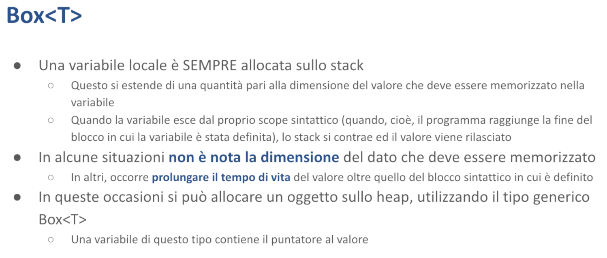

# Il Linguaggio - Malnati 6-7 <!-- omit in toc -->

# Indice <!-- omit in toc -->
- [1. Box](#1-box)
  - [1.1 Esempio Box 1 (+ insight su Debug e Display)](#11-esempio-box-1--insight-su-debug-e-display)
  - [1.2 Esempio Box 2 (+ insight sul movimento)](#12-esempio-box-2--insight-sul-movimento)
- [2. Esempio sul movimento](#2-esempio-sul-movimento)
  - [2.1 Differenza indirizzo stack e indirizzo heap](#21-differenza-indirizzo-stack-e-indirizzo-heap)
  - [2.2 Distruttore](#22-distruttore)
  - [2.3 Movimento](#23-movimento)
    - [2.3.1 Il tratto copy](#231-il-tratto-copy)
    - [2.3.2 Il tratto clone](#232-il-tratto-clone)
- [3. Array](#3-array)
  - [3.1 Slice](#31-slice)
- [4. Vec](#4-vec)
- [5. Stringhe](#5-stringhe)
  - [5.1 str](#51-str)
  - [5.2 String](#52-string)
    - [5.2.1 Esempio](#521-esempio)
- [6. Istruzioni ed espressioni](#6-istruzioni-ed-espressioni)
  - [6.1 Esempio espressione](#61-esempio-espressione)
  - [6.2 Funzioni](#62-funzioni)
    - [6.2.1 Esempi](#621-esempi)
  - [6.3 Cicli](#63-cicli)
    - [6.3.1 Esempi](#631-esempi)
  - [6.4 Notazione `..`](#64-notazione-)
    - [6.4.1 Esempi](#641-esempi)
  - [6.5 Match](#65-match)
    - [6.5.1 Esempi](#651-esempi)
- [7. Riga di comando e argomenti](#7-riga-di-comando-e-argomenti)
  - [7.1 std::env::args](#71-stdenvargs)
  - [7.2 Clap](#72-clap)
    - [7.2.1 Esempio Clap](#721-esempio-clap)
- [8. I/O da Console](#8-io-da-console)
- [9. Convenzione sui nomi](#9-convenzione-sui-nomi)

# 1. Box



Abbiamo visto che Rust ci presenta puntatori di tipo diverso per gestire situazioni di tipo diverso.

In quelle situazioni in cui esiste una variabile che ha possesso di un dato, e quindi è responsabile del suo rilascio, ma ha bisogno di far sapere a una funzione, a un altro oggetto, il valore attualmente contenuto senza copiarlo, può passare un riferimento.
Il riferimento è un prestito: io ti presto l'accesso a questa variabile.

I riferimenti possono essere semplici, quindi condivisi, e non permettono la modifica, oppure i riferimenti possono essere mutabili e mutuamente esclusivi. 

**Finché esiste un riferimento di qualunque tipo, il dato non può cambiare.**

**Se è presente un riferimento mutabile, non può essere presente nessun riferimento semplice e la variabile originale che possiede il valore non può accedere al valore**, perché mentre esiste un riferimento mutabile questo è l'unico che può accedere, ed eventualmente modificare.

I riferimenti sono puntatori che non hanno possesso. Vanno bene per ottimizzare: invece di muovere 200 byte ti muovo un puntatore.
Siccome io ho la semantica della condivisione o della condivisione mutabile, sono tranquillo: non possono succedere cose strane — è evidente qual è lo scopo.

In altre situazioni invece noi abbiamo bisogno di manipolare dei dati di cui magari non conosciamo a priori la dimensione.
Potremmo aver bisogno di puntare un blocco da 10 byte, magari da 100, magari da 1000.
Lo sapremo solo a runtime.

Oppure abbiamo bisogno di prendere un dato la cui vita duri più a lungo della funzione in cui quel dato nasce.
In queste situazioni non è possibile usare una variabile locale semplice che include il valore.

Se il dato ha dimensione variabile non posso usare una variabile locale semplice perché i tipi hanno bisogno di avere una dimensione. Se quello non lo so non ce la faccio, mi serve un puntatore.

Ma anche se il dato ha una vita che dura più a lungo devo fare in modo diverso, perché naturalmente la variabile, al termine del suo scope, della sua zona di visibilità, verrebbe buttata via e insieme a lei viene buttato via il valore che contiene.

Quindi in questo tipo di situazioni mi serve gestire un puntatore.
Un puntatore con una natura molto diversa da quello del reference, perché questo è un puntatore **che possiede il suo dato**.

In Rust un puntatore che possiede il suo dato si chiama **box**.


Un box non è nient'altro che un puntatore che punta sullo heap e che quando esce di visibilità rilascia quel blocco.

Creiamo i box semplicemente usando la sintassi `let b = Box::new(v);` 

Quello che succede è che il valore che noi indichiamo viene preso, allocato dentro lo heap, quindi si cerca nello heap un blocco grande quanto serve per tenere quel valore, lo si mette dentro e nella variabile `b` ci arriva il puntatore a questo blocco.

Nel momento in cui abbiamo bisogno di andare a vedere cosa c'è nella variabile `b` basta usare l'espressione `*b` che segue il puntatore e ci accede.

Se ciò che c'è nella variabile `b` è un oggetto che ha dei metodi posso fare `(*b).qualcosa()` ma posso anche, come abbiamo visto prima, scrivere soltanto `b.qualcosa` perché la notazione *“punto”* guarda automaticamente cosa c'è prima di sé, e quando vede che c'è qualcosa che è un puntatore prima di tutto lo dereferenzia.

Supponendo che la variabile `b` sia mutabile, se devo assegnare alla variabile `b` un qualche contenuto nuovo che finirà nello heap in quella zona che ho preparato, scriverò `*b = qualcosa;`.

La caratteristica di un box è che possiede il blocco, di conseguenza il compilatore automaticamente nel momento in cui la variabile `b` giunge alla fine della propria vita e quindi sta per essere *ejected*, prima di buttarla via rilascia il blocco di memoria che la variabile `b` possiede, garantendoci quindi che non c'è perdita.

Non dobbiamo essere noi a ricordare di fare la `delete` piuttosto che `free`.
Automaticamente nel momento in cui `b` esce *out of scope* quel blocco viene rilasciato.

Vediamo un esempio.

## 1.1 Esempio Box 1 (+ insight su Debug e Display)


Qui abbiamo una funzione ipotetica nella quale io comincio ad allocare, giusto per far vedere che nello stack succede qualcosa, una variabile locale `let i = 4`.

La variabile `i` è una variabile locale semplice, nel momento in cui io eseguo questa funzione lo stack cresce e all'interno viene prolungato di un 4 byte (in questo caso), e all'interno di quei 4 byte viene messo un normalissimo 4 che sta lì.


Alla riga successiva metto una tupla `(5, 2)` dentro un box.
Succede che innanzitutto nasce `b` e quindi lo stack si allunga un po' per contenere `b`, che di suo è una variabile locale.

Quello che non è locale è il suo valore.

*Cosa ci metto dentro* `b`*?*
Automaticamente Rust va a cercare nello heap un blocco grande quanto gli serve per tenere la tupla, lo trova da qualche parte, inizializza la tupla nel modo opportuno, cioè ci scrive 5 e 2 in questo caso, e il puntatore al primo byte di questo blocco viene salvato all'interno di `b`.

Di conseguenza `b` contiene il puntatore alla tupla.


Da qui in avanti io posso usarlo tranquillamente, ad esempio posso scrivere `(*b).1 = 7`, oppure `b.1 = 7` andrebbe bene ugualmente.

Seguo `b`, vado nel campo 1 e lì ci scrivo 7. Quindi la tupla non è più 5 e 2, è diventato 5 e 7.


Poi lo stampo.
Posso stampare `b` esplicitamente dereferenziandolo con l’asterisco (*b), oppure direttamente con `b`: non fa differenza in questo caso. Quando uso `println!("{:?}", ...)`, Rust cerca un’implementazione del tratto `Debug` per il tipo in questione, e se necessario applica automaticamente la dereferenziazione per accedere al valore interno e formattarlo correttamente.

Vedete che `println!` qua, invece di usare come abbiamo visto le volte scorse `{ }` usa `{:?}`.
Questo perché in Rust ci sono due modi di stampare.

In Java mediamente se voi dovete stampare, sull'oggetto che stampate viene chiamato il metodo `to_string()` che ha il compito di trasformarlo in qualcosa di visibile.

In Rust ci sono due metodi diversi che corrispondono a due tratti che i tipi possono implementare.

Esiste il tratto `Display` che è l'equivalente di `to_string()` diciamo di Java, serve a dare una rappresentazione utile all'utente finale di che cosa c'è scritto lì dentro.

E poi c'è il tratto `Debug` che viceversa il più delle volte in automatico deriva una rappresentazione che permette a un programmatore di capirci qualcosa ma non necessariamente a un utente finale.

Le tuple automaticamente implementano il tratto `Debug`.

Non ci devo fare niente perché una tuple dice “*vabbè io so che se per un programmatore che ha capito che cosa io significo io stampo direttamente come sono fatta*”.
A un utente finale sta cosa qua dice poco perché un utente finale ragiona in termini del significato di quell'informazione lì.
Se quello è un punto sul piano è una certa cosa, se è il numero di genitori piuttosto che il numero di cugini piuttosto che il numero di nipoti è tutta un'altra faccenda.

Chiaramente quando noi usiamo le strutture dati, a quelle strutture dati diamo un significato nel dominio del nostro problema.

Il tratto `Display` si occupa di fornire una rappresentazione comprensibile ***del dominio*** cioè di cosa quell'informazione rappresenta nel dominio.
Non può essere generato in automatico, bisogna farlo a mano perché il programma non ne può avere la più palli d'idea di che cosa siano quelle cose lì.

Mentre in automatico il più delle volte (non sempre perché ci possono essere dei punti ambigui dove dobbiamo intervenire) il tratto `Debug` è possibile generarlo in automatico.

*Come si selezionano le due cose?*
Allora con `{ }` seleziona il tratto `Display` che è implementato per default sui numeri.
Quindi quando stampiamo i numeri non fa nessuna differenza mettere `{:?}` o `{ }`, perché per Rust 7 è 7 senza dirgli nulla di particolare.

Su tutto il resto invece c'è distinzione, e quindi `{:?}`  dice *“stampami la versione di debug”,* mentre `{ }` dice *“stampami la versione di display”.*

Ci sono altri modificatori: se nelle graffe scrivo `:p` quello che gli metto a fianco viene interpretato come puntatore, quindi mi fa vedere non cosa c'è nella memoria, ma dov'è! Ovviamente devo mettergli un puntatore, se non gli metto un puntatore e gli metto 7 il compilatore mi blocca.


Abbiamo stampato `b` in un paio di modi, viene sempre la stessa faccenda, e arriviamo al chiusa graffa. 

Cosa succede quando arriviamo al chiusa graffa? 
Lo stack si contrae e cosa c'era nello stack? 
Nell'ordine c'era `b` che puntava qualcosa e poi c'era `i`. 

Lo stack si contrae in un primo passo, sta per buttare via `b`, ma `b` è un box! 
Il box ha un distruttore che si occupa di rilasciare il blocco di memoria, e quindi in questo momento quello che succede è che, per eliminare `b` quando lo stack si contrae, prima di tutto viene rilasciato il blocco.

Ma c'è ancora `i`, lo stack si contrae anche per `i` che è un i32 semplice — non ha distruttori perché di suo non ha una semantica associata particolare. 

Quindi arrivato al chiusa graffa la situazione che vedo sullo stack è questa. 

## 1.2 Esempio Box 2 (+ insight sul movimento)


Vediamo qua un altro pezzo: qui ho una funzione main che chiama la funzione `makeBox`, la quale funzione ritorna un `Box`. 

Questo serve per far vedere un dato che nasce in un punto ma che deve durare più a lungo. 

La funzione main chiama `makeBox`, la quale accetta un parametro e avrà un valore di ritorno, quindi per poter chiamare la funzione `makeBox` nel main viene preparato sullo stack uno spazio nel quale possa essere depositato il valore che `makeBox` ritornerà. 


Dopo di che chiamo `makeBox`. 
Viene chiamata con un parametro, 5, perfetto. 
In realtà il main, subito prima di chiamare `makeBox`, ha anche depositato 5 all'interno dello stack in modo tale da arrivarci e si accinge a fare la sua operazione.


Entrando nella funzione, viene creata una variabile locale `r`. 
Questa variabile locale dice “*crea un nuovo box che contiene una tupla composta in questo caso dal parametro e 1*”. 
Quindi al solito si va sullo heap, si cerca un blocco grande quanto serve, lo si inizializza e il puntatore viene salvato nella variabile `r`.

Fino a qua tutto tranquillo. 
La riga successiva, che dice `return r`, ci farebbe dire “*ok, prendi r e mettilo dentro b, ma siccome r è arrivato al fondo distruggilo*”, e se distruggo `r` che cosa succede? 
Succede che quel blocco dentro cui c'è scritto `(5, 1)` viene rilasciato, ma `b` avrebbe già una copia! 
Problema!!!

 


Ma qui emerge invece una delle caratteristiche fondamentali di Rust, che all'inizio mettono un po’ di difficoltà le persone: **le assegnazioni, nella maggior parte dei casi, non copiano — spostano!** 

*Cosa vuol dire che non copiano ma spostano?* 
Quando scrivo `return r` di fatto `r` viene copiato nello spazio che è stato preparato dal main in cui dovrà stare, e di fatto i byte vengono ricopiati a destinazione, ma il compilatore dice “*ah benissimo questo è stato uno spostamento*”, cioè **il dovere di rilascio è transitato dalla variabile `r` alla variabile destinazione**, in questo caso `b`. 

**Lo spostamento è una copia** (quindi io di fatto passo tutti i byte), **ma perdo il diritto di accesso perché ho ceduto i miei byte a un altro.** 
E perdo il dovere del rilascio perché è transitato a quell'altro. 

Quindi adesso vedete che la riga da `r` è tratteggiata, perché dentro `r` ci sono ancora scritti 3b7f5942 (quello che è, l’indirizzo dell’heap in cui è memorizzata la tupla), ma il compilatore sa che quel dato lì non deve più essere guardato — non c'è lì la responsabilità del rilascio. La responsabilità del rilascio è transitata sul destinatario, cioè `b`.

>💡 **Copia vs Movimento**
>
>La **copia** è una **duplicazione**: il nuovo valore è indipendente dall’originale.
Tipi come gli interi (i32, u8, ecc.) vengono copiati quando vengono assegnati o passati a una funzione: si crea una nuova copia del dato, e l’originale resta valido.
>
>Invece, per tipi come Box<T>, l’assegnazione comporta un ***movimento*** (move): il valore viene *spostato*, e l’originale non può più essere usato.
>
>```rust
>/* This is fine */
>fn main() {
>    let x1 = 5;
>    let x2 = x1; // Copy
>    
>    println!("x1: {}", x1);
>    println!("x2: {}", x2);
>}
>```
>
>```rust
>/* This doesn't compile */
>fn main() {
>    let b1 = Box::new(5);
>    let b2 = b1; // Movement
>    
>    println!("b1: {}", b1);     // this should thrown an error
>    println!("b2: {}", b2);
>}
>```
>
>L’esempio a destra non funziona perchè, dato che i dati posseduti da `b1` vengono *spostati* in `b2` (che ne diventa il nuovo proprietario), quando proviamo a stampare `b1` dopo il movimento, il compilatore ci blocca. 
Ci suggerisce anche un modo per risolvere, qualora proprio volessimo tenere sia `b1` che `b2`: clonare `b1`.
>
>```rust
>/* This is fine */
>fn main() {
>    let b1 = Box::new(5);
>    let b2 = b1.clone();
>    
>    println!("b1: {}", b1);
>    println!("b2: {}", b2);
>}
>```


Di conseguenza nel momento in cui contraggo lo stack va via `r` (variabile locale), vanno via i parametri etc.. quello che potrebbe esserci e torno al main.


A questo punto è `b` il vero proprietario di questo blocco, che sa assolutamente dove stava. 
E quindi posso creare la variabile `c` come somma delle due parti. 


Dopodiché arrivo al chiusa graffa del main. 
Qui avevo sullo stack `c`, che è un intero semplice e va via, avevo b, che è un box e prima di andar via rilascia, motivo per cui quando termina questa cosa qua lascio pulito lo heap — non ho perdite di memoria, tutto è stato rilasciato una e una sola volta.

Il meccanismo del ***movimento*** è challenging perché le persone inizialmente fan fatica a capirlo.


> 💡 **Nota**
> >
>Nota che qua non stiamo dicendo che il box è mutabile: `r` non lo è. 
Ma avrei potuto dire in main `let mut b = makeBox(5);`, perché quando a `b` gli arriva, anche se il box è stato costruito senza mutabilità, **la variabile che viene ritornata è proprietaria del box** **e chi è proprietario può in qualunque momento decidere che si dà il diritto di mutare**.
>
>```rust
>/* This is fine */
>fn makeBox(a: i32) -> Box<(i32, i32)> {
>    let r = Box::new( (a, 1) );
>    return r;
>}
>
>fn main() {
>    let mut b = makeBox(5);
>    b.0 = b.0 + 1;
>    
>    println!("{:?}", b);
>}
>```

Lo scegliere di non essere mutabili è una scelta conservativa per evitare *misunderstandings*, ma non è intrinseco nel valore, è intrinseco nel possessore! 
Nel momento in cui io cedo da un possessore a un altro, il possessore originale poteva aver scelto per quello che riguardava lui di non essere mutabile perché lui non aveva nessun bisogno di fare mutazioni, ma il nuovo possessore a cui viene ceduta la cosa può decidere di farlo.

> *Proprio come un padrone di casa che possiede un appartamento e decide che anche se brutto gli va bene così, poi un giorno lo vende e il nuovo padrone decide che butta via tutto e lo rifà. 
È il nuovo padrone, quindi fa quello che vuole!*
> 

# 2. Esempio sul movimento


Adesso introduciamo un pezzettino di sintassi i cui dettagli li vedremo in seguito, ma comunque li introduciamo già adesso per far vedere che cosa succede dietro le quinte. 

Prepariamo una struttura `S` all'interno della quale ci metto semplicemente un numero, quindi potrò creare degli oggetti di tipo S(1), S(54), S(-2) etc.. semplicemente una struct così è di fatto equivalente a un `Int` — è semplicemente un `Int` con un nome. 

A questa struct associo un paio di metodi che mi servono a far vedere che cosa succede.


Per associare dei metodi si usa il costrutto ***impl***.
Associamo il metodo ***display***.

I metodi hanno un parametro che viene scritto nella loro definizione esplicitamente che dice “*tu verrai chiamato su un oggetto di questo tipo (**self**), cioè della classe S, e lo riceverai come riferimento non mutabile (in questo caso)*”.


E qui possiamo fare print line e stampiamo una stringa che indica che si tratta di un oggetto S, che contiene un dato che si chiama `self.0` e che l’oggetto S vive ad un certo indirizzo, e l'indirizzo `self` è tale indirizzo.

Questo metodo fondamentalmente serve per sapere cosa c'è dentro S e dove sta S.

Facciamo una prova a chiamarlo nel main. 


Notate che il metodo `display()` prendeva il parametro `&self` — questo parametro lui ce l'ha, ma siccome è **self**, è scritto prima: `s.` è il suo self. 
In Java noi sappiamo che quando scriviamo `s.to_string()`, il metodo `to_string()` ha un **this** implicito — in Rust, nell'implementazione del metodo, quello che negli altri linguaggi si chiama ***this*** si scrive esplicitamente ***self***, perché noi lo possiamo passare in tanti modi. 
In questo caso lo abbiamo passato non modificabile perché il metodo `display()` non ha bisogno di cambiare niente. 

Lanciamolo:


Quello è un indirizzo sullo stack — questa è un variabile locale. 

## 2.1 Differenza indirizzo stack e indirizzo heap


Modifichiamo l’esempio, creando anche un Box e chiamando il metodo `display()` anche sul Box.
Lanciamo e vediamo che `s1` vive nello stack all'indirizzo indicato, mentre `s2` vive tutto da un'altra parte, sullo heap. 

## 2.2 Distruttore

Alla struct S aggiungiamo anche un **distruttore**, qualcosa che ci faccia vedere quando cessa di esistere. 


Per aggiungere un distruttore bisogna fare in questo modo. 
Vediamo che in questo caso la funzione `drop()`, che è predefinita dal linguaggio e che così come in C++ il distruttore si scrive `~nome_classe`, qua il distruttore si scrive in questo modo e ha possibilità di manipolare quello che c'è dentro — riceve sempre l'oggetto che sta per essere distrutto come **mutabile**, e quindi sa di poter farci delle cose dentro. 


>💡 **Nota**
>
>Notiamo inoltre che stiamo fornendo una implementazione del tratto `Drop` per il tipo S che abbiamo definito noi, prima invece avevamo solo definito un metodo che abbiamo chiamato “display”, che appartiene al tipo da noi definito.
>
>Se avessimo voluto fornire l’implementazione del tratto `Display`, per poter stampare il nostro tipo usando la macro `println!(”{}”, …)` invece di fare `s1.display()`, avremmo dovuto fare così:
>
>```rust
>use std::fmt::Display;
>use std::fmt;
>
>struct S(i32);
>impl Display for S {
>    fn fmt(&self, f: &mut fmt::Formatter<'_>) -> fmt::Result {
>        write!(f, "S value: {}, @{:p}", self.0, self)
>    }
>}
>impl Drop for S {
>    fn drop(&mut self) {
>        println!("Dropping.. S value: {}, @{:p}", self.0, self);
>    }
>}
>
>fn main() {
>    let s1 = S(5);
>    
>    println!("{}", s1); // Now this works!
>}
>```
>
>Inoltre, in questo esempio, S è una struct che contiene tipi elementari, dunque non vi è allocazione di memoria sullo heap: le strutture di tipo S vivono quindi nello stack.
Dunque di fatto, non vi è alcun “rilascio della memoria”, abbiamo implementato `Drop` giusto per fare una stampa.
>
>Per i tipi che invece allocano memoria sullo heap, *dopo* che viene eseguito il metodo `drop()` da noi implementato, il tratto `Drop` si occupa poi di rilasciare la memoria.
>
>

A noi in questo momento serve solo stamparlo.


Vediamo che è stato costruito S(1) sullo stack, è stato costruito S(2) sullo heap, poi senza che noi abbiamo fatto niente altro se non rendere esplicita la distruzione (che avveniva comunque, solo che per default non stampava niente).

Vediamo che siccome abbiamo creato prima S(1) e poi S(2), nel contrarsi lo stack prima egetta S(2) e poi egetta S(1).

## 2.3 Movimento

Ragioniamo meglio su questo movimento, questo passaggio per movimento.


Momentaneamente ci dimentichiamo del Box e creiamo il nostro S(1), e verifichiamo dove sta, e poi diciamo `let s2 = s1;` — lo copio..? No: lo muovo! 


>💡 **Drop vs Copy**
>Avendo implementato **`Drop`**, questo tipo **non può avere anche il tratto `Copy`.**
Se non avessimo implementato il tratto `Drop`, essendo che questa struct contiene solo tipi elementari (un i32, nello specifico), allora avremmo potuto avere tranquillamente il tratto `Copy`.


Faccio `s2.display()`, e provo a fare anche `s1.display()` ma il compilatore mi blocca! 

Ci dice *“sei partito da* `let s1 = S(1);`*, poi hai chiamato display, bene, e poi me l'hai mosso dentro s2 — **value moved here***”. 

Dentro `s1` non c'è più niente, o meglio hai trasferito i byte dall'altra parte come qualunque copia, ma insieme hai trasferito diritti e doveri: non hai più il diritto di andarci a guardare e non hai più il dovere di distruggere. 
`s2` ha acquisito il diritto di andarci a guardare e il dovere di distruggere.


Infatti mi dice “*lì l'hai mosso, alla riga 16, e alla 18 hai fatto l’errore: dopo aver detto che non era più tuo ci vai ancora a guardar dentro — **value borrowed here after move***”.


Allora dobbiamo cancellare la riga 18 e a questo punto il programma diventa semplicemente: `s1 = S(1)`, che contiene un numero, → lo stampo → `let s2 = s1` (**lo trasferisco**) → e poi `s2` lo posso guardare tranquillamente perché a questo punto `s2` ha guadagnato lui il diritto di accesso e quindi lo può vedere, e il dovere di rilascio.

 


Questa volta compila correttamente e qui vedo che `s1` l'avevo fatto, e l’ho stampato: conteneva 1 e stava all'indirizzo che finisce con 84. 
Nel momento in cui ho scritto `let s2 = s1;`, lui ha preso e quel valore lì l'ha spostato! 
Dentro `s2` c'è ancora scritto 1, ma il suo indirizzo non è più 84: è diventato 88, proprio perché l'ha spostato! 

Adesso quando lo stack si contrarrà per la parte di 84 non capiterà niente, quando lo stack si contrae per 88 invece capita il drop. 
L'informazione dropping ci viene stampata su 88, che è l'indirizzo della seconda variabile, perché la seconda variabile nell'acquisire il valore ha acquisito i diritti e i doveri. 


La variabile `s2`, se ci servisse, la possiamo anche rendere mutabile. 

Quindi nella maggior parte dei casi le assegnazioni sono in realtà dei ***movimenti***, cioè io ti passo i byte e i diritti e i doveri. 

### 2.3.1 Il tratto copy

Ci sono piccole eccezioni: nel caso dei numeri, le assegnazioni sono semplici copie, perchè questi godono del tratto `Copy`, che dice che è lecito trasferire il valore senza trasferire i diritti e i doveri.
Il tratto `Copy` è mutuamente esclusivo con il tratto `Drop` — `Copy` va bene per quelle situazioni in cui non ci sono doveri associati: noi nell’esempio abbiamo implementato `Drop` giusto per fare una `println!`, ma Box implementa `Drop` per poter fare il rilascio, non può farne a meno, altrimenti non rilascerebbe la memoria. 

Nella maggior parte delle situazioni le assegnazioni sono dei movimenti, che vuol dire che copio i byte e trasferisco diritti e doveri. 
Per quei tipi, come i numeri, che implementano il tratto `Copy` le cose sono più semplici, cioè io ho solo il trasferimento dei byte. 

Ma ci sono dei vincoli: il tratto `Copy` lo possono avere solo alcuni. 

### 2.3.2 Il tratto clone

*E allora non duplico mai le cose?* 
C'è un altro tratto interessante che si chiama **`Clone`**. 
Il tratto clone è un tratto più impegnativo che dice “*io voglio davvero duplicare questa cosa **in profondità***” — in profondità vuol dire che non copio solo la superficie, ma vado avanti: se ad esempio clono il mio box di S, non è che duplico il puntatore del box, ma alloco nell’heap un'altra cosa della stessa dimensione di ciò a cui il box originale puntava, copio tutti i byte dalla sorgente alla destinazione e a quel punto lì ho due puntatori distinti e vado bene.

Clone è in generale un'operazione onerosa — nella libreria standard del C c'è una funzione che si chiama ***strdup*** che duplica una stringa. 

*Cosa fa strdup?* 
Dice *“se tu parti da una stringa terminata da zero io mi conto quanti byte ha, poi gli aggiungo uno, poi alloco un blocco grande quanto è venuto sto conteggio, poi copio tutti i byte originali nel loro blocco e poi ti restituisco il puntatore del blocco nuovo”* — quello fa strdup, una copia in profondità. 

Le copie in profondità sono onerose, possono essere estremamente onerose: dipende quanto è grande il blocco da copiare. 
Possono essere ricorsive, perché nel caso della stringa sono byte semplici, ma io posso avere delle cose che puntano a cose che puntano a cose etc..

Allora l'operatore `=` , quello che fa le assegnazioni, può essere solo usato per il movimento (cioè trasferisco dati, diritti e doveri), o la copia semplice (trasferisco dati là dove non ci sono particolari doveri associati). 
Quando invece abbiamo bisogno di fare copia in profondità lo dobbiamo scrivere in modo esplicito: dobbiamo scrivere  `.clone()`, perché così siamo obbligati a renderci conto che quella è un'operazione potenzialmente onerosa.


Prima abbiamo anche brevemente accennato che in realtà Rust ammette anche i tipi elementari `*const T` e `*mut T` che corrispondono ai puntatori del C con tutti i limiti dei puntatori del C. Questi però possono solo essere usati all'interno di blocchi **unsafe**. 

# 3. Array


Rust ci permette facilmente di gestire anche gli **array**. 
Un array è una sequenza contigua di n dati elementari di tipo T. 
Gli array sono omogenei: tutti i loro elementi sono dello stesso tipo. 
La lunghezza è nota a priori.

Quando creo un array posso inizializzarlo direttamente, potrei scrivere `let a = [1, 2, 3, 4, 5];`

Posso anche rendere esplicito il suo tipo con `let a: [i32, 5] = 1, 2, 3, 4, 5];` — che vuol dire che ci sono 5 interi i32 consecutivi.

Posso anche scrivere `let b = [0; 5]`, che vuol dire ci sono cinque 0 consecutivi (siccome gli zeri il compilatore tende a leggerli come degli i32, a meno che non hanno un suffisso, lui mi fa un array che ha la stessa dimensione di quello sopra ma questa volta è inizializzato con degli zeri). 
Questa seconda notazione è molto comoda perché se io devo allocare un array da un mega, posso scrivere `let buffer = [0; 1024*1024];` piuttosto che `let buffer = [0, 0, 0, …];` fino a 1024. 

Gli array hanno alcuni metodi built-in che ci vengono comodi: in particolare hanno il metodo `len()` che è molto comodo e ci dice quanto è lungo, perché a differenza del C dove gli array sono ridotti al puntatore al primo elemento (e quindi quando voi dichiarate un array di interi quello diventa di fatto un `int*` e il compilatore non sa più quanto è grande), qua invece gli array sono un tipo a tutti gli effetti e sanno quanto sono grandi e quindi in grado di dirti quanto è lungo.

**Attenzione**: la lunghezza di un array è immutabile — io ho creato questo array da 5 elementi, sarà 5 elementi tutta la vita. 
Dire che l'array è mutabile significa che cambiano i valori che contiene, ma non la sua lunghezza.

## 3.1 Slice


Gli array hanno una dimensione fissa, ma a volte i nostri algoritmi nell’ambito di un array grosso che è già stato allocato hanno bisogno di essere agili e muoversi per segmenti di questo array, quindi considerare delle parti.

Il C, e C++ come conseguenza, avevano elaborato l’idea ***dell’aritmetica dei puntatori***: io alloco un array, l’array automaticamente diventa il puntatore al primo elemento ma io poi posso fare ptr+1, ptr+7, ptr+54 etc.. per muovermi all’interno di questa cosa.
Ma l’aritmetica dei puntatori è tanto simpatica tanto quanto pericolosa, perché io posso sommare un miliardo e chissà dove vado a finire. 

Io voglio passarti delle parti, e le voglio passare in modo efficiente, cioè in realtà non ti voglio ricopiare i byte. 

Supponiamo di aver letto un grosso documento: stiamo facendo il syntax checker per vedere se ci sono parole strambe e una delle possibilità è dire *“io ricopio le singole paroline che trovo e le mando alla funzione controllo_nel_dizionario”,* ma è una cosa onerosissima perché i byte già li ho letti una volta in memoria e poi devo prendermene tutte le volte dei segmenti, ricopiarli in un’altra variabile e passarli.
Alla fine ho scandito l’intero documento ma l’ho copiato praticamente tutto quanto, un po’ per volta ma l’ho copiato tutto. 
L’idea dell’aritmetica dei puntatori dice *“guarda io ce l’ho in memoria, parte qui e finisce lì, però ti do il puntatore. Vai a guardare la parola che comincia a questo punto, così non devi ricopiare e te la leggi direttamente dalla fonte”.* 

In C++ l’idea è stata estesa introducendo il concetto di ***iteratore***, ******che fa proprio leva sulla sintassi dell’aritmetica dei puntatori: l’iteratore è una cosa che *sembra un puntatore* — lo dereferenziate con asterisco, gli fate la somma o la differenza come come fossero dei puntatori e serve a muoversi dentro le strutture dati di vario tipo. 
Però è soggetto a tutti i problemi dell’aritmetica dei puntatori. 

Rust dice *“guarda io ti dò la possibilità di identificare dei segmenti all’interno di un array più grande senza bisogno di dover copiare i dati presenti al loro interno — ti dò il tipo che si chiama **slice***”. 

Una **slice** indica un segmento all’interno di un array. 
Una slice ha come notazione `&[T]` dove T è il tipo del singolo elemento dell’array. 
Possiamo avere una slice non mutabile oppure `&mut[T]` è una slice mutabile, ed è quindi un riferimento a un blocco di `[T]`. 
Notate che nel caso dell’array il tipo è `[T; n]`, dove n è un numero, invece qui abbiamo `[T]` che vuol dire *“ci sono dei T di fila”.* 
Quanti? Boh, nel tipo non si sa, perché io solo a runtime capirò se me ne servono 5, 12, 84 etc..

**Le slice in quanto reference possono solo essere ricavate da un dato che esiste, quindi se non ho un dato a priori (il mio array di partenza) non ho le slice**. 

Io posso prendere una slice all’intero array, posso prendere una slice di un pezzettino di quell’array, o posso decidere che comincia prima o che comincia dopo e cose del genere.. la slice può solo stare dentro l’array: se io cerco di andare fuori se lui può mi blocca già a compile time, se non può mi garantisce che a runtime mi bloccherà (panicando).

Quando io dichiaro un array di tipo slice sto dicendo che quella variabile è un ***fat pointer***, perché contiene il puntatore al primo elemento della mia fettina e subito a fianco il numero di elementi che fanno parte della mia fetta. Questo permette di passare il riferimento ad altri che avranno modo di sapere che loro potranno partire da quel puntatore e al massimo accedere all’ennesimo elemento e poi basta. 
Se cercheranno di andare oltre succederà esattamente una condizione di panic dicendo *index out of bound*. 

Io posso inizializzare una slice in modo esplicito con la scritta `let s1: **&[i32]** = &a;` — se io non avessi messo l’annotazione `&[i32]` lui avrebbe detto che s1 è un ref al mio array, ma io in realtà gli voglio dire che quello lì è un ref a un array di interi senza cablare nel tipo di s1 il numero. Il numero effettivo è dentro il valore di s1 perché s1 contiene sia il puntatore al primo che quanti ne sono stati presi. 

**s2** ha lo stesso tipo di s1, in questo caso la prima parte del del fat pointer coincide con quella di s1 ma il secondo pezzettino del fat pointer invece di essere 4 contiene 2.

**s3** ha lo stesso tipo di s1 e di s2 ma la prima parte del suo fat pointer non contiene l’inizio dell’array ma l’inizio dell’array spostato di due elementi (quindi punta al terzo elemento dell’array), e nella seconda parte del fat pointer c’è scritto 2 perché scrivendo da `[2..]` lui va a vedere “*quanto era grande l’array? Era 4, quindi da 2 a 4*”, e quindi ne prende 2. 

Scritte così sono tutte slice immutabili cioè ci permettono di guardare quei numeri ma di non copiarle, se l’array originale era mutabile possiamo estrarne una mutable slice. 
**Mentre esiste una mutable slice l’intero array è inaccessibile!** 
Anche se io ne guardo solo un pezzettino, perché in realtà lui non riesce a governarmi tutta la faccenda e dire “*la coda non la scrivi, mentre l’inizio sì*”. 
Quindi finché c’è una mutable slice l’array è inaccessibile, come avere un ref mut all’array nel suo intero.

Se ho una slice accedo ai suoi elementi esattamente come farei con un array e se vado fuori dal tutto mi genera un panic.

# 4. Vec<T>


Gli array e le slice sono dei meccanismi abbastanza comodi, ma in realtà non sempre così versatili. 
Il vero cavallo di battaglia dei programmi che andremo a scrivere, che alimenta la maggior parte dei meccanismi dove abbiamo bisogno dinamicamente di usare le cose, è il `Vec`. 

`Vec` è più o meno quello che in Java si chiama ***arraylist***, ovvero rappresenta un blocco di elementi omogenei allocato sullo heap ridimensionabile, cioè che io posso far crescere, far diminuire e così via, e quindi in cui posso memorizzare tutti gli elementi che mi servono.

Posso cercare quelli che mi interessano, posso ordinarlo (se gli elementi sono ordinabili, cioè hanno un modo di essere confrontati come “prima e dopo”), posso farci tante cose..

Il `Vec` è un oggetto che gestisce in automatico la memoria che utilizza, e provvede a garantirne il rilascio corretto. 
All’interno di un `Vec` ci sono tre campi: 

- **un puntatore ad un blocco sullo heap** dove lui ha spazio per mettere le cose
- **un intero senza segno che dice quel blocco lì quanto è grande** complessivamente — lui sa che sullo heap si è preso 50 elementi di tipo T, qualunque cosa sia T.
- **un intero senza segno che dice quanto, di quello spazio, stiamo effettivamente utilizzando** —  quanti di quei 50 sono già usati: ovvero lui ha spazio per tenerne fino a 50 ma non ne ha necessariamente 50, perché ha riempito solo i primi tre e quindi ha ancora 47 caselle libere. 
Quando arrivasse a riempire tutte le 50 caselle e io gli dico “aggiungi”, lui dice “aspetta”, va dal sistema operativo e dice “mi dai un blocco da 100?”, e in quel blocco da 100 copia i suoi primi 50 e poi nella posizione 51 mette quello che volevamo aggiungere, dopodiché il vecchio blocco da 50 lo rilascia.

Quindi dinamicamente cresce. Vediamolo.


Partiamo da un programma molto semplice: creiamo una variabile mutabile perché dovremmo metterci delle cose dentro (se fosse immutabile ce ne faremmo pochissimo). 

`let mut v = Vec::new();` — questo è il modo con cui costruiamo gli oggetti in Rust. 
La parola `new` non è una parola chiave del linguaggio, è un metodo. 
Convenzionalmente si chiama “new”, ma lo potremmo chiamare “francesco” e andrebbe bene lo stesso. 
Di solito i programmatori tendono a dare quel nome lì ma vedremo che c’è anche un altro modo di creare il nostro array — potremmo crearlo `Vec::with_capacity(32)`: in quel caso lì preallocheremmo già un vettore che ha spazio per 32 elementi; questo va bene in quei casi in cui sappiamo già immaginare con un buon grado di probabilità quanto spazio potrebbe servirci.

In questo caso gli stiamo dicendo `Vec::new()`, che vuol dire “*guarda io non so neanche se ti metterò mai qualche cosa*”, quindi Rust mi restituisce un oggetto che sta quindi sullo stack perché v è una variabile locale che ha dentro di sé tre campetti: il primo è un ***puntatore*** che è nullo, ma io non lo vedo tanto quel puntatore e non lo so che è nullo, il secondo è il campo ***size*** che ci dice quanti elementi hai in utilizzo sulla capienza totale (per ora nessuno), e l’altro è il campo ***capacity***. 


Nel momento in cui io cerco di salvare dentro questo array un dato lo faccio col metodo ***push***, che vuol dire “*aggiungi al fondo, nella prima posizione libera, un dato*”. 
Succede che lui dice “aspetta io non ho spazio, allora momento: sistema operativo mi dai un blocchettino?”. 
Grande quanto? Si prende quattro interi. 
Si salva il puntatore, si segna dentro capacity che ne ha presi quattro, e nel primo ci mette il dato che abbiamo pushato, e quindi si segna che il size in questo momento è 1.


Subito dopo gli diciamo `v.push(4)` — benissimo, abbiamo spazio libero? Si: size è più piccolo di capacity, dunque vado nell’array che ho allocato nell’heap, vado all’indirizzo del size e ci metto 4. 


Poi posso prendermi un riferimento e in questo caso sto dicendo “*mi dai valori che hai scritti dentro così che io li possa anche eventualmente cambiare?*”. 
Cosa succede? Viene creato uno slice agli elementi che contiene solo quelli che sono validi in questo momento. 
Siccome è un ref al vettore, di fatto il vettore fin tanto che esistesse è inaccessibile, ha temporaneamente ceduto il suo valore. 


Usando `s`, e dentro s vedete uno slice perché contiene il puntatore al primo elemento e la dimensione, posso andarci dentro e scrivere. 


Poi qui arrivo al fondo della mia funzione e cosa succede? 
Si contrae lo stack una prima volta, si contrae buttando via s (buttare via s non ha effetti), perché s non ha possesso (è un ref e quindi ha accesso ma non possesso), poi devo contrarre ancora, c’è `v`. 
Siccome s non esiste più, v adesso è di nuovo tornato in pieno possesso delle sue facoltà, quindi ci posso posso invocare il metodo drop relativo. 
Cosa fa il metodo drop di v? Fa un rilascio del blocco di memoria che aveva a disposizione e lo restituisce al sistema operativo, e poi se ne va.

# 5. Stringhe


Il mondo delle stringhe in Rust è articolatissimo. 
Le stringhe sono un oggetto estremamente utile nella programmazione perché spesso e volentieri abbiamo bisogno di trattare del testo comprensibile alle persone. 

Le stringhe però sono anche una faccenda un po' complicata, perché ci sono tanti possibili caratteri. 
Inizialmente le cose erano un po' approssimative, c'erano i caratteri ASCII, che vuol dire *American Standard Code for Information Interchange*. Pensato per gli americani. Gli americani hanno 26 lettere. Non hanno gli accenti. 
E quindi l'hanno disegnato a propria misura. 

L'ASCII da solo è stato problematico: è un codice a 7 bit. 
I byte sono 8 bit. Quindi qualcuno ha subito detto *“visto che ASCII definisce i primi 128 simboli, usiamo i simboli successivi per metterci altre lettere”.* 
E sono nati una serie di alfabeti incompatibili. Per cui quelli dell'Europa centrale, che avevano lettere accentate e qualche simbolo un po' più strano, tipo la Cedille in francese piuttosto che la doppia S in tedesco o cose del genere, hanno fatto l'alfabeto Latin 1. 
Quelli dell'Europa orientale, che hanno simboli a volte un po' più diversi, hanno fatto il Latin 2. Poi c'è il greco, poi c'è il cirillico. Tutti incompatibili perché gli stessi numeri da 128 a 255 vogliono dire cose diverse in alfabeti diversi. 
Ne è venuta fuori una babella ingestibile. Ma soprattutto, con quei simboli lì, il cinese non lo scrivevi, perché il cinese ha gli ideogrammi e gli ideogrammi sono tanti. 

Quindi è nato, guidato da Apple, tanti anni fa, un consorzio che si chiama Unicode. 
Unicode ha cominciato a definire e standardizzare gli alfabeti in modo formale. 
Ha assegnato a ciascun carattere un code point, cioè un numero, che è partito da quelli standard, quindi ha accettato che il code point della A maiuscola fosse 41 esadecimale, cioè 65, e 97 quello della A minuscola, cioè ha tenuto buono l'ASCII, perché non avrebbe avuto nessun senso fare diversamente, però è andato avanti e ha cominciato a standardizzare tutto quello che veniva dopo. 

Attualmente ci sono più di due milioni di code point rappresentati, che contengono al loro interno tutti gli alfabeti scritti moderni, ma anche quelli antichi, per cui c'è il siro babilonese, piuttosto che il fenicio o cose del genere, ma ci trovate sopra anche rappresentati le simbologie tecniche di vari tipi. Tutti i caratteri usati in matematica, l'integrale, la derivata, il segno di equivalenza, etc..

Lo Unicode, di base, avrebbe bisogno per rappresentare un code point, uno spazio tale da poter tenere almeno il numero due milioni.
Quindi ci vogliono sostanzialmente 24 bit. 
24 è un numero scomodissimo, e di conseguenza la scelta è stata 32.
Quindi un carattere Unicode richiede 32 bit.

Dopodiché Unicode ha definito delle rappresentazioni compatte per poter memorizzare questi dati.
Perché se mentre io elaboro il dato mi va bene avere un array di code point per farci dei ragionamenti, in realtà quando memorizzo il dato questo mi porta uno spreco enorme, perché la maggior parte dei testi archiviati e cose del genere in realtà sono poi scritti in ASCII.
E quindi io avrei quadruplicato il fabbisogno della memoria.
E quindi hanno scelto di avere delle rappresentazioni più compatte che si chiamano UTF-8, 16 e 32.

UTF-32 è banale. Un carattere è 32 bit, quindi 4 byte, fine, non c’è bisogno di conversione.
Nell’UTF-8, viceversa, un carattere può occupare un solo byte se il suo code point è nel range degli ASCII.
Due byte se il suo code point è tra 193 e 48 mila qualcosa.
Tre code point se è tra 48 mila e 640 mila.
Quattro byte per arrivare fino al fondo.

Quindi è una rappresentazione multi byte.
Nelle rappresentazioni multi byte c’è sempre un’ambiguità.
Se ho più byte consecutivi scritti, come sono scritti questi byte? Big-endian o little-endian?

E allora i file UTF possono cominciare con un particolare marcatore che si chiama BOM, ***byte order marker***, che vale `FFFE`, e che è un simbolo impossibile altre volte, e permette, guardando, se io incontro nell’ordine leggendo i byte prima `FF` e poi `FE`, vuol dire che quello lì è little-endian.
Se invece incontro `FE`, e poi `FF`, vuol dire che è un’architettura big-endian e di conseguenza da lì in avanti so cambiare le cose.

Quindi quando prendete Notepad e salvate un testo, guardate Save As, vi da le opzioni, potete salvarlo come file ASCII semplice oppure come UTF e se lo salvate come UTF vi dice “with BOM” o “without BOM”.

Questo giusto per darvi un minimo di idee.

Rust decide che i caratteri li rappresenta come Code Point a 32 bit, ma le stringhe non le gestisce in quel modo lì, perché sennò avrebbe bisogno di una montagna di memoria.
Quindi le stringhe le gestisce come UTF-8, senza BOM, perché tanto per un certo processore è big-endian e quindi userà la versione big-endian per tenersi le stringhe in pancia.
Quell’altro sarà little-endian e se li terrà little-endian.

Fintanto che io i dati non li muovo da un processore o un altro, l’endianess non è un problema.
Tengo quella di default della mia macchina che è la più efficiente possibile.

Detto questo, però, la stringa è una sequenza di byte.

Non tutte le sequenze di byte sono lecite in UTF, proprio perché UTF definisce questo meccanismo e le sequenze che richiedono due byte ricadono in certi range, ma ci sono delle sequenze impossibili.
Quindi non è detto che se io ho un array di byte, quello è interpretabile come array di carattere UTF-8.

Al contrario, se io ho un array di UTF-8, quello lo posso tranquillamente guardare anche come array di byte, semplicemente che certe combinazioni non le potrò mai osservare.

Detto questo, c’è il problema della **mutabilità**.
Io posso avere delle stringhe immutabili e posso avere delle stringhe mutabili perché mi interessa cambiare delle cose.

## 5.1 str

Le stringhe immutabili sono di fatto degli **slice di byte**, con la restrizione che sono valide.
In realtà, le stringhe immutabili sono rappresentate da un tipo primitivo che si chiama `str` e di fatto sono accedute sempre come `&str`.

Quando io scrivo `let s = "ciao";`, `s` ha tipo `&str`. 
Questo perché "ciao", essendo una costante, viene scritto nella zona statica del programma, nell'area dei dati. Dentro `s` ci finisce uno slice, cioè il puntatore al primo di questi byte, affiancato dal numero dei byte possibili: "ciao" ha quattro lettere, quindi c'è `3B7F5924` e accanto c'è scritto 4.
Notate che non c’è il terminatore 0, perché la lunghezza è espressa nello slice, quindi non ho bisogno di avere il terminatore. Queste sono le `&str`.

Non tutte le slice sono statiche, cioè allocate in questa parte di memoria.
Le stringhe che scrivete tra virgolette lo sono, ma potreste anche manipolare stringhe recuperate da altre fonti.
Le costanti stringa hanno durata illimitata perché sono integrate nell'eseguibile del programma - esistono dall'inizio alla fine e sono immutabili (il compilatore impedisce di modificarle). D'altra parte, i riferimenti stringa presi da un buffer hanno una durata limitata e più breve.

## 5.2 String

Spesso noi abbiamo bisogno di modificarle le stringhe, magari vogliamo trasformarle da minuscole a maiuscole, oppure vogliamo spezzarle, etc… 

Allora Rust introduce il tipo **`String`**, con la S maiuscola.

Il tipo `String` è di fatto molto simile al `Vec`, ovvero esattamente come il `Vec` contiene tre pezzettini:

- il primo è un **puntatore sullo heap**, dove c’è il buffer su cui opera
- il secondo è un numero che mi dice quanti di quegli **elementi sono occupati**
- il terzo è la **capacità** che mi dice quel buffer lì in generale quanto è grande, in modo tale che nel momento in cui io lo riempissi tutto, ne vado a prendere un altro più grande ancora

`&str` e `String` sono parenti, ci sono moltissimi metodi già definiti per `&str`, quindi se io scrivo `“ciao”.`, mi si apre un menu bello lungo di cose che posso fare su una costante stringa.

Sono tutte cose che non mutano la costante stringa, necessariamente.

Se io ho un oggetto `String` e ci metto `&` davanti, lui diventa automaticamente, diventa automaticamente un `str`, quindi beneficia di tutto quello che `str` può fare.

A questo si aggiungono le cose che può fare solo una `String`. Adesso li vediamo.

### 5.2.1 Esempio


`let hello: &str = “hello,”;` → Cosa succede?

Il compilatore quando incontra questa cosa, oltre a generare il codice assembler di `let hello: &str = “hello,”;` e cosa via, da qualche parte nella mappa di memoria che prepara per il run time del programma (la zona disegnata in azzurrino in basso), si copia quei caratteri lì e ci scrive “hello,”.

Quando introduco la variabile `let hello`, questa variabile non fa nient’altro che puntare allo slice.
È uno slice, quindi contiene il puntatore, che finisce nella zona statica, e la dimensione.


Poi vado avanti e dico `let mut s = String::new();` 

Quindi lo stack cresce e fa spazio per una String. Una String contiene 8 byte di puntatore (con l’architettura 64 bit), 8 byte di size, 8 byte di capacity.
Inizialmente il puntatore è nullo, il size è zero, la capacity è zero.


Siccome s è mutabile, posso invocare i metodi che ne cambiano il contenuto: `s.push_str(hello);`. 
Cioè, voglio aggiungere al fondo della mia stringa questo slice.
Allora devo vedere se ho spazio per uno slice! Quanto e’ grande sto slice? 6!
Ce li ho 6 byte liberi? No: la capacity è 0, la size è 0, la differenza fa 0, 0 e’ più piccolo di 6. 
Quindi devo allungare la mia capacity.

Vado al sistema operativo e gli chiedo “*mi dai un po’ di byte? Ne ho bisogno di 6, ma dammene 8 che è la prima potenza di 2 utile*”, e lui mi da 8 byte.

Aggiorno un attimo la stringa, adesso size e’ ancora 0, capacity è diventata 8. Ce li posso mettere i 6 che avevo? Si, posso, e quindi faccio questa operazione: porto il mio size a 6 e copio i singoli byte.
E quindi dentro s mi comincia a venire “hello,”, e poi ho ancora due posti liberi.


A questo punto faccio `s.push_str(” world”);`.

Quanto e’ grande “ world!”? 7 byte!
Ce li ho 7 byte liberi? No, `capacity` meno `size` fa 2.

*A quanto dovrei andare?*
Io sono 8, ne ho due liberi, me ne servono altri 5, dovrei andare a 13. 
13 e’ un numero strambo: *“Sistema operativo, dammene direttamente 16”.*

Dunque da qualche parte nello heap c’era scritto “hello,”, poi abbiamo preso un altro blocco grosso il doppio dentro cui lui ha temporaneamente ricopiato “hello,”, e poi ci ha appiccicato “ world!”, dopo di che il blocco originale dove c’era solo “hello,” l’ha buttato via, e quando tutta l’operazione finisce, la stringa punta a un nuovo indirizzo, dentro di sè il puntatore è da qualche altra parte dentro cui c’è scritto “hello, world!”.

Questo succede, quindi la stringa contiene dei dati che possono crescere.


Quando arrivo al chiusa graffa lo stack si contrae.

Cosa c’era sullo stack? 
Due cose: c’era `s` che possiede un buffer e che quindi quando viene eliminata ha un drop da fare. Cosa fa il suo metodo `drop()`? Rilascia, e quindi tutto quel buffer lì esce.

Poi c’era `hello`, che era uno slice; lo slice non ha possesso, quindi va via senza fare nulla.
Lo spazio statico rimane scritto così, ma tanto quello era stampato nella pietra, non ci poteva fare nulla.

E quindi quando questo finisce, lo stack è pulito, lo heap è pulito, e nello spazio statico continua a starci scritto quello che c’era scritto fin dall’inizio.


Come manipolo le stringhe?
Posso creare le stringhe in tanti modi, ne vediamo alcuni. 

`let s0 = String::new();` 
Questo crea una stringa vuota. Se avrò bisogno ci metterò dentro delle cose e internamente si rialloca proprio come un Vec che va a prendersi la memoria quando ne ha bisogno.

Oppure, se so già che voglio che contenga qualche contenuto, posso fare `let s1 = String::from("some text”);`. 
In questo caso mi crea una stringa inizializzata con il valore che gli ho messo.

Posso anche fare al contrario `let s2 = "some text".to_string();`. 
Il metodo `to_string()` va a tradurre quello slice di byte in una stringa corrispondente.

Se ho una `String` e voglio averne una versione congelata, quindi solo leggibile ma non modificabile, la posso ricavare con `s2.as_str()`.
Questo mi ritorna un `&str` semplice. Notate che non esiste il `&mut str`. Il linguaggio non ce l’ha. La stringa mutabile è `String` e l’altro è `&str` e basta.

Se ho una `String` che ho dichiarato mutabile, posso farci delle cose.
Ad esempio posso `push_str(”…”)`, aggiungere al fondo, concateno.

Oppure `insert_str(”…”)`. 
`insert_str()` dice *“metti non al fondo ma nella particolare posizione che ti indico”.* In questo caso “0”: questo vuol dire che tutto quello che c’era scritto l’ho sposto più avanti e davanti ci inietto questo pezzo qua.

Oppure posso eliminare un carattere `remove(4)`. Tolgo il quarto carattere.
Dove sta il quarto carattere?
Potrebbe stare nel quarto byte, o potrebbe stare nel quinto byte se uno dei caratteri precedenti era lungo due, oppure potrebbe stare nel sesto byte se due dei caratteri precedenti erano lunghi due o uno era lungo tre. Potrebbe stare nel dodicesimo byte se quelli che precedevano erano lunghi quattro.
Quindi quando io dico `remove(4)` gli sto dicendo *“toglimi il quarto carattere”* e la stringa si occupa di capire qual era effettivamente il quarto carattere.

Posso anche pulirla tutta la stringa, `clear()`.

Alcuni metodi come questi **cambiano** la stringa, altri metodi partono da una stringa e **ne generano una nuova**.
Ad esempio il metodo `to_uppercase()` o  `to_lowercase()` partono da una stringa e ne generano una completamente nuova.

Perché?
Perché la faccenda dell’uppercase e lowercase è complicata.
Innanzitutto perché non tutte le lingue hanno il concetto di uppercase e lowercase — in cinese l’ideogramma maiuscolo non c’è.
Poi perché in alcune lingue vengono fuori degli obbrobri — in tedesco esiste il carattere che sembra una beta che rappresenta la doppia S minuscola. Peccato che la sua versione maiuscola si scrive con due S, per cui la lunghezza è differente. E così via.

Il metodo `replace()` crea una nuova stringa che contiene i caratteri della precedente tranne alcuni che sono stati sostituiti con qualcos’altro.

Il metodo `trim()` crea una nuova stringa che contiene i caratteri della precedente tranne gli spazi iniziali e finali.

E tanti altri. Poi se vi mettete lì e guardate un attimo la documentazione imparate un po’ di cose utili..


Ma di stringhe non ce ne sono solo due (`&str` e `String`).
Rust ce ne dà un bel po’, specializzate per fare cose diverse.
Al contrario C vi dà `char*`, e siate contenti.

Vediamo, citiamone alcune.
`&str` e `String`, le abbiamo già viste. Di fatto `&str` è uno slice di byte.
Da un certo punto di vista, lo posso considerare simile a uno slice di byte di tipo `&[u8]`. 

Sono la stessa cosa? *Ni*: `&str` è effettivamente uno slice di byte, nel senso che è fatto di un **puntatore a una sequenza** e di **un numero che mi dice quanti byte è lunga** quella sequenza.

Rispetto a un `&[u8]` la differenza è che non tutte le combinazioni di byte in un `&str` sono lecite, invece in un `&[u8]`, in uno slice di byte, lo sono.
Però, a volte ci viene comodo così, perché noi riceviamo, ad esempio, un pacchetto di rete che di per sé contiene uno slice di byte, potenzialmente quindi qualunque combinazione di numeri uno dopo l’altro, ma sappiamo che quel pacchetto lì contiene, che ne so, il metodo GET.
E vogliamo trasformarlo in stringa, per poterlo manipolare come stringa.
E quindi ci sono metodi che il tipo `String` offre per passare da un slice di byte a un oggetto str, restituendo un errore se quella sequenza di byte è illecita.

O al contrario, ci sono metodi che `&str` offre per ricavare lo slice di byte corrispondente.
Questo non dà mai errore, perché passo da un sotto insieme, vado verso un insieme più grande, e quindi sono tranquillo.

Può essere uno slice, può essere un riferimento a un vettore: `&[u8; N]`, vado a finire in un caso particolare, dove ho esattamente N byte.
L’oggetto String, per lo stesso motivo, di fatto è equivalente a un Vec di byte.
Nel senso che se io guardo com’è fatto, è fatto proprio come un Vec di byte.
Qual è la differenza? È che nel Vec di byte posso metterci `.push(7)`, `.push(54)`, `.push(89)`.
Nella stringa non necessariamente questa sequenza è lecita, perché potrebbe rappresentare un carattere illecito.

Il singolo `&u8`, puntatore riferimento a un singolo byte, può essere visto come una stringa di carattere di dimensione 1, sotto certe condizioni.

Poi abbiamo le `OsStr` e le `OsString`. 
Sono le stringhe mutabili (le `OsString`) e non mutabili (le `OsStr`) come piacciono al sistema operativo.
Unix, internamente, tratta i caratteri come utf-8, e quindi va tutto bene, non devo fare nessuna modifica.
Windows, i caratteri li tratta come utf-16. Se devo chiamare la system call `create_file()`, che è quella che Windows mi mette a disposizione per creare un file, il nome del file non glielo posso passare come utf-8, perché si spaccherebbe, Windows lo vuole utf-16.
E quindi se il file si chiama `f`, quella cosa lì sono due byte, il primo dei quali è il decimale `4f`, il codice della “f”, e il secondo è `0`.

Per lo stesso motivo i path esistono nella duplice versione: `Path`e `PathBuf`. 
Il `Path` è un path immutabile, che differenza c’è?
Mentre un `OsStr` comprende semplicemente che è una stringa, senza sapere che fa riferimento al file system, e quindi è divisibile in segmenti come gli slash, un `Path` è una stringa del sistema operativo che è segmentabile con gli slash. Quali slash? Dipende: in Unix con lo slash dritto, e in Windows con lo slash al contrario.

Poi ci sono le `CString`.
Se io devo chiamare una funzione del C, il C vuole lo 0 come terminatore, altrimenti non va bene, ma Rust 0 non ce l’ha, perché si tiene la lunghezza, che è molto più sicuro.
Però se io devo poter chiamare una funzione unsafe scritta in C, devo tradurre la mia stringa in una stringa del C. `CStr` è una stringa immutabile, semplicemente un buffer più lungo di 1, che contiene anche lo 0 finale, e `CString` è un buffer mutabile che contiene lo 0 finale.

Tra tutte le `&str`, ce n’è un sottogruppo che è l’insieme delle **costanti**, cioè quelle che avete scritto voi tra doppi apici.
Queste, oltre a essere degli `&str`, hanno una caratteristica: hanno un tempo di vita che coincide con l’intero processo.
E quindi il loro vero nome è, `&’static str`.
Perché? Perché lì il compilatore sa che quel particolare tipo di stringhe esistono da sempre e per sempre.
Tutti gli altri ref, invece, sono soggetti al tempo di vita del buffer da cui nascono, e quindi esistono da un certo punto, e solo finché il buffer corrispondente non si toglie dai piedi.

# 6. Istruzioni ed espressioni


In termini di istruzioni che abbiamo a disposizione, sono istruzioni, cioè non danno nessun risultato.
Se io scrivo `let i = 0`, non posso fare come invece farei in C. In C posso dire `int i = j = k = 0`, perché l’assegnazione ha come risultato il valore assegnato, che quindi può essere propagato.

Le istruzioni tipo `let` e `let mut`, viceversa, non restituiscono nessun valore.

Invece, quello che scriviamo tra graffe è un’espressione.
Qual è il valore ritornato da un blocco di graffe? È l’ultimo elemento presente nel blocco, a condizione che non abbia il `;`.

`If else` è un’espressione, `loop` è un’espressione.

## 6.1 Esempio espressione


E infatti se vado a vedere cosa mi ha stampato, mi ha stampato `fsf` perché è entrato nel blocco, ha fatto le cose che c’erano scritte lì, e poi l’ultimo pezzo, poiché non aveva un `;`, è finita dentro `i`. 
Infatti `i` me lo dice che è un `i32`.


Se io 43 avessi messo `43;`, mi dice che `i` diventa `void`, di fatto la tupla unitaria.


Posso anche dire *“if 3 maggiore di 2, i vale 43, else vale 54”*.

***Quindi il blocco restituisce un valore, l’if restituisce un valore, il while restituisce un valore.***

## 6.2 Funzioni


Le funzioni si scrivono `fn nome_funzione(param1, param 2, ...) -> valore_ritorno`

Se la funzione non ritorna niente, la freccia valore di ritorno si può omettere — il valore di ritorno sarebbe `()`, la tupla unitaria.

`add_numbers` è una funzione che ritorna un i32, notate che non c’è il `;` finale, perché?
La funzione prende come valore il blocco corrispondente, questo blocco restituisce l’ultimo elemento se non ha il `;`, questo non ce l’ha e quindi questa funzione qui ritorna `x+y`, senza bisogno di scrivere la parola chiave `return`.
La parola chiave return mi è utile quando ho bisogno di uscire a metà di una funzione, quindi senza arrivare fino al fondo.

### 6.2.1 Esempi


## 6.3 Cicli


In generale è possibile avere più cicli, loop e while annidati all’interno, è possibile mettere delle etichette, delle label, mettendo apice qualcosa, e questo ci dà la possibilità di uscire da un ciclo più esterno.

Di solito le istruzioni break e continue riguardano il ciclo più stretto, dentro cui vengono messe, se io voglio uscire dal ciclo esterno, ciclo esterno è bisogno che sia etichettato con *‘qualcosa*, e faccio `break ‘qualcosa`, e lui esce dal ciclo più esterno.

`for` ha una sintassi particolare.
La sintassi del C, `for(i=0;i<n;i++)`, non c’è. 
Potete solo scrivere `for variabile in qualcosa`.
Dove `for` e `in` sono keyword, la variabile è una variabile basta, cioè quindi ci mettete il nome di un identificatore, e l’espressione deve essere un’espressione **iterabile**.
Cioè qualcosa che rappresenta una molteplicità.

Cos’è che rappresenta una molteplicità? Un array rappresenta una molteplicità.
Se avete la variabile `let a =[2, 3, 4]` , `for s in a`, a `s` viene dato prima 2, fa le sue cose, poi viene dato 3, poi viene dato 4.
Quindi gli array sono naturalmente iterabili. Anche gli slice sono naturalmente iterabili. Lui tanto lo slice sa quanti pezzi sono e li va a prendere uno per volta.

I range sono iterabili: `for i in 0..10`.

### 6.3.1 Esempi


Qui vediamo l’uso degli apici per fare il break, per cui ho un loop esterno che si chiama `‘outer`, e poi ne ho uno interno `'inner`, giusto per dargli dei nomi, e così via.
E posso fare `break` dalle varie parti interrompere.


Questo è un esempio più che altro fa vedere l’uso della libreria standard.
A volte abbiamo bisogno di servirci di tipi un po’ più sofisticati — non c’è bisogno di inventare l’acqua calda, la libreria di Rust viene già con montagne di cose!

Ad esempio se avete bisogno di rappresentare la data corrente (data e ora corrente, cioè il momento), esiste la libreria `std::time::instant`, che offre un metodo `now()`, che va a cercare sul vostro sistema operativo l’orologio, il real time clock, si fa dire che ore sono, e vi restituisce quel valore lì.

Così come c’è anche il `duration`, che rappresenta un intervallo di tempo.
Mentre un instant è un punto specifico sull’asse temporale, un duration è un segmento sull’asse temporale, una durata. Quindi rappresenta una distanza tra due instant.

Se voi avete due instant potete sottrarli e ottenete una duration.
Se voi avete un instant e una duration, li potete sommare per ottenere una nuova durata.

Qui crea una duration di un secondo, duration prende il numero di secondi e il numero di nanosecondi, quindi io prendo un secondo e zero nanosecondi, quindi una quantità pulita, e poi mi faccio dire che ore sono, e poi provo a interrogare l’orologio di sistema.

While instant now meno start e minore di un secondo incrementa, e questo mi fa vedere più o meno quanto è efficiente il sistema operativo dal milore a corrente, perché io gli chiedo l’ora continuamente, ma a un certo punto sarà passato un secondo. E alla fine mi faccio dire quanto viene.

## 6.4 Notazione `..`


Il *range* lo posso scrivere nella forma `inizio..fine`, e questo vuol dire da inizio compreso a fine escluso, oppure `inizio..=fine`, e questo vuol dire da inizio a fine inclusi entrambi.

Laddove io ho un certo dominio possibile, posso usare delle notazioni compatte: la notazione *“punto punto”* rappresenta tutti i valori di un certo dominio.
`for i: u8 in ..`Che cosa fa? u8 ha un dominio che va da 0 a 256 escluso, for i: u8, è bene che glielo scriva altrimenti diventa un problema, in .. lui mi dà 0, 1, 2, e arriva a 255 e si ferma.

Se `i` invece di essere un u8 fosse un u16, partirebbe da 0 e si fermerebbe a 65.575, e così via.
Se io scrivo `for i: u8 in 25..`, parte da 25 e si ferma a 255, e così via.

### 6.4.1 Esempi


## 6.5 Match


C’è poi un’istruzione particolare, `match`, che adesso citiamo semplicemente, ma la tratteremo meglio appena parliamo delle enum, perché al momento fa casino.
Diciamo che serve più o meno come serve in C o in Java avere lo switch.
Scegliere non tra due strade, come il caso di if, ma quando io devo scegliere tra molte strade.

Quindi uso match per scegliere una di molte strade.

La caratteristica di match è che le strade che vado a indicare devono essere **comprensive di tutte le possibili situazioni**.
Cioè il compilatore verifica che quando io uso un valore per scegliere, scrivo dei blocchi che coprono tutte le possibilità. Se esiste almeno una possibilità che non è coperta, il match mi blocca e mi dice “*non va bene perché qui manca qualcosa”*.

Ciò che caratterizza il match rispetto al costrutto switch, il costrutto switch è stupido, perché switch `i`, case 1, case 2, case 3. Potete solo chiedervi questo.

Qua il match invece utilizza il criterio proprio del ***pattern matching***.
Cioè voi potete dire se `i` è tra 5 e 7, se è divisibile per 3, etc..

Quindi rispetto al concetto di switch che vi pone a fare delle cose e vi fa fare poi delle porcate del tipo case 1, break, se non metto break finisco nel case 2 e cose del genere, ecco qui abbiamo dei match che sono mutuamente esclusivi, sono valutati in ordine e quindi io vedo se ricado nel primo caso faccio una cosa, basta.
Se non ricado nel primo caso verifico se ricado nel secondo caso, faccio quella cosa lì, etc..
E in ogni caso in uno devo sicuramente caderci e il compilatore me lo verifica.

### 6.5.1 Esempi


Ad esempio, supponendo che `item` sia un numero, se è 0 restituisco il valore 0.
Se è tra 10 e 20 inclusi restituisco la stringa “tra dieci e venti”.
Se è 40 oppure 80 scrivo 40-80.
In tutti gli altri casi dico qualcos’altro.
Se non mettessi quest’ultima riga il compilatore mi bloccherebbe e direbbe “*no, attenzione, non mi hai coperto tutte le possibilità*”.


Vado a cercare, guardo la slice di quell’array lì e dico “*se è una slice che comincia con 0 e* *prosegue per i fatti suoi, dico che comincia con 0”*.
Se invece comincia in qualche modo e poi c’è una variabile `v`, e quella variabile `v` sta nel range 3, 5 compreso, allora dico che finisce con `v`, che diventerà o 3 o 4 o 5”.
Se viceversa c’è un primo elemento che ignoro, poi c’è la variabile `v` e poi c’è altro, dico il secondo valore è `v`.
Se è fatto di un solo elemento, che chiamo `v`, dico ha un solo elemento ed è questo.
Ed infine se è vuoto, dico che è vuoto.

Anche in questo caso ho considerato tutti i casi possibili, perché se l’array è vuoto, se la slice è vuota passo nell’ultimo, se la slice contiene un solo elemento, quello che sia, cado nel penultimo.

Se ci sono due o più elementi, cado sicuramente in uno dei tre, perché se il primo elemento è 0, qualunque sia la continuazione finisco lì, se il primo elemento non è 0, finisco sicuramente nel terzo, perché nel secondo potrei passarci prima e va bene, ma in ogni caso il terzo mi comprende, perché ignora il primo valore, prende il secondo, quello che sia, e ignora tutto quello che segue.

E quindi ho la garanzia di aver coperto l’intero dominio del mio slice.

Vedete che è un costrutto potentissimo, consente di esprimere delle logiche molto sofisticate.
Ma ci torneremo perché c’è bisogno di un po’ per ragionarci sopra.

# 7. Riga di comando e argomenti

## 7.1 std::env::args


Esattamente come in C possiamo passare dei parametri alla riga di comando.

*Come li passiamo questi parametri alla riga di comando?*
Qui è un po’ diverso, in C il metodo `main()` prende `int argc, char **argv`, quindi riceve dei parametri espliciti che indicano quanti sono gli argomenti che sono stati passati dalla riga di comando e quali sono già segmentati per spazio.

Qua il main invece è sempre vuoto, se abbiamo bisogno di avere accesso alla riga di comando dobbiamo servirci del tipo predefinito che si chiama `std::env::args` e ci facciamo dare questi pezzi col comando `args.collect()`. 

`args` ci dà un iteratore ai singoli elementi: il primo è il nome del programma stesso, quindi se il mio programma l’ho chiamato “test” e lo lancio scrivendo `test 25 -f 44`, gli args comprendono la stringa `test`, la stringa `25`, la stringa `-f`, la stringa `44`.

Di solito il nome del programma non mi interessa, per cui `args.skip(1)`, per buttare via il primo, e tutti quelli che restano `.collect()`, per prenderli insieme e metterli in un vettore, a questo punto li ho nel vettore e vedo cosa farmene.

Il singolo argomento è una **String**, quindi la posso poi mutare in qualche modo.

Se ho bisogno `args.len()` mi dice a priori quanti sono, se no li metto nel vettore e poi chiedo il vettore quanta roba c’è dentro.

## 7.2 Clap


In realtà i programmi Rust raramente accedono in quel modo lì ai loro parametri, perché la comunità open source ha sviluppato una libreria potentissima che si chiama `clap`, che permette di gestire in modo dichiarativo i parametri che ottengo.

Il problema non è accedere ai parametri, è che quando tu mi passi `-f` qualcosa devo fare certi mestieri, quando mi passi `--help` devo stamparti l’help, etc...

Quindi il problema è che nei programmi *command line* io devo raccoglierli questi parametri e poi devo agire di conseguenza.

Le azioni che faccio vanno misurate perché se ce n’è solo uno faccio una cosa, magari se sono presenti in due devo vedere se sono compatibili e così via.

Clap mi facilita tantissimo, mi permette di descrivere con poche righe le varie combinazioni lecite che io voglio gestire, mi automatizza buona parte dei comportamenti (ad esempio mi implementa di suo già un help, mi implementa già di suo una serie di descrizioni, etc..) e quindi è tipicamente qualcosa di utile.

*Come faccio a servirmi di questa libreria?*
Devo nel file `cargo.toml`, che descrive le mie cose, andare nella sezione `Dependencies` e scrivere che voglio usare `clap`.

### 7.2.1 Esempio Clap


Questo mi mette a disposizione un insieme di macro strutture dati su cui posso fare delle cose.

*Come lo scrivo un programma che usa clap?*
Vedete, qui c’è un main, che invece di andare a cercare `std::env::args`, va a prendere la libreria `clap::Parser`.

E `Args` è la struttura che ho definito lì sopra, che è compilata, dice “Vattele a leggere tutte, e poi per quelli che ci sono, salutami”.

La struttura `Args` è definita con dei campi, dice *“Guarda, io ho un nome e un count”.*

Questi mi devono arrivare dalla command line.

*Come mi arrivano?*
Allora, innanzitutto, name mi deve arrivare dalla command line con un **prefisso**.
Quel prefisso può essere o `short` o `long`.
*Che vuol dire?*
Potrò chiamare il mio argomento con `-n`, oppure `--name`.

Dire `#arg(short)` vuol dire automaticamente vai a cercare se c’è il corrispondente *“-lettera_iniziale”*. 
Se c’è il long vuol dire automaticamente vai a cercare se c’è *“--nome_completo”*, `name` in questo caso.

Quello sotto, `count`, anche lui è short e long, quindi posso mettere `-c`, e posso mettere `--count`, e c’è anche `default_value` (in questo caso se non metto argomenti, default_value fa finta che l’abbia messo e che ce ne sia scritto 1).

Quindi io posso invocare il mio programma, che in questo caso ho chiamato “demo”, in vari modi.

Oltre a questi due, che sono parametri che io userò, in questo caso per count volte stamperò nel main `args.name`, lui me ne aggiunge alcuni altri.
Ad esempio mi aggiunge la versione, mi aggiunge un about e così via.

Compilando questa cosa qua, quello che mi viene fuori è che se lancio il mio programma `--help`, di suo mi mette già una stringa. 
*Dove se l’è presa quella stringa?* Dal commento. 
Perché era un commento con **tre slash** — i commenti con tre slash servono a fare la documentazione, e di conseguenza lui ha capito immediatamente che quello è la descrizione generale del programma.

Non solo mi ha stampato quel commento lì, ma mi dà anche istruzioni su come posso eseguirlo.

Dicendo *“guarda, tu lo lanci col comando demo, che è il suo nome, eventualmente exe se sei sotto Windows, puoi metterci delle opzioni, che dopo ti dico, e poi obbligatoriamente devi almeno mettermi --name”.*

*Quali sono le opzioni possibili?* 
*“Guarda, se mi metti -n mi può andar bene, sarebbe l’equivalente di --name, ma dopo ci deve venire una stringa.”*

*Che cosa è questa stringa?* 
È il nome della persona da salutare.

*Dove si è preso quella stringa lì?* 
Dal commento col tre slash, etc…

*Poi devi mettere un `-c` o un `--count`, indicando quante volte. Che cosa vuol dire?* 
*”Indica il numero di volte che ti saluterò. Se non me lo metti, guarda che ci metto io uno.”*

Oppure mi chiami con `-h` o `--help`. Oppure mi chiami con `-v` o `--version`.
E in questo caso ti stampo la versione del programma.

*Dove la prendo la versione?* 
Dal file `cargo.toml`, perché nella descrizione del `cargo.toml` c’è `version`, che di solito è 0.1.0 se non la toccate.

Vediamo come con poca roba ci siamo arricchiti tantissimo e creiamo un’interfaccia che è professionale. Permette a chi usa il vostro programma di capirci qualcosa.

# 8. I/O da Console


Abbiamo visto che stampare si fa con `println!`.
Print line è una macro: spacchetta quello che c’è dentro e lo espande.

Oltre a print line è presente `print!`, che fa la stessa cosa, semplicemente dopo non va a capo.
Quindi vi serve se volete stampare più pezzi, uno a fianco all’altro, sulla stessa riga.

A volte volete leggere.
Quando leggete, la maggior parte in realtà delle operazioni di I/O possono andare a buon fine o meno.
Lo riconoscete perché se guardate i metodi offerti vi restituiscono degli oggetti di tipo `Result`.

I Result sono delle **monadi** che incapsulano il risultato. Il result può essere `Ok` o `Error`.
Se è Ok, dentro Ok c’è scritto il vero risultato. Se è Error, dentro Error c’è scritto la ragione dell’errore.

*Cosa ve ne fate di un tipo Result?*
Innanzitutto potete controllare se è buono o meno — il metodo `.is_ok()` restituisce un booleano.

Nella maggior parte dei casi, se non siete riusciti a leggere da tastiera, per esempio, non è tanto importante perché non siete riusciti, l’importante è che non siete riusciti e quindi magari dovete piantarla lì.

Se viceversa, siete riusciti, quindi se `.is_ok()` vi dà true, potete chiamare il metodo `unwrap()`.

*Cosa fa unwrap?* 
Sbusta: tira fuori il valore che è prigioniero dentro la monade.
Chiaramente dovete chiamare `unwrap()` solo se quello che è stato lì è buono, perché se c’è stato un errore, `unwrap()` vi pianta il programma, panicando, esattamente come se cercaste di accedere fuori dal range di un array, perché non avete fatto il controllo.


*Quindi, come leggo da tastiera?* 
Mi preparo una stringa, `let mut s = String::new()`, e poi chiamo `io::stdin().read_line(&mut s)`, a cui passo `s` come mutabile, passo un riferimento mutabile a `s`.

Questo permette a `read_line()` di scriverci dentro. Il metodo `read_line()` mi può dare un risultato che è `Ok`, oppure un `Error`. 
Se è Ok, dentro `s` mi trovo scritto quello che `read_line()` ha avuto.

Se sono sicuro che `read_line()` non mi dà errori, posso invocare come scritto sotto: `io::stdin()::read_line(&mut s).unwrap()`. 
**Attenzione:** se qui non sono riuscito a leggere, questa riga mi provoca un panic e il programma si arresta.

# 9. Convenzione sui nomi


La comunità Rust ha sviluppato una serie di regole sulla nomenclatura, sull’uso degli identificatori e cose del genere.
L’ambiente di compilazione è molto sofisticato e pistino, cioè va a controllare che voi siate attenti a questa convenzione.

*Quali sono le convenzioni?*
**I tipi** si scrivono nel formato **upper camel case**: cominciano con una lettera maiuscola, e se sono formati da due o più parole, tutte le iniziali successive sono maiuscole.

Viceversa, per **i valori** (variabili, funzioni, metodi), si usa la notazione **lower snake case**: tutto minuscolo separando più parole con l’underscore.

Se non fate così vi beccate dei warning.

È bene che voi impariate a compilare i programmi senza warning, cioè eliminandoli.
È vero che il warning non è bloccante, ma è indice di uno smell, di qualcosa che non va bene.