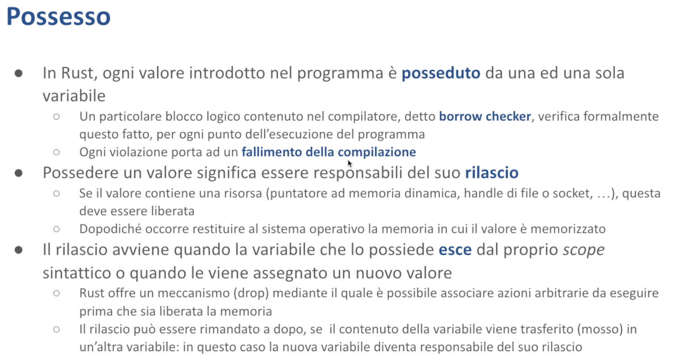

# Possesso - Malnati 8-9 <!-- omit in toc -->

# Indice <!-- omit in toc -->
- [1. Introduzione](#1-introduzione)
  - [1.1 Esempio](#11-esempio)
- [2. Movimento](#2-movimento)
  - [2.1 Esempi](#21-esempi)
- [3.1 Copy](#31-copy)
  - [3.1 Esempio](#31-esempio)
- [4. Clone](#4-clone)
  - [4.1 Esempio](#41-esempio)
  - [4.2 Confronto con C e C++](#42-confronto-con-c-e-c)
- [5. Riferimenti: simple pointer e fat pointer](#5-riferimenti-simple-pointer-e-fat-pointer)
- [6. Tempo di vita dei riferimenti](#6-tempo-di-vita-dei-riferimenti)
  - [6.1 Esempi](#61-esempi)
- [7. Possesso - Riassunto regole](#7-possesso---riassunto-regole)
- [8. Slice](#8-slice)
- [9. Vantaggi introdotti dal Possesso](#9-vantaggi-introdotti-dal-possesso)
- [10. Riferimenti](#10-riferimenti)

# 1. Introduzione

Ogni volta che in Rust noi creiamo un valore questo valore è **posseduto** da una e una sola variabile. 
Ciò che è posseduto è il valore: *la variabile può possederlo.* 

C'è una parte del compilatore molto importante che si chiama ***borrow checker*** che verifica formalmente che nel programma che noi abbiamo scritto effettivamente ogni valore sia posseduto da una sola variabile, e nel momento in cui risulta che un valore non è posseduto provvede a rilasciarlo e nel momento in cui verifica che invece c'è un tentativo di far possedere lo stesso valore a due variabili si ribella e impedisce la compilazione. 

Questo rende la compilazione di un programma Rust più difficile ma ci obbliga a scriverlo giusto ed è la garanzia del fatto che i programmi scritti in Rust funzionano e non riservano problemi dopo.

*Cosa significa possedere un valore?* 
Significa sostanzialmente essere responsabili del suo rilascio, ovvero di garantire che quando quel valore lì non servirà più non solo la memoria in cui il valore è contenuto viene correttamente restituita al sistema operativo, comunque si sia originata (se sullo stack contraendo lo stack, se sullo heap liberando l’heap con l'opportuna funzione di rilascio) ma anche che i dati contenuti all'interno di quella struttura, se hanno delle dipendenze (se sono cioè oggetto di qualche tipo), vengano correttamente rilasciati. 

Questo significa, ad esempio, che se io all'interno del mio valore contengo la handle di un file che è stato aperto, ecco: devo notificare al sistema operativo che quel file lì in ogni caso lo voglio chiudere e non mi serve più.

*Quando avviene il rilascio?* 
Normalmente il rilascio avviene nel momento in cui la variabile che lo possiede **esce dal proprio scope sintattico** — noi sappiamo che una variabile comincia a esistere nella riga in cui la dichiariamo, `let var = *qualcosa*;`, e cessa di esistere quando arriviamo al chiusa graffa corrispondente, quindi l'ho dichiarata all'interno di un blocco che quindi era stata aperta una qualche graffa poco prima, e quella variabile è accessibile fino a raggiungere il chiusa graffa.

Questa è la vita normale di una variabile, quindi che inizia il possesso nel momento in cui viene dichiarata e termina il proprio possesso nel momento in cui raggiunge il fine vita, ma possono succedere cose, perché il valore che è memorizzato nella mia variabile **può essere ceduto** a qualcun altro. 

Se io ho dichiarato la variabile `v1`, che conteneva qualcosa, da qualche parte potrei scrivere `let v2 = v1`, mentre `v1` è ancora in vita. 

Negli altri linguaggi `v2 = v1` significa “*copia il valore di v1 dentro v2*” e poi finisce lì. 
In Rust invece significa “*copia il valore di v1 in v2, e da questo momento cessa di considerare v1 come responsabile del valore*”, quindi chi si dovrà occupare del suo rilascio non è più v1 ma è v2!

>💡 **Copy**
>
>Abbiamo visto che ci sono alcune eccezioni a questa regola: per alcuni tipi semplici, come ad esempio i numeri, `let v2 = v1;` originerebbe una variabile **indipendente** da `v1`, che continuerebbe a possedere il suo valore.

Le assegnazioni di fatto in Rust corrispondono a **movimento**, ovvero c'è una cessione non solo del dato così com'è — `v1` esiste in un qualche punto della mia memoria ad un certo indirizzo, la variabile `v2` esiste in un altro punto della memoria al proprio indirizzo, e i dati dall'indirizzo 1 vengono copiati nell'indirizzo 2 per la dimensione necessaria (quindi se quello lì era un valore che occupava 10 byte vengono copiati 10 byte), dopodiché responsabile del rilascio diventa il destinatario, il mittente l'ha perso. 

Perso vuol dire che non è più lecito neanche andare a leggere che cosa c'è scritto dentro. 
Per il compilatore è come se la variabile `v1`, dopo che è stato eseguito `v2 = v1` è come se `v1` non fosse più inizializzata, non ha più un valore lecito. 
Se `v1` era mutabile sarà possibile assegnargli un nuovo valore, e va bene: questo nuovo `v1` possederà questo nuovo valore e avrà un altro pezzo di storia, ma il valore originale l'ha ceduto a `v2`. 

Questa cessione si attua certamente nei momenti espliciti in cui io faccio `v2 = v1`, ma si attua parimenti quando io uso `v1` come argomento di una funzione. 
Quindi se io chiamo la funzione `f` passandogli `v1`, succede che la variabile `v1` viene trasferita nel primo parametro della funzione `f` (o nell'ennesimo parametro la funzione `f`, a secondo di come è stata dichiarata), e quel parametro lì diventa possessore del valore. 
La variabile `v1` a questo punto non ce l'ha più: ha perduto diritti e doveri — ha perduto il diritto di accesso e ha perduto il dovere del rilascio. 

*A chi sono stati stati a chi sono stati trasferiti diritti e doveri?* 
Al destinatario, nel caso dell'invocazione a funzione dunque il parametro della funzione.

Vediamo un esempio.

## 1.1 Esempio

Creo un vettore `v` sullo stack.

Un vettore può essere creato in tanti modi — un modo per crearlo è usare la funzione costruttrice `Vec::new()`, che mi prepara un vettore completamente vuoto, o in alternativa posso usare `Vec::with_capacity()`, che mi crea un vettore che è sempre vuoto ma ha già preallocato un buffer sullo heap di una certa dimensione. 

In questo caso io gli chiedo preparare un vettore che abbia già fin dall'inizio uno spazio per contenere quattro cose, e quindi sullo stack mi compare la variabile `v` che dentro di sé contiene 24 byte: i primi 8 puntano ad un blocco sullo heap (grande 4 unità), il secondo pezzo di 8 byte contiene la dimensione del blocco puntato sullo heap (4), e il terzo elemento mi dice quanti di questi slot sono occupati.

>💡 **`Vec::with_capacity(n)`**
>
>Quando scriviamo `let mut vec = Vec::with_capacity(n);`, dobbiamo sapere il tipo dei dati che verranno inseriti nel Vec. Il tipo viene esplicitamente scritto (scrivendo `let mut vec: Vec<i32> = Vec::with_capacity(n);`), oppure dedotto dal compilatore.
Nell’esempio sopra il tipo viene immediatamente dedotto quando scriviamo `v.push(i)`, ed essendo `i` un i32 (tendenzialmente), a run time verrà fatto spazio per 4 i32 sullo heap.
>
>Se avessimo creato il Vec tramite `Vec::new()`, una volta arrivati alla prima istruzione `v.push(i)`, sarebbe stato allocato solo lo spazio per un i32 sullo heap, per poi far crescere questo spazio durante il for.

Dopo aver creato questo inizia un ciclo che faccio durare 5, a ogni iterazione del ciclo inserisco un numero nel mio vettore.

A un certo punto cercherò di inserire 5, ma il 5 in quel vettore non ci starebbe più, quindi il vettore alloca un nuovo spazio nello heap grande il doppio di quello che aveva prima (quindi se prima aveva 4 adesso si prende uno spazio da 8), e nei primi 4 slot ci copia i 4 slot che aveva prima e nel quinto ci piazza il valore che gli sto mettendo. 

Dopodiché raggiungo la fine del for e stampo il contenuto del vettore, questa stampa mi fa vedere normalmente 12345 perché nel vettore in questo momento questo è presente. 
Quindi finché la variabile `v` è in scope, siccome io non l'ho trasferita e non ho fatto niente di stravagante, lei è responsabile del rilascio.

*Quando arrivo al chiusa graffa cosa succede?* 
La variabile `v` deve essere eliminata, ma siccome la variabile `v` al suo interno conteneva delle risorse (ovvero puntava al blocco presente sullo heap), questa eliminazione passa attraverso dapprima il rilascio delle sue risorse, quindi viene invocato il metodo `drop()` sulla variabile v, che provvede a restituire al sistema operativo il blocco che possedeva; dopodiché lo stack si contrae e mi ritrovo in questa situazione in slide dove la memoria è pulita — ho raggiunto la fine della mia funzione e ho rilasciato tutto quello che aveva — `v` possedeva un blocco sullo heap, e giunto alla fine della sua vita l’ha rilasciato. 

# 2. Movimento

Il possesso da parte di una variabile del relativo valore inizia all'atto della sua inizializzazione, quindi nel momento in cui ho scritto `let v = Vec::with_capacity(4)`, in quel momento `v` comincia a possedere il suo valore. 

Nel momento in cui io dovessi copiare il mio `v` dentro un `v1`, il possesso si trasferisce. 
Se ad una variabile mutabile è assegnato un nuovo valore, e quindi se `v` fosse mutabile e io facessi il contrario, cioè dicessi `v = v1`, il valore che possedevo prima di prendermi quello nuovo di `v1` viene rilasciato.

>💡 **Nota**
>
>Alcuni tipi di dato hanno un obbligo particolare: sono quelli che implementano il tratto `Drop`. 
Altri sono più semplici, e queste cose avvengono lo stesso ma il compilatore si accorge che sono semplificabili e quindi le salta, ma di per sé avviene per tutto — anche con gli interi avverrebbe così, ma semplicemente l'intero dice *“ah benissimo, tu avevi la variabile `i` che conteneva 5, adesso ci sto mettendo 7. Dovrei rilasciare quel 5, ma siccome il 5 come tipo non implementa il tratto* `Drop` *posso non fare niente”* perché il fatto che il tipo i32 (o quello che sia) non implementa il tratto `Drop` vuol dire che dietro quel valore lì non c'è un significato particolare, se quello invece fosse sempre 5 ma inteso come **file descriptor** (cioè un numero che mi ha concesso il sistema operativo per indicare una risorsa che sta nel kernel che è un file che ho aperto da qualche parte) allora pur essendo concettualmente sempre solo un numero quello è un numero che però ha una valenza per il sistema operativo, quindi non posso semplicemente dire che è perduto, devo prima dire al sistema operativo “*tu mi avevi dato sto 5 che rappresentava un file, ora non mi serve più, quindi sappi che quel file lì te lo puoi gestire per qualche altra cosa*”, quindi quello che conta è **che cosa significano quei valori**. ****
>
>Di conseguenza noi metteremo il file descriptor tendenzialmente dentro un oggetto che pur avendo le dimensioni di un intero sia qualificato non come `Int` ma come qualcosa di diverso che permette al sistema operativo di riconoscere che quello lì è un intero un po’ particolare.

Quindi nel momento in cui una variabile venga assegnata ad un'altra variabile, oppure venga passata come argomento una funzione, il suo contenuto viene mosso nella sua nuova destinazione. Mosso significa che i suoi bit vengono copiati.

Ma al di là del fatto che i suoi bit vengono copiati il compilatore si segna che la variabile `v1` ha perso i diritti e i doveri e li ha trasferiti su `v2`, quindi quando `v1` uscirà di scope non dovrà essere fatto nulla perché in questo momento è come se fosse non inizializzata — è come se dentro di lei non ci fosse nulla. 
Invece quando `v2` uscirà di scope bisognerà fare quelle azioni necessarie per rilasciare le cose e quindi pulire il pulibile. 

**Di fatto non è che lo stack si contragga in quel momento lì**: la mia variabile `v1`, che conteneva qualcosa, dal punto di vista dell'occupazione di memoria, dopo che ho fatto `v2 = v1`, esiste ancora — è lì al suo posto e starà al suo posto fin quando non arrivo al chiusa graffa, perché solo il chiusa graffa corrispondente lo stack si contrae. 
Però è inaccessibile! Se io cercassi di andarla a leggere il compilatore mi blocca dicendo *“guarda da questa linea in avanti non è più inizializzata”,* quindi eventuali accessi in lettura a quella variabile lì dopo che il movimento è avvenuto portano un errore di compilazione.

Eventuali viceversa accessi in scrittura, ammesso che la variabile fosse mutabile, andranno bene perché nel momento in cui io deposito nella mia variabile qualcosa di diverso la variabile diventa di nuovo possessore di un nuovo valore e quindi quest'altro valore lo gestirà fino a che ne ha bisogno (finché non lo cede o non arriva al fondo).

**Il movimento da un punto di vista pratico è semplicemente la copia bit a bit dell'originale**, quindi quando scrivo `v1 = v2`, prendo `v1` che ha una sua dimensione (nel caso del Vec sono 24 byte), e solo la parte dello stack viene copiata da una parte all'altra. 

Quello che c'è sullo heap non viene toccato: il mio vettore originale qui dentro possedeva un puntatore, un usize che vale 8 e un usize che vale 5. 
Nel momento in cui io scrivessi `v2 = v` in questo caso da qualche parte quello che succederebbe è che nel nuovo `v2` metterei nel primo campo lo stesso puntatore che c'è dentro `v`, nel secondo campo 8 e nel terzo campo metterei 5, cioè copia esattamente così com'è, e la parte sullo heap viene completamente ignorata, perché io ho solo spostato i pezzi sullo stack.

## 2.1 Esempi

Lo vediamo meglio qua con una stringa (le stringhe sono fatte come i vettori, quello che cambia è l'interpretazione delle sequenze). 
In questo caso crea una stringa `s1` — quello che succede è che `s1` viene creato come stringa e quindi contiene dentro di sé un puntatore sullo heap, che punta un blocco grande quanto il numero di byte contenuti nella `String` “hello”, la quale è fatta solo di caratteri ASCII e quindi stanno ciascuno in un byte, quindi quella cosa lì è fatta di un blocco di 5 byte i cui valori sono quelli corrispondenti a “hello” quindi `68656c6c6f` esadecimali. 

Quella è la stringa “hello”, quindi `s1` contiene un puntatore ad un blocco di 5 byte seguito da una sua **capacity** (5), seguito da una sua **size** (5). 

Poi scrivo `let s2 = s1`, quindi a questo punto introduco sullo stack una nuova variabile `s2`. Quant’è grande s2? È una `String` e quindi anche lei è grande 24 byte: 8 di puntatore, 8 di capacity e 8 di size. 

Nel puntatore ci metto lo stesso puntatore che c'era su `s1`, nella capacity ci metto la stessa capacity che c'era in `s1`, e nella size ci metto la stesso size di `s1`. 
Se in questo momento congelassi il mio processo e vado a fare l'inspect della memoria vedo che `s1` esiste benissimo sullo stack e punta alla stringa hello, vedo che `s2` esiste sullo stack e punta allo stesso blocco, quindi quel blocco lì in questo momento lo conoscono in due. 
Il compilatore lo sa benissimo e dice “*per me non è un problema, perché tanto io s1 non te lo faccio più toccare, è come se non ci fosse. Non mi dà fastidio e non c'è il rischio di doppio rilascio perché s1 è stata taggata come **mossa**, e di conseguenza ha perso l'obbligo del rilascio. Viceversa quell'obbligo se l'è guadagnato s2*”. 

Posso stampare `s2` e vedrò di nuovo stampato “hello” esattamente come prima.
Nel momento in cui raggiungessi il fondo delle cose `s2` verrebbe rilasciato.

Se invece dopo aver stampato `s2` provassi ad accedere ancora ad `s1` aggiungendo questa riga che qui è segnata in rosso barrata, il compilatore mi bloccherebbe perché dice “*guarda che tu alla riga 4 hai scritto s2 = s1, e quindi s1 adesso è come se fosse vuota quindi non la vai a leggere*”. 

Se invece io decommentassi la riga `s1 = "world".to_string();`, la riga che adesso è marcata in rosso diventerebbe perfettamente lecita perché dentro `s1`  (che in questo esempio è stata dichiarata mutabile) posso riassegnargli delle cose, e prenderebbe possesso di nuovo di qualcosa.

Questo è il principio del possesso: ***un valore è posseduto da una sola variabile***. 

Non è il contrario: non è che una variabile possiede un solo valore, questo succede in tutti i linguaggi — è chiaro che se la variabile è una, dentro c'è scritta una cosa sola, ma è il contrario che invece è significativo. 
**Il valore ha una sola variabile che la possiede** — non è così in quasi nessun altro linguaggio.

Quello che succederebbe se io cercassi di compilare il pezzo di prima senza decommentare la riga `s1 = "world".to_string();` sarebbe un errore di questo genere dice “*attenzione: tu avevi inizializzato s1 con “hello”, però quando vai a cercare di stamparmi s1.to_uppercase(), questa cosa non funziona più perché nel frattempo s1 ha perso quello che possedeva*”. 

`s1` alla riga 20 è stato trasferito dentro `s2`, quindi alla riga 23 `s1` non ha più niente dentro, e siccome `s1` è una stringa che non gode del tratto `Copy` quel movimento lì effettivamente la depaupera delle sue cose. 

*Cosa vuol dire che non gode del tratto* `Copy`*?* 
Spieghiamoci meglio.

# 3.1 Copy

Alcuni tipi, specialmente quelli numerici (quando quei numeri non hanno altro significato che un numero), hanno una particolare caratteristica: godono di un tratto che si chiama `Copy`.

Quel tratto lì ha una caratteristica: quando avviene un'assegnazione o avviene un passaggio di parametro viene effettuata sempre la copia bit-a-bit esattamente come prima, ma non c'è una perdita di diritto — **non ho perso il diritto di andarci a guardare dentro**. 

Non ho perso il diritto di andarci a guardare dentro perché in realtà il tratto `Copy`, che è mutuamente esclusivo col tratto `Drop`, **mi garantisce che non avevo doveri**. 
Il tratto `Drop` se lo implemento implica che ho un dovere, se ho il tratto `Copy` non posso avere il tratto `Drop` perché il compilatore mi blocca, non me lo lascia manco di dichiarare. 

Quindi quella lì è una variabile che non aveva dei doveri, e se non aveva dei doveri va benissimo fare delle copie perché non ci diamo fastidio. 

**È possibile perché il valore contenuto non è una risorsa che richiede ulteriori azioni di rilascio.** 

Ad esempio è un numero semplice che posso usare per fare le somme, le moltiplicazioni etc.. non è l'indice di un array, non è una cosa strana che richiede che altri ci facciano dei conti sopra, invece i file descriptor, ad esempio, che sono un'informazione che mi viene dal kernel che mi permette di stare allineato tra quella che è la mia immagine del kernel e quello che il kernel sa davvero, ecco quelle cose lì devono restare gestite bene. 
Io sul file descriptor non ci faccio le somme o le moltiplicazioni, lo prendo solo come identificativo univoco. 

Quindi **i tipi semplici e le loro combinazioni** (ad esempio le tuple di tipi semplici o gli array di tipi semplici) **sono automaticamente copiabili** e quindi questo mi garantisce che io posso accedere dopo un'assegnazione ancora all'originale. 

**Anche i riferimenti non mutabili sono copiabili**: se io ho preso un riferimento semplice `&T` e lo assegno ad un altro riferimento, entrambi restano visibili. 
L'unica faccenda è che nel momento in cui esiste un riferimento, il dato originale non è modificabile anche se era mutabile, perché la presenza del riferimento è un prestito e dice “*mentre l'hai prestato a qualcun altro quel dato lì non lo tocchi, perché non deve cambiargli sotto il naso”*. 
Se io un riferimento lo copio, allungo la durata del prestito, ovvero la durata del prestito diventa il massimo tra la durata della prima copia e la durata della seconda copia, quindi solo quando tutte le copie saranno finite e avranno esaurito la propria visibilità allora il dato tornerà ad essere modificabile. 

Quindi quando io avessi un tipo (come String o Vec) che non implementa `Copy`, nel momento in cui io cerco di riassegnare o di consumare il valore originale — ad esempio qui abbiamo `let s = String::from("hello");` , benissimo ho creato una stringa, e poi `let b = s + " world";` — di fatto quell’istruzione `s + “ world”` è la chiamata ad una funzione (anche se non lo vedo apparentemente in modo esplicito), la funzione `concat()` che unisce il contenuto di `s` con il contenuto di “ world”. 

Quindi `s` è stata passata come argomento alla funzione `concat()` di String, e di conseguenza `s` ha ceduto, ha mosso il suo contenuto dentro il parametro di `concat()` che l'ha usato per i fatti suoi. 
Dunque `s` non è più accessibile. 

Viceversa per i tipi che implementano il tratto `Copy` questa cosa non succede: `let i = 42` e poi `let j = i + 1;`  si può fare perché `i` inteso come numero semplice godeva del tratto copy perché non ha obblighi, quindi posso tranquillamente copiarlo dentro `j`: non ci sono doppi obblighi dell'uno e dell'altro, quindi quando `i` cesserà di esistere sparisce dallo stack per i fatti suoi, quando `j` finirà di esistere sparirà dallo stack per i fatti suoi, e non c'erano obblighi di rilascio. 

Quindi non si può verificare il doppio rilascio, non potendosi verificare il doppio rilascio va tutto bene. 
Questa è la ragione per cui `Copy` e `Drop` sono mutuamente esclusivi: per risolvere il problema del doppio rilascio che invece affligge il C e C++. 

## 3.1 Esempio

Con `let string2 = string1`  trasferisco tutto quello che c'era dentro `string1` in `string2`, quindi adesso ho due puntatori di fatto che vanno allo stesso blocco sull'heap, ma la prima terna è **inaccessibile** e non ha nessun obbligo, quindi per il compilatore `string1` è come se fosse vuota — non mi genererà assolutamente nessuna chiamata a `drop()`, non fa nulla. 

Se io cerco di accedere a `string1` vengo bloccato, invece subito dopo c'è `let num1 = 3`, e `let num2 = num 1`, e in questo caso invece `num2` contiene un altro 3 indipendente da `num1` — non si danno fastidio, posso decidere che (ammesso che sia mutabile) `num1` lo faccio diventare qualcos'altro, posso leggerli entrambi e non si impicciano perché i numeri sono ***copiabili***.

# 4. Clone

Il movimento piace perché spesso quando ho le stringhe, i vettori etc.. posso avere delle cose molto grosse allocate — io posso trovarmi ad avere un vettore con 100.000 elementi tranquillamente. 
Io posso tranquillamente copiare `v1 = v2` sapendo che quello che sposto sono 24 byte, i tre puntatori, quindi va bene.

Però chiaramente ho un unico buffer che transita dal possessore 1 al possessore 2. 
In certe situazioni invece io ho bisogno di creare due buffer disgiunti, perchè io l'originale non me lo voglio perdere, quindi in quel caso lì non posso fare `v1 = v2` perché se facessi così, sì `v2` avrebbe il buffer ma `v1` non ce l'avrebbe più.
Io vorrei avere una copia completa delle due cose. 

Questo tipo di operazione in Rust si chiama **clonazione**, è fattibile a condizione che il tipo implementi il tratto `Clone` — il tratto `Clone` è un tratto molto semplice: dispone dell’unico metodo `clone()`, che provvede a generare una copia in profondità di tutto quello che c'è dentro l'originale, quindi io non solo ho sullo stack un nuovo vettore con i suoi 24 byte ma ho sullo heap un nuovo blocco grande quanto era grande il blocco originale e che contiene una copia completa del tutto. 

Clonare è un’operazione costosa ma è sotto il controllo del programmatore che sceglie quando applicarla, e *come* applicarla. 
Nel momento in cui definite le vostre strutture dati siete liberi di scegliervi qual è l’algoritmo più adeguato per effettuare le copie in profondità, implementando il tratto Clone e il corrispondente metodo `.clone()`. 

Viceversa le assegnazioni che sottendono un movimento o una copia a seconda del caso voi non le potete governare perché è il compilatore che genera il codice, e il codice che viene generato è una `memcpy` dall’indirizzo della variabile di partenza verso l’indirizzo della variabile di destinazione per una quantità di byte pari al size del tipo — quindi se quel tipo lì è un tipo che ha come size 30 byte lui copia 30 byte sapendo che va bene così e che non c’è bisogno di fare altro.

Il tratto **`Clone` è implicato dal tratto `Copy`** — cioè un tipo per poter implementare `Copy` deve anche implementare `Clone`.
Il tratto `Copy` è mutuamente esclusivo a `Drop`, mentre `Clone` no. 
Infatti un `Vec` è clonabile ed è anche droppable, viceversa un numero non è droppable, ma è copiabile ed è anche clonabile (di fatto se voi prendete `let x = 1` e scrivete `let x2 = x.clone()` ottenete un altro 1 paro paro — è inutile ma si può fare).

Questo è una sottolineatura che trova una sua giustificazione nel fatto che il C++ invece si comporta molto diversamente. 
Nel C++ il programmatore è responsabile di definire per i tipi che si crea per i fatti propri **l’operatore di copia**: cosa succede quando scrivo `a = b`. 

Se a e b hanno come tipo il tipo t1 di qualche genere io dovrò definire nel tipo t1 il comportamento del costruttore di copia e dovrò anche definire il comportamento dell’operatore di assegnazione, e i due (che sono distinti tra di loro) devono però essere congruenti. 

Questo mette nel programmatore una responsabilità grossa, perché deve farle bene le cose, e il linguaggio non ti aiuta: se tu definisci il costruttore di copia che faccia certe cose e l’operatore di assegnazione che ne fa di diverse puoi trovarti in una situazione molto brutta in cui certe volte il tuo programma fa in un modo e certe volte in un altro e non sai perché. 
Non solo, ma tutte le volte che assegni — e questo succede tantissimo ad esempio usando l’std::string del C++ — tu stai in realtà clonando ma non lo capisci, non è evidente. 
Siccome quando scrivi `s1 = s2` in C++ tu stai allocando un nuovo buffer e stai copiandotele, e se quelle due stringhe erano grosse stai muovendo un mucchio di cose, ma magari tu non avevi intenzione di fare quella faccenda lì. 

Rust mette in ordine tutto questo e stabilisce una netta distinzione: quando segni uguale oppure passi come parametro tu stai facendo un **movimento**, un’operazione superficiale che dice semplicemente “*io trasferisco il possesso dall’uno all’altro, l’originale ha perso le cose*”, invece quando hai veramente bisogno di duplicare i valori lo chiedi esplicitamente.

Rust ti obbliga a capire cosa stai facendo: quando copi lo puoi fare solo se quel dato è elementare; puoi clonare prendendoti la responsabilità del fatto che la clonazione è potenzialmente un’operazione lenta.

Dunque le assegnazioni sono prevalentemente assegnazioni per movimento, quindi costano poco e quelle che non sono per movimento costano comunque poco perché la definizione è che in realtà movimento e copia da un punto di vista del runtime hanno lo stesso costo: la copia di fatto di n byte, dove n è noto a priori perchè dipende dal tipo di partenza e non dalla dimensione delle sue aggiunte (sullo heap). 

## 4.1 Esempio

Qui vediamo un esempio di clonazione. 

`let s2 = s1.clone();` → quello che succede è che `s2` esiste sullo stack, ha un nuovo puntatore che punta ad un buffer differente da quello di `s1`, e i due buffer al momento hanno la stessa lunghezza e lo stesso contenuto.

Siccome `s1` era mutabile decido di aggiungere al fondo un punto esclamativo, ma non ho capacità residua! Allora rialloco un altro buffer un po’ più grande: prima avevo un buffer da 2, ne facciamo uno da 4. 
Quindi `s1` adesso si trova ad avere dentro di sé un buffer da 4, con due spazi vuoti e quindi diventa possibile inserire l’esclamativo. 
Al termine di questa operazione `s1` ha una capacity di 4 e un size di 3.

## 4.2 Confronto con C e C++

Questo ci serve per mettere un po in prospettiva le scelte che sono fatte.

In C il concetto di movimento non esiste, esiste solo il concetto di copia — quindi quello che succede è che quando voi assegnate la variabile 1 alla variabile 2 viene fatta una copia della variabile così com’è. 

In C++ invece esiste il concetto di movimento — quando voi definite un tipo custom (tipicamente una classe) avete la possibilità di (a condizione che usiate il C++ dallo standard 2011 a seguire) associare al tipo anche ***un*** ***costruttore di movimento*** ***e un operatore di assegnazione per movimento***.

Quindi definite un tipo, gli spiegate qual è il suo costruttore, qual è il suo distruttore, poi definite il costruttore di copia (cosa fare quando io partendo da zero creo una nuova istanza che deve essere una copia di un altro oggetto dello stesso tipo), l’operatore di assegnazione che dice “*io avevo già un valore precedentemente, tu adesso mi stai chiedendo di sovrascriverlo con quest’altro. Che faccio?*” — devo prima sbarazzarmi del valore vecchio, e quindi è un pezzo di responsabilità simile al distruttore, e poi ci metto quello nuovo.

Allora *l’operatore di assegnazione* si distingue dal *costruttore di copia* perché il costruttore di copia crea dal nuovo, non c’è niente da buttare via! 
L’operatore di assegnazione invece riscrive sul vecchio, c’è qualcosa prima da liberare e poi ci metto il nuovo. 

Dopodiché il C++ moderno ci dice “oltre a costruttore, distruttore, operatore di copia, operatore di assegnazione puoi anche definirti il ***costruttore di movimento*** e l’***operatore di assegnazione*** ***per movimento***” e che fanno questi qua? 
Sottraggono il contenuto dell’originale e lo piazzano nella destinazione, quindi si pigliano i pezzi e se li mettono dentro ma hanno la responsabilità di riempire la sorgente da dove hanno attinto con dei placeholder, in modo tale che la distruzione del pezzo da cui hanno attinto non faccia casino (di nuovo grande responsabilità sul programmatore che deve fare le cose congruenti). 

In più il C++ pur dando la possibilità di avere l’idea di movimento, di suo la applica in pochissimi casi e richiede invece al programmatore in modo esplicito di dire *“qui voglio muovere”,* e lo fa invocando una funzione che si chiama `std::move` che serve proprio a invocare il movimento. 

Quindi per default il C++ adotta il concetto di copia, e in alcuni casi ti lascia scegliere di mettere il movimento, ma tu come programmatore hai la responsabilità di implementarlo correttamente — c’è una famosa regola (la regola dei 5) che dice che se implementi uno qualunque tra distruttore, costruttore di copia, costruttore di momento, operatore di assegnazione per copia, operatore di assegnazione per movimento, devi implementare anche tutti gli altri quattro, e devi farlo in modo coerente — un gran casino! 
Quindi il debugging anche di una semplice classe in C++ è complicato, richiede un approccio estremamente metodico da parte del programmatore che deve avere molto chiaro nella testa che ha tutta quella responsabilità sulle spalle.

Allora l’avere introdotto il concetto di movimento in C++ nasce proprio dall’esigenza di ricercare una ottimizzazione nel codice, di raggiungere un livello di efficienza più elevata perché io posso scegliere (laddove non ho bisogno un duplicato) di *riusare* delle parti, ma siccome è l’eccezione e non la regola, bisogna che il programmatore scelga lui quando farlo.

Rust adotta il contrario, dice “*per me la regola è il movimento, la copia è un’eccezione. Io la faccio in automatico là dove son tranquillo che non ci sono rischi: è stato implementato il tratto Copy, che è implementabile solo se non c’è Drop, e il fatto che non ci sia Drop vuol dire non ci sono risorse da rilasciare, quindi sono tranquillo. Oppure la faccio perché me lo chiede un esplicito `.clone()`*" 

Perché la copia davvero è l’eccezione: non abbiamo sempre bisogno di copiare le cose, nella maggior parte dei casi ci basta guardarci dentro, non ci serve *farne un altro*. 

# 5. Riferimenti: simple pointer e fat pointer

Dopodichè, in alcune situazioni io ho bisogno di poter accedere a un dato e guardarci dentro senza prenderne il possesso. 
O se ho bisogno anche di modificarlo posso chiedere di farlo senza però aver la responsabilità di doverlo rilasciare. 

Per permettere questo genere di cose Rust introduce il concetto di **riferimento**. 
Il riferimento non è nient’altro che un modo per avere accesso in lettura o in scrittura (se ho un riferimento mutabile) a un dato che non sto possedendo. 
Questo accesso non ce l’ho per sempre, ce l’ho *temporaneamente*, è un prestito. 

*Io chiedo in prestito questa cosa, la uso per il mio scopo, e la restituisco.* 

*Come avviene la restituzione?* 
Nel momento in cui cesso di usarla il compilatore tiene traccia di questa cosa e capisce automaticamente *“qui hai cessato di usarla, quindi il prestito è finito”.* 
Il modulo che governa tutta la faccenda del possesso si chiama ***borrow checker***.

Il riferimento è un puntatore in sola lettura a un blocco che appartiene a un’altra variabile, quindi se mi viene dato un riferimento io posso dereferenziarlo (cioè metterci l’asterisco davanti e andarci a guardare dentro per leggere quello che c’è scritto), non ho obblighi se non quello di piantarla lì a un certo punto in modo che il possessore possa poi ritornare in pieno possesso delle sue cose. 

Un riferimento permette di accedere ad un valore senza trasferirne la proprietà, chiaramente questo pone dei vincoli: bisogna che il riferimento esista solo nel momento in cui la variabile che possiede il valore di cui ho ottenuto il riferimento esista anch’essa. 
Il compilatore si prende la briga di verificare questa cosa qua, e se io cerco di accedere ad un riferimento in un momento in cui la variabile originale (da cui quel riferimento nasce) ha cessato di esistere, mi blocca. 

Nella slide vediamo un esempio: ho creato una tupla che contiene un paio di numeri, 1 e 0, e poi `let reference = &point`, se io scrivessi `let reference = point` ne farei a tutti gli effetti una copia (in questo momento point sono due float a 64 bit, e quindi è grande 128 bit, cioè 16 byte), reference di suo sono solo 8 Byte. 
Se avessi scritto `let reference = point` avrei fatto una copia, questo perché quella tupla lì è fatta di numeri, le tuple fatte di numeri sono copiabili perché i numeri sono copiabili e quindi lì si concludeva velocemente. 
Qui invece ho preso l’indirizzo, e posso usarlo per accedere ai singoli campi: in questo caso nella print line successiva stampo reference.0 e reference.1 — quando uso l’annotazione punto con un reference, il compilatore automaticamente va a guardare cosa c’è prima del punto e se è un reference ci mette un asterisco, se il tipo che gli viene è ancora un reference ci mette un secondo asterisco e così via quanti ne servono fino ad accedere al livello giusto. Questa è l’auto dereferenziazione. 
Questo avviene solo con l’annotazione punto, se io non avessi l’annotazione punto questa cosa non succede: ci devo mettere l’asterisco esplicito. 

Un riferimento prende a prestito l’indirizzo in cui esiste il valore. 
Fino che il riferimento è accessibile non posso modificare il valore anche se la variabile originaria che lo possiede è mutabile, questo perché il prestito presuppone che “*io te l’ho data in lettura, tu la puoi leggere, io anche la posso leggere ma nessuno la cambia”*, perché se no c’è il rischio di prendere delle decisioni sbagliate. 

Nel momento in cui io creo un prestito e ottengo un reference, quel reference lo posso facilmente copiare, perché i reference in lettura sono copiabili tranquillamente — sto copiando un indirizzo, è un numero.
La presenza di più riferimenti a un valore originale aumenta la durata del prestito, che rimane in essere fino a che c’è almeno un riferimento presente. 
Quando anche l’ultimo riferimento sarà andato via allora la variabile tornerà in pieno possesso del suo valore. 

Il compilatore si fa garante di questo: il fatto che in un dato momento ci siano `n` riferimenti esistenti al valore originale è un’informazione che il compilatore tiene al suo interno, e che non si vede a runtime, è un puro dato di compilazione, fa parte delle strutture dati che il compilatore si tiene per garantire la correttezza del nostro programma, quindi non c’è costo a runtime. 
C’è un po’ più di costo in compilazione, motivo per cui compilare i file Rust è più lento rispetto a C++. 

A partire da una variabile che possiede un valore, se la variabile è mutabile potete creare un riferimento mutabile. 
Se la variabile non era mutabile non potete creare un riferimento mutabile. 
Il riferimento mutabile esiste **in modo univoco**, è mutuamente esclusivo: mentre c’è un riferimento mutabile a quella variabile lì non ce ne può essere un altro, e non ci può essere neanche un riferimento immutabile, e la variabile originale non è accessibile né in lettura né in scrittura. 

*Come funziona un metodo che prende e modifica una stringa?* 
Ad esempio io potrei avere il metodo `.push()` che abbiamo visto prima che mi aggiunge un carattere al fondo della stringa. Quando scrivo `s.push()` quello che succede è che il metodo push è dichiarato ad agire su un riferimento mutabile della stringa `s`, quindi bisogna che `s` sia mutabile e quello che succede è che il metodo push riceve un riferimento mutabile, quindi viene preso temporaneamente il riferimento, il metodo push vedrà l’indirizzo di `s` e potrà andare dentro e farci delle cose, quindi per esempio chiedere di riallocare e fare cose del genere, e quando il metodo push finisce, quel riferimento lì è restituito ed `s` torna in pieno possesso delle facoltà, solo che sarà diversa dall’originale.

In questo modo i metodi possono decidere come operano: 

- possono operare prendendo il **totale possesso** del dato, che quindi dopo l’invocazione del metodo non è più accessibile
- possono prendere accesso in **sola lettura** al dato, e quindi mentre loro girano quel dato lì è ancora leggibile e possono succedere altre cose
- possono prendere accesso con un **riferimento mutabile** e quindi mentre il metodo è in esecuzione il dato originale è inaccessibile

Qui vediamo questa cosa rappresentata, abbiamo una variabile `s` mutabile e faccio aperta graffa — inizia un blocco. 
Quindi c’è uno scopo sintattico ridotto. Dentro questo blocco dichiaro `m` come `&mut s` — cosa c’è dentro `m`? 
C’è un puntatore che punta alla struttura `s`, e che può modificarne il contenuto, quindi `m` di per sé è un puntatore. 
Può essere mosso, quindi lo posso trasferire da un’altra parte. 
Posso dire *“non mi serve più mutabile, lo riduco a riferimento semplice”,* sto riducendomi il privilegio d’accesso — questo è lecito, nel momento in cui mi riduco il privilegio d’accesso permetto di farne delle copie. 
Quello che non posso fare è copiarlo, perché di riferimenti mutabili ce ne può essere uno solo. 
E non posso neanche accedere ad `s` in alcun modo. 

Quando giungo al chiusa graffa `m` evapora perché ha finito il suo ciclo di vita, ed `s` diventa nuovamente accessibile. 

Il comportamento di Rust è molto *smart*: di fatto l’inaccessibilità di `s` non si estende necessariamente fino al chiusa graffa. Rust fa attenzione e vede che se l’ultima volta che avete usato `m` è a metà del pezzo viola da lì in avanti dice “*m non lo stai più usando, quindi anche se di fatto esiste ancora io ti ridò l’accesso ad s*”, quindi la durata effettiva del vincolo corrisponde all’uso effettivo.

Al contrario quando mi procuro un riferimento semplice, r è sempre un riferimento, è sempre un puntatore, non è cambiato niente rispetto a prima se non nei poteri.
Lo posso duplicare senza problemi, ne posso fare quante copie voglio, chiaramente queste copie andranno ad aumentare il tempo in cui s è immodificabile (a parte il fatto che in questo momento s è tutta immodificabile perché l’abbiamo creata non mutabile, ma avessimo scritto `let mut s = String::from"hello");` non potrei farci delle cose). 
Quello che non posso fare è fare l’upgrade a riferimento mutabile, perché mentre esiste un riferimento semplice so che potrebbero esisterne anche degli altri. 
Non posso sicuramente muovere s: è leggibile ma non posso cederla a nessun altro, perché se la cedessi a qualcun altro il suo indirizzo non sarebbe più valido (o meglio l’indirizzo sarebbe quello lì ma i dati contenuti al suo interno non rifletterebbero più la vera natura delle cose).

A differenza di quello che succede in C e in C++ i riferimenti non sono di dimensione costante: **dipende da cosa puntano**. 
Ci sono riferimenti che sono grandi usize e ci sono riferimenti che sono grandi 2*usize — ovvero possono essere, con un’architettura a 64 bit, grandi 64 bit oppure 128. 

*Perchè?*
Tutte le volte in cui il compilatore sa esattamente qual è la dimensione del tipo a cui puntano, il riferimento è implementato come un puntatore semplice, e quindi è grande usize, cioè su un’architettura 64 bit è grande 64 bit. 
Quando invece il compilatore non sa la dimensione del dato puntato, perchè questa è nota solo a runtime, come ad esempio nel caso degli slice, un reference è un ***fat pointer***, ovvero è grande 2*usize (64 + 64) — il primo è il puntatore all’inizio dello slice, il secondo è la dimensione dello slice. 

È quello che succede ad esempio con `&str`. 
Gli oggetti `&str` sono grandi 128 bit perchè contengono nel primo pezzo il puntatore al buffer dove i caratteri sono memorizzati, e nel secondo pezzo la dimensione di quel buffer. 

Oppure potrebbe trattarsi di un ***doppio puntatore***, questo succede con i dati di **tipi dinamici**, che implementano il polimorfismo. 
Si riconoscono perchè sono marcati `&dyn`.

Qui vediamo i primi due tipi. 

Se abbiamo la variabile `i` di tipo i32, che vale 10 e poi ci prepariamo il riferimento, il compilatore sa che quello lì è un riferimento ad un i32. 
Un i32 è grande 4 byte, perfetto, non ho bisogno di nient’altro, mi basta il puntatore, e quindi il suo riferimento è un *simple pointer*. 

Nell’altro esempio a destra abbiamo un array dove ci sono tre interi: mi creo `r2` come slice, ovvero non solo come riferimento all’array, che di per sé saprei essere un array di tre interi, ma in questo caso `r2` l’ho ribattezzato come slice di interi, quindi r2 è un riferimento *a un pezzo*, che in questo caso coincide con l’intero array, ma avrei potuto scrivere `&a[..]`, oppure `&a[0..1]`, oppure `&a[..2]`, etc.. quindi avrei la possibilità di prenderne solo delle parti. 
Di conseguenza il riferimento diventa un ***fat pointer***, e quindi il compilatore alloca 128 bit: i primi 64 puntano all’array, i secondi 64 mi dicono di quanti pezzi è fatto quell’array, in questo caso tre pezzi. 

La terza situazione possibile è quando io ho un dato che ha un certo tipo, ad esempio `f` è di tipo `File` . 
In questo caso io voglio dire “*vai a vedere se nella cartella corrente c’è già un file che si chiama test.txt, se no crealo. Se c’è già lo fai diventare lungo zero, come se lo creassi da nuovo*”, su questo file io potrò poi leggere e scrivere.

Di per sé `f` è un oggetto `File` che è un oggetto più o meno complicato che ha dentro di sé tanti campi x per i fatti suoi. 
L’oggetto `File` ha un certo numero di capacità che sono rappresentate dai tratti che implementa. Uno dei tratti che implementa è il tratto `Write` — il tratto `Write` è la capacità di fare 4 operazioni, oltre al drop: `write()` , `write_vectored()`, `is_write_vectored()` e `flush()`. Da notare che non c’è solo l’oggetto `File` che implementa questo tratto, anche `Vec` implementa lo stesso tratto. 

Ovviamente in modi diversi: quando invoco `write()` sul file, e gli passo un contenuto, quello che succede è che il file sul disco si allunga e mette al suo interno l’insieme dei byte che gli ho passato come parametro di `write()`, appendendoli. 
Se chiamassi su un `Vec` il metodo `write()` anche lì nel vector i bytes li appenderei ma chiaramente l’operazione è molto diversa: nel caso del vector starebbero solo in memoria, nel caso del file vanno proprio sul disco, quindi l’insieme di istruzioni che poi vado a eseguire sono totalmente diverse, ma in ogni caso io farei sempre `write()`. 

Quando ho un blocco come quello scritto in giallo nella slide `let f = File::create("test.txt");` e poi `let r3: &dyn Write = &f;`, con quest’ultima istruzione io prendo `f` non come un riferimento a file (quindi volendo sapere che quello lì è un file), ma mi limito a considerare il fatto che `f` è *una cosa scrivibile*. 

Avrei potuto inizializzare lo stesso `r3`, di tipo `&dyn Write`, prendendo il riferimento di un `Vec` di byte, avrei acquisito le stesse possibilità, chiaramente con dei metodi totalmente diversi.

*Come farebbe il compilatore a questo punto a capire qual è la vera funzione da chiamare? Devo fare la write() sul File o devo fare la write() sul Vec?*
In queste situazioni il reference diventa un ***double pointer***: nella prima metà punta alla **struttura** vera e propria (in questo caso alla struttura file), nell’altro punta a una tabellina che si chiama ***vtable*** che contiene per il tratto in questione — `r3` è dichiarato come tratto dinamico `Write` — l’insieme dei metodi che il tratto `Write` mi mette a disposizione, mi dice *“ok tu vuoi guardare f non come file ma genericamente come cosa scrivibile”.* 

*Come è fatta una cosa scrivibile?*
Una cosa scrivibile è una cosa che ha un metodo `drop()`, un metodo `write()`, un metodo `write_vectored()`, un metodo `is_write_vectored()` e un metodo `flush()`. 
Sapendo questa cosa, lui mi compila quella tabellina mettendomi le giuste funzioni da chiamare, quindi nell’esempio r3 siccome bisogna associare a una graffia forse un titolo è utilizzato r3 che tipo è?

>💡 **Ma il tratto è un tipo?**
>
>I **tratti** in Rust non sono “tipi” nel senso diretto del termine, ma rappresentano un **insieme di comportamenti** (cioè metodi e/o funzioni associate) che un tipo può implementare. Un tratto definisce un contratto che i tipi devono soddisfare per essere considerati come “aderenti” a quel tratto.
>
>Possiamo paragonare i tratti alle interfacce di Java o di altri linguaggi orientati agli oggetti. In Java, un’interfaccia è un tipo astratto che può essere implementato da una classe concreta. Similmente, un tratto in Rust definisce un contratto che un tipo (ad esempio, una struct o un enum) può implementare. In Rust, si usa la parola chiave impl per implementare i tratti.
>
>Anche se i tratti non sono “tipi” in sé, Rust consente di utilizzarli come **trait object** tramite puntatori come `&dyn Trait` o `Box<dyn Trait>`. Questo permette di trattare i tipi che implementano un tratto come se fossero dello stesso tipo astratto. Ad esempio:
>
>
>
>L’idea che un tratto rappresenti “un pezzo di tipo” è utile per capire che un tratto definisce un insieme di capacità che un tipo può avere. Però, dire che una variabile è “di tipo Runnable” (per esempio) significa, tecnicamente, che la variabile è un **trait object**, non il tratto stesso.
>
>Un tratto da solo non può essere “istanziato”. Può essere implementato da tipi concreti, e puoi usare trait object per lavorare con tipi che lo implementano in modo polimorfico.

Quindi quello che succede è che i riferimenti così costruiti, che riconosciamo perché sono dichiarati di tipo `&dyn`, la parola *dynamic* è messa lì a posta per aiutare il programmatore a capire che quello che sta costruendo è un **double pointer**, gli costa il doppio ma probabilmente gli va bene che gli costi il doppio perché implementato in questo modo il programmatore può scrivere del codice che funziona sia con i file che con i vettori e quindi gli può star bene. 

In seguito approfondiremo l’argomento dei tratti e andremo a imparare tutto quello che serve a riguardo, per il momento ci serve prendere in considerazione il fatto che Rust si è dato delle libertà nel scegliere delle cose, ha detto “*non è che tutti i riferimenti debbono essere uguali, tutti i riferimenti devono darmi le informazioni di cui ho bisogno. Laddove le informazioni che io posso capire staticamente dal programma mi bastano, il riferimento è un puntatore semplice. Laddove invece non mi bastano, il riferimento è un fat pointer (costituito da puntatore e size). Laddove non mi bastano ancora il riferimento è un double pointer (costituito da un puntatore alla struttura e un puntatore ad una vtable)*”. 

Notate che la vtable contiene al suo interno, oltre che il puntatore e i vari metodi (e quindi al codice effettivo che dovrà essere invocato nelle varie situazioni), anche due dati che sono ***size*** e ***alignment***. 
Quel size lì permette di dire *“ok, ho capito che il primo pezzo del mio fat pointer punta al blocco dove c’è scritto hidden implementation, ma quel blocco lì quanto è grande?”,* e allora guardando la vtable vedo size.
L’alignment mi dice se l’oggetto puntato può cominciare ad un indirizzo qualsiasi o può iniziare solo un indirizzo pari, o può iniziare ad un indirizzo che sia multiplo di 4, che sia multiplo di 8 e così via.. questo perché permette poi, dovendo manipolare questo oggetto, di manipolarlo in un modo che sia congruente con i vincoli con cui quel blocco di memoria è stato acquisito. 

>💡 **La vtable**
>
>Il double pointer punta a una vtable che è allocata **una volta sola**, quindi se io avessi 25 file diversi di cui mi faccio dare il reference, la prima parte del puntatore punta in 25 zone diverse dello heap, la seconda parte del puntatore punta alla stessa vtable perché di tipo `File` ce n’è uno solo: c’è una sola versione del metodo `drop()` per `File`, una sola versione del metodo `write_vectored()` etc...
>
>La vtable non sta nello heap, sta nella zona statica del programma (dove vivono ad esempio le stringhe costanti) perché il compilatore la prealloca. È una zona che esiste da sempre: nel momento in cui io ho definito che esiste un tratto il compilatore si crea sta tabellina che rappresenta l’insieme delle funzioni che quel tratto in particolare sta dichiarando.

>⚠️ **Fat pointer e double pointer**
>
>In questa spiegazione abbiamo fatto distinzione tra **fat pointer** e **double pointer** per maggiore chiarezza, ma in seguito parleremo di fat pointer indistintamente, indicando un riferimento che è, in generale, grande 2*usize.
>
>In un caso, il secondo usize indica un valore (la size del dato puntato), nell’altro caso invece indica un puntatore alla vtable.

# 6. Tempo di vita dei riferimenti

I riferimenti hanno un tempo di vita. 
Questo, di nuovo, è quello che il borrow checker mette a disposizione per garantirmi che non scriviamo stupidaggini — ovvero, il borrow checker garantisce che io utilizzo un certo riferimento solo in quell’intervallo di tempo in cui il dato originale (da cui quel riferimento nasce) esiste, per evitare di creare dei **dangling pointer**. 

Perché se io accedessi al riferimento *dopo* che il dato originale è stato distrutto avrei fatto un dangling pointer. 

Il concetto di tempo di vita — ***lifetime*** — è una di quelle cose che sfugge, perché non c’è nessun linguaggio che lo manifesta. 
Il fatto che non venga manifestato sintatticamente nei linguaggi, non vuol dire che non ci sia un tempo di vita. 
In C, il tempo di vita è assolutamente una cosa essenziale: se io scrivo `int *ptr = malloc(sizeof(int))` in quel momento il mio `ptr` comincia ad esistere. 
Se 5 righe dopo scrivo `free(ptr)`, `ptr` lì cessa di esistere, cioè `ptr` come variabile c’è ancora ma il numero puntato da `ptr` non mi indica più un blocco su cui posso fare delle cose, ha cessato di esistere — chiamando `free` l’ho restituito al sistema operativo. 

Il problema è che `ptr` come variabile di per sé potrebbe stare ancora in giro, il C non mi protegge su questo, tocca a me programmatore dire *“caspita, ma io qui ho appena fatto la free, non devo più andare a leggere o fare* `ptr*`*,* `ptr->` *o cose del genere”.*
Ma siccome tocca a me come programmatore, è difficile andare a cercare tutte le strade che un programma fa, mentre il borrow checker invece non si stufa e le fa tutte, e va a verificare che non ci sia nel nostro programma nessuna strada che mette a rischio questa situazione, ovvero per la quale possa esistere la possibilità che ad un certo punto la variabile originale ha cessato di esistere, ma il riferimento c’è ancora.

Nella maggior parte delle situazioni quindi il tempo di vita è un qualcosa che possiamo immaginare, ma non viene materializzato. 
Rust a differenza degli altri linguaggi ci dà la possibilità sintattica di **materializzare il tempo di vita**, ovvero quando introduciamo un reference (mutabile o non mutabile) abbiamo la possibilità di *decorarlo con un nome simbolico*: io posso scrivere, se ho la variabile `i` che contiene 42, `let r = &i`, oppure posso dire `let r = &’a i`.  

Cosa succede quando scrivo `&'*qualcosa*`?
Apice si legge ***tic***, e poi di solito si usa un nome, una lettera singola, ad esempio `&’a` .
Sto semplicemente dicendo che ho deciso di dare un nome a quel tempo di vita. 
Non sto dicendo quanto è lungo, non sto dicendo quale sia, gli ho dato solo un nome. 

*Perchè gli ho dato un nome?
P*erchè in certi casi può servire esprimere il fatto che ho bisogno che due riferimenti abbiano lo stesso tempo di vita, e quindi posso dire che quel pezzo di codice vale nell’intersezione dei loro tempi di vita, oppure che vale nell’unione dei loro tempi di vita, oppure posso dire che io da due riferimenti diversi ricavo un risultato che è ancora un riferimento, il cui tempo di vita è legato in qualche modo all’uno piuttosto che all’altro, per questo motivo esiste la possibilità di materializzarlo, cioè di dargli un nome, ma è solo un nome. 

C’è un’eccezione importante: il nome che dò al tempo di vita è quello che voglio (quindi una stringa, una lettera etc..), l’eccezione è **static**. 
`&’static` il compilatore lo interpreta in un modo molto forte: vuol dire “*questa cosa qua esiste dall’inizio alla fine*”. 
Questa cosa è importante sulle stringhe: quando voi scrivete “*hello world*”, scritto così questa stringa finisce nella zona statica del vostro programma, la crea il compilatore, ci sarà dall’inizio fino alla fine. 
Quella stringa lì non è solo una `&str`, è una `&’static str`: siete sicuri che quella stringa lì ha durata quanto l’intero vostro programma. 

In alcune situazioni voi volete forzare una struttura dati, ad esempio un vettore o una mappa, a contenere delle `&’static str`, in quel caso ci potrete mettere solo delle costanti e non potrete mettere dei valori di altro tipo perché quegli altri avranno un tempo di vita differente.

Indipendentemente dal fatto che noi li materializziamo o meno i tempi di vita vengono verificati dal compilatore. 
Per il compilatore i tempi di vita non sono nient’altro che l’intervallo di righe in cui è lecito accedere a quel particolare riferimento.

Quando noi creiamo una funzione che prende come parametro dei riferimenti dotati di un tempo di vita materializzato, il compilatore andrà a verificare che quando noi chiamiamo quella funzione gli passiamo dei parametri che vivano in modo compatibile con i vincoli che abbiamo espresso nella funzione stessa. 

Il primo criterio che il compilatore adotta è controllare che un riferimento esista soltanto nell’intervallo di tempo in cui esiste il valore da cui è stato tratto. 
Se io ho creato il riferimento `r` preso dalla stringa `s`, `r` può esistere solo fin tanto che `s` esiste, quando `s` non c’è più `r` non deve esserci, perché se ci fosse sarebbe un dangling pointer. 

Il tempo di vita è un aiuto enorme — voi lo vivrete inizialmente come un impiccio perchè è difficile, perchè non ha corrispondenza negli altri linguaggi.
Le variabili hanno un tempo di vita e ragionarci sopra è essenziale. 
Il fatto che il compilatore per noi faccia questo mestiere è davvero un enorme servizio perchè è quello che ci garantisce che non facciamo schifezze. 
Nel momento in cui ci troviamo a dover salvare dei riferimenti dentro delle strutture più complesse o passare dei riferimenti alle funzioni, i tempi di vita hanno bisogno di essere esplicitati. 

Questa cosa è un pezzo un po’ meno ovvio, perchè cosa succede?
Immaginate che abbia una bottiglia di latte che scade domani, se io con quel latte lì ci faccio il budino, ho trasferito la scadenza del latte nel budino. 
Anche il budino adesso scade domani. 

Quindi se io ho una variabile di tipo riferimento che scade perchè prende dati da qualche parte che tra un po’ evaporano, se questa variabile la metto dentro qualcosa di più grande anche questa cosa più grande riceve il limite, si riduce in possibilità di utilizzo.

Questo è una delle conseguenze poco ovvie dei tempi di vita, ma assolutamente vere. 
E quindi io sono obbligato a dire che se io in quella struttura lì metto un dato che dura `a` tutta quella struttura dura al massimo `a`, perchè se durasse di più potenzialmente leggerebbe schifezze — c’è una propagazione del tempo di vita. 
E se chiamo la funzione che consuma il dato `'a` e lo usa per darmi il suo risultato, il suo risultato ha tempo di vita `'a`, al massimo. 
E se faccio la funzione che consuma il dato `'a'b`, il suo risultato ha tempo di vita che è il più breve tra i due.

Vediamo un esempio.

## 6.1 Esempi

Qui partiamo con una variabile `r`, l’abbiamo solo introdotta senza dargli un valore iniziale o un tipo. 
Il compilatore ce lo lascia fare, quello che sa è che r comincia lì alla riga 2 e finirà all’ultima chiusa graffa.

Poi apriamo un blocco, e introduciamo `x = 1`, il compilatore prepara un `x` e ci mette dentro un 1, e poi subito dopo diciamo `r = &x`, quindi il compilatore ha capito che `r` è un reference non mutabile, e punta alla variabile `x`. 
Poi chiudiamo la graffa, chiudendo la graffa `x` cessa di esistere, lo stack si accorcia. Però `r` rimane, e punta dove?
Nel vuoto, in una zona che non è più nostra.

Sotto ci chiediamo “*è vero che *r vale 1?*”.
Perigliosissimo! 
Tra l’altro già solo facendo quell’assert, questa è una macro, che viene espansa e diventa una chiamata funzione eccetera, quel pezzo di stack si sporca, non c’è più scritto 1, chissà cosa c’è.

Qua il compilatore ci aiuta perché dice “*x non vive abbastanza, sta roba non la puoi fare. Alla riga 9 hai preso in prestito x, alla riga 11 x è morto ma alla riga 12, 13 tu sei andato ancora a leggere r che puntava ad x, ma non puoi leggere r che punta un x che non c’è più*”.

Questo è l’intervallo in cui x esiste: dalla riga in cui compare fino alla chiusa graffa.

Questo è l’intervallo di valità di r: da dove viene inizializzata fino al suo ultimo uso. 

Ma non si sovrappongono! 
E quindi c’è almeno un punto, la riga in fondo, in cui c’è una **violazione**, e quindi il compilatore mi dice *“no, non si può fare”.* 
Il compilatore C non ve lo dice..

Queste regole valgono anche quando si crea un riferimento a una parte di struttura dati più grande. 

Se ad esempio io ho un Vec `v` che contiene [1, 2, 3], e prendo il riferimento al secondo elemento con `let r = &v[1];`, che cosa succede? Che `r` può esistere solo finché esiste `v`!
Dal fatto che ho preso un riferimento ad un suo pezzettino, `v` diventa immutabile per tutto il tempo in cui esiste `r`, perché se io `v` lo lasciassi mutabile quello che potrebbe succedere è che magari qualcuno me lo fa crescere e lui si sposta, ha bisogno di riallocare quindi quel puntatore che avevo preso non punta più o al contrario qualcuno potrebbe invocare `clear()` sul mio vettore e me lo cancella tutto, e di nuovo mi trovo un puntatore dangling o qualunque altra cosa.

Quindi se memorizzo dei riferimenti in una struttura (come l’esempio di prima del latte e del budino), la struttura diventa a scadenza: scade non appena scade il più giovane, il più prossimo di tutti gli elementi. 
E quindi io devo garantire che quella struttura lì esiste al massimo quanto esiste il più vicino degli elementi a scadenza.

Il compilatore Rust è molto preciso nelle sue indicazioni e si sforza di dirci con chiarezza che cosa succede, ovviamente noi dobbiamo capirne un po’: nell’esempio di questa slide io sto cercando di inserire in questo vettore un riferimento, e quindi quello lì diventa un vettore di riferimenti, ad un dato che però appena arrivo alla chiusa graffa prima della println non c’è più, e quindi subito sotto quando cercherò di stampare cosa c’è nel vettore farei casino perché mi troverei in quel vettore lì un dato che non esiste più e quindi il compilatore non me lo fa fare. 

# 7. Possesso - Riassunto regole

Cerchiamo di mettere un minimo di ordine in tutta questa serie di regole. 

**Ogni valore ha uno e un solo possessore**.

*Chi è il possessore del valore?* 
È una variabile singola, ad esempio `v = 27`, oppure il campo di una struttura, se io ho preparato un vettore, e ho inserito nel vettore un certo dato il vettore diventa proprietario di quel dato, e quando il vettore sparirà quel dato lì sarà rilasciato. 
A sua volta il vettore potrà essere posseduto da qualcun altro, che sarà posseduto da qualcuno etc.. quindi il possesso è una catena lunga. 

**A un dato valore può esistere al più un solo riferimento mutabile**. 
**Oppure, a un dato valore possono esistere molti riferimenti immutabili**, ma fin tanto che esiste almeno un riferimento immutabile il dato originale (quindi il possessore del valore) può solo leggerlo e non può cambiarlo. 
Viceversa mentre esiste l’unico riferimento mutabile l’originale non ci può proprio accedere, questo significa che se io prendo un riferimento mutabile al terzo elemento di un `Vec`, io quel `Vec` non lo leggo proprio, perchè se lo potessi leggere leggerei anche il terzo elemento, però non devo e quindi propago il lock — che è un lock che esiste solo nella testa del compilatore, nelle sue strutture dati e nei suoi ragionamenti — per tutto il tempo in cui ho quel riferimento lì.

**Tutti i riferimenti devono avere una durata di vita inferiore a quella del valore a cui fanno riferimento da cui sono stati tratti**, ****perchè altrimenti diventano dei dangling pointer. 

**I riferimenti sono implementati come *puntatori semplici* quando il dato ha dimensione nota,** **come *puntatori fat*** (cioè come puntatori fatti di un puntatore e di un size) **quando il dato ha dimensione del dato nota solo a run time,** **e come *doppi puntatori* quando il dato è conosciuto non per il suo tipo ma solo per un tratto che implementa** e quindi il dato è un dato che è conosciuto non per il suo tipo ma solo per un tratto che implementa e in questo caso il doppio puntatore rappresenta il puntatore al dato vero e proprio e il puntatore alla vtable che mi descrive il tratto per il quale io lo conosco.

# 8. Slice

Le slice le abbiamo già incontrate, sono fette — possiamo definire uno slice come ***viste***, un po’ come nei database. 

*Cos’è una vista in un database?*
È un modo di guardare un gruppo di record senza avere accesso alla tabella stessa. 
Una vista può essere una selezione, per cui vedete non tutta la tabella ma solo righe che hanno certe caratteristiche. 
Su una vista leggete ma non scrivete. 

Tipicamente noi creiamo delle slice, le possiamo creare a partire da dati replicati, quindi si possono fare delle slice su degli array, si possono fare delle slice su dei vettori. 
Tipicamente la slice è un blocco di elementi consecutivi la cui dimensione è nota a run time. 

Le slice sono rappresentate da dei fat pointer: il primo elemento punta all’inizio della mia slice, il secondo mi dice quanti elementi ho considerato all’interno. 
**In quanto riferimento la slice non possiede**, quindi ho creato la slice a partire da un `Vec`, ad esempio, ed è il `Vec` a possedere il dato. 
La slice lo guarda, mi da l’accesso, mi dà la possibilità di manipolarlo in alcune situazioni. 

Posso creare una slice partendo da un array, ma anche partendo da vari tipi di contenitori: posso creare slice a partire da dei `Vec`, dei `Box`, da delle `String` e così via. 

Gli `&str` sono delle slice, sono slice di byte. 
Un `&str` è una sequenza consecutiva di n byte, quegli n byte in generale corrispondono a m caratteri con m ≤ n, dato che alcuni caratteri sono rappresentati dal singolo byte, alcuni da 2, alcuni da 3, e alcuni da 4, quindi il fatto che io abbia una slice di 8 byte non mi dice niente di per sé su quanti caratteri ci sono: ce ne possono essere da 2 a 8. 

Qui vediamo una rappresentazione: se io ho un `Vec` posso trasformarlo in un ***boxed slice***, cosa succede? 
Il `Vec` evapora, lo consumo, ma tengo di buono puntatore e lunghezza, e butto via la capacity, e mi rimane il boxed slice associato, e quindi ho creato un `Box` che rappresenta un array degli n elementi che sono attualmente presenti. 

Al contrario, se io ho un boxed slice, posso trasformarlo e farlo diventare un vector, e quindi gli dò la possibilità di aggiungere elementi. 
Quando lo faccio diventare un vector, di solito il vector ha capacity pari alla len perché a priori non avrei una preallocazione.

Notate che `Vec` e `String` sono parenti stretti, nel senso che da un punto di vista della disposizione in memoria una `String` è esattamente un `Vec` di byte. 
Dal punto di vista dei metodi sono molto diversi: la `String` ha metodi per essere messa in maiuscolo, in minuscolo, per essere divisa in token e cose del genere, cose che il vector non ha. Il fatto che la `String` sia un `Vec` di byte, non vuol dire che (come dicevamo prima) ha tanti caratteri quanti sono i byte presenti, per via della codifica utf-8. 

Parimenti, una `&str` ha lo stesso layout di memoria di uno slice di byte, semplicemente è un puntatore ad una sequenza di n byte all’interno. 

# 9. Vantaggi introdotti dal Possesso

*Perché tutto questo è importante?* 
Il problema di gestire in modo affidabile la memoria è una cosa che affligge i programmatori da quando sono stati introdotti i linguaggi ad alto livello. 
Con l’introduzione dei linguaggi di alto livello si è messo nelle mani del programmatore la capacità di creare delle cose più complicate, ma al tempo stesso ha sollevato l’enorme problema dell’allocazione della memoria e della corretta gestione. 

Nel 1992-1993 nel tentativo di dare una risposta a questo enorme problema è nato Java, che poi è stato copiato per questa idea iniziale da n altri linguaggi. 
Java introduce il concetto di *garbage collector*, dicendo “*Ok, gestire la memoria è un grosso problema. Il programmatore non ce la fa, quindi ci penso io. Mi prendo la briga di rilasciarla, quindi io — garbage collector — sono il possessore della memoria. Quando la rilascio? La rilascio nel momento in cui vedo che più nessuno la sta usando, e quando la rilascio posso compattarla. Ma se la compatto cambio gli indirizzi: una cosa che prima stava qua la sposto un po’ più in là perché devo compattare. Ma questo mi spacca tutto, quindi devo fare in modo che quando compatto la memoria nulla si muova*”, e qui nasce il problema della garbage collection.

La garbage collection in Java blocca l’esecuzione. 
Se sto facendo un gestionale per le paghe e stipendi non è mica un problema, ogni tanto questa cosa qua si ferma e fa la sua garbage collection e poi riparte.
Se sto facendo un sistema real time invece è un grosso problema, perché nel frattempo la fisica va avanti e se ad esempio sto cadendo continuo a cadere etc..

Secondo problema: la maggior parte dei linguaggi che gestiscono l’idea di puntatore lo fanno alla luce del fatto che il puntatore permette di rappresentare delle cose che i tipi elementari non permettono, in particolare permette di condividere l’accesso a strutture o a rappresentare dei grafi o cose del genere che altrimenti sarebbe molto complicato. 
Solo che la maggior parte dei programmi che usano i puntatori è afflitta da quello che si chiama il “***billion dollar error***”, cioè il fatto che è stato introdotto il concetto di **null pointer**. 
Concetto di null pointer che è problematico in quanto spesso ce lo si dimentica: Java non risolve il problema del null pointer, tanto che rimane il grosso casino delle ***null pointer exceptions***. 

Per questo motivo sono stati introdotti altri linguaggi come Kotlin che duplicano il sistema dei tipi e ti dicono “*c’è tutta una gerarchia di tipi non annullabili, non possono mai diventare null, e parimenti c’è una gerarchia di tipi annullabili: possono diventare null. Tocca a te caro programmatore dirmi che cosa è l’uno e cosa è l’altro, se un tipo non è annullabile io compilatore vigilo che tu non ci metti mai null dentro, se un tipo è annullabile io compilatore vigilo che tu acceda soltanto con un null safe expression, e non faccia casino la cosa*”. 
La cosa si migliora un po’, ma non è ancora perfetta. 

In Rust il problema è molto più facile: non esiste il riferimento nullo, non può essere scritto e dunque non c’è possibilità che venga fuori, per lo meno fin tanto che usiamo la parte safe di Rust. 

Poiché il borrow checker vigila sull’assegnazione dei riferimenti e sugli intervalli temporali in cui sono usati non c’è il rischio di accedere in modo illecito a dei contenuti, non c’è il dangling pointer né tantomeno ho problemi di ***segment violation*** dovuti al fatto che vado a leggere a casa di qualcun altro, cioè in zone che non sono mappate nel mio spazio di indirizzamento. 

Inoltre poiché tutte le strutture hanno una dimensione nota a compile time, oppure hanno un esplicito campo che permette a runtime di validarle, risolvo a priori i problemi dei ***buffer overflow*** che affliggono disperatamente i programmi scritti in C e C++, e sono la sorgente della maggior parte degli attacchi hacker, perché se io ho una slice che ha lunghezza ignota a compile time, a runtime lì c’è scritto quanto è grande, e se provo ad andare oltre i suoi limiti (quindi a prendere un indice più piccolo di zero, questo sarebbe facile comunque, o un indice più grande della sua vera dimensione) il programma mi blocca, va in panico. 
Andare in panico vuol dire che lui si ferma, ma è un comportamento deterministico! 
Non mi lascia andare avanti e poi bene se viene, perché è proprio su questa cosa qua che gli hacker lavorano per forzare i sistemi. 

Quindi non possono verificarsi né buffer overflow né buffer underflow, cioè cerco di andare prima del loro inizio. 
Analogamente gli iteratori presenti in Rust, che mi consentono di esplorare delle strutture dati complesse come un vettore, una mappa o cose del genere per prendere gli elementi presenti al loro interno, non possono mai eccedere il limite e quindi non c’è il rischio di andare oltre il fondo o prima dell’inizio, e questo mi dà garanzia di correttezza.

Tutte le variabili per default sono immutabili e tocca a noi come programmatori scegliere quali rendere mutabili. 
La scelta fatta così è ispirata al *principio del minimo privilegio*: se una cosa non ti serve, non ce l’hai.  Se proprio hai bisogno lo chiedi, e siccome lo devi chiedere, allora chiedere è sempre un po’ faticoso e questo vuol dire che dovrai spenderci qualche secondo per pensarci — e questo è buono per valutare meglio cosa stai facendo. 

Notate che il principio di possesso si vede esplicitamente in modo evidente con la gestione della memoria per cui non ho doppio rilascio, non ho dangling pointer, non ho null pointer exception, non ho tutta questa serie di cose qua… ma vale anche con tutte le altre risorse: se posseggo un file lo debbo rilasciare, se posseggo un socket lo debbo chiudere, se posseggo un mutex altrettanto e così via. 
Quindi vale nei confronti di qualunque tipo di risorsa io possa aver preso in prestito dal sistema operativo — il concetto di prestito è molto ampio. 

*Un’applicazione Rust è automaticamente sicura rispetto agli attacchi degli hacker?* 
In parte si, in parte no.

Certamente io ho una buona parte del mio programma, che è quella che qui è rappresentata da quel blocco disegnato in giallo nella zona in basso a sinistra di questa slide, che è data da tutte quelle garanzie che nascono a compile time — per cui a compile time so che non posso accedere a una variabile se non è stata inizializzata, so che posso usare solo riferimenti validi, so che non ci sono dangling pointer e non ci sono le corse critiche tra thread differenti, quando cioè due thread cercano di leggere o di scrivere insieme una certa variabile.
Questi li abbiamo esclusi a priori *by design*.

In più Rust mi aggiunge una serie di safety che nascono a run time, ad esempio se tu accedi a uno slice che a compile time ha dimensione ignota io non posso a priori vedere se tu stai uscendo o meno dai limiti, ma a run time stai tranquillo che ti becco, perché me lo sono scritto quanto è grande e di volta in volta lo vado a verificare. 
Questo mi garantisce che non ho rischi sullo stack, quindi non posso andare in overflow perché mi becca prima, posso essere tranquillo sui bound per cui gli slice non escono dai loro confini e su un insieme di cose posso fare dei controlli su alcune API unsafe. 

Detto questo, però, il mio programma consiste della parte verde che è quella in qualche modo controllata — è il cosiddetto ***safe Rust***, quella parte lì o a run time o a compile time è stata validata e sono sicuro che lì non ci sono errori — ma nel mio programma può essere presente qualche blocco unsafe, che dipende come è stato scritto, potrebbe essere soggetto ad attacco, devo scriverlo proprio bene. 
Se fa uso di librerie native in C e quelle sono tutte attaccabili, sono soggetto a vulnerabilità.

Dopodiché il mio programma fa uso del sistema operativo, che a sua volta è attaccabile e a sua volta il sistema operativo fa uso dell’hardware, che anche lui è attaccabile.

Quindi Rust è certamente un contesto dove la sicurezza è stata considerata in modo serio. 
La superficie di attacco è grande e quindi Rust difende se stesso, e tutto il resto bisogna difendersi. 
Allora va detto che i sistemi operativi crescono nel tempo e fanno tutto il possibile per difendersi a propria volta. 
Le librerie C che mediamente usiamo sono, nella maggior parte, librerie C di lunga data che hanno in qualche modo già dimostrato nel tempo la loro solidità, però il rischio esiste sempre. 
Se poi mettiamo dei blocchi unsafe, chiaramente dobbiamo prenderci la responsabilità di quello che facciamo con l’unsafe.

# 10. Riferimenti

