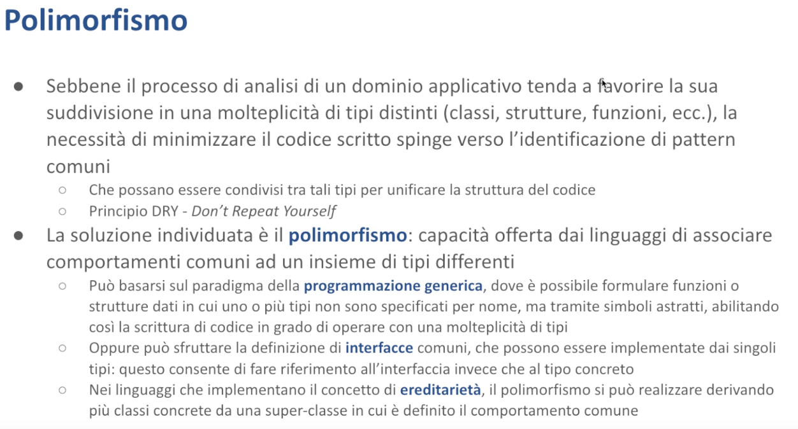

# Polimorfismo - Malnati 11-12 <!-- omit in toc -->

# Indice <!-- omit in toc -->
- [1. Introduzione al Polimorfismo](#1-introduzione-al-polimorfismo)
  - [1.1 Concetti Base](#11-concetti-base)
  - [1.2 Implementazione nei Linguaggi](#12-implementazione-nei-linguaggi)
- [2. Ereditarietà e Polimorfismo in C++](#2-ereditarietà-e-polimorfismo-in-c)
  - [2.1 Costi del Polimorfismo](#21-costi-del-polimorfismo)
  - [2.2 Metodi virtuali puri / funzioni virtuali astratte](#22-metodi-virtuali-puri--funzioni-virtuali-astratte)
- [3. Tratti in Rust](#3-tratti-in-rust)
  - [3.1 Concetto di Tratto](#31-concetto-di-tratto)
  - [3.2 Esempio](#32-esempio)
  - [3.3 VTable in Rust](#33-vtable-in-rust)
  - [3.4 Definire ed usare un tratto](#34-definire-ed-usare-un-tratto)
  - [3.5 Tipi Associati nei Tratti](#35-tipi-associati-nei-tratti)
  - [3.6 Implementazioni Default nei Tratti](#36-implementazioni-default-nei-tratti)
  - [3.7 Gerarchia dei Tratti](#37-gerarchia-dei-tratti)
  - [3.8 Come invochiamo un tratto?](#38-come-invochiamo-un-tratto)
  - [3.9 Tratti nella Libreria Standard](#39-tratti-nella-libreria-standard)
    - [3.9.1 Eq e PartialEq](#391-eq-e-partialeq)
    - [3.9.2 Ord e PartialOrd](#392-ord-e-partialord)
  - [3.10 Display e Debug](#310-display-e-debug)
    - [3.10.1 Esempio](#3101-esempio)
  - [3.11 Clone e Copy](#311-clone-e-copy)
  - [3.12 Drop](#312-drop)
  - [3.13 Index](#313-index)
  - [3.14 Deref](#314-deref)
    - [3.14.1 Esempio](#3141-esempio)
    - [3.14.2 Esempio](#3142-esempio)
  - [3.15 RangeBounds](#315-rangebounds)
  - [3.16 From](#316-from)
    - [3.16.1 Esempio](#3161-esempio)
  - [3.17 TryFrom e TryInto](#317-tryfrom-e-tryinto)
  - [3.18 Error](#318-error)
  - [3.19 La macro `derive`](#319-la-macro-derive)
- [4. Tipi generici](#4-tipi-generici)
    - [4.1 Complementarità dei Due Approcci](#41-complementarità-dei-due-approcci)
    - [4.2 Esempio](#42-esempio)
    - [4.3 Relazione tra Tratti e Tipi Generici](#43-relazione-tra-tratti-e-tipi-generici)
    - [4.4 Oggetti Tratto e Polimorfismo](#44-oggetti-tratto-e-polimorfismo)
    - [4.5 Compromessi e Ottimizzazioni](#45-compromessi-e-ottimizzazioni)

# 1. Introduzione al Polimorfismo

Questa lezione spazia su diversi concetti, alcuni dei quali probabilmente vi sono già noti, altri magari vi sono noti ma non li avete messi a fuoco con le parole giuste. Utilizzeremo alcuni termini che suonano strani, ma sono semplici per la verità. Vediamo di mettere insieme i vari problemi. 

Di per sé la lezione tratta del ***polimorfismo***, che si realizza concretamente con tecniche diverse. Nel caso specifico di Rust si realizza con un misto tra l'uso dei ***tratti*** e l'uso della ***programmazione generica***. Sono due termini che vi dicono poco, perché negli altri linguaggi di programmazione esiste in parte il concetto di programmazione generica, ma è implementato in un modo totalmente diverso. I tratti si chiamano interfacce e quindi questo mette un po' in difficoltà.

Tratti e programmazione generica sono due modi diversi di implementare il polimorfismo, non sono due modi alternativi. Spesso e volentieri ci sono tratti generici, oppure nella programmazione generica si usano i tratti come vincoli su cosa può essere reso generico. Quindi sono due cose molto intrecciate e parenti. Adesso cerchiamo di slegarle e di vedere pezzettino per pezzettino che cosa significhino.

## 1.1 Concetti Base



Di base, nel momento in cui noi ci troviamo di fronte a un problema, ad esempio dobbiamo realizzare un programma che copi tutte le mail presenti sul server e le sposti all'interno di tanti file in una qualche cartella, siamo portati a cominciare a entrare nel dominio del problema — in questo caso esempio il problema tratta di mail, mail che stanno su un server, quel server ha bisogno di un'autenticazione e così via...

Abbiamo una serie di concetti che dobbiamo fare entrare nel nostro programma e tendenzialmente noi utilizziamo tipi diversi per rappresentare questa entità del mondo con cui dobbiamo fare. Per cui ci viene abbastanza naturale creare una struttura dati che rappresenta il singolo **messaggio**, una struttura dati che rappresenta magari una **collezione di messaggi** come la *inbox*, una struttura dati che rappresenta le **credenziali** con le quali noi possiamo collegarci al server per poterci accedere, una struttura dati che rappresenta il **server** in quanto tale con il suo indirizzo e altre cose etc... 

Quindi la tendenza di base è una tendenza alla moltiplicazione degi enti, dei tipi. Questi tipi possono essere strutture, possono essere numerazioni, in alcuni casi sono funzioni. Nei linguaggi a oggetti spesso e volentieri questi diventano classi.

Spesso però nel fare questa operazione ci rendiamo conto che i vari tipi che abbiamo introdotto, pur rappresentando qualcosa di completamente diverso, perché un messaggio di posta elettronica non è una credenziale con la quale io accedo. Un messaggio ha i campi `from`, `to`, `date`, `body`, `subject`. Le credenziali hanno `user` e `password`, a volte qualcosa in più, magari c'è anche il codice one time che ho mandato sul cellulare o altre cose del genere.

Però magari hanno delle caratteristiche comuni. Entrambi per esempio devono essere trasformabili in un oggetto json per poterlo mandare in giro per il mondo in modo comodo. Entrambi al contrario devono poter essere leggibili da un oggetto json e questo oggetto json, che di fatto è una stringa, dovrà essere usato per riempire i campi del mio oggetto. Quindi anche se ho due entità molto diverse tra di loro, le credenziali e il messaggio, c'è un aspetto comune perché entrambi sono *serializzabili* e *deserializzabili* nel formato json. 

Ma potrei trovare altre caratteristiche che a volte hanno in comune cose molto diverse.

Chiaramente nessuno mi impedisce di dire, *“scrivo il codice per trasformare in json il mio messaggio e lo metto nella classe (o struct)* `EmailMessage`*, poi un codice molto simile, magari in certi aspetti potrebbe anche essere lo stesso, se sono abbastanza bravo nel renderlo parametrico, lo posso mettere anche nella classe o nella struct* `Credentials` *che mi rappresenta delle altre cose”*. 

Sì, si può fare, ma non è un'idea saggia.

Perché? Perché c'è un principio molto forte nella programmazione che si chiama **DRY**, che vuol dire "*don't repeat yourself*", evita di scrivere la stessa cosa in due posti diversi. Perché? Perché la probabilità che quella cosa cambi è alta, e se tu l'hai scritta in più posti devi cambiarla in tutti, e devi ricordarteli tutti — è un casino.

Per questo motivo spesso si adotta una tecnica che prende il nome di **polimorfismo**, ovvero offrire comportamenti *comuni* a cose che sono *eterogenee* tra di loro. Il concetto di polimorfismo l'avrete incontrato nella *programmazione a oggetti*, dove capita che grazie al meccanismo della **ereditarietà** uno possa dire *"sai che c'è? Io definisco questo comportamento comune in una **superclasse** e faccio ereditare le mie classi concrete da questa superclasse comune, cosicché lo scrivo una volta sola e automaticamente le mie due classi derivate ereditano, si trovano questo comportamento".*

L'idea che venti/trenta anni fa sembrava sagacissima, e quindi tutti dicevano *"bella la programmazione a oggetti, l'ereditarietà, grande idea"*, in realtà è un po' un casino, perché l'ereditarietà si porta dietro tutta una serie di altri vincoli, anche solo concettuali.

Mentre per alcuni versi funziona bene in alcune situazioni, ad esempio, un mondo che viene spesso utilizzato è quello della natura: abbiamo il concetto di *essere vivente —* gli esseri viventi respirano, mangiano, dormono, emettono suoni. 

Allora io modello la classe `EssereVivente` che ha questo comportamento base, poi derivo dagli esseri viventi gli animali, i vegetali, dagli animali tiro fuori i pesci rispetto ai mammiferi, rispetto a cosa, etc... 

Lì un po' funziona, perché? 
Perché il vincolo dell'ereditarietà è che una classe derivata **deve essere anche la classe superiore.** 
È abbastanza normale dire che un *pinguino* è un *uccello,* che a sua volta è un *animale*, che a sua volta è un *essere vivente*. E ci sta ragionevolmente in questa catena di situazioni, quindi dire che le proprietà di animale scendono naturalmente sul `Pinguino` che è una classe concreta.

Quando venissimo invece al nostro dominio, qual è la classe generale per cui le credenziali sono imparentate con un messaggio di posta elettronica? È un po' forzata la cosa, non è proprio ovvio dire che le credenziali sono serializzabili perché tutto il mondo è serializzabile. Va bene, però a questo punto di classi comuni ce ne possono essere tante ed è uno dei motivi che ha portato **Bjorn Strostrup**, l'inventore del C++, a immaginare nel C++ l'**ereditarietà multipla**.

Perché in fondo le credenziali possono essere imparentate con il messaggio di posta elettronica perché sono **serializzabili**, ma al contrario le credenziali possono essere imparentate con un'altra cosa perché sono **crittografate** e il messaggio di posta elettronica è imparentato con qualcos'altro perché, che ne so, ha gli *attachments*, che invece le credenziali non hanno, etc…

Quindi diventa un po' complicata sta faccenda qua e trovare delle classi comuni adatte è difficile.

## 1.2 Implementazione nei Linguaggi

La soluzione dell'**ereditarietà multipla**, che di nuovo l'idea del C++ nasce alla fine degli anni '80, inizio degli anni '90, dove tutto questo mondo era in fermento, si cercava di dargli un senso, ha fatto sì che ci si scontri facilmente con dei muri. Nel momento in cui ho due o più classi da cui eredito, vado in difficoltà perché posso trovarmi in situazioni in cui eredito da due classi diverse che però hanno una classe in comune e si crea una situazione brutta chiamata "*Diamond Death*" in cui ho del codice duplicato. Ho due metodi con lo stesso nome che mi arrivano per strade diverse, che potenzialmente sono stati arricchiti in modo diverso. Quale uso? Boh, disastro.

Per questo motivo, quando **Java** nasce nel '92-'93 sulle orme del C++, la scelta è stata quella dell'ereditarietà, ma specificamente dell'**ereditarietà singola**. Con una piccola ma importante sfumatura: oltre all'ereditarietà singola, c'è la possibilità di implementare più interfacce. In Java potete specificare che la vostra classe `extends something` e che `implements something`. 

Può implementare tutte le interfacce che volete, senza alcun problema.
*Perché?* 
Perché in fondo implementare un'**interfaccia** indica semplicemente prendersi un impegno. Io non sto ricevendo niente dall'interfaccia se non l'impegno a mettere a disposizione dei metodi che hanno un certo nome, certi parametri di ingresso e certi valori restituiti in uscita. Quindi io sto semplicemente dicendo che sono conforme a una sorta di *protocollo*, cioè a una convenzione generale per cui gli oggetti, istanza della mia classe, sicuramente mi offriranno il metodo X, Y e Z. Come è fatto il metodo X, Y e Z l'interfaccia non me lo dice. Toccherà a me dargli un senso opportuno.

Quindi mentre nella ereditarietà mi ritrovo nella situazione in cui prendo cose diverse concretamente, quindi non solo la garanzia che quel particolare metodo lo metto a disposizione, ma ricevo anche il codice che eventualmente posso **sovrascrivere**. E questo apre un altro grosso problema nell'implementazione del linguaggio: cosa vuol dire sovrascrivere un metodo? Come lo sovrascrivo e come gestisco questa sovrascrittura?

Mentre tutto questo ragionamento avveniva e veniva via via rifinito negli altri linguaggi che nel frattempo venivano anche introdotti, siamo alla fine degli anni '90 in cui nasce anche JavaScript, che segue una storia diversa sull'ereditarietà. Segue un'ereditarietà basata sul **template**, per cui voi instanziate classi a partire da un template e questo template potete arricchirlo etc… e quindi potete fare in modo che due oggetti, istanze della stessa classe, non hanno gli stessi metodi, perché nel frattempo il template è stato arricchito, dando origine ad altri mostri.

Mentre queste cose avvenivano, lo stesso era il periodo in cui anche in Python si cominciava a ragionare, mettiamo le classi, come le mettiamo, eccetera, Strostrup e Sochi, seguendo il filone del C++, cominciavano a maturare un'idea che era altrettanto interessante, che era quella della programmazione generica, che diceva che ci sono molte situazioni, ad esempio i contenitori, le liste, i vector, le mappe, e queste cose qua in generale, in cui l'algoritmo è abbastanza indipendente dal tipo di dato — una lista di numeri, una lista di stringhe, una lista di messaggi di post elettronica, sempre una lista è.

Le operazioni di inserisco, cancello, sostituisco, ordino, non è che fa differenza tanto sulla base di *che cosa c'è dentro la lista*. 
*Perché devo scrivere codice diverso?* 
Io potrei rappresentare la mia lista, l'algoritmo, l'insieme dei metodi che definiscono la lista, come operanti su un tipo T, che non ho bisogno di specificare fin dall'inizio.

Tutto al più posso chiedere che questo tipo T abbia delle caratteristiche, magari deve essere copiabile, perché se non lo posso copiare non riesco a metterlo dentro la lista. Magari deve essere confrontabile, perché devo poter sapere, nella lista spesso mi chiedo *"questo elemento è presente?"*, e allora se devo poter rispondere a una domanda è presente o è assente, devo avere un modo di fare dei confronti. Se ho bisogno di ordinarla la mia lista, quell'elemento lì non solo deve essere confrontabile, deve essere anche confrontabile per ordine, cioè devo poter dire se viene prima o dopo di un altro.

Queste sono un po' delle caratteristiche che quel tipo deve avere, ma tipi che hanno le caratteristiche di essere copiabili, di essere confrontabili per identità e confrontabili per ordine, ce n’è a valangate. 

E allora posso scrivere l'algoritmo, che agisce su un tipo che è “lista di T”, sapendo che la mia lista funzionerà con tanti tipi diversi e nasce l'idea della **programmazione generica**. 

Quest'idea qua ha preso un po' di tempo ad assumere una forma decente e ha avuto anche lei una biforcazione, così come la storia dell'ereditarietà si è biforcata varie volte (ereditarietà singola o ereditarietà multipla, ereditarietà sintattica con le interfacce o non sintattica, ereditarietà a template o ereditarietà basata su classe etc…), anche la programmazione generica ha avuto delle sue evoluzioni. 

Il C++ la introduce con un concetto di ***monomorfizzazione***, cioè scrivi la tua lista di T, ma quando la usi dovrai specificare un **tipo concreto**. Nel tuo programma avrai la lista di interi, la lista di stringhe, la lista di `EmailMessage` — non c'è problema! Quando specifichi cosa metti dentro la lista, io genero dalla forma generica dell'algoritmo il codice specifico per quel tipo. Per esempio, una lista di interi avrà record di 4 byte più il puntatore al next, una lista di stringhe avrà record di 24 byte più il puntatore al next, e così via per altre dimensioni. In questo modo posso generare il codice più adatto per ogni tipo concreto specifico. 

**E questa è la scelta fatta dal C++ che ritroviamo anche in Rust.** 

Per contro altri linguaggi fanno scelte completamente diverse. Java, Kotlin, JavaScript, Python e altri, in realtà partono dall'assunzione che la gerarchia di ereditarietà ha un *capostipite*, e la presenza di questo capostipite in realtà mi permette di scrivere, in caso di Java, "Object" — tutto deriva da `Object`. E allora la vera implementazione della classe `List` è in realtà una lista di `Object`, e voi in Java questo lo vedete bene perché una lista di `int` semplici non la fate, perché gli `int` sono un'eccezione in Java e non sono oggetti, ma sono *valori*. Potete fare la lista di `Integer` con la "i" maiuscola, che sono oggetti, ma la lista di int non si può fare. 

E quando in Java scrivete `List<T>` in realtà state semplicemente dicendo che in quella roba lì potete metterci delle restrizioni che il compilatore userà in fase di compilazione, ma alla fine il tipo verrà cancellato. L'oggetto `List` non sa che cosa ha dentro. Se voi andate dentro l'oggetto `List` e usate l’introspezione di Java (cioè il fatto che ogni oggetto Java ha un campo che si chiama `.class` che permette di accedere alla definizione della classe stessa, eccetera), la lista vi dice che è una `java.util.List`, ma non sa dirvi "list di che cosa”. Non lo può sapere, perché in Java si adotta una tecnica che si chiama ***Type Erasure*** — cancello il tipo: quello a run time è una lista di `Object`. 

In quanto `List<Object>`, lo posso fare perché in Java **tutto**, tranne i tipi elementari, deriva da oggetti. E quindi sicuramente qualunque cosa io gli metta, se non è un tipo elementare, è anche un oggetto, e dunque va bene. 

In C++ invece l'ereditarietà è possibile, ma non è obbligatoria. Quindi il Type Erasure non può funzionare. 

In Rust, invece, l'ereditarietà non c'è proprio. Abbiamo risolto il problema. 

Ma il polimorfismo sì, quello c’è. E allora vediamo di capire. Questo per darvi un po' un panorama storico di questa cosa, perché i concetti che noi oggi consideriamo più o meno scontati, non sono scontati. E non sono neanche necessariamente giusti. Cioè, il sapere un minimo dell'evoluzione dei linguaggi ci serve a capire che ad oggi, con l'esperienza che abbiamo fatto, avendo realizzato sistemi più o meno grandi, si è capito che certe cose più o meno possono andare — non è verità rivelata. Via via che si va verso sistemi più complessi, ci si rende conto che le astrazioni che oggi ci sembrano buone, non sono poi così buone. Hanno dei limiti. E questo spingerà la vostra generazione a inventare delle cose migliori. 

Per cui noi le impariamo, cerchiamo di capirle, cerchiamo di capire perché quelle che prima sembravano delle buone idee, poi così buone non erano, non erano proprio cattive. Perché in qualche modo funzionavano. Anche il C funziona. Non è che non funzioni. Però se devo realizzare un sistema molto grosso, devo pensare che mi costerà molto. E non è detto che sia così sostenibile. Per questo motivo cerchiamo delle rappresentazioni ulteriori. 


Allora, in C sintatticamente non c'è nessun supporto per il polimorfismo. Quindi se io ho due tipi che devono avere dei comportamenti comuni, il linguaggio in quanto linguaggio non mi dà di suo nessuna struttura sintattica che mi aiuti.
Devo scolpire tutto a mano. Si può fare, sì certo, qui vi ho messo un link, andatevelo a leggere, dove vi raccontano come si può approcciare il polimorfismo in C. 
S*poiler*: scrivendo un bel po' di cose. 

C++, trent'anni fa, parte con l'idea che l'ereditarietà può essere uno strumento a favore del meccanismo polimorfico. L'ereditarietà nasce con quest'idea: racchiudo nella classe base quel comportamento comune che le classi derivate devono avere. Così se lo trovano, tranquillamente, senza bisogno di fare grossi pasticci. C++, nell'affrontare questa cosa, dice *"guarda l'ereditarietà è possibile, addirittura è possibile l'ereditarietà multipla”*. 

Quindi io posso derivare dalla classe `Alfa` e anche dalla classe `Beta`. Dalla classe `Alfa` ricevo il metodo `m1`, `m2`, `m3`, dalla classe `Beta` ricevo il metodo `m4`, `m5`, `m6`. Benissimo. 
La classe `Alfa` mi rende parente di qualcun altro, che anche lui deriva da `Alfa`, la classe `Beta` mi rende parente di qualcun altro che anche lui deriva da `Beta`. E va bene: si crea un mondo di classi "*cugine*", più o meno con delle affinità, ma diverse tra di loro. 

Non solo io posso ereditare, quindi mi ritrovo, ad esempio, l'esistenza di un metodo e della sua implementazione, ma è anche possibile, così come in Java e in molti altri linguaggi, **sovrascrivere**. In Java tutti gli `Object` hanno il metodo `toString`. 

*Com'è fatto il metodo* `toString` *nella classe* `Object`*?* 
Ti stampa un numerino che sembra a caso, e in realtà è il suo hashcode, e poi `@NomeClasse`. Per cui se io creo un oggetto di qualche tipo, ad esempio se ho creato una classe `Automobile`, che deriva da `Object`, e faccio `Automobile a = new Automobile()` e poi faccio `a.toString()`, vedrò `7b5f49@Automobile`, o nome del package, quindi `it.polito.Automobile`. 

*E' utile?* 
Meglio che niente, ma certo che se devo farlo vedere a un utente non è che ci capisca molto, per cui non solo io eredito il metodo `toString`, ma ho la possibilità di fare **l'override**, ovvero nella classe automobile posso dire:

```java
@Override
public String toString() {
    return "Car {" +
            "manifacturer ='" + manifacturer + '\'' +
            ", model ='" + model + '\'' +
            ", color =" + color +
            '}';
}
```

Java naturalmente introduce il concetto di polimorfismo e di **metodi virtuali**, perché? Perché se io prendo la mia Automobile `a`, quindi `a` è una variabile di classe `Automobile`, la posso salvare dentro una variabile `o` di tipo `Object`? Certo che lo posso fare, è lecito, la `Automobile` è un `Object`, e quindi questa operazione la posso fare. 

A quel punto se sull'Object `o` facessi `toString`, continuerei a vedere la versione di `toString` di `Automobile`. Non ci vedo l'implementazione che deriva dalla classe `Object`. 
Cioè, i metodi che sono ***overridden***, legati a una certa istanza, si ricordano di preciso a che istanza appartengono, anche se sono memorizzati in una variabile che non conosce i dettagli di quella classe lì. 

Questo è per il fatto che in Java tutti i metodi pubblici sono naturalmente **virtuali**, ovvero, **tengono traccia della classe concreta a cui l'istanza appartiene**. Il modo con cui in Java questo può avvenire è perché tutte le istanze si portano dietro il punto class. Quindi gli oggetti in Java sono naturalmente più grassi, perché devono tenersi traccia della classe vera a cui appartengono. Per cui se voi avete un `Object` di cui non sapete nient'altro, ma gli fate `System.out.println(o.getClass())`, lui vi dice che in realtà non è un `Object`, è `Java.util.List`. Quindi il fatto che gli oggetti conoscano la classe gli rende facile sapere delle cose. 

In C++ questa cosa non si è voluta assolutamente fare, perché? Perché questo obbliga, nel mondo di Java (che peraltro è un mondo supportato a una virtual machine, quindi che ha un costo associato non trascurabile), a tenere in memoria una rappresentazione delle classi. Nei programmi C e C++ e in generale nella programmazione di sistema, dove si lavora a basso livello, le classi, i tipi dati, eccetera, sono concetti che esistono solo nel codice sorgente, non ci sono nel run time. Non li vedo, ne vedo gli effetti. Se ho definito che la mia struct aveva due numeri e una stringa, guardando la struttura del run time, troverò effettivamente il campo *numero1*, il campo *numero2*, il campo *stringa*. Ma non c'è più scritto che era così, è compilato, cioè il codice sa che all'offset 12 trova una cosa, all'offset 54 ne trova un'altra, punto. Ma ha perso di vista quella che era la struttura. Non potete interrogare un programma in C o in C++ per dire *"raccontami come sono fatte le tue classi".* Non c'è questa consapevolezza, questa introspezione. Non c'è perché, altrimenti ci porteremo dietro montagne di cose che va un po' contro l'efficienza.

*Come posso, in assenza di introspezione, permettere comunque di garantire un comportamento polimorfico?* 
La scelta dei signori del C++ è stato quello di dire *"attenzione, prima di tutto non è vero che tutti i metodi devono essere virtuali, perché è una caratteristica che costa. Quindi, caro programmatore, dimmelo un po' tu, quelli che vuoi, dove vuoi spendere e dove non vuoi spendere.* *Dove non vuoi spendere questo comportamento non c'è, e fine. Dove vuoi spendere io te lo do*". 

*Come faccio a dire che voglio spendere?* 
Mi indichi che quel metodo lì è **virtual**, quindi il C++ introduce una parola chiave in più, `virtual`, che permette di far capire che quel particolare metodo potrà essere, nelle sottoclassi, sovrascritto e cambiato. Dopodiché, per gestirsi questa cosa, C++ dice *"se una classe ha dei metodi virtual, io devo aggiungere nelle istanze un pezzettino"*: ogni istanza di una classe che ha almeno un metodo virtual, ha un puntatore in più. Questo è un costo in termini di memoria. 

*E cos'è sto puntatore in più?* 
È un puntatore a una struttura dati che si chiama ***Vtable***. Adesso la vediamo disegnata così riusciamo a capire. Questa struttura dati non è nient'altro che una tabellina che contiene il puntatore all'implementazione concreta del metodo virtual che io sto chiamando. Questo vuol dire che chiamare un metodo virtual in C++ costa di più che chiamare un metodo semplice. Mi costa di più in termini di spazio, perché per avere un metodo virtual io devo avere il campo Vtable, che è nascosto ma c'è. Mi costa in termini di tempo, perché quella chiamata è indiretta. Quindi io vado dentro un array, prelevo l'iesimo elemento, che è l'effettivo indirizzo a cui dovrò saltare. Solo a runtime saprò effettivamente quale metodo concreto sto chiamando. Questo mi fa perdere qualche ciclo macchina. 

In Java voi perennemente perdete memoria, perché tutti i vostri oggetti contengono metodi virtuali, e perdete perennemente tempo, perché ogni volta che avete l'invocazione di un metodo dovete andare nella struttura class e andare a recuperare il metodo.. cioè, non lo fate voi, lo fa la Java Virtual Machine per voi, ma questo ha un suo costo. 

# 2. Ereditarietà e Polimorfismo in C++


**Prendiamo questo esempio qua banale.** 

**Classe Alfa:** qui abbiamo una classe `Alfa` che contiene dentro di sé un unico campo, `bool b`, e ha un metodo chiamato `getValue` che è marcato con la parola chiave *virtual*, per far capire che questo metodo potrà essere cambiato dalle sottoclassi. La versione di `Alfa` è che questo metodo ritorna `1`.
Se instanzio oggetti di questa classe, questi occuperanno 1 byte (per il boolean `b`) più 8 byte (per il puntatore alla vtable che tiene traccia dell’implementazione di `getValue`, essendo questo un metodo virtuale) e dunque 1 + 8 = 9 → Scomodo, e quindi prima potenza di 2 per allineamento = 16.
Un oggetto di classe `Alfa` occuperà 16 byte in memoria — notiamo già quanto “spreco” di memoria ci causa avere un metodo virtuale.

**Classe Beta:** poi creo la classe `Beta`, che è una sottoclasse di `Alfa`. `Class beta : public alfa`, quindi beta estende alfa. Estendendo alfa naturalmente eredita quello che c'è dentro alfa. Eredita un campo b, booleano, che però per lei è inaccessibile, perché sopra era privato. Non c'è nessun modificatore davanti, quindi quello è un campo privato. C'è, ce l'ho in pancia, ma non lo posso vedere. E poi un campo `i` che invece è proprio mio, ci posso fare delle cose. Dopodiché non mi piaceva l'implementazione che ho ricevuto dall'alto di `getValue`. Quell'altro tornava un `1`, ma io sono un `Beta`, quindi lo cambio, e dico che torno `2`.
Analogamente per quanto descritto per `Alfa`, qui avremo 4 byte in più per la variabile `i`, che ci stanno benissimo in quei 7 byte di padding in più che avevamo in `Alfa`, quindi anche in questo caso abbiamo un’occupazione in memoria di 16 byte totali, per oggetti di classe `Beta`.
Chiaramente, `Beta` ha un puntatore ad una sua vtable, con la relativa implementazione di `getValue` per la classe `Beta`.

**Classe Gamma:** e poi un'altra classe `Gamma`, che è sorella di beta, perché anche lei deriva da `Alfa`. Questa invece ha un campo privato suo `c`, di tipo `char`, anche lei ha il `b` booleano che non può vedere, ce l'ha dentro ma non ci può fare niente. E poi ha il suo metodo `getValue`, in cui invece ritorna `3`.
Anche qui, stesso discorso di sopra: in totale anche gli oggetti `Gamma` occupano 16 byte in memoria.

Questa è la struttura delle classi, semplice.

A destra vediamo come le usiamo. Le usiamo con dei puntatori.

E quindi dichiaro un primo puntatore `ptr1` di tipo `Alfa` e posso dire che punta a un oggetto, a un'istanza di `Alfa`, quindi quel puntatore lì che sono 8 byte punta da qualche parte nello heap a un blocco di 16 byte, e dentro mi crea un oggetto del genere.

Poi dichiaro un altro puntatore sempre di tipo `Alfa` (e lo posso fare perché `Beta` *is* `Alfa`) e chiedo di allocare altri 16 byte sullo heap per un oggetto `Beta`.

Discorso analogo per `ptr3`, che punterà ad un blocco di 16 byte per contenere un oggetto `Gamma`.

Siccome tutti e 3 sono `Alfa`, tutti e 3 hanno sicuramente il metodo pubblico `getValue`. Vediamo che se lo invochiamo, torna i 3 valori diversi. 

*Come fa il compilatore a fare in modo che mi escano 3 risposte diverse per del codice che mi appare uguale?* 
Perché se io mi limito a guardare le 3 righe in cui invoco il metodo `getValue`, ptr1, ptr2, ptr3 sono dello stesso tipo: sono tutti e 3 degli `Alfa*`. Eppure se io eseguo questo codice vedo effettivamente che mi ritornano 1, 2, 3. *Come è possibile?* 


Qui c'è rappresentata la versione di queste classi evidenziando l’ereditarietà, c'è la classe madre `Alfa` in alto che ha il suo metodo `getValue` e il suo campo privato `b`. 

Sotto c'è la classe `Beta` che ha il campo `b` ereditato ma inaccessibile (ha anche del padding che qua non è esplicitato, ma c'è) e poi c'è l'intero `i`, con la sua versione *rossa* di `getValue`. 

E poi c'è la classe `Gamma` che ha sempre il booleano `b` ereditato, poi il carattere `c` e anche qui la sua versione *blu* di `getValue`. 

Ma nero, rosso, e blu sono messi solo per un motivo didattico — per far vedere che sono 3 cose diverse. Ma per il compilatore quello non si capisce. 


Allora, quello che realmente succede è la seguente cosa. 

Quando io dico `Alfa *ptr = new Alfa()` viene allocato il nostro blocco da 16 byte, in cui i primi 8 byte sono un puntatore alla vtable, ed in particolare la vtable di `Alfa`, che ha un’unica entry perchè abbiamo un solo metodo virtuale. Tale entry è un puntatore all’implementazione di `getValue` per la classe `Alfa`. 

Stesso discorso per le classi `Beta` e `Gamma`, i cui blocchi però puntano ognuno ad una vtable diversa, la quale a sua volta punta ad una implementazione diversa di `getValue`!

Questo è come C++ implementa il polimorfismo.
Il costo è che tutti questi oggetti, in assenza di metodi virtuali, sarebbero stati molto più piccoli, e invece ora pesano tutti 16 byte (`Alfa`, ad esempio, sarebbe pesato solo 1 byte: cioè lo spazio necessario per contenere il booleano).

Un altro costo è che le invocazioni a getValue devono fare un po’ di salti: quando viene eseguita `ptr1->getValue();`, bisogna necessariamente passare dalla vtable per capire qual è l’implementazione di `getValue` — il codice generato dall’istruzione `ptr1→getValue();` non contiene subito l’indirizzo della funzione da chiamare, perchè non lo può sapere: lo saprà solo a run time.
Notiamo che gli step sono: 

- Segui il puntatore
- Accedi alla vtable
- Recupera la i-esima entry (in questo caso `getValue` è l’unico metodo che c’è, quindi sarà la prima e unica entry)
- Segui il puntatore contenuto nella entry per effettivamente accedere al codice del metodo desiderato

Ed in caso di ereditarietà multipla con metodo virtuale da entrambi i genitori, le vtable sono separate! 

Questo nel C++ è fautore di una serie di problemi, perché quando tu scrivi `Alfa *ptr2 = new Beta()`, di fatto hai creato il `Beta`, ma stai prendendo la vtable del padre, che contiene in questo caso `getValue`. 

Nel caso di due genitori separati, dentro `Beta` troviamo due vtable: quando creiamo un oggetto con `new Beta`, supponiamo all'indirizzo 1000, viene allocata sia la vtable propria di `Beta` che quella del primo genitore, contenente i suoi metodi.
La prima tabella contiene in sequenza i metodi del genitore di `Beta` seguiti da quelli propri di `Beta`. I metodi del secondo genitore si trovano invece in una vtable separata, posizionata più avanti in memoria. 

Quando assegniamo `Beta` a `ptr2`, se il puntatore è di tipo `Beta` o del primo genitore, assegniamo l'indirizzo 1000. Ma se `ptr2` è un puntatore al secondo genitore, gli assegniamo l'indirizzo della seconda vtable!

Di conseguenza, gli oggetti in C++ con ereditarietà multipla non hanno un unico indirizzo, ma **ne hanno tanti quanti sono i loro genitori**. Questi indirizzi, pur essendo vicini in memoria, sono distinti. Questo crea un problema serio: se salviamo lo stesso oggetto `Beta` in due puntatori `ptr1` e `ptr2` riferiti ai diversi genitori (cioè dichiarando `ptr1` come puntatore a `Beta`, o `genitore1` di `Beta`, e `ptr2` invece come puntatore a `genitore2` di `Beta`) e poi confrontiamo i puntatori, risulteranno diversi nonostante puntino allo stesso oggetto — una vera tragedia!

L'ereditarietà multipla in C++ presenta diverse **complessità**, tanto che i progettisti di Java hanno deciso di eliminarla completamente. Nonostante offra molte possibilità, richiede che il programmatore abbia una *comprensione approfondita* dei meccanismi sottostanti.

## 2.1 Costi del Polimorfismo

Il punto cruciale, tralasciando l'ereditarietà multipla, è il meccanismo di **late binding** che permette di determinare a runtime quale metodo chiamare. C++ implementa questo attraverso la vtable, ma ciò comporta un *overhead* nella dimensione degli oggetti: un oggetto che potrebbe occupare un solo byte finisce per occuparne 16 (8 per il puntatore più padding per l'allineamento).

Questo comporta due costi significativi:

- Un **costo di spazio**: nel caso di Alfa, ad esempio, abbiamo uno spreco di 15/16 dello spazio allocato
- Un **costo di tempo**: quando invochiamo `ptr1->getValue()`, non possiamo determinare l'indirizzo in fase di compilazione. Dobbiamo prima consultare la vtable, con possibili penalizzazioni dovute a cache miss

Se Gamma ridefinisce solo `getValue`, avremo sempre un solo metodo virtuale. Estendendo Beta, Gamma potrebbe aggiungere i propri metodi: la sua vtable inizierebbe con i metodi della vtable di Beta più i propri. È possibile chiamare esplicitamente i metodi con la sintassi `Alfa::getValue`.

## 2.2 Metodi virtuali puri / funzioni virtuali astratte


È importante notare che *non tutte* le chiamate in C++ seguono questo meccanismo - sarebbe inefficiente. Solo i metodi marcati come `virtual` utilizzano la vtable. Per i metodi non virtuali, quando questi vengono chiamati il compilatore può generare direttamente l'indirizzo della funzione, senza mettere alcuna vtable tra i piedi.

Il C++ permette, nella classe base (Alfa in questo caso), di dichiarare un metodo virtuale puro usando la sintassi `virtual int getValue() = 0`. Questo indica che `Alfa` dichiara il metodo `getValue` ma non lo implementa — l'implementazione sarà fornita dalle classi figlie.

Questa cosa in Java voi la scrivete con `abstract`. Quando in java scrivete `abstract int vattelapesca`, state dicendo *“io introduco il nome di un metodo che non ho, ma che le mie sottoclassi dovranno mettere, sono responsabili di questa cosa”*. 

In Java l'effetto di scrivere `abstract` davanti a un metodo è che siete obbligati a ripetere `abstract` anche davanti alla classe, se no il compilatore vi picchia.
Questo per rendere consapevole chi usa la classe che quella classe non è istanziabile. Se voi in Java provate a fare `new` di una classe `abstract` il compilatore vi blocca. Però potete fare `new` di una sua sottoclasse.

*Perché serve poter mettere uguale a 0?* 
Perché permette di definire quelle che in C++ si chiamano le ***funzioni virtuali astratte***. Cioè sono gli *impegni* ad avere un metodo senza al momento potercelo avere — è un modo di *impegnare le proprie sottoclassi* a fornire un'implementazione adatta in base alla loro cosa.

La classe che ha almeno un metodo virtual uguale a 0, in C++ viene detta classe virtuale astratta, ma viene solo detta così per intendersi: non c'è un'annotazione come in Java (la notazione `abstract`, appunto) che te la rende evidente. Questo serve ai programmatori per capirsi, ma non compare nella sintassi del linguaggio. Quello che compare nel linguaggio è il fatto che se voi provate a istanziare una classe virtuale astratta il compilatore blocca.

È molto interessante il caso del C++ in cui voi create una classe che non ha nessun campo, quindi non contiene delle variabili proprie, e ha solo quindi dei metodi, e tutti questi metodi sono `virtual = 0`. 
Quella classe lì è diventata l'impegno a mettere a disposizione dei metodi — in Java una cosa di questo tipo si chiama `interface`. Cioè un'interfaccia è semplicemente una classe da cui è possibile ereditare in modo multiplo (perché non ha contenuti e quindi non mi porta niente in termini di uso di memoria), e mi dà l'impegno a fornire un'implementazione per un certo numero di metodi.

# 3. Tratti in Rust


Tutte queste cose qua sono nel C++, in parte in Java, ma le trovate modo simili in altri linguaggi che hanno l'ereditarietà.

Veniamo ora a Rust. I signori che hanno implementato Rust hanno detto *"Bello il polimorfismo, assolutamente utile! Brutta l'ereditarietà, fonte di casino a non finire”*. Per cui la scelta è stata *“le strutture Rust (*`struct`*,* `enum`*,* `tuple`*..) non ereditano”*.

L'*ereditarietà concreta*, cioè quella dove mi porto dei pezzi intesi come variabili aggiuntive e dei metodi implementati è un casino — dà più malefici che benefici, quindi non la facciamo. 
L'*ereditarietà delle interfacce*, dei metodi virtuali puri eccetera, invece è molto potente perché abilita un processo che si chiama ***composizione***.

**Composizione:** Piuttosto che dire che la vostra automobile *è* un motore, che non è vero, è molto meglio dire che la vostra automobile *ha* un motore, che invece è vero. E ne può anche avere due, un elettrico e uno a benzina. La composizione vi permette di fare delle cose e può esserci anche l'automobile a pedali, che il motore non ce l'ha proprio. Ma se voi dite che automobile eredita da motore perché viene tanto comodo, perché motore definisce il metodo accendi e spegni, e viene tanto comodo farselo avere anche all'automobile, è un casino. Quindi la scelta è stata quella di dire: non abilitiamo l'ereditarietà che implica l'***essenza***, cioè *essere* (quando io eredito da qualcuno, **sono anche di quel tipo**), molto meglio la ***composizione*** (una parte di me è fatta così). 

Il modo con cui questo viene fatto è tramite il concetto di ***tratto***. 

## 3.1 Concetto di Tratto

*Che cos'è un tratto?* 
È un **tipo**, che noi possiamo creare all'interno, che esprime l'impegno da parte di chi implementerà quel tratto a mettere a disposizione un gruppo di metodi. E il tratto elenca quali sono i metodi che dovranno essere messi a disposizione. Diciamo che il tratto equivale a quello che in C++ è una classe virtuale astratta pura, cioè una classe che non ha nessun campo proprio, che ha solo dei metodi e tutti i metodi sono virtuali puri, cioè non hanno un'implementazione. 

Rust in realtà fa un passo avanti e dice *“guarda, se vuoi nel tratto mi metti un metodo, e a tale metodo se vuoi ci aggiungi, oltre che alla sua firma (cioè l'insieme dei parametri che ricevi in ingresso e il valore che ritorna), anche una implementazione, che però non viene considerata ereditata: è la cosiddetta implementazione di default”*. 
Cioè, se chi implementa il tratto non dà una sua versione, può usare quella. Se dà la sua versione, dà la sua versione, punto — quella di defaut è come se non ci fosse.

*Perché uso i tratti?* 
Uso i tratti per esprimere quei comportamenti comuni che cose molto diverse tra di loro possono avere. Ad esempio il tratto `std::io::Write` indica che quell’aggeggio lì, chi lo implementa, è capace di scrivere dei byte. Il tratto `std::fmt:Debug` indica che quella cosa lì è capace di essere stampata quando il modificatore è `{:?}`. 
Il tratto `Display` indica che quella cosa lì può essere stampata quando il modificatore è `{ }`, e così via. 
Il tratto `Clone` indica che quell'oggetto lì è duplicabile, a costo più o meno alto, ma è duplicabile. 
Il tratto `Iterator` indica che quell'oggetto lì è capace di tirare fuori uno alla volta dei pezzi. 

**A differenza di quello che succede in C++, in Java, in JavaScript, in Python, e in molti altri linguaggi**, nella maggior parte delle situazioni in cui in Rust usiamo dei tratti, non abbiamo nessun costo aggiuntivo, né in termini di spazio, né in termini di tempo.

Nella maggior parte delle situazioni, ma *non sempre*, perché ci sono alcune situazioni in cui il compilatore non ha abbastanza informazioni per capire cosa deve fare. In quelle situazioni lì il compilatore aggiunge qualche cosa, e adesso vediamo dove e in che modo, e ci obbliga anche a renderlo evidente.

Queste situazioni sono quelle in cui, se noi dobbiamo passare una cosa e la vogliamo trattare come tratto e non come cosa concreta, dove il compilatore si rende conto che non avrebbe alternative perché c'è ambiguità, ci obbliga a passarla come `&dyn`. Noi abbiamo imparato a conoscere il `&` semplice, il `&mut`, ma possiamo avere anche il `&dyn`.

**Che cos'è il `&dyn`?** 
È un reference *fat*, perché in quanto reference sicuramente all'oggetto, almeno. Notate che in Rust, al contrario di C++, il polimorfismo funziona tramite i puntatori, non con le istanze concrete, perché se io ho degli oggetti che sono uno piccolo e uno grosso, non posso metterci indifferentemente l'uno o l'altro. Quando lavoro con i puntatori invece va tutto bene, perché i puntatori sono tutti della stessa dimensione.

Un puntatore `&dyn` è un particolare puntatore che ha nella prima parte il puntatore vero all'oggetto e nella seconda parte ha la *vtable*. Cioè, mentre in C++ la vtable *sta nell'oggetto*, qua la vtable sta *nei puntatori*, ma non in tutti i puntatori in assoluto, ma solo in quei puntatori che sono **potenzialmente ambigui**, cioè dove il compilatore non riesce a gestirsi la cosa.

Vediamo un esempio.

## 3.2 Esempio


Introduciamo un **tratto**. Prendiamo come esempio le figure geometriche: sebbene un triangolo sia molto diverso da un cerchio, entrambi condividono alcune caratteristiche. Sia i triangoli che i cerchi hanno un *perimetro* e un'*area*.

Definiamo quindi il tratto `Figura2D`. 

*Come è strutturato?* 
Ha due funzioni: `perimetro` che restituisce un `f64` e `area` che restituisce anch'essa un `f64`. Entrambi i metodi ricevono `&self`, cioè operano sull’oggetto che li sta invocando, in modalità di sola lettura. Stiamo descrivendo un comportamento comune: per ogni `Figura2D` possiamo calcolare perimetro e area. Non specifichiamo altro (non stiamo specificando quale è questa figura) - questo è l'unico impegno richiesto.

Definiamo ora la struttura `Cerchio`. Avrà tre campi di tipo `f64`: `xc` e `yc` per le coordinate del centro, e `r` per il raggio. Rappresenta un cerchio posizionato sul piano.


La struttura `Cerchio` può implementare il tratto `Figura2D` usando `impl Figura2D for Cerchio`. Quando scriviamo questo, il compilatore ci avvisa: *"Non basta dichiarare l'implementazione, devi fornire il codice"*. `Figura2D` richiede l'implementazione di `perimetro` e `area`. 


Usando `Implement missing members of Figura2D` il compilatore genera automaticamente lo scheletro base necessario.
Poi ovviamente troviamo dentro un `todo!()`, se io provassi a eseguire a questo punto i metodi, non andrei da nessuna parte, si impianta e mi muore con un `panic`.


Forniamo quindi una valida implementazione dei due metodi.

Questa è l'implementazione del `Cerchio`. 


Poi facciamo la `struct Punto`. La `struct Punto` ha un `x` di tipo `f64` e una `y` di tipo `f64`. Questo rappresenta un singolo punto sullo spazio, sul piano. Anche `Punto` può implementare il tratto `Figura2D`. In questo caso, sia il perimetro che l’area di un punto sono uguali a 0. 

Abbiamo ora due figure.

**Ho definito questo comportamento. Che me ne faccio?** Nel main, possiamo cominciare a crearci degli oggetti.


Facciamo `let c = Cerchio { xc: 0, yc: 1, r: 10 }`. Poi posso dire `let p = Punto { x: 2.3, y: 2.4 }`.

Io qua vedo direttamente le caratteristiche di `c`, posso fare `c.area()`, `c.perimetro()`. *Perché?* Perché il compilatore sa che il cerchio implementa il comportamento di `Figura2D`. Quando qui scrivo `c.perimetro()`, e il compilatore non ha bisogno di informazioni particolari. Sa esattamente che `c` è un tipo concreto, sa che quel tipo concreto implementa `Figura2D`, e quindi ha una sua versione del metodo `perimetro`, e quindi qua se io vado a vedere l'assembler che viene generato, vedo che ci mette direttamente la chiamata alla funzione specifica del perimetro, non ha dubbi.

**Quindi qua non c'è bisogno di nessun gioco della VTABLE**, questo costa 0, cioè costa come qualunque altra chiamata.


Se io invece mi metto qua sopra, e aggiungo una funzione `fn f1`, che accetta un oggetto di tipo `Figura2D`, allora devo scrivere che questo prende `&dyn Figura2D`. E qui posso scrivere `println!("L'area vale {}", f.area())`, e poi `println!("Il perimetro vale {}", f.perimetro())`.

E quando devo chiamare `f1()`, *non posso passargli direttamente* `c` o `p`, perché sono grossi diversi. `c`, che è `Cerchio`, ha tre campi: centro `x`, centro `y` e raggio `r`, e invece `p` ha solo `x` e `y`. 


Però posso passargli il puntatore, posso passare `&c` e posso passare `&p`.

Notate che nell’invocazione passiamo semplicemente `&`, mentre nella firma della funzione l'ho chiamato `&dyn`, *perché?* Perché l'altro deve capire che `Figura2D` potrebbe essere l'uno o l'altro, e nel costruire il codice di `f1`, chi gli arriva come parametro non lo sa più, e non lo può sapere! Il codice di `f1` viene compilato per i fatti suoi, così com’è. È ignorante, potrebbe essere chiamato dal main, ma potrebbe essere chiamato anche da un'altra parte, con oggetti di tipi diversi.

Quindi il compilatore non può sapere nel momento in cui viene creato il codice di `f1`, che parametro specifico gli verrà dato. E quindi devo dire *“guarda, cautelati: se ti arriva un parametro, quel parametro lì deve essere un **puntatore fat**. Deve avere certamente il puntatore al dato, ma deve avere anche la vtable associata, in modo tale che tu te la possa risolvere.”*


Se io adesso lo eseguo, mi dice che per il cerchio l'area vale **314** e ci sta perché ha dato raggio 10, e 10 per 10 fa 100, poi 100 per pi greco fa 314, e il perimetro vale **6,28** per 10, che ci siamo. Quindi 628.

**L'aspetto che ci interessa è che il comportamento è stato effettivamente polimorfico.** Cioè, abbiamo definito la funzione `f1` che accetta una cosa che è una `Figura2D`, e questa `Figura2D` viene ricevuta come puntatore. Perché altrimenti non potrei passargli cose a volte piccole, a volte grosse. Quindi io devo necessariamente darglielo come puntatore.

Ma siccome le implementazioni possono essere molto diverse tra di loro (e in effetti lo sono, in un caso qua ci ritorna `0`, nell'altro ci ritorna il risultato di una formula), allora è necessario che io aggreghi al puntatore, nella struttura dati, anche la vtable.


Questo è reso evidente dal fatto che qua mi segno `&dyn`. Se io cancellassi questo `dyn`, lui si arrabbia e mi dice *"attenzione, questo è un tratto, non è un oggetto. Se tu mi avessi passato &Cerchio, a me andrà bene, io so quanto è grande un cerchio. Ma se mi passi &Figura2D, io che ne so quanto è grande Figura2D. E allora devi includere la dyn keyword."*

Questo ci rende consapevoli che quella cosa lì sarà grande **16 byte**. Quindi le chiamate a `f1` si porteranno dietro due cose. Ma non è un problema, perché tanto nel main, quando io faccio `f1(&c)`, io sto prendendo il puntatore di `c`, ma `c` so che è un cerchio, quindi il compilatore lì mi mette sia il puntatore effettivo a `c`, che in questo momento è borrowed finché questa funzione non torna, e mi mette anche il puntatore alla vtable, che lui non ha problemi a sapere, perché sa che `c` è un cerchio e quindi quali sono i suoi metodi virtuali ce li ha. E lo stesso sotto `f1(&p)`, di nuovo, mi mette i due pezzi che mi interessano.

## 3.3 VTable in Rust


*Come è fatta la vtable?* 
Quando ho un oggetto tratto, cioè `&dyn Something`, quello che succede è che viene passato un puntatore doppio. La prima parte punta all'oggetto vero e proprio, quello che sia, nel caso della slide era un intero semplice, ma lui non sa che cosa sia, sa che inizia lì e però fine. La seconda parte è più interessante, perché la vtable di Rust ci porta sempre almeno 4 entries. La vtable può esistere solo se hai almeno un metodo virtual, cioè un metodo preso dal tratto, altrimenti non avresti nessun tratto.

Un tratto senza metodi esiste ed è chiamato tratto ***marker***, ma ha un impatto limitato poiché può essere gestito interamente dal compilatore. D'altra parte, un tratto con metodi — quelli che utilizziamo più frequentemente — contiene sempre 3 entries iniziali. 

Il primo è il metodo `drop()` — se quell'oggetto lì non è droppable, non è un problema: il metodo `drop()` sarà nullo, ma lo gestisce il compilatore. Quindi il primo elemento della vtable è il distruttore associato al dato, questo perché nel caso in cui il ricevitore dell'oggetto tratto dovesse distruggerlo per qualche motivo, deve sapere come poterlo fare.

La seconda informazione è *quanto è grande il dato*, io so che nella prima parte al mio puntatore ho l'inizio, ma non so quanto è grande quella struttura lì. Nel caso del cerchio era grande 24 byte, nel caso del punto era grande solo 16. E quindi mi ritroverò nella seconda entry della vtable la dimensione.

Nella terza entry della vtable mi trovo *l'allineamento*. Dice: *“guarda, se per caso lo devi spostare, farci cose, sappi che quest'oggetto qua comunque deve stare allineato a multipli di 2, 4, 8, o quel che sia”*. In questo caso qui l'oggetto era un `i32` e quindi aveva dimensione 4 e allineamento 4.

Quello che viene successivamente sono i *metodi specifici*. Siccome questo qui era il tratto `Print`, che qui era definito come un singolo metodo `print()`, lì aveva il puntatore effettivo al metodo `print()`. Nel nostro esempio di prima, il nostro `Cerchio` avrà due metodi specifici, `area()` e `perimetro()`.

## 3.4 Definire ed usare un tratto


**Regole fondamentali per i tratti:**

Si definisce un tratto con la sintassi `trait SomeTrait {fn fun1(...) -> SomeResult; ... }`.
Quindi quella è la definizione del tratto.

La struttura dati concreta, come le `struct` o le `enum`, possono aggiungere l'implementazione di un tratto con la sintassi `impl SomeTrait for NomeStruttura`. Questo può essere fatto con un vincolo. Si può fare nel file in cui è definita la struttura dati, e si può fare nel file in cui è definito il tratto.

**Importante:** Non si può fare in un file terzo, dove non è definita né la struttura dati né il tratto, cioè esiste la `struct String` che è definita dal sistema. Io non ho accesso a quel file lì, ce l'ho nelle librerie standard. Posso, in un file mio, inventarmi il tratto `t` e dire che la `String` implementa il tratto `t`. Non posso definire il tratto `t` in un posto e poi in un file terzo dire che `String`, che non è definito in questo momento, implementa il tratto `t`. Quindi l'implementazione del tratto si fa o **dove si definisce il tratto** o **dove si definisce la struttura dati**. Non in un posto terzo.

**Nota sull'autocompletamento:** i tratti vi mettono in difficoltà con l'autocompletamento. Se voi volete usare un metodo che è definito in un certo tratto e quel tratto non è nel vostro file corrente, lo dovete importare, se no l'IDE non ve lo fa comparire come metodo possibile. Ad esempio noi avevamo fatto il tratto `Figura2d`, che era nello stesso file in cui abbiamo messo il cerchio, per cui lavorando col cerchio facevamo `c.` qualcosa e immediatamente comparivano i metodi `area` e `perimetro`. Se avessimo definito il tratto `Figura2d` da un'altra parte, se non lo vado a importare tramite `use`, con il suo nome completo, i metodi `area` e `perimetro` non li avremmo visti.

**Preludio:** Ci sono alcuni tratti (ad esempio `Clone`, `Iter`), che non è necessario importare in modo esplicito. Il motivo è che di fatto sono importati per noi dal compilatore, il quale fa riferimento a un blocco fondamentale che si chiama ***preludio***, `std::prelud`, che contiene i tratti più comuni per cui non abbiamo bisogno di fare l'import; è lo stesso motivo per cui non dobbiamo importare `Vec`, è lo stesso motivo per cui non dobbiamo importare `String`, eccetera, che fanno parte di questa definizione di cose frequenti e comuni. Solo alcuni tratti stanno nel preludio, quelli che sono di uso comune, quegli altri che sono un po' più strani bisogna importarli in modo esplicito.


**Il riferimento self:** Le singole funzioni dei tratti hanno bisogno normalmente di un riferimento a `Self`. Quel `Self` lì, nel tratto, non è risolto. Mentre il compilatore esamina il codice del tratto, `Self` non sa che cos'è, sarà il tipo concreto che implementa. Tanto che noi abbiamo detto che avremmo il tratto `Figura2d` che aveva `perimetro` che prendeva `&self`, ma in quel momento lui non sapeva che cosa fosse `self`. Quando abbiamo detto che implementavamo `Figura2d for Cerchio`, `Self` è diventato `Cerchio`. Quando abbiamo detto che implementavamo `Figura2d for Punto`, `Self` è diventato `Punto`. Quindi mentre esponiamo il tratto, lo definiamo semplicemente, `Self` è un placeholder che prenderà valore per chi lo implementa. Il tipo `Self` può essere ritornato dalle funzioni del tratto o può essere consumato dalle funzioni del tratto.


**Parametri self nei tratti:** Se le funzioni del mio tratto hanno bisogno di riferirsi all'istanza specifica su cui operano, ecco che possono prendere come parametro un `self` puro (in questo caso lo prendono per movimento), oppure un `&self` (e quindi lo prendono a prestito in sola lettura), o un `&mut self` (lo prendono a prestito in lettura e scrittura in modalità esclusiva). Vale la stessa cosa dei metodi delle struct: `self`, `&self`, `&mut self` sono degli shortcut sintattici per la notazione più completa che è `self: Self`, `self: &Self`, `self: &mut Self`.

## 3.5 Tipi Associati nei Tratti


Quando definiamo un tratto abbiamo la possibilità di associargli dei tipi, è una cosa che nelle librerie standard è fatta tantissimo. Ad esempio il tratto `T3` che è introdotto qua ha un tipo associato chiamato `AssociatedType`, serve perché la funzione che definisce, `f`, accetta come argomento che cosa? Un parametro `arg` di tipo `Self::AssociatedType`. Ok, se già `self` è ignoto, `Self::AssociatedType` è doppiamente ignoto.

Le classi che implementano `T3` hanno il compito di dire ovviamente che cos'è `Self` — sono loro stesse — ma anche che cos'è l'*associated type*. In questo caso `SomeType`, scritto qui a fianco ha come associated type un `i32` e quindi la funzione `f` di fatto è una funzione che prende un intero 32 bit.

Nell’esempio sotto, invece, `OtherType` implementa anche essa `T3` ma sceglie come tipo associato di avere un `&str` e quindi la funzione `f` prenderà come parametro un `&str`.

Questo ci fa già intravedere che dietro i tratti c'è un modo di fare delle cose molto più articolate. A differenza di quello che succede con le interfacce di Java dove i metodi hanno una signature ben definita, qua la signature ha delle parti che sono definibili, parametrizzabili dal tipo effettivo, quindi io scelgo con chi vado. È interessante, quindi nel main chiamerò `SomeType::f(1234)` e `OtherType::f("Hello, Rust!")`, e tutto funziona. Sempre la funzione `f`, ma a seconda di a che cosa è legata prenderà l'uno o l'altro valore.

## 3.6 Implementazioni Default nei Tratti


Quando viene definito un tratto è lecito associare al nome di una funzione anche un'implementazione di default. Le strutture dati, tipi concreti che implementano il dato tratto potranno scegliere se adottare per quella particolare funzione l'implementazione di default, semplicemente omettendola, oppure se fornire la loro implementazione specifica, e in quel caso ci mettono quel che vogliono. 

Quindi qui `T4` introduce la funzione `f` che ha un'implementazione di default, `SomeType` implementa `T4` e non mette niente, si fa andare bene la funzione di default.

`OtherType` viceversa implementa `T4` e lo fa rinunciando alla funzione di default e scegliendo la sua versione.

Di nuovo dentro main possiamo chiamare `SomeType.f()` e quindi avrò l’implementazione di `f` di default che stampa “default”, oppure posso chiamare `OtherType.f()` e in questo caso vedrò stampato “Other”.

## 3.7 Gerarchia dei Tratti


I tratti possono essere legati in una struttura di ***implicazione***. Quando scrivo `trait Subtrait: Supertrait`, sto definendo `Subtrait` e sto vincolandolo al fatto che i tipi che implementano `Subtrait` devono anche implementare `Supertrait`. 

Non sto creando una gerarchia di ereditarietà, **sto creando una gerarchia di implicazioni**. — *“Per poter implementare* `Subtrait` *devi anche implementare* `Supertrait`*"*.

**Esempio pratico:** Questo noi l'abbiamo già incontrato, abbiamo visto che c'è un tratto particolare che si chiama `Copy`. Il tratto `Copy` non ha nessun metodo, è un tratto marker, perché l'unico metodo è quello che conosce il compilatore che permette di duplicare un'area di memoria chiamando la `memcpy`. Ma il tratto `Copy` ha come implicazione il tratto `Clone`: per poter implementare il tratto `Copy` occorre implementare il tratto `Clone`. E ha anche un'implicazione negativa: il tratto `Copy` implica il tratto `Clone` e implica il **non tratto** `Drop`. Cioè non è possibile essere `Copy` e `Drop` allo stesso momento. Viceversa, il tratto `Drop` implica il non tratto `Copy`. Per lo stesso motivo.

## 3.8 Come invochiamo un tratto?


L'abbiamo in parte già visto, qui lo riassumiamo in modo da avere delle regole. Ci sono le invocazioni cosiddette **statiche**: ovvero in tutte quelle situazioni in cui il compilatore conosce il tipo concreto di cui stiamo invocando il metodo, l’invocazione è un'invocazione normalissima. Per cui banalmente il compilatore chiama la funzione associata.

Quando invece ci mettiamo in una situazione dove c'è **ambiguità**, ovvero dove il compilatore sa solo che ha tra le mani una cosa che implementa il tratto, ma non sa che cosa sia, questa cosa gli deve arrivare sotto forma di puntatore e questo puntatore deve essere etichettato come `&dyn`. Potrebbe anche essere `&mut dyn`. `&mut dyn` vuol dire che è un puntatore il cui contenuto può essere modificato, è chiaramente in mutua esclusione, quindi mentre esiste questo non ne possono esistere altri, e non è possibile l'accesso normale, come tutti i `&mut` d’altronde, ma in questo caso è anche `dyn`, cioè assieme al puntatore che ha le caratteristiche del caso, viene anche il puntatore alla **vtable** per potermi risolvere i vari metodi.

Notate che il puntatore può essere un `&dyn`, `&mut dyn`, può essere un `Box<dyn Trait>`, può essere un `Arc<dyn Trait>`, può essere un `Rc<dyn Trait>`, cioè tutti i puntatori di vario tipo se contengono qualcosa che è noto solo di tipo tratto, devono avere il `dyn` associato.


Gli oggetti tratti li abbiamo già visti, sostanzialmente quando lo dichiariamo come `&dyn`, `&mut dyn`, `Box<dyn Trait>`, eccetera, stiamo passando 16 byte, i primi 8 puntano all'implementazione concreta, cioè al dato effettivo, i secondi 8 puntano alla vtable, che ha questa struttura qua.

## 3.9 Tratti nella Libreria Standard


La libreria standard è piena di tratti e utilizza i tratti per permetterci di estendere la semantica del linguaggio ai tipi che stiamo introducendo. Noi abbiamo introdotto il tipo `Cerchio`, abbiamo voluto anche dirgli che il cerchio era una `Figura2D` e quindi aveva l'area e il perimetro, ma indipendentemente dal fatto che il cerchio ha l'area e il perimetro, in qualche momento ci potrebbe venire da chiedere *“Io ho due cerchi,* `c1` *e* `c2` *— sono uguali? Come faccio a sapere se i due cerchi sono uguali?”*

Se invece che cerchi fossero dei numeri, `i1` e `i2`, scriverei semplicemente `if i1 == i2`, esprimerei l'uguaglianza come si esprime normalmente. 

Se io provassi a scrivere `if c1 == c2`, il compilatore mi bloccherebbe, perché mi dice *"scusa, che ne so io se i due cerchi sono uguali"*. 
Affinchè il compilatore possa capire se i due cerchi sono uguali o meno, ovvero affinchè il compilatore possa usare l'operatore `==` per confrontare i due cerchi, occorre che la nostra struct `Cerchio` implementi il tratto **`Eq`**, ovvero nella libreria standard sono presenti un certo numero di tratti il cui scopo è far capire come il compilatore deve agire quando trova certe espressioni scritte.

Il tratto **`Eq`** è il tratto che viene utilizzato nel momento in cui io scrivo `if qualcosa == qualcosaltro`. 
Il compilatore va a vedere *"questo qualcosa dispone del tratto* **`Eq`***?",* e se dispone del tratto `Eq` ne invoca il metodo associato. Lo stesso succede se io scrivessi `if qualcosa != qualcosaltro`, userei sempre il tratto `Eq`.

Viceversa, quando io scrivo `if c1 < c2`, se introducessi questa cosa qua il compilatore andrebbe a vedere se `Cerchio` implementa il tratto **`Ord`**. 

**`Ord`** è ordine, dà il concetto di *“prima-dopo”*. Quindi se implementa il tratto **`Ord`** ha un metodo che si chiamerà `le()` (*less or equal*) o `lt()` (*less than*) che mi permette di sapere se `c1` è più piccolo di `c2`, ad esempio.

**Uguaglianza** e **relazione d'ordine** (`<` e `>`), prima di tutto sono imparentati, perché io posso avere `<=` e `>=`. 
Allora è chiaro che se ho minore-uguale bisogna che la definizione di uguale sia parente di minore-uguale. Se A è uguale a B, deve anche essere che A è minore-uguale a B. E deve anche essere che A è maggiore-uguale a B. Quindi sono tratti diversi, ma io devo poi implementarli garantendo questa faccenda qua.

Quindi lì è una responsabilità, poi come facciamo a dire se due cerchi sono uguali? Due cerchi sono uguali se hanno lo stesso centro e lo stesso raggio, per esempio. Oppure potremmo dire che due cerchi sono uguali se hanno lo stesso raggio, fregandocene del centro. 
Dipende da che significato vogliamo dare noi all'uguaglianza, ma dobbiamo sceglierne uno che abbia un senso e se implementiamo sia l'uguaglianza sia l'ordine, bisogna che l'ordine sia **coerente** con l'uguaglianza, se no rischiamo di fare dei pasticci inenarrabili.

C'è un problema aggiuntivo: l'uguaglianza presuppone, dalla matematica e dalla logica, l'esistenza di **tre proprietà**: riflessiva, simmetrica e transitiva.

Innanzitutto deve essere che `A = A` (riflessiva), quindi se confronto una cosa con se stessa, questa deve essere uguale. Questo dipende da come scrivo l'implementazione - può darsi di sì, può darsi di no. 
Se `A = B`, deve essere altrettanto vero che `B = A` (simmetrica). 
E deve essere transitiva: se `A = B` e `B = C`, deve anche venire fuori che `A = C`.

Sembrerebbe banale, ma non lo è. Nei numeri — il posto più facile dove l'uguaglianza dovrebbe esistere — tra i numeri in virgola mobile c'è un valore impiccevole: si chiama `NaN` (*not a number*). È il risultato, ad esempio, di:

- `√(-1)`
- `0 ÷ 0`
- `0⁰`

e altre situazioni di questo genere…

Secondo lo standard **IEEE 754**, che definisce la rappresentazione dei numeri in virgola mobile e la loro semantica (standard adottato da tutti i linguaggi di programmazione per garantire operazioni coerenti), **`NaN` non è uguale a `NaN`**.

Quindi se nella variabile `v1` avete `NaN` e nella variabile `v2` avete `NaN` e le confrontate, la risposta è: “*sono diversi”*. 
Può sembrare controintuitivo, ma è così per motivi fondamentali — il primo può essere il risultato di 0⁰, e l'altro magari il risultato di √(-1).

0⁰ non è un numero perché può essere qualsiasi numero. 0⁰ implica sostanzialmente la divisione di 0 con se stesso, perché un esponente 0 lo potete vedere come risultato di una divisione: `x^n ÷ x^n = x^(n-n) = x⁰`

Se la base è 0, quindi 0⁰, la divisione è di 0 con se stesso. La divisione di 0 con se stesso quanto fa? Qualunque numero moltiplicato per 0 dà 0, quindi 0⁰ come 0/0 non è un numero definito. Mentre √(-1) non è nessun numero reale ma vale *i* o *-i* — sono almeno due e non sono numeri reali, bensì complessi.

Per questo motivo due `NaN` non sono confrontabili. Di conseguenza, non vale la proprietà riflessiva: quando confronto `NaN` con se stesso ottengo `false`. 

### 3.9.1 Eq e PartialEq

Per questo Rust distingue **due tratti dell'uguaglianza**:

- **`Eq`**
- **`PartialEq`**

`Eq` implica `PartialEq`. 

`PartialEq` è per tutte quelle classi di valori che sono **simmetrici** e **transitivi** ma **non riflessivi** (come i numeri in virgola mobile con il problema del `NaN`). 

`Eq`, l'uguaglianza piena, implica quella parziale e aggiunge la proprietà **riflessiva**. 

La maggior parte delle strutture dati che vogliamo avere sono complete - hanno l'`Eq` completa.

Lo stesso problema si pone nell'ordine: poiché la proprietà riflessiva non è garantita, non è vero che `NaN` sia minore o uguale di `NaN`. Di conseguenza anche qui abbiamo due tratti: **`Ord`** e **`PartialOrd`**. Questi ci servono tutte le volte che vogliamo confrontare due strutture dati.

Lo stesso ragionamento vale per molte altre situazioni. Ad esempio, cosa succede se abbiamo due variabili `c1` e `c2` che sono entrambi `Cerchio` e scriviamo `c1 - c2`? Cosa significa fare la differenza di due cerchi? In un'ipotetica geometria costruttiva sottrarre potrebbe significare fare un "buco", ammesso che uno sia dentro l'altro. O forse rimuoverne una fetta. O forse nulla se sono disgiunti. 
Ma al di là del significato, per poter scrivere `c1 - c2` devo implementare il tratto **`Sub`**. Questo estende il comportamento dei nostri tipi custom a tutta la sintassi lecita - se posso scrivere `3 × 2` con i numeri, deve essere possibile farlo anche con i cerchi (ammesso che abbia senso), e questo può essere fatto implementando il tratto **`Mul`**.

Quasi tutti questi tratti vengono con un tipo associato che per default è `Self`. Se implemento `Eq`, di default confronto con un mio simile - `Cerchio` implementa `Eq` quindi confronto `Cerchio` con `Cerchio`. 

Ma posso anche dire che `Cerchio` si confronta con `Rettangolo` implementando `Eq` due volte: una volta per `Self` (confronto tra cerchi) e una per `Rettangolo`. Cosa significa che un cerchio è uguale a un rettangolo? Magari hanno la stessa area o lo stesso perimetro. 

Possiamo quindi definire confronti sia omogenei (stesso tipo) che eterogenei (tipi diversi), proprio grazie al meccanismo del *tipo associato*.


Di base sia il tratto `Eq` che `PartialEq` richiedono un solo metodo obbligatorio, perchè il secondo ha un'implementazione default: il metodo `eq` che confronta `&self` con `&RHS`, dove `RHS` (*right hand side*) è un tipo associato, che per default è `Self`, ma può essere specificato diversamente. 

Quindi posso scrivere:

```rust
impl Eq for Cerchio {
    type RHS = Rettangolo;
    // ...
}

```

E questo mi permette di confrontare un cerchio con un rettangolo.

**PartialEq**, come dicevamo, richiede solo simmetrica e transitiva, mentre **Eq** invece impone anche la proprietà riflessiva, cosa che non vale sui numeri con la virgola. E per default `RHS` è Self. 

Il metodo `ne`, che fa parte della definizione del tratto, ha un'implementazione default che è `not eq`, che di solito basta e avanza.

Se noi implementiamo “`Cerchio` == `Rettangolo`", dobbiamo implementare anche “`Rettangolo` == `Cerchio`".

### 3.9.2 Ord e PartialOrd


Anche qua abbiamo i due tratti, il tratto `Ord` implica doppiamente il tratto `Eq` e il tratto `PartialOrd`, viceversa il `PartialOrd` implica soltanto il `PartialEq`, cioè per poter fare una relazione d'ordine io devo avere anche la relazione di uguaglianza, perché l'ordine ammette il **minore uguale**, e quindi se non esiste un modo di decidere l'uguaglianza non riuscirò mai a definire il minore uguale.

Notate che la relazione d'ordine mi richiede di implementare il metodo `cmp` o il metodo `partial_cmp`. 

`cmp`, la **relazione d'ordine totale**, vuole sostanzialmente un `enum Ordering` come risultato, quindi confronta due oggetti, in questo caso `other` e `self`, perché io posso mettere in ordine solo cose omogenee, altrimenti diventa una cosa complicata, mentre `PartialEq` mi ammette per default la possibilità di avere anche delle cose eterogenee, in quanto proprio perché *partial* posso anche arrivare a dire che se ho due cose diverse, non so dire chi viene prima: viene prima il `Punto` o il `Rettangolo`? Boh: sono incommensurabili, motivo per cui `partial_cmp` ritorna un `Option`, cioè qualcosa che potrebbe anche essere `None`, oppure `Some` di `Ordering`, dove `Ordering` è un'enumerazione che vale `Less` (vengo prima), `Equal` (siamo uguali) o `Greater` (vengo dopo).

Il tratto `PartialOrd` ha dentro di sé una serie di metodi ulteriori che si chiamano `lt`, `le`, `gt`, `ge` (*less than*, *less equal*, *greater than*, *greater equal*), che di fatto hanno un'implementazione di default che è derivata da `partial_cmp`, motivo per cui `partial_cmp` è messo in rosso nella slide, perché è l'unico che è necessario implementare, tutti gli altri si derivano normalmente.

Lo stesso vale per il tratto `Ord`, che ha il metodo `cmp`, questo ha anche una serie di metodi ulteriori come `max`, `min`, `clamp` che ulteriormente possiamo prendere per buoni come sono. 

Notate che in quanto `Ord` implica sia `Eq` che `PartialOrd`, automaticamente se un tratto implementa `Ord` deve anche implementare `partial_cmp` e quindi ha sicuramente `lt`, `le` e compagnia bella che sono usati dal compilatore tutte le volte in cui scrivete `qualcosa <= qualcosaltro` e cose del genere.

Come accennato, in `Ord` troviamo altri metodi:

- `max` dà il massimo tra due
- `min` dà il minimo tra due
- `clamp` permette di far sì che un certo valore stia dentro un intervallo, quindi se è già compreso in un intervallo restituisce il valore così come gliel’abbiamo dato, se va oltre la fine dell'intervallo lo limita al massimo dell'intervallo, se è più piccolo del valore minimo lo porta in alto in modo da stare all'interno, in certe situazioni è molto comodo.

Quindi, per poter confrontare due tipi custom dobbiamo implementare dei tratti, `Ord` o `Eq`, `PartialOrd` o `PartialEq`. 

## 3.10 Display e Debug


Per poter stampare dei tipi custom dobbiamo implementare i tratti **`Display`** o **`Debug`**, qual è la differenza? `Display` ha un unico metodo che fondamentalmente è `fmt` (format), il cui compito è produrre una rappresentazione utile all'utente finale della nostra applicazione, che quindi racconti qualcosa che ha un senso per una persona che non è un programmatore.

`Debug` permette di rappresentare una struttura dati in un modo che è sensato per il programmatore. Anche `Debug` ha la stessa firma, quindi ha bisogno del metodo `fmt` che prende il riferimento a se stesso e poi prende un riferimento mutabile a un `Formatter`.

Mentre `Display` lo dobbiamo necessariamente implementare a mano, e possiamo venire aiutati dalla macro `write!`, il `Debug`, così come `Eq` e `PartialEq`, possiamo chiedere al compilatore che li generi per noi, come? Aggiungendo prima della struct l'annotazione `#[derive]` e poi elencando le varie cose.

Per implementare il tratto `Debug`, usiamo `#[derive(Debug)]`. Per abilitare i confronti tra le nostre strutture dati (come i cerchi), possiamo usare `#[derive(Debug, Eq, Cmp)]`.

Vediamo un esempio pratico. 

### 3.10.1 Esempio


Nella definizione del `Cerchio`, aggiungiamo `#[derive(Debug)]`. Per quanto riguarda `Eq`, non possiamo usarlo direttamente perché la struct contiene un `f64` che potrebbe contenere `NaN` - dobbiamo quindi usare `PartialEq`. Possiamo anche aggiungere `PartialOrd`.


A questo punto possiamo usare `println!` con il nostro `Cerchio c`: `println!("Il cerchio {:?} ha perimetro {}", c, c.perimetro)`. 


Il risultato mostrerà la rappresentazione interna generata automaticamente: `Cerchio { x: 0, y: 1, r: 10 }` con perimetro 62. 


Possiamo anche confrontare i cerchi. L'implementazione automatica di `PartialOrd` non è molto sofisticata - confronta semplicemente i campi in ordine. Se il primo campo è minore del primo campo dell’altro, considera l'intero oggetto minore, dunque per ora è preferibile limitarsi all'uguaglianza rimuovendo `PartialOrd`, oppure implementarlo manualmente confrontando i raggi, in questo caso.


Possiamo creare un secondo cerchio `c2`: `Cerchio { x: 0, y: 2.1, r: 10.0 }` e confrontarli con `println!("{:?} == {:?} ? {}", c, c2, c == c2)`.


Se eseguiamo il codice, vedremo il cerchio con centro (0,1) e raggio 10 confrontato con un cerchio con centro (0,1) e raggio 10, risultando in `true`. 


Cambiando il raggio di uno dei due a 9, otterremo `false`.


L'implementazione dell'uguaglianza può essere automatica tramite `derive`. In questo caso, confronterà tutti i campi: il primo con il primo, il secondo con il secondo, il terzo con il terzo.

Per un'implementazione personalizzata, dobbiamo rimuovere `PartialEq` dalla macro `#[derive(Debug, PartialEq)]`, e scriverla manualmente. Ad esempio, per confrontare solo i raggi possiamo fare come mostrato.


Se modifichiamo il nostro cerchio con coordinate (1,2) e raggio 9, otterremo `false`.


Con raggio 10 ma coordinate diverse, otterremo `true` perché confrontiamo solo i raggi.


Un caso particolare: se usiamo `f64::NAN` come raggio per entrambi i cerchi, il confronto tra due cerchi con `NaN` risulterà `false`, perché come dicevamo, in floating-point `NaN != NaN`. E questo vale in tutti i linguaggi. 


>💡 **La macro Derive**
>
>**Derive** è in grado di implementare `Debug`, `Eq`, `PartialEq`, `Ord`, `PartialOrd` e alcuni altri tratti, ma non tutti, poiché ogni tratto ha una semantica particolare - questi sono solo i tratti più semplici. 
>
>Esistono anche librerie aggiuntive, come `derive_more`, che forniscono ulteriori tratti da derivare, ma richiedono l'importazione della libreria nel proprio `Cargo`. È possibile creare i propri tratti derivabili, e ci sono altre librerie utili come `Serde` (*abbreviazione di serialization/deserialization*), che permette di derivare macro per serializzare - ovvero tratti per convertire i propri oggetti in JSON e leggerli da JSON.
>
>`Serde` offre anche la possibilità di leggere e generare XML, ma richiede l'importazione specifica del modulo `Serde XML`.

Esistono numerosi **tratti** che arricchiscono il comportamento degli oggetti. Esaminiamoli brevemente:

## 3.11 Clone e Copy


Il tratto `Clone` indica che un oggetto può essere **duplicato**, creando una struttura completamente nuova, indipendente dall'originale (in termini di dipendenze) ma con lo stesso contenuto semantico.

Il tratto `Copy`, già visto in precedenza, è un'estensione di `Clone` (perchè lo implica) che permette la copia tramite `memcpy`. Con `Copy`, le operazioni di movimento diventano operazioni di copia, mantenendo l'originale che quindi non perde il possesso.

## 3.12 Drop


Il tratto `Drop` indica che l'oggetto ha azioni da eseguire al momento del rilascio, similmente al distruttore in C++. È mutuamente esclusivo con `Copy`, prevenendo così doppi rilasci in Rust (eccetto in blocchi unsafe).

Il tratto `Drop` è parente di una funzione globale `drop` che permette di terminare immediatamente il ciclo di vita di un oggetto. Questa funzione prende possesso dell'argomento e, non facendone nulla, ne causa la distruzione non appena arriva alla chiusa graffa della funzione.

## 3.13 Index


Il tratto `Index` permette di trattare qualsiasi oggetto come un array, usando la sintassi `[...]`. Ovviamente sta a noi dare un senso a questa cosa qua, laddove la usiamo.


Supporta:

- Accesso in lettura e scrittura
- Parametri di tipo `usize` o `range`
- Restituzione di elementi singoli o `slice`

## 3.14 Deref


Il tratto `Deref` è particolarmente importante perché permette di trasformare una cosa qualunque in un puntatore. O meglio, di poter usare qualsiasi cosa (che non sia un puntatore) sintatticamente come se fosse un puntatore. È alla base del comportamento degli smart pointer.

### 3.14.1 Esempio


Per esempio, implementando `Deref` per il nostro `Cerchio`, dobbiamo specificare a quale tipo punta (`type Target = f64`) e cosa restituire (`&self.r`).


Questo ci permette di utilizzare la sintassi dei puntatori (`*c`) su oggetti che tecnicamente non lo sono, ampliando notevolmente le possibilità di utilizzo.


`c.deref()` dice *“prendi il puntatore associato a* `c`*”,* e anteponendo l’asterisco, quindi `*c.deref()`, vediamo cosa c’è dentro.

### 3.14.2 Esempio


Questa funzionalità viene utilizzata in diverse situazioni per creare oggetti che, pur non essendo nativamente puntatori, possono essere usati sintatticamente in tutti i contesti dove si utilizzano i puntatori. 

È importante notare che `Deref` opera su un prestito di `self`, e le regole di privacy di Rust continuano ad applicarsi normalmente.

## 3.15 RangeBounds


Il tratto `RangeBounds` mi dà la possibilità di scrivere degli intervalli `..`, `a..`, `..b`, etc...

## 3.16 From


Il tratto `From` mi permette di trasformare una cosa in un'altra. 

### 3.16.1 Esempio


Ad esempio io se ho una stringa, posso scrivere `String::from("Mario")`. `"Mario"` è un `&str`. Come faccio a farlo diventare una `String`? In questo caso uso il tratto `From`, `String::from("")`. Questo fa sì che lui parta da `"Mario"` e ne ricavi una stringa. Come fa? Banalmente invocherà il metodo `to_string` su Mario e ottiene quella cosa lì.


Ma potrei anche provare a vedere con un `i32`, e vedere se il suo tratto `From` è in grado di convertire un float in i32, ma il compilatore ci dà errore: il tratto `From<{float}>` non è implementato da `i32`, però ci dà la lista dei tipi che supporta, per `i32`. 

In questo caso `i32` sa solo trasformare altri interi con e senza segno in se stesso. 
Volendo potremmo cercare di aggiungere noi delle definizioni.


E qua ci sono altri esempi. 

## 3.17 TryFrom e TryInto


I tratti `From` e `Into` sono complementari: con `From` posso dire *"creo una stringa a partire da qualcos'altro"*, mentre con `Into` *”trasformo qualcosa in una stringa”*. Sono due tratti uno all'opposto dell'altro. 

C'è anche la versione `TryFrom` e `TryInto`, la differenza è che ritornano un `Result`. 

## 3.18 Error


`Error` serve in quelle situazioni in cui si ha l'esigenza di descrivere qualcosa che si è rotto. Implementare il tratto `Error` richiede che si implementino sia il tratto `Debug` che il `Display`.
Tutti gli altri metodi sono opzionali e hanno una versione default per cui possiamo non implementarli. 

Invece occorre garantire che il dato che incastriamo all'interno, che dichiariamo implementare `Error`, abbia `Debug` e `Display`. 

## 3.19 La macro `derive`


La macro `derive` ci permette di ricavare automaticamente le implementazioni per alcuni di questi tratti, a condizione che siano derivabili. Quindi a condizione che i tipi dei dati contenuti nel tipo per cui eseguiamo la derivazione soddisfino certi vincoli.

# 4. Tipi generici


Questo fondamentalmente riassume un po' un insieme di informazioni sui tratti e sull'uso che Rust fa degli stessi. Spendiamo invece ora due parole su un altro modo di implementare il polimorfismo.

Un altro modo che è sempre nato a casa del C++, ma ha seguito una strada totalmente diversa rispetto alla strada delle Vtable. E l'idea è passata attraverso l'introduzione del concetto di **programmazione generica**.

*Che cos'è la programmazione generica?* 
La programmazione generica è l'idea che si possono esprimere degli algoritmi lasciando dei *placeholder*, diciamo quindi delle indicazioni, su alcuni dei parametri dell'algoritmo stesso. I parametri dell'algoritmo stesso possono essere delle costanti, che qualcuno dovrà poi fornirmi a un certo punto, e altre sono dei tipi. L'idea è quindi che io posso, ad esempio, introdurre una funzione `f`, che è capace di fare un qualche mestiere indipendentemente, per esempio, dal tipo di parametro che mi viene passato. Perché trovo una maniera di combinarlo, oppure a condizione che il tipo di parametro che mi viene passato sia uno di alcuni.

Quest'idea qua richiede che il compilatore lavori in due fasi. Nella prima fase esamina il codice cosiddetto **generico** e verifica che sostanzialmente quel codice lì sia coerente al suo interno, ovvero tutte le parentesi aperte siano chiuse, i punti virgola siano al loro posto, e dove si fa riferimento a qualcosa di generico, dove cioè c'è un *placeholder*, quel *placeholder* sia usato in modo congruente, quindi se in un punto lo uso come tipo, quando lo ritrovo più avanti deve essere ancora un tipo e mantenere le stesse caratteristiche. Questa è la fase iniziale, dove verifico semplicemente che il codice sia logicamente coerente.

Quando poi qualcuno userà la mia funzione, il mio tipo generico, lo userà in un **modo concreto**, cioè passandomi e indicandomi che cosa ci vuol fare esattamente. E a questo punto, a quella analisi iniziale che avevo fatto, faccio corrispondere la generazione di codice specifico. Da qualche parte avevo introdotto il tipo `Vec`, che poteva lavorare sul tipo `T`, e dice *"guarda, io so gestire, so fare `Vec` di qualunque cosa, non c'è problema".* Detto così, il compilatore ha preso atto, ma non ha generato ancora nessun codice utile.

Quando poi dico *"guarda, qui ho un vettore di `i32`"*, il compilatore capisce e genera una versione specifica di `Vec` per `i32`, dove il puntatore interno punta a un blocco di `i32` sullo heap. Se più avanti creo un `Vec` di stringhe, il compilatore genera una versione diversa: il blocco sullo heap non contiene più singoli `i32` da 4 byte, ma stringhe da 24 byte ciascuna, ognuna con un proprio puntatore a un'altra area dello heap dove sono memorizzati i caratteri.

Questa seconda parte, in cui in base a come lo uso genero la versione specifica, prende il nome di ***monomorfizzazione***. 
Cioè il tipo generico `Vec<T>`, che era polimorfico, quindi andava bene in tanti modi distinti, nel momento in cui io lo istanzio, diventa monomorfico: cioè ha una forma sola. Quello lì è un `Vec<i32>`, che non ha niente a che fare col `Vec` di stringhe. Sono due cose distinte.


Io posso utilizzare il concetto di programmazione generica con le funzioni, con le strutture dati, e con i tratti. Vediamo come. 

Lo faccio aggiungendo alla definizione della funzione o del tipo l'annotazione scritta tra parentesi angolari, del mio *placeholder* `<typename T>`. Così da annunciare al compilatore che quella cosa lì non la deve cercare tra quelle che già conosce, ma deve accettare che sia un parametro. 

La sintassi è un po' diversa tra C++ e Rust, ma sostanzialmente si assomigliano. In C++ la cosa è introdotta dalla parola chiave `typename`, dentro cui vado a dire *"guarda, userò una cosa `T` che è un nome di un tipo, `typename T`"*.
A questo punto il compilatore dice *"ok, da qui in avanti mi aspetto che T rappresenti il nome di un tipo. Non so ancora che tipo sarà, me lo dirai tu più avanti”*. Però va bene, allora lo posso usare per introdurre in questo caso la funzione `max`, che ritorna il tipo `T` e accetta due parametri, `T1` e `T2`, entrambi di tipo `T`. 

E cosa fa la funzione `max`? 
Beh, in questo caso confronta se `T1` è più piccolo di `T2` mi ritorna `T2`, se no mi ritorna `T1`. Lo stesso lo posso fare in Rust: scrivo `fn max<T>`. Non uso la parola chiave `typename`, Rust capisce già che quando vede una funzione `<T>`, quel qualcosa è il nome di un tipo che potrà essere usato più avanti.

E infatti qui scriviamo che `max` prende `T1` che è di tipo `T`, prende `T2` che è anche lui di tipo `T` e restituisce a sua volta un `T`. E mi aggiunge anche una condizione più specifica, `where T: Ord` — cosa vuol dire questa faccenda qua? Beh, che rispetto al C++, che mi diceva *“io prendo un* `T` *qualunque”*, qui mi sta dicendo una cosa un po' più stringente: *"guarda io prendo un T qualunque **a condizione che implementi il tratto* `Ord`***, perché devo poterli confrontare. Devo confrontarli per ordine col minore."*

In C++ se io gli passassi, provassi a chiamare `max` passando due cose che non sono confrontabili, otterrei un errore di compilazione, che non è purtroppo così chiaro. Io mi aspetterei che il C++ mi dicesse *"non posso applicare la funzione max a queste due cose qua che tu mi hai scritto, perché non so come confrontarle per minore."*

Invece in queste situazioni i compilatori C++ il più delle volte ti dicono una cosa che non c'entra assolutamente niente. Quattro pagine di errore dove non si capisce assolutamente nulla del perché si sta lamentando. Recentemente sono un po' migliorati, ma nella maggior parte di cose viene così. 

Perché? 
Perché C++ mette in queste situazioni tutta una serie di meccanismi che si chiamano `SFINAE` (*Substitution Failure Is Not An Error*), per cui lui dice *"beh se non ci provo così provo a tradurre il tuo tipo T in un'altra cosa, se poi neanche viene lo traduco in una terza cosa"*, fa degli obrobri fino a che ha esplorato tutte le strade possibili.

Quando non ha più strade possibili ti dice che l'ultima è sbagliata. Peccato che l'ultima era più cervellotica e non vi sarebbe mai venuto in mente. E di conseguenza vi trovate spesso in difficoltà nello spiegare perché il codice non compila. 

Rust a questo punto è molto meglio perché ci permette di esprimere in modo esplicito i vincoli che vogliamo. In questo caso ci permette di dire che io posso usare questa funzione `max` con qualunque tipo `T` che sia ordinabile, cioè che permetta il confronto con la relazione d'ordine.


Lasciamo per ora da parte i dettagli sul funzionamento del C++ e concentriamoci sulla parte Rust. Come abbiamo visto, possiamo usare la programmazione generica con le funzioni dichiarando una funzione che termina con `<T>`. Al posto di `T` possiamo usare anche `K` o `W` - la scelta del nome è libera. Se necessitiamo di due parametri, possiamo scrivere `<T,U>` o qualsiasi altra combinazione: sono semplicemente dei nomi generici che, per convenzione, si scrivono in maiuscolo per facilitare la lettura.

Possiamo costruire anche strutture dati generiche.

Quando scriviamo delle strutture dati generiche, usiamo la sintassi `struct MyStruct<T>`. Come per le funzioni, dopo il nome della struttura mettiamo il parametro `T`. Possiamo anche aggiungere dei vincoli usando `where T: *qualche_caratteristica*`. In questo caso, stiamo definendo una struct che dipende da un tipo `T` a condizione che implementi `SomeTrait` - questa è la nostra restrizione. Naturalmente, quando creiamo `MyStruct` in questo modo, avremo probabilmente dei campi di tipo `T` che useranno questo tratto.

Dopodiché quando devo implementare dei metodi, scrivo per com’è mostrato a destra: quindi se devo creare dei metodi per le mie struct scrivo `impl<T> for MyStruct<T>`, notate che quel `T` è scritto due volte nell'implementazione: **implemento per il tipo `T` la struct `MyStruct<T>` con il vincolo  `T: SomeTrait`**. 

Questa faccenda qua la devo scrivere così perché in certe situazioni (non in questo caso, in cui la stiamo scrivendo in modo assolutamente generico) posso avere delle *specializzazioni*: posso implementarla solo per gli interi, solo per le stringhe, etc… cioè posso aggiungere delle ulteriori varianti.


Nel momento in cui il compilatore incontra la definizione di tipi generici o di funzioni generiche, fa la prima fase della compilazione: legge quel costrutto che abbiamo messo e verifica che sia intrinsecamente coerente, quindi controlla le parentesi, punti e virgola, e le cose che può capire alla luce dei vincoli che gli abbiamo dato. Se non va bene già questo ci blocca. Se viceversa quella struttura lì di per sé è coerente, non emette niente in termini di codici.

Quando più avanti, in altre parti del programma, noi facciamo riferimento (invochiamo la funzione o utilizziamo il tipo), noi saremo obbligati a utilizzare la funzione passandogli dei dati concreti o useremo il tipo passandogli dei dati concreti. In quel punto lui dice *"Adesso ho capito, tu non vuoi un Vec<T>, vuoi un Vec<String>, benissimo. L'ho già generata la versione di Vec per le stringhe? No? Allora la genero"*. In quel momento viene emesso del codice specifico, cioè viene costruita **la versione monomorfizzata del nostro tipo**.

Se in un pezzo successivo si riusa il tipo generico con lo stesso dettaglio, uso l'implementazione già generata, quindi non aggiungo niente, se viceversa faccio un `Vec` di un'altra cosa, genererò una nuova versione di `Vec` adatta. Quindi alla fine, se io nel mio programma uso cinque tipi di vettori, avrò cinque implementazioni del vettore. Una per ciascun tipo di dato intrinseco.

Questo, nonostante tutto, facilita tantissimo la vita del programmatore, perché se io ho capito come funziona un vettore, so che indipendentemente dal fatto che quello lì contenga dei numeri, dei booleani o delle stringhe, posso sempre chiedergli `len()` per sapere quante cose ci sono, posso sempre chiedergli `first()` per prendere il primo elemento, posso sempre chiedergli `last()` per prendere l'ultimo, o cose del genere. Posso fare `push()` per inserire il fondo, `pop()` per estrarre dal fondo, e così via. Quindi questo mi dà un vocabolario generale indipendentemente dal tipo di dato presente dentro. Chiaramente `push()` per un vettore di interi vuole un parametro intero, per un vettore di stringhe vuole un parametro di tipo stringa.

E quindi si crea questa forma di polimorfismo attraverso la **programmazione generica**. I due metodi, il polimorfismo creato coi tratti e il polimorfismo creato con la programmazione generica, hanno tanto in comune da un punto di vista logico, perché entrambe mi rispondono al bisogno di avere un modo comune di fare delle cose. Da un punto di vista pragmatico, sono due mondi completamente distinti, perché usano tutte tecniche differenti.

### 4.1 Complementarità dei Due Approcci

Non è che ce n'è uno che va meglio dell'altro, ci sono situazioni che si prestano più facilmente alla programmazione generica, ce ne sono altre che si prestano maggiormente all'uso dei tratti, e spesso e volentieri noi facciamo con la programmazione generica riferimento a tratti o coi tratti facciamo uso della programmazione generica. Quindi le due tecniche si *ibridizzano*, diventano usate in modo congiunto per poter esprimere delle generalizzazioni ancora maggiori.

### 4.2 Esempio


A volte io devo porre molte restrizioni sul tipo di dato su cui voglio operare. Ad esempio, io avrei bisogno qua di implementare una funzione chiamata `run_query` che probabilmente esegue una qualche richiesta su un database, che prende due parametri. Il primo parametro, lo chiamo `M`, è una funzione che fa un mapping: trasforma un insieme di dati in qualche cos'altro. Il secondo, `Reducer`, è un qualcosa che opera su sequenze di dati per produrmi un valore singolo.

Cosa sono? Quali tipi concreti sono? Non lo so, e allora posso crearmi questa funzione `run_query` che è doppiamente generica: dipende dal tipo `M` e dal tipo `R`, dove il tipo `M` deve soddisfarmi in questo caso due vincoli, `Mapper` e `Serialize`, ovvero deve essere un tipo che implementa il tratto `Mapper`, che probabilmente mi definirà una funzione `map` che mi consente di trasformare una cosa in un'altra, e il tipo `Serialize` che mi permette, ad esempio, di spedirlo attraverso la rete perché devo mandarlo al database che ci farà delle cose. E il tipo `R` che deve implementare il tratto `Reducer` e anche il tratto `Serialize`.

Quindi qui sto esprimendo un vincolo doppio, lo faccio con il simbolo `+`. 
La notazione `M: Mapper + Serialize` vuol dire *“va bene qualunque tipo purché abbia entrambi i tratti”*. Notate che `Mapper` e `Serialize` non sono tratto e sottotratto, si ignorano reciprocamente, io qui sto dicendo che devo metterci una cosa che le ha tutte e due.

Questo lo posso scrivere in due modi, lo posso scrivere direttamente nella notazione tra minore e maggiore, come fatto nel pezzo di sopra, o lo posso scrivere come fatto nel pezzo sotto.

Questa seconda notazione mi dà la possibilità di esprimere anche delle relazioni molto più complesse, in questo caso sia `M` che `R` hanno dei vincoli, ma non sono reciprocamente legati. In certi casi con la condizione `where` ho la possibilità di aggiungere anche il fatto che `M` dipende da `R` o viceversa.

Quindi la sintassi che mi viene offerta è una sintassi profonda, quindi con la versione compatta quando introduco il tipo generico posso subito dargli dei vincoli, se sono dei vincoli solo per lui. Oppure con la versione stesa, dove introduco il tipo generico solo col nome, definisco tutto quello che devo, e al fondo aggiungo `where` e lì posso mettere delle espressioni più sofisticate.

### 4.3 Relazione tra Tratti e Tipi Generici


Come dicevamo, tratti e tipi generici sono due modi apparentemente alternativi per implementare il polimorfismo, ma solo apparentemente, perché in realtà esiste un legame profondo tra le varie parti. 

Spesso e volentieri si usano i tratti per *limitare l'uso dei tipi generici*, ma allo stesso modo si possono definire dei ***tratti generici***, ovvero dei tratti che operano su tipi `T` da definirsi, e quindi ci sono delle parentele complesse.

### 4.4 Oggetti Tratto e Polimorfismo

Con i tratti il polimorfismo più completo lo si ottiene attraverso gli **oggetti tratto**, quando devo scrivere `dyn`, `&dyn` o `&mut dyn`, che vuol dire sto passando un "fat pointer" composto dal puntatore al dato e dalla vtable relativa. Il vincolo con gli oggetti tratti è che io posso soltanto implementare un tratto. Prima avevo creato la funzione che accettava un `&dyn Summarizable`, potevo solo dire che era `Summarizable` quella cosa lì.

Se si utilizzasse l'implementazione generica, si potrebbe scrivere la funzione `display_summary` come `display_summary<T>` seguito da `where T: Summarizable`. In questo modo sarebbe possibile aggiungere ulteriori vincoli come `where T: Summarizable + Debug + Display`. La programmazione generica offre quindi la possibilità di esprimere vincoli più sofisticati.

### 4.5 Compromessi e Ottimizzazioni

In compenso, con la programmazione usando gli oggetti tratto, io sono sicuro che quella funzione lì esiste in un'unica copia che viene implementata così com'è. Che prende sempre 16 byte di puntatore dell'oggetto tratto. Quando creo una funzione generica, nel caso della slide `generic_process<T>`, dove `T` deve implementare il tratto `Write`, io qui di funzioni `generic_process` ne avrei tante quante sono le diverse tipologie di dato `T` che vado a utilizzare.

Quindi la versione generica potrebbe generarmi molto più codice della versione con l'oggetto tratto dinamico. È più flessibile (perchè appunto consente di esprimere vincoli più complessi), ma mi genera più codice, perché ho copie disgiunte, una per ciascuna versione. 


Quindi le **struct generiche**, in generale, portano però a codice più efficiente, perché può essere ottimizzato, possibilmente permettendo di togliere quelle parti che sono compilabili a priori, perché sono in grado, attraverso l'analisi statica del codice, di vedere cosa capita. Mi permette di usare l'inlining e così via.

In più, gli oggetti tratto li posso creare solo nella condizione in cui mi ritrovo a non avere metodi statici all'interno del tratto stesso. Quindi non posso definire un oggetto tratto legato a più tratti disgiunti, mentre lo posso fare dall'altra parte.


>💡 **Monomorphism vs Trait Objects**
>
>
