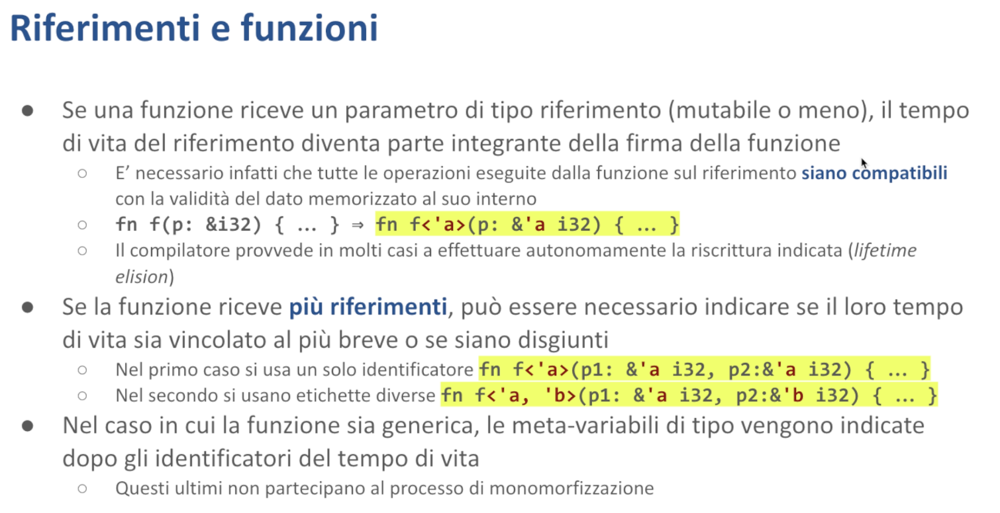

# Lifetime - Malnati 13-14 <!-- omit in toc -->

# Indice <!-- omit in toc -->
- [1. Introduzione](#1-introduzione)
  - [1.1 Esempio](#11-esempio)
- [2. Riferimenti e funzioni](#2-riferimenti-e-funzioni)
- [3. Riferimenti e strutture dati](#3-riferimenti-e-strutture-dati)
- [4. Elisione dei tempi di vita](#4-elisione-dei-tempi-di-vita)

# 1. Introduzione

Tutti i valori hanno un **tempo di vita**. 
Un valore comincia a esistere nel momento in cui viene creato e memorizzato all'interno di una variabile che lo possiede, e resta in vita fino a quando la variabile che lo possiede (o quella che eventualmente l’ha ricevuto dopo un movimento) non viene distrutta. 

Nel momento in cui creiamo dei prestiti attraverso il concetto di riferimento, il tempo di vita di un singolo valore comincia a legarsi al tempo di vita di altri valori e questo in Rust è tracciato in modo esplicito. Adesso vogliamo capire meglio le regole che ci stanno dietro.

Noi già sappiamo che un valore inizia a esistere all'interno del blocco in cui è definito e se non viene mosso cessa di esistere nel momento in cui esce dal proprio blocco, quando l'esecuzione cioè raggiunge il chiusa graffa corrispondente. Se di questo valore noi ricuperiamo il riferimento, il riferimento potrà esistere e quindi essere acceduto in vari modi soltanto nell'intervallo di tempo in cui il valore cui il riferimento si riferisce esiste, altrimenti si romperebbe tutto.

Questa è la grossa differenza che Rust pone rispetto al C e al C++. In C e in C++ voi potete *recuperare* l'indirizzo di un valore quando vi pare, poi però il linguaggio non tiene traccia della durata dell’indirizzo, cioè del puntatore che ne avete ricavato, rispetto alla durata del valore stesso. Conseguentemente può succedere che il puntatore ci sia ancora quando il valore non c'è più e questo genera i vari problemi di dangling pointer, wild pointer, doppio rilascio o cose del genere.

Tuttavia garantire il controllo dell'esistenza in vita del valore nel momento in cui ho un riferimento a questo pone dei vincoli sul linguaggio stesso, cioè devo occuparmi di gestirlo. 

*Cosa succede nel momento in cui io recupero il riferimento di un valore e lo passo a una funzione?* 
Se lo passo a una funzione e la funzione ritorna subito, verosimilmente vuol dire che ho potuto prendere il riferimento a un valore e chiamare una funzione, quindi l'invocazione della funzione è sintatticamente tutta compresa nello scope in cui il riferimento è stato passato e di conseguenza per la durata strettamente della funzione le cose vanno bene.

A condizione però di mettere alcuni puntini sulle i: questo riferimento ha una durata, una durata che il più delle volte noi non esplicitiamo perché Rust riesce in moltissime situazioni a capire quale sia effettivamente la durata e non ci chiede di annotare. Tuttavia se noi decidiamo di invocare una certa funzione passandogli uno o più riferimenti, in qualche modo internamente il compilatore si segna che questa invocazione è soggetta ai vincoli di quel tempo di vita.

La cosa diventa particolarmente importante nel momento in cui la funzione ricevesse non un solo riferimento ma ne ricevesse due o più perché occorre che le azioni che la funzione fa siano compatibili con i tempi di vita dei relativi riferimenti. Quindi se noi avessimo una funzione come quella che è riportata a metà slide `fn f(p: &i32)`, di fatto il compilatore trasforma questa notazione (di cui noi abbiamo fatto l'omissione del tempo di vita) nella sua forma esplicita, ovvero quella è una funzione che è soggetta a un tempo di vita chiamato `a` che coincide col tempo di vita del suo riferimento, cioè è lecito chiamare questa funzione nel momento in cui quel riferimento esiste, altrimenti non è lecito chiamare questa funzione.

Questa annotazione permette al compilatore di rendersi conto che quel riferimento lì non esiste per sempre, esiste in un certo periodo e le azioni che vengono svolte all'interno della funzione sono soggette all'esistenza in vita del parametro.

Nel caso in cui la funzione ricevesse più riferimenti, quello che succede è che il compilatore tenderebbe ad assumere che questi riferimenti abbiano un tempo di vita tendenzialmente ***disgiunto*** e quindi se avessimo due riferimenti la riscrittura diventerebbe una cosa `fn <'a, 'b>`, che vuol dire che ho due riferimenti, il primo gli do un tempo di vita che chiamo a, il secondo un tempo di vita che chiamo b e vado a dire che i parametri sono rispettivamente un riferimento che ha tempo di vita `a` e si chiama `p1` e un altro che ha un tempo di vita che si chiama `b` e il parametro si chiama `p2`. In questo modo il compilatore prende atto che i due riferimenti sono in qualche modo **indipendenti**.

Ci possono essere delle situazioni in cui noi vogliamo far sapere in modo esplicito al compilatore che quei due riferimenti necessariamente devono durare la stessa quantità di tempo. In questo caso dovremmo in modo esplicito andare a dire che la nostra funzione di tempi di vita ne ha uno solo, lo possiamo chiamare come ci pare, di solito si usano le lettere a, b, o c per farla semplice, ed entrambi i riferimenti condividono il tempo di vita.

*Cosa vuol dire condividere il tempo di vita?*
Significa che facciamo delle assunzioni sull'uso dei riferimenti `p1` e `p2` passati alla funzione: non solo durante l'esecuzione della funzione stessa, ma anche per le loro conseguenze successive, questi riferimenti devono avere un periodo di sovrapposizione. Le operazioni che la funzione può eseguire sono quindi vincolate all'intersezione dei due tempi di vita — il periodo in cui entrambi i riferimenti esistono.

Notate che la notazione dei tempi di vita assomiglia un po' alla **notazione generica**, perché usa le parentesi angolari alla stessa maniera. Tuttavia, per il compilatore è solo una notazione. Se la nostra funzione fosse davvero generica, potrebbe ricevere, oltre agli indicatori del tempo di vita, nelle parentesi angolari, anche le metavariabili di tipo(`T`, `U`, `V`, o quelle che vogliamo usare, che normalmente si indicano con una singola lettera maiuscola).

**Per sintassi**, il linguaggio prevede che i tempi di vita precedano sempre le eventuali metavariabili di tipo usate nella programmazione generica. Quindi, se abbiamo una funzione generica che prende dei riferimenti, prima ci sono tutte le cose con l'apice, e poi tutte le parti restanti. Ma questo basta saperlo e uno lo fa.

È importante anche rendersi conto che, quando quella funzione generica venisse usata, il compilatore costruirà delle versioni specifiche per i tipi con cui la funzione è stata utilizzata: se io ho detto che la mia funzione agiva su un riferimento al tipo `T`, qualunque esso sia, nel momento in cui io la chiamo passandogli un riferimento a tipo `i32`, la funzione verrà rigenerata dicendo ok, questo `T`, in questo caso è un `i32`, e quindi costruirà la versione specializzata per gli `int32`. Questo processo, abbiamo detto, è la *monomorfizzazione*.

**Gli indicatori di tempo di vita** **non partecipano al processo di monomorfizzazione**, sono solo utili, una notazione sintattica utile, affinchè il borrow checker possa capire quali sono le conseguenze dei particolari puntatori che noi stiamo passando e quindi possa verificare che non facciamo schifezze.

Il punto cruciale ****in cui diventa evidente che la nostra funzione ha bisogno dei tempi di vita espliciti comincia a prendere forma nel momento in cui la funzione ritornasse un riferimento. 
Qui abbiamo un esempio di un'ipotetica funzione `f`, che prende due riferimenti `p1` e `p2`, a qualunque cosa esse siano (`Foo` e `Bar` non ci importa in questo momento cosa siano), e ci ritorna un riferimento. Questa funzione qua ritorna un riferimento a un singolo intero.

È essenziale dire: *"ma questo intero di cui ci viene tornato il riferimento da dove è preso?"* 
Non certo da dentro la funzione stessa, deve essere preso **da uno dei suoi parametri**.
Allora, il fatto che noi abbiamo esplicitato che i due parametri avevano tempo di vita `'a` e `'b` ci consente di andare a dire che l'`i32` che viene restituito viene da uno dei due parametri in modo particolare. In questo caso noi stiamo evidenziando il fatto che derivi dal secondo parametro. E infatti andando a leggere nel codice vediamo che il valore restituito è `p2.y`, immaginando che il tipo `bar` abbia un campo `y`, riferimento a `p2.y`.

Quindi ciò che è fondamentale da capire è che la notazione dei tempi di vita ci serve. 

Perché? Perché se io passo due cose che possono svanire, quindi due cose che ho in prestito, e te ne restituisco una terza, che è sempre un prestito, devo farti capire questo ulteriore prestito quanto potrebbe durare.

Indicata in questa maniera (nell’esempio della slide), il compilatore capisce che le conseguenze dell'invocazione di questa funzione sono valide solo nello stesso intervallo di tempo del secondo parametro. Se io invece avessi etichettato la funzione con un'unica lettera, quindi `'a p1`, `'a p2`, le conseguenze del risultato erano vere solo nell'***intersezione***, cioè potevo accedere al valore risultante solo nell'intervallo di tempo in cui esistevano ancora entrambi i parametri.

Notate che il compilatore da solo non riesce a estrapolare che cosa viene fuori. Tocca a noi farglielo sapere. Questo è lo sforzo che noi abbiamo nel momento in cui vogliamo costruire una funzione che ritorna un riferimento. E costruire una funzione che ritorna un riferimento ci interessa in tutte quelle situazioni in cui vogliamo esplorare una struttura dati senza fare delle copie, perché fare delle copie è mediamente un'operazione costosa. Esplorare una struttura dati ci piace di più.

Nel caso in cui il compilatore, vedendo che noi abbiamo indicato delle cose, trovasse che c'è almeno una situazione in cui il risultato della funzione viene usato fuori dal tempo in cui è lecito usarlo, ci blocca e ci dice *"guarda che questa cosa non la puoi fare"*.

Vediamo degli esempi. 

## 1.1 Esempio

Qui abbiamo una funzione che riceve due riferimenti. Una funzione molto semplice. Il primo è un riferimento a una stringa (uno slice sostanzialmente), il secondo è un riferimento mutabile a un vettore. E la funzione, in modo molto banale, inserisce lo slice all'interno del vettore.

Se noi scrivessimo direttamente questa cosa, per il compilatore quello vuol dire *“io ho una stringa che può esistere per un tempo* `a`*, qualunque esso sia, la metto dentro un vettore che esiste in un tempo* `b`*, qualunque esso sia. Caspita, problema! E chi mi garantisce che il tempo* `a` *in cui la stringa esiste è più grande del tempo in cui esiste il vettore?”* 
Se io metto la stringa nel vettore, vuol dire che il vettore la terrà, ma se posso usare il vettore quando quella stringa non è più valida, potrei ritrovarmi in una situazione che non va bene. Quindi è necessario che la stringa duri almeno quanto il vettore, altrimenti non va bene. 

Quindi, se io mi limitassi a scrivere questo blocco di codice qua, il compilatore mi blocca con l'errore che viene mostrato nella slide. 
Dice *"guarda, tu hai due tipi. Siccome non mi hai detto che tempi di vita hanno, per me sono due tempi diversi. Li chiamo genericamente* `a` *e* `b`*. Ma siccome me ne metti uno dentro l'altro e sono diversi, io come faccio a garantirmi che coincidano? Non lo posso sapere”*.

Quindi aggiungo una notazione e ti dico *"guarda, questo slice che ti passo ha tempo di vita* `a`*, che coincide con il tempo di vita del vettore. O meglio, mi impegno a garantire che duri almeno quanto il vettore, altrimenti me lo segnalerai"*. 
Perfetto. Ora so che questo vettore, che continuerà a esistere successivamente, esisterà certamente almeno quanto la stringa che vi ho inserito.

Ma il compilatore non è contento ancora, perché sapere che il vettore esiste per il tempo di quella stringa non mi è ancora garante che il vettore contenga **solo** cose che sono valide. E quindi mi dice *"guarda che non solo il vettore deve durare quanto quello slice, ma tu mi devi anche dire che questo vettore contiene solo cose che sono valide per tutto il suo tempo di vita"*. E quindi la notazione `'a` non va aggiunto solo al riferimento del vettore, ma va aggiunto **anche a ciò che il vettore contiene**. Quindi quello è un vettore che ha tempo di vita `a` e che contiene cose che durano almeno `a`. E a questo punto gli possiamo aggiungere un'altra cosa che dura almeno `a`.

Per cui, il compilatore ci aiuta da questo punto di vista e ti dice *"aggiungi il tempo* `a` *al tipo di* `v`*, ovvero dimmi che* `v` *è un ref mut (che dura* `a`*) a un vettore che contiene slice che durano* `a`*"*. Questo è come il compilatore ci guida per capire. Così non capita che noi mettiamo nel vettore cose che durino di meno, perché diventa parte della sua firma esplicita.

A questo punto abbiamo corretto questa cosa e la funzione `f` compila. 

Poi però nel main scriviamo questa cosa qua. Creiamo il vettore `v`. Bene. 

Poi apriamo un blocco. All'interno di questo blocco creiamo una stringa. Nessun problema. Salviamo nel vettore, tramite `v.push` o tramite la funzione `f`, il riferimento alla stringa. 

*Ah, questo è un problema.* Quella stringa che abbiamo creato esiste nella coppia di graffe dentro cui l'abbiamo definita. Di conseguenza il suo riferimento dura quanto la coppia di graffe. Ma il vettore dura di più, perché il vettore è nato prima e lo usiamo dopo. 

Quindi **non è vero** che nel vettore stiamo infilando quello che stiamo dicendo. E quindi il compilatore ci blocca. `Borrowed value does not live long enough`. 

**Questo è il modo con cui Rust ci aiuta.** In C questa cosa voi non la vedete. E' sbagliata, ma il compilatore la compila senza nessun problema. Non ha nessuna consapevolezza che state scrivendo un'idiozia. E di conseguenza quel codice lì passa, va avanti e a un certo punto si spacca. E non sapete quando e come. E il più delle volte non sapete dire perché.

Il Borrow Checker non verifica solo questi casi banali - questo è solo un piccolo esempio fatto per essere comprensibile e spiegabile in una slide. Il Borrow Checker fa tutte le verifiche anche in situazioni complesse, quando passo un puntatore attraverso una catena di funzioni e lo sposto in diverse parti del programma. Ti intercetta ogni volta con precisione perché **dimostra il teorema della correttezza dei tempi di vita**. È fondamentale che capiate e apprezziate questo concetto.

**Quindi il fatto che ci siano delle funzioni che prendono riferimenti e generano riferimenti** richiede che noi facciamo questo piccolo sforzo di dare indicazioni sulla semantica della nostra funzione, cioè *“Quanto dura il riferimento restituito rispetto ai riferimenti passati?”*

# 2. Riferimenti e funzioni

*Caso 1: Un solo riferimento*
Se una funzione ha un unico riferimento in ingresso assume che l'eventuale riferimento in uscita abbia la stessa durata e quindi ci consente questo processo chiamato **elisione dei tempi di vita**. Quindi noi possiamo banalmente scrivere la funzione `f` che prende riferimento `x` e restituisce riferimento `y`. Visto che ce n'è solo un ingresso e uno in uscita il compilatore tranquillo dice quello in uscita durerà quanto quello in ingresso.

*Caso 2: Riferimenti multipli*
Se invece ce ne sono almeno due in ingresso e uno in uscita, il compilatore non è in grado di decidere e non può farlo perché potrebbero esserci degli `if` o altri costrutti condizionali all'interno del nostro codice che possono essere valutati solo nel momento in cui abbiamo tutti i parametri in ingresso, quindi l'analisi statica non permetterebbe di dire quanto dura. Di conseguenza tocca a noi andare a descrivere questa cosa qua.

Esempio slide:
In questo caso qui abbiamo una funzione `f` che prende due riferimenti con relativi tempi di vita che abbiamo chiamato `b` e `c`, e tale funzione ci restituisce un parametro che ha tempo di vita `c`. Questo permette al compilatore di farci dei ragionamenti sopra. Siccome ci restituisce un riferimento che ha tempo di vita `c` questo ha due livelli di implicazione:

- Un livello di implicazione sull'accesso al riferimento in quanto tale, cioè io non posso leggere il contenuto di quel riferimento (cioè dereferenziarlo) oltre il periodo in cui lui esiste.
- Ma anche una cosa al contrario: siccome quello è “un pezzo” del parametro `y` che ho ricevuto, il valore che era stato attribuito al parametro `y` (in questo caso `v2`) non può essere cambiato fin tanto che io uso quel riferimento (il riferimento restituito), perché altrimenti non appattano più le cose.

**Esempio concreto:** Lì ho `v1` che è una tupla [**ndr:** *Il prof continua a parlare di tupla, ma io tuple non ne vedo, al massimo S mi sembra una ipotetica struct*.] che contiene il numero 1 e `v2` che è un'altra tupla e contiene il numero 2. I due riferimenti a questa tupla li passo alla funzione `f` la quale si fa delle cose sue e poi decide di ritornarmi un pezzo della seconda tupla. Che sia un pezzo della seconda tupla lo capisco dal fatto che la signature del tempo di vita del risultato coincide col tempo di vita del secondo parametro.

Questo il compilatore capisce. Di conseguenza esiste un vincolo: 

- Non posso accedere al risultato *oltre la durata* di `v2`
- Non posso modificare `v2` fin tanto che faccio accesso al risultato

In questo caso se io provassi a compilare il codice lasciando la riga barrata in rosso otterrei un errore che mi dice *“Attenzione: qui c'è un conflitto perché tu stai cambiando le carte in tavola, stai mutando una struttura, e un pezzo di questa struttura è osservato dalla riga successiva”*. Questo non si fa: finché gli ti ho dato il prestito, l'impegno è che non me lo cambi.

Notate che se non ci fosse questo legame dovuto ai tempi di vita espliciti, un parametro era la struttura di tipo tupla, e il valore restituito è un riferimento a `u8` — apparentemente sono due cose separate, non c'è un legame di tipo tra i due ma c'è un legame sostanziale: quell'u8 è parte della tupla in qualche misura, o almeno abbiamo dichiarato così. 

Quindi l'aver aggiunto questa notazione consente al compilatore di fare questo ragionamento ed evitare delle schifezze. Questa faccenda qua è la base della solidità di Rust.

**Notate che è più complesso.** Allora, dal punto di vista del compilatore l'aggiunta dei tempi di identificatori dei tempi di vita ha **due valenze**. 

*Prima di tutto* nel momento in cui io invoco questa funzione senza sapere cosa c'è scritto dentro (quindi limitandomi a guardare la sua firma) arrivo a capire che mi verrà generato un risultato che dipende da entrambi o da uno solo dei parametri che io sto passando alla funzione. Di conseguenza devo prolungare tutti i vincoli legati al prestito per il tempo in cui non solo esistono i due prestiti specifici ma esiste anche il risultato.

Perché se io mi limitassi, nell'esempio precedente, a guardare il codice, `&v1` e `&v2` esistono esclusivamente per la durata dell'invocazione di `f`. Quindi potrei dire *"ah ma quando* `f` *ritorna quei prestiti lì non ci sono più, sono andati"*. In realtà, siccome la funzione mi ha restituito un pezzo di `v2` , il prestito su `v1` effettivamente non c'è più e quindi io a `v1` posso far fare quello che voglio (in questo caso non è mutabile ma se lo mettessi mutabile lo potrei tranquillamente cambiare), ma `v2` invece non lo posso cambiare fintanto che il risultato che qui ho chiamato `r` è vivo, e siccome uso il risultato ancora nell'ultima linea `print byte(r)` questo mi tiene in vita.

**Quindi la conoscenza della firma permette al codice** che vede che quella funzione lì è usata, di capire come deve gestirsi i vincoli. 

Quando invece il compilatore invece di concentrarsi su dove chiamo la funzione si sta concentrando sul *come genero il codice della funzione*, che avviene in un qualche altro momento il compilatore controlla che non faccia schifezze. Se tu mi hai dichiarato che il risultato ha tempo di vita `c`, che corrisponde a quello del secondo parametro, ma tu cerchi di assegnarmi come risultato un riferimento al primo che ha tempo di vita `b` , ti blocca. Quindi questa scrittura che noi facciamo in ogni caso è validata dal fatto che effettivamente non combiniamo delle schifezze. Questo in qualche modo ci aiuta.

**Nel momento in cui l'invocazione avviene** quello che il compilatore verifica è che gli identificatori che noi abbiamo passato esistano almeno per il tempo minimo necessario affinchè tutto abbia senso. Quindi non posso leggere il riferimento oltre il suo tempo di vita e non posso modificare la variabile finché il riferimento è in uso.

# 3. Riferimenti e strutture dati

**Il problema non c'è solo con le funzioni** che possono smontare o prendere un pezzo di una cosa più grande. Il problema si pone anche con le **strutture dati**. 
Se io salvo un riferimento che necessariamente ha un tempo di vita dentro una struttura dati quella struttura dati lì diventa anche lei *a rischio*, cioè *eredita il tempo di vita **più breve** di tutti i riferimenti che contiene al suo interno*. Quindi salvare il riferimento da qualche parte implica che il tempo di vita del riferimento, che è un pezzo, si propaga al tutto.

Se io costruisco quest'aula ma c'è un mattone che dopo tre mesi si sbriciola l'aula dopo tre mesi è a rischio perché se quel mattone lì viene meno potrebbe crollare tutta quanta. **Quindi il pezzo dentro la struttura *implica* la durata massima di validità della struttura intera.**

*Lo stesso vale se fate una torta.* Se ci mettete dentro delle cose che sono che hanno una conservazione limitata chiaramente il tempo minimo dell'ingrediente implica la validità di quello che andate a sintetizzare con la vostra cosa. Quindi tenete presente che tutto questo vale altrettanto.

**Ad esempio** qui nella slide viene mostrato una struttura `User` che contiene un riferimento. Siccome questo è un riferimento, e ha una durata, è necessario che noi andiamo a dire che anche la struttura ha una durata, che è almeno al massimo quella del suo riferimento. E se questa struttura diventa parte di una struttura più grande (non come riferimento, ma semplicemente come parte di una struttura più grande, com’è mostrato poi nella struttura `Data`), anche la struttura più grande si prende lo stesso vincolo.

Perché è necessario garantire che solo del codice corretto possa essere scritto. *Non deve esistere nessuna situazione in cui io credo di poter accedere a un indirizzo di memoria quando in realtà non posso farlo.*

Questa cosa qua a sentirla raccontare fila. 
Poi quando scrivete il codice non sapete da che parte mettere le mani. Quindi bisogna allenarsi. **Però è proprio la base**, il motivo per cui il mondo sta sterzando verso Rust è perché Rust ci dà **questo** livello di garanzia.

Nè C, nè C++ ce lo possono dare. Gli altri linguaggi, *Java, JavaScript, Python,* e compagnia bella, ci danno una garanzia sui tempi di vita. 
Come? **Prolungando l'esistenza in vita.** Se io conosco il puntatore di un dato automaticamente quel dato dura fin tanto che io lo conosco. Che è certamente una soluzione corretta. Non posso avere dei memory fault in questa maniera.

**Piccolo problema:** il mio fabbisogno di memoria cresce tantissimo. Perché devo necessariamente prolungare la vita di oggetti e quindi tenerli allocati anche se non mi servirebbero più. Non solo, ma siccome io posso prolungare la vita solo di cose sullo heap e non di cose sullo stack, perché lo stack si deve poter contrarre, questo implica che i linguaggi come Java, JavaScript, Python e compagnia bella non possono usare **tipi valore**, cioè memorizzati nello stack.

Questo comporta un *aggravio delle prestazioni*. Perché tutte le volte in cui mi serve un nuovo valore io devo andare a cercare nello heap un posto grande a sufficienza per tenerlo e devo poi gestirmi questo rilascio in qualche maniera.

Da questo punto di vista C e C++ viceversa non hanno nessun problema a lasciarci costruire tipi valore, cioè oggetti più o meno complessi che esistono all'interno dello stack e che quindi hanno un costo di allocazione e rilascio molto basso. **Il problema è che** non potendo verificare la liceità dei puntatori lasciano spazio agli **undefined behavior**, che sono poi la porta dei vari exploit che vengono usati dagli hacker, che sono la porta anche di tutti i malfunzionamenti che noi poi andiamo a verificare quotidianamente.

Rust, da questo punto di vista, ci permette senza problema di creare tipi valore, cioè dichiarati sullo stack e quindi molto agili dal punto di vista della loro allocazione e del loro rilascio, garantendo al tempo stesso la correttezza del codice che andiamo a scrivere. Tutto al più non compila. Questo è un po' fonte di frustrazione per il programmatore, ma è una frustrazione sana. *Non compila vuol dire che non hai capito abbastanza, ma è meglio che te lo dica lui subito piuttosto che dopo.*

# 4. Elisione dei tempi di vita

Se non mettiamo in modo esplicito un tempo di vita nelle strutture, così come nelle funzioni, per Rust sono tempi di vita indipendenti, quindi l'eventuale struct `Point` che dichiariamo qua, che contiene due riferimenti, per il compilatore è come se fossero due riferimenti completamente disgiunti. Se noi passiamo questa struct `Point` a una funzione che prende un'ulteriore variabile di tipo riferimento, quello è ancora un tempo di vita disgiunto.

Quindi la funzione `scale`, nella parte bassa sinistra, che prende un riferimento `r` e il punto `p`, che implicitamente ha due tempi di vita disgiunti, di fatto per il compilatore è, come vediamo nella parte destra, una funzione che opera su tre riferimenti che possono essere completamente indipendenti tra di loro. Quindi il tempo di vita di `r` è indipendente dal tempo di vita del campo `x` della struttura point, che è indipendente dal tempo di vita della struttura `y`, eccetera. E di conseguenza ci lascerà solo fare operazioni compatibili con questa faccenda.

Se noi ci trovassimo a dover ritornare come valore un riferimento o fare delle assunzioni che non permettono di essere certi che i tre tempi di vita sono realmente indipendenti, il compilatore ci bloccherebbe e ci chiederebbe di esplicitare quale vincolo sia necessario. 

Quindi se una funzione restituisce un riferimento o restituisce un tipo che contiene direttamente o indirettamente un riferimento, bisogna far capire quanto dura questo riferimento.

Nel caso in cui la funzione avesse in ingresso un solo parametro dotato di tempo di vita, implicito e esplicito, Rust dice *"io assumo che il tempo di vita del risultato restituito sia lo stesso dell’unico parametro ricevuto".* Se invece ci sono più parametri dotati di tempi di vita *diversi*, allora tocca al programmatore disambiguare.

*Chi è dotato di tempo di vita?* 
I riferimenti hanno tutti un tempo di vita. Le strutture dati, qualunque esse siano, struct, enum o tuple, che hanno dentro di sé dei riferimenti *acquisiscono* il tempo di vita del loro riferimento. Le strutture che contengono strutture che contengono riferimenti acquisiscono il tempo di vita del riferimento, eccetera. Se una struttura contiene più oggetti che hanno un tempo di vita, quei tempi di vita devono coincidere, altrimenti non va bene, cioè devono avere un'intersezione.

Questo è il motivo per cui nell’esempio del vettore di slice mostrato all’inizio, abbiamo dovuto dire che la durata dello slice, non solo doveva essere almeno coincidente con quella del vettore, ma andavamo anche a dire che comunque dentro quel vettore lì metteremo solo delle cose che durino almeno quanto il vettore stesso.

Se abbiamo un metodo (invece che una funzione esterna), ovvero all'interno di un blocco `impl`, che prende `&self`, o `&mut self`, il tempo di vita dell'eventuale risultato per il compilatore **coincide** col tempo di vita di `self`. Se non è così, dobbiamo andarlo a dire in modo esplicito.

**Queste sono le regole di elisione**, cioè il motivo per cui nella maggior parte dei casi noi possiamo *non scrivere* in modo esplicito il tempo di vita. Ma non è che non ci sia, *c'è* e il compilatore ci risparmia l'onere di farlo vedere, anche se sarebbe un buon esercizio scriverlo in modo esplicito perché così almeno lo capiamo, ne prendiamo più consapevolezza.

*Cos'è il lifetime static?* 
Il lifetime static è un'eccezione: noi i lifetime li chiamiamo come ci pare.
L'unica cosa che non possiamo mettere come vogliamo è `‘static`, perché quello lo possiamo mettere ma ha un significato particolare. Una cosa ha lifetime static, se è un riferimento, ed è un riferimento che certamente dura quanto l'intero programma. Nel caso delle stringhe, delle slice, quando noi mettiamo una slice costante, `“ciao”`, quello diventa un pezzo del sorgente del nostro programma. Viene allocato in una zona delle costanti e di conseguenza esiste da quando il nostro programma parte fino a quando il programma terminerà, perché è statico, è messo lì dentro. Quindi, la variabile `let s: &str = “ciao”`, di fatto ha un tempo di vita **static**.

**Attenzione,** **il tempo di vita static non è solo quello.** 
Se una variabile possiede interamente il suo valore, cioè non ha riferimenti, quella variabile ha tempo di vita static. Quando io dichiaro `let i: i32 = 25`, `i` possiede il suo valore, e ha come tempo di vita static, che vuol dire che di per sé lei possiede. Quindi se io faccio dei ragionamenti: fin tanto che `i` esiste, non è soggetto a dipendenze di altri. 

Nei riferimenti è una cosa che dura per tutta la durata del programma. 
Nei *non riferimenti* vuol dire che non ha pendenze legate al tempo, quindi è totalmente padrone del suo valore. 

Se invece una struct o una variabile contiene al suo interno qualcosa — tipicamente una struct con campi che hanno un tempo di vita — allora non è più static. Questo perché, anche se quella variabile possiede il suo valore, si tratta di un valore "ipotecato": una parte di esso non dura quanto vuole la variabile, ma dipende dalla durata di qualcos'altro, e quindi non può essere static.

Quindi static sui riferimenti, sono quei riferimenti che possiamo garantire esistono dall'inizio fino alla fine del programma. Il caso più pratico è sulle slice costanti. 
Viceversa, sulle restanti variabili, tempo di vita static è quello di chi non ha ipoteche sul proprio valore.