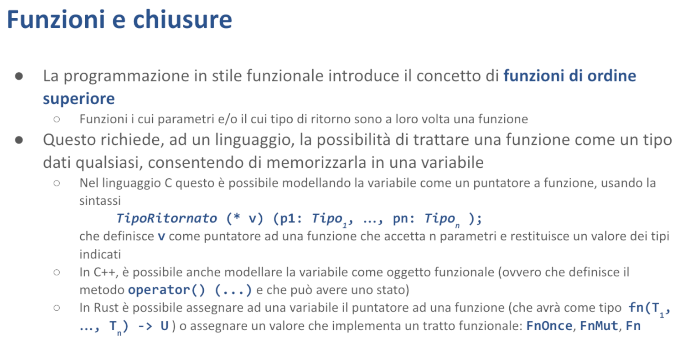

# Chiusure - Malnati 14-15 <!-- omit in toc -->

# Indice <!-- omit in toc -->
- [1. Introduzione](#1-introduzione)
- [2. Programmazione funzionale](#2-programmazione-funzionale)
	- [2.1 Funzioni di ordine superiore](#21-funzioni-di-ordine-superiore)
		- [2.1.1 …in C](#211-in-c)
		- [2.1.1 …in C++](#211-in-c-1)
		- [2.1.1 …in Rust](#211-in-rust)
	- [2.2 Oggetti funzionali](#22-oggetti-funzionali)
		- [2.2.1 Esempio: La Classe Accumulatore](#221-esempio-la-classe-accumulatore)
		- [2.2.2 Sintassi nei Diversi Linguaggi](#222-sintassi-nei-diversi-linguaggi)
		- [2.2.3 Variabili libere](#223-variabili-libere)
- [3. Cattura delle variabili in Rust](#3-cattura-delle-variabili-in-rust)
	- [3.1 Esempi pratici](#31-esempi-pratici)
		- [3.1.1 Esempio 1](#311-esempio-1)
		- [3.1.1 Esempio 2](#311-esempio-2)
	- [3.2 La parola chiave **`move`**](#32-la-parola-chiave-move)
	- [3.3 Tratti funzionali](#33-tratti-funzionali)
- [4. Riferimenti](#4-riferimenti)
- [5. Applicazioni pratiche](#5-applicazioni-pratiche)

# 1. Introduzione

Affrontiamo un altro capitoletto semplice, ma strano come minimo. 
Vogliamo introdurre le ***chiusure***, che vengono anche chiamate ***funzione lambda***. 

**Attenzione,** il termine funzione lambda recentemente, negli ultimi anni, ha preso anche una seconda connotazione. Qui è derivato dal **calcolo lambda**, nato almeno con il linguaggio Lisp negli anni '60, ma probabilmente il calcolo lambda come espressione matematica esiste almeno degli anni '20 del secolo scorso, quindi stiamo parlando di un secolo fa. 

Il termine lambda è stato usato dai signori di Amazon Web Service per rappresentare le cosiddette "***serverless functions***", ovvero dei blocchi di codice che possono essere eseguiti alla bisogna quando si verifica un qualche evento. 
Quello è un caso che però è una semantica diversa, quindi se voi fate una ricerca su Google di "Rust lambda" rischiate di finire su come si fa una serverless function in AWS senza capire quello che invece qua ci interessa. 

Il termine che noi qui usiamo per evitare questa ambiguità è **chiusura**. 



Per dare un senso a questa cosa dobbiamo fare uno shift paradigmatico, cioè noi sappiamo che la programmazione può essere di tipo **imperativo**, dove cioè ci basiamo sul fatto che facciamo delle azioni che hanno degli effetti collaterali, che si propagano su delle variabili. Queste variabili nel tempo mantengono il loro valore e di conseguenza possiamo immaginare che il nostro algoritmo è fatto dell'azione 1, che fa qualcosa, dell'azione 2, che fa qualcos'altro, dell'azione 3, che combina quelle due cose lì in un modo ulteriore, eccetera. Questo è un modo di pensare la programmazione. 

# 2. Programmazione funzionale

C'è un altro modo di pensare la programmazione, che è l'approccio cosiddetto ***funzionale***. L'approccio funzionale fondamentalmente mette le sue radici nella matematica. 

*Cos'è una funzione in matematica?* 
È un modo di combinare più valori. La **funzione**, in matematica, ha determinate caratteristiche.

- Dipende esclusivamente dai parametri che la funzione riceve
- Non ha effetti collaterali

Quanto fa 3+2? 5. 
Se lo chiedo di nuovo, quanto fa 3+2? Sempre 5. 
Se si mette a piovere, quanto fa 3+2? 5. 
Può il calcolo di 3+2 causare la pioggia? No. 

Questo vuol dire funzione che non ha effetti collaterali. 

Il fatto che non abbia effetti collaterali è molto interessante, ma è anche molto problematico. È molto interessante perché io so che posso calcolarla tutte le volte che voglio, senza avere nessun problema. Può succedere attorno di me più o meno qualunque cosa, e 3+2 fa sempre 5. Grande.

Ma è anche molto inutile. Proprio perché 3+2 fa sempre 5, chi se ne frega di calcolarlo? 

Cent'anni fa, chi studiava ingegneria si comprava il tomo delle tabelle dei seni e dei coseni. Perché l'ingegnere del tempo aveva bisogno di fare i calcoli. Piccolo problema: quanto fa il seno di 37,5°? Beh, calcolarlo a mano è un po' dura, si puoi fare lo sviluppo di Taylor, ma non ti passa più. Per cui venivano stampati, a beneficio degli allievi ingegneri, queste tabelle degli integrali, eccetera, che contenevano precalcolati tutta una serie di numeri. E andava benissimo, perché tanto il seno di 37,5 fa sempre quel numero lì. Non è che cambia nel tempo. 
Quindi, il fatto che le funzioni non dipendono da altre cose, consente di calcolarle in anticipo.

Questo è un po' utile, e un po' inutile. Nella programmazione nostra, come lo calcoliamo il seno di 0,5? Tutte le volte che invochiamo seno di 0,5, parte un algoritmo che si mette lì e sfruttando l'algoritmo di Taylor o qualunque altra approssimazione abbiano voluto, lo ricalcola. 

Quello è l'approccio standard della programmazione. Non è particolarmente intelligente, ma è come di fatto i nostri calcolatori funzionano. Così, quando fate la radice quadrata di 4, lui si mette lì e si fa i suoi conticini. Però non sta inventando proprio niente. 

## 2.1 Funzioni di ordine superiore

I matematici però, che sono bravi a creare astrazioni, hanno detto *"Vabbè, una funzione mangia dei dati e produce un risultato".* 

*Ma cosa sono questi dati e che cos'è questo risultato?* 
Beh, nella versione più semplice i dati sono dei numeri e il risultato è un numero. È come vi hanno insegnato la matematica agli elementari, dove vi hanno spiegato che `3+2 = 5`. Questo è molto conveniente perché ci consente di ragionare sul fatto che abbiamo quei numeri lì, possiamo trovare un risultato che ha innumerevoli applicazioni pratiche: andate al mercato e potete capire quanto spendete o cose del genere. 

Poi però siete andati alla scuola media. Alla scuola media vi hanno insegnato il calcolo letterale. Cosa è successo nel calcolo letterale? Beh, vi hanno insegnato che potevate scrivere `3+2` ma potevate anche scrivere `A+B`. E se potevate scrivere `A+B` diventava interessante perché si potevano dedurre delle proprietà. Ad esempio che `A+B` è uguale a `B+A`. E quindi quando vedete scritto `A+B` potete sostituirlo con `B+A` che tanto va bene lo stesso. Vi hanno insegnato che qualunque cosa per 0 fa 0 e questo vi ha abilitato a fare le semplificazioni. Vi hanno insegnato che un qualche cosa diviso se stesso, se non è 0, fa 1. E questo vi ha abilitato a fare delle altre semplificazioni aggiungendo una dipendenza: il denominatore non deve essere 0. Interessante, però `A` e `B` erano solo delle sostituzioni per dei numeri. 

Poi siete arrivati al liceo e li vi hanno insegnato le derivate. Le derivate sono interessanti perché la derivata è una funzione, (è un operatore, ma di fatto è una funzione), che prende in ingresso una funzione e ne restituisce un'altra — qual è la derivata di `x²`? `2x`. 

Ma vi hanno insegnato anche gli integrali, che di nuovo prendono in ingresso una funzione e ne restituiscono un'altra. Anzi, ne restituiscono una famiglia, perché l'integrale di `x²` è `x³/3 + k`. Dove `k` non è noto. Quindi avete una famiglia di funzioni. 

Questo genere di cose noi le chiamiamo ***funzioni di ordine superiore***. La derivata e l'integrale sono funzioni di ordine superiore, perché sono funzioni che, invece di operare direttamente su valori, operano su altre funzioni. 

Quest'idea qua, che vale in matematica e permette, ad esempio, di trovare il massimo e il minimo con più agilità, sfruttando le caratteristiche dell'analisi e altre cose, ecco, si presta anche al calcolo nostro. 

Noi possiamo cioè immaginare di avere un programma che, invece di scrivere funzioni che mangiano dati e producono dati, possiamo avere un programma dove aggiungiamo, accanto a funzioni che mangiano dati e producono dati, delle altre funzioni che mangiano funzioni e producono funzioni. Questo ci abilita a guardare la nostra programmazione in un modo totalmente diverso. Il principio per poter fare questo è che il linguaggio che usiamo ci consenta di scrivere all'interno delle variabili non solo dei valori elementari, come gli interi, i float, le stringhe, o cose del genere, ma ci consenta di **salvare dentro una variabile una funzione**. 

Questa cosa qua si può fare in **C**, si può fare in **C++**, si può fare in **Rust**, si può fare in **Java**, si può fare in **Python**, solo che tutti questi linguaggi lo fanno in modo diverso e con un'enfasi totalmente diversa. Quindi con facilitazioni sintattiche o con ostacoli sintattici grossi.

Allora, sfatiamo subito un problema: di per sé la funzione è un pezzo di codice eseguibile. Quindi, alla fine, quella roba lì è una sequenza di byte che vanno interpretati come codice macchina. `3b7f5942` — Cosa vuol dire? Dipende dal processore. Il processore **x86** lo interpreta in un modo, l'**arm** lo interpreta in un altro.

Comunque, noi sappiamo che le funzioni sono quella cosa lì, possiamo mettere in una variabile una funzione. È impegnativo mettere in una variabile una funzione, perché questa funzione qui può essere *3 byte* o può essere *3000 byte* o anche *3 mega*. Ma stante che quei byte lì li ficchiamo in memoria da qualche parte, tra l'altro in una zona statica, precostruita dal compilatore a priori, quello che noi possiamo salvarci è **l'indirizzo del primo di questi byte**, cioè di dove bisogna fare la chiamata. E poi di lì in avanti tutto bene.

Quindi, di per sé, se è lecito in una variabile tenere un puntatore a un dato, è altrettanto lecito tenere il puntatore a una funzione. Solo che sul dato posso fare alcune cose: lo leggo, lo scrivo, lo incremento, lo sommo, lo sottraggo. Sulle funzioni ci posso fare solo una cosa: **la chiamo**. Ma salvo questa caratteristica, alla fine è un dato come tanti altri.

*Come si fa a rappresentare questo?* 

### 2.1.1 …in C

Allora, in C si può tenere il puntatore a una funzione. Piccolo problema: la notazione per dichiarare quella cosa lì è un casino. 
Guardate l'esempio a metà della slide: `TipoRitornato (* v) (p1: Tipo1, ..., pn: Tipon);`.

*Cosa vuol dire quella sintassi lì?* È poco leggibile. Vuol dire che in quella riga sto dichiarando la variabile `v`. E questa variabile `v` è destinata a contenere un puntatore, `* v`, che punta a una funzione che ha *n parametri*, di tipo `Tipo1`, `Tipo2`, `Tipon`, e che ritorna un `TipoRitornato`. Non è proprio ovvio, però quello vuol dire. 

Quindi quella sintassi lì è quella che si usa in C per poter esprimere il fatto che noi abbiamo una variabile `v` che punta a una funzione con una certa *signature*. Perché il discorso non è solo puntare ad una funzione. La funzione l'unica cosa che posso fare è chiamarla, si, ma devo chiamarla col numero giusto di parametri, con la sequenza giusta di parametri, e devo sapere cosa mi ritorna.

Quindi quello è il modo con cui **Kernighan e Ritchie**, 45 anni fa, hanno trovato il modo di scrivere che c'erano i puntatori a funzione. Siccome è una cosa rarissima, proprio da guru particolare, non è che si siano curati di dargli una leggibilità particolare, e sono rimasti così.

### 2.1.1 …in C++

Una decina di anni dopo Bjorn Strostrup, nel pensare al linguaggio C++, si è detto *"Caspita, ma magari possiamo migliorare un po'".* 
E quindi si è immaginato: siccome gli oggetti in C++ possono ridefinire il comportamento degli operatori, e quindi posso dire cosa succede quando io incremento un oggetto di tipo `T`, implementando il metodo `operator++`, posso dire come si confrontano due oggetti di tipo `T`, implementando il metodo chiamato `operator==`, eccetera, posso anche dire come si comporta il tipo `T` quando lo uso come fosse una funzione, a patto di implementare `operator()`. Questo ha reso un pochino più utile la semantica delle funzioni.

Con un'aggiunta mica da poco. Quando io ho un oggetto che può essere usato come funzione, beh, quell'oggetto lì, certamente, l'oggetto lo chiamo `o`, posso fare `o(p1, p2...)`, con i suoi parametri, e quello trita e mi dà un risultato. Ma l'oggetto `o`, oltre ad avere il metodo `operator()`, può avere dentro di sé tutti i campi che gli pare. E il metodo `operator()` è un metodo come tutti gli altri, al di là di avere un nome un po' strano, è un metodo come tutti gli altri, e se in tutti gli altri metodi è lecito fare `this.x += 1`, cioè comunque manipolare lo stato dell'oggetto, anche `operator()` può manipolare lo stato dell'oggetto.

Questo vuol dire che quella cosa lì *sembra* una funzione, nel senso che è chiamabile come funzione, ma è molto diversa dalla radice quadrata, perché tutte le volte che io la invoco, può, se lo desidera, modificare lo stato dell'oggetto. O al contrario, se lo stato dell'oggetto viene modificato da qualcun altro, può darmi, a parità di parametri, risultati diversi. Questo vuol dire che certe volte 3+2 fa 5 e certe volte 3+2 fa -2 — which is interesting. È un po' un mostro, ma è potenzialmente molto interessante.

Anche perché, nella programmazione tradizionale, l'unica cosa che posso fare è ***farla subito***. Nella programmazione funzionale, io posso **prepararmi le cose da fare e farle poi dopo**. Vediamo di capire meglio.

### 2.1.1 …in Rust

In Rust c'è un modo apposito per gestire questo. Io posso banalmente, se ho dichiarato la funzione `alpha` che fa un certo mestiere, dire `let f = alpha`. 
"Alpha" da solo, senza parentesi. In questo caso, `f` diventa un puntatore alla funzione `alpha`. 
E come era lecito prima scrivere `alpha(p1, p2, …)`, dopo sarà lecito scrivere `f(p1, p2, …)`, e ottengo esattamente la stessa cosa di `alpha`. Cioè `f` è diventato semplicemente un alias di `alpha`.

Ma in quanto variabile, io posso assegnare a `f` in certi casi `alpha`, e in certi altri casi `beta`. Cioè io posso avere un pezzo di codice che chiama `f`, che a seguito di cosa sia capitato prima, di fatto chiamerà alternativamente `alpha` o `beta`. Questo mi ha permesso di **trasformare completamente** la struttura del mio codice.

Io prima avevo `if(someCondition) { alpha(p1, p2, ...) } else { beta(p1, p2, ...}`. 
E quindi nel momento stesso in cui invoco la mia funzione, dovrò decidere che cosa fare. Invece, potendo sfruttare una variabile di questo genere, io posso avere un algoritmo che a monte dentro `f` ci salva `alpha` oppure ci salva `beta`, che immaginiamo abbiano la stessa *firma*. Molto dopo, invocherò `f`. A questo punto io non so più qual era la condizione, **non ha importanza**. Prima ho preso la decisione che la cosa da fare era l'una o l'altra, ma non l'ho fatta, ho solo preso la decisione. Sfrutto il fatto che la mia variabile `f` contiene questa decisione e quindi la eseguo di conseguenza.

Per riuscire a sfruttare bene questa cosa qua, bisogna **cambiare modo di pensare**. Cominciare a ragionare in termini di *programmazione funzionale*. Quello che è interessante è che Rust non solo ci permette di assegnare una funzione pura a una variabile, ma ci permette anche di assegnare degli oggetti che implementano i **tratti funzionali**. 
Ovvero ci sono tre tratti particolari che si chiamano `Fn`, `FnMut`, `FnOnce`, che hanno la caratteristica di dare all'oggetto che li implementa il comportamento di una funzione. Senza togliergli altre cose. Quindi dandogli la possibilità di essere anche altro.

Allora vogliamo capire un po' meglio questo genere di cose qua. 


Vediamo di dare concretezza a quest'idea dei **puntatori alla funzione** e dei **puntatori agli oggetti funzionali** o degli **oggetti funzionali** in generale. 

Di base, quando noi abbiamo un puntatore a funzione possiamo usare tale puntatore come fosse la funzione stessa. 

Qui vediamo due esempi, uno in C++ (ma che di fatto usa la sintassi del C), e l'altro in Rust, a confronto. Nel primo pezzo in alto è introdotta una funzione, la funzione `f1` che prende un intero e un double, e restituisce un double, in modo banalissimo. Subito sotto è dichiarato il puntatore. Il puntatore lo posso assegnare.

La dichiarazione che si fa in C++ è quella del C, cioè `ptr` è un puntatore a una funzione che prende un `int` e un `double` e restituisce un `double`. La dichiarazione che si fa in Rust è più semplice, si dice che `ptr` è un valore di tipo `fn` che prende un `i32` e un `f64` e restituisce un `f64`. Questo rende un po' più chiaro che cosa stiamo introducendo.

Dopodiché lo dobbiamo inizializzare, l'inizializzazione è identica, `ptr = f1` da una parte e dall'altra. A questo punto chiamare `ptr()` e chiamare `f1()` è la stessa cosa. E quindi se io chiamo `ptr(2, 3.14)` ottengo `6,28` dall'una e dall'altra parte. Quindi io posso banalmente in una variabile assegnare il puntatore a una funzione. Una volta che ho assegnato un puntatore a una funzione, quella variabile per me contiene la funzione, la uso come fosse la funzione stessa. Questo è un fatto puramente sintattico.

Però è comodo, perché io potrei decidere che ho una funzione che si chiama `log`, che prende una stringa e tutte le volte che la invoco la scrive da qualche parte. Poi potrei avere una seconda funzione che chiamo `no_log`, che prende una stringa e non ci fa niente. Quando il mio programma parte potrei decidere che se ci trovo un flag o meno, nella variabile `l` ci assegno `log` oppure `no_log`. Ho preso una decisione, ho salvato nella mia variabile `l` una delle due.

Da lì in avanti il resto del programma chiamerà sempre `l` con quello che vorrebbe loggare. Se sono partito con la richiesta di loggare, la chiamata `l` finirà sulla chiamata `log` che è effettivamente scrivere qualcosa. Se no finirà nella chiamata `no_log` che fa finta di niente, non fa nulla e torna. Questo mi permette invece di avere 10.000 `if` sparsi per il mio programma, che tutte le volte dicono "*ma come ero partito? Ero partito con la richiesta di loggare o meno?”* e fanno meno delle cose, di fregarmi altamente e dire io imposto un comportamento che a scelta è di tipo x o di tipo y. E poi banalmente uso il comportamento, sapendo che il comportamento lo userò coerentemente con tutto il resto.

Questo mi permette di non dovermi portare dietro il flag originale che mi diceva che cosa dovevo fare, ma semplicemente io ho una funzione da chiamare e quella chiamo. **Questo approccio alla programmazione consente di fare un mucchio di cose interessanti.**

## 2.2 Oggetti funzionali


Il C++ oltre a permettermi di scrivere direttamente il puntatore a funzione, con la sintassi del C, mi dà la possibilità quando introduco una classe, e in questo caso ho introdotto la classe che ho chiamato `FC` (*Functional Component*), di mettere tra i suoi metodi anche `operator()`. Notate, è un metodo che ha una sintassi un po' strana, perché si chiama `operator()`, quello è il suo nome, ma poi ha bisogno dei suoi parametri, in questo caso `int v`.

*Che cosa fa questo metodo?* 
Banalmente, in questo caso, prende il suo argomento e lo moltiplica per 2. Nella parte sinistra vediamo la definizione della classe, quindi ho introdotto questa classe che ha semplicemente questo metodo, nella parte di destra vediamo che quello che succede è che posso dichiarare un oggetto di tipo `FC`, `FC fc;` significa creo un oggetto di tipo `FC` sullo stack, e poi lo posso usare come fosse una funzione, `fc(5)` ottengo `10`, `fc(2)` ottengo `4`, e cose del genere. Quindi ho creato una cosa che uso come fosse una funzione, senza che sia una funzione.


Questo visto così è assolutamente poco utile, ma diventa molto più interessante se comincio a considerare il fatto che la mia classe di definizioni di `operator()` ne può contenere diverse, quindi supporta l'**overloading**, posso fare quella che prende un intero e mi restituisce un intero, posso fare quella che prende un double e mi restituisce un double, posso fare quella che prende una stringa e mi restituisce un'altra cosa, eccetera. Quindi la posso usare in varie maniere. E questo va bene, è un vantaggio, ma potrei farmi 10 funzioni diverse e in qualche modo me la caverei.

Ma il vantaggio molto più significativo è che siccome è una classe, oltre ad avere uno o più metodi, può avere degli attributi, dei campi interni. E questi campi interni sono accessibili all'interno della funzione `operator()`, perché quella è una funzione membro a tutti gli effetti, quindi avrà un `this` e potrò accedere al suo contenuto. Queste variabili membro possono essere utilizzate per determinare il comportamento della mia funzione apparente.

Possono essere usate per ricordarsi le invocazioni e quindi trasformare quella che era una **funzione pura** (cioè come quelle matematiche, che dati gli stessi dati in ingresso ti dà sempre solo gli stessi dati in uscita) in una **funzione impura**, che nella terminologia del C++ si chiamano ***oggetti funzionali***. Ovvero una cosa che **ricorda la propria storia,** **ha uno stato.**

### 2.2.1 Esempio: La Classe Accumulatore


Qui è introdotta un'ipotetica classe chiamata `accumulatore`, che ha dentro di sé un unico parametro `totale`. Il costruttore della classe accumulatore setta `totale` a zero.

Quel `Accumulatore():totale(0){}` è la sintassi del C++ per inizializzare il parametro `totale`. 

All'interno contiene la definizione di `operator()`, che quando gli passiamo un valore lo prende e lo somma a `totale`. Vedete che dentro `operator()` c'è scritto `totale += v`. Quindi io prendo atto che sono stato invocato e mi registro questa cosa. In questo caso ritorna `v`, ma potrei anche non ritornare niente, e andava bene lo stesso. Poi c'è un ulteriore metodo chiamato `totale()`, che mi ritorna il valore `totale` stesso, che altrimenti sarebbe privato (e dunque inaccessibile altrimenti).

Dopodiché nel `main` io dichiaro il mio oggetto `Accumulatore a`, e per `i` che vanno da 0 a 10 calcolo `a(i)`. Quindi fa:

- `a(0)`: dentro `totale` rimane 0
- `a(1)`: dentro `totale` ci finisce 1
- `a(2)`: dentro `totale` ci finisce 3
- `a(3)`: ci finisce 6

etc…

Finito il mio `for`, stampo quanto vale la variabile `totale` e ci vedo 45.

*Cosa significa questo?* Ho la possibilità di chiamare una funzione che oltre eventualmente a ritornarmi un valore per i fatti suoi, e quindi essere usata come funzione, riesce a **ricordarsi delle cose**. In questo caso io mi limito a ricordarle. Potrei anche dire che io utilizzo lo stato, in questo caso la variabile `totale`, per cambiare il valore che ritorno. Cosa che sarebbe molto complicata da fare con una funzione semplice.

Ovvero, con una funzione semplice l'unico modo che avrei per avere un comportamento del genere è appoggiarmi a una **variabile globale**. Con un vincolo però: che io di variabile globale ne posso avere, per una data funzione, *una sola*. Io qui, se creo due oggetti di tipo `accumulatore`, ho ciascuno il suo stato. Il primo parte a zero, e il secondo parte a zero. Al primo chiamo tre volte `a(1), a(2), a(3)`, e lui somma, mentre l'altro sta ancora a zero. Poi comincio a chiamare sull'altro, l'altro sale, il primo sta fermo, e così via. 

Quindi posso portarmi più storie in contemporanea. Mentre se io avessi usato una variabile globale, non c'era modo di distinguere un oggetto da un altro.

Questi sono gli oggetti funzionali. Quindi sono oggetti che come tutti gli oggetti hanno il loro stato; in Rust non parliamo di oggetti, quindi li chiameremmo struct, che hanno dei campi. Oltre ad avere dei campi, possono essere sintatticamente usati come fossero una funzione. E infatti io ci scrivo `a(i)`. Il problema è che questa notazione è un po' verbosa. E' il meglio che Bjorn Stroustrup è riuscito a inventarsi alla fine degli anni '80, mentre si ragionava su questo genere di cose.

Però poi i programmatori si sono resi conto che questa idea qua era tutt'altra che peregrina, e aveva un mucchio di vantaggi. Solo che bisognava semplificarla, dare modo di scrivere più facilmente un comportamento del genere. E qui le strade si sono sparpagliate. Nei vari linguaggi sono nate sintassi completamente diverse per rappresentare le stesse idee.

### 2.2.2 Sintassi nei Diversi Linguaggi


**JavaScript:** potete introdurre una variabile `const f =` e a quel punto attribuite un letterale, ovvero un set di parametri tra tonde, freccia, e il body: quindi `const f = (v) => v + 1`. 
Questo assegna a `f` un letterale che consuma un numero `v` e produce il numero incrementato di un'unità.

**Kotlin:** Si è adottato una sintassi diversa. La funzione è scritta tutta tra graffe e comincia con la definizione dei parametri, poi freccia, e poi il suo body: `val f = { v: Int -> v + 1}`.

**C++:** Si usa quest'altra notazione: `[](int v) -> int { return i+1 }`.

**Rust:** Si può fare così: `|v| v+1`, con o senza graffe.

Tutti dicono la stessa cosa, sto introducendo un letterale, una funzione espressa letterale. Diciamo che questo è un po' quanto i linguaggi hanno trovato di meglio per rendere facile esprimere delle funzioni.

**Caratteristiche delle Funzioni Lambda**
Sono funzioni che però **non hanno un nome**. Il nome lo prendono dalla variabile a cui sono assegnate. `let f =`, `const f =`, `val f =`, `auto f =`, questi sono i modi con cui nei vari linguaggi io le introduco. In questo caso la funzione è particolare, il nome non ce l'aveva, prende il nome della variabile. Se questa variabile la assegno ad un'altra variabile, boh, diventeranno tutte e due la stessa cosa, non è un problema.

**Origine del Nome**
Vengono dette funzioni lambda perché nel calcolo dei matematici a un certo punto, negli anni venti, era nata questa filone della matematica teorica che introduceva l'idea delle funzioni di ordine superiore manipolate algebricamente e quindi avevano chiamato lambda una funzione priva di nome. Ed è rimasto attraverso Lisp, fondamentalmente.


**Uso Pratico**
Quando definiamo una lambda usando la sintassi del linguaggio (nel nostro caso la barra verticale con i parametri seguita dal body), dobbiamo memorizzarla in una variabile per poterla utilizzare. Scrivere solo `|x| { x + 1 }` non serve a nulla. Invece, salvandola in una variabile con `let f = |x| { x + 1 }`, possiamo poi usarla. Per esempio, `f(25)` ci restituirà 26.

È **interessante** perché una cosa del genere posso passarla come argomento a una funzione, o al contrario posso riceverla come risultato di un'altra funzione. Il problema è che la sintassi può essere più o meno chiara. Ad esempio qui nella slide stiamo stiamo definendo una funzione chiamata `ret_fan`, quindi una funzione che quando verrà invocata non ha parametri e restituirà una funzione. In questo caso si restituisce assolutamente sempre la stessa, ma potrebbe darci una tra diverse funzioni.

### 2.2.3 Variabili libere


L'aspetto interessante, e qui adesso ci stacchiamo dal problema puramente **sintattico** di *come si fa a scrivere questa cosa*, ed entriamo invece in un dominio più ***semantico***. 
Nel corpo di questa funzione abbiamo certamente la possibilità di mettere delle costanti, abbiamo certamente la possibilità di mettere i parametri della funzione stessa (`|**x**| x + 1`), ma possiamo anche citare nel corpo della nostra funzione delle variabili che siano visibili nel punto in cui la definizione avviene.

Quindi noi stiamo **congelando** nel corpo della nostra funzione dei valori che prendiamo attorno a noi, nel punto in cui siamo stati definiti. E che cosa viene preso? Beh, a secondo dei casi prenderemo un riferimento, oppure prenderemo una copia, oppure prenderemo il possesso completo. E nei linguaggi diversi questa cosa prende forme leggermente diverse.

Questo insieme di variabili che compaiono nel corpo di una lambda e non sono parametri espliciti, vengono chiamate **variabili libere**, perché sono quelle che definiscono un comportamento **contestuale**. 
Nel momento in cui io sono nato, io sono nato in Italia, quindi sono italiano. Potevo nascer altrove, sarei stato diverso. È capitato così. Quando la lambda nasce può acquisire dal suo ambiente di nascita dei valori che si porta dentro e **gli rimangono**.

*Cosa succede quando scriviamo un'espressione del genere?* 
Nei diversi linguaggi succedono cose leggermente diverse. Nel caso di **C++**, quando noi scriviamo una funzione lambda che cattura qualcosa dall'ambiente, cioè ha delle variabili libere, C++ genera per noi un *oggetto funzionale* che ha come attributi interni, i valori che ha catturato. Tipicamente ha delle copie dei valori, oppure in certi casi (se glielo spieghiamo in modo esplicito) dei riferimenti.

Nel caso di **Rust**, viceversa, **una lambda che abbia delle variabili libere diventa una *tupla*.** Semplicemente una tupla. Che ha però il comportamento funzionale: può essere usata come funzione. E a secondo di come usiamo la lambda e di come abbiamo catturato le variabili libere, potrà implementare il tratto funzionale `FnOnce`, oppure potrà implementare il tratto funzionale `FnMut`, oppure potrà implementare il tratto funzionale `Fn`.

Adesso vogliamo capire cosa sono questi tratti funzionali e come ci stanno.

# 3. Cattura delle variabili in Rust


## 3.1 Esempi pratici

### 3.1.1 Esempio 1


Per un po' di volte, dico che creo la funzione `f`, per il momento non la sto ancora usando, che prende un valore `v` e mi restituisce `v + i`. Quindi questa variabile, questa variabile `f` che sto creando, potrà essere usata come funzione, potrà essere usata come funzione che prende un numero e che restituisce un numero. Ma che cosa restituisce? Restituisce un numero che dipende da quanto vale `i`.

Quindi stiamo preparandoci via via delle `f` diverse. 


Se io lo eseguo, e guardo un po' il codice che viene fuori, vedo che quando `i` vale 2, `f(1)` vale 2, `f(2)` vale 4. Cioè la funzione moltiplica per 2. 

Quando `i` vale 3, `f(1)` vale 3, `f(2)` vale 6. La funzione `f` moltiplica per 3. 
Quando `i` vale 4, `f(1)` vale 4, `f(2)` vale 8. La funzione moltiplica per 4. 

**Perché?** Perché io ho definito la mia funzione in modo che catturasse dall'ambiente in cui era `i`. E se lo tenesse stretto.

Queste funzioni le potrei memorizzare da qualche parte, ad esempio in un array, un `Vec`. E poi in futuro utilizzarle. Queste funzioni automaticamente si ricorderebbero: la prima si ricorderà che `i` vale 2 e se lo terrà stretto. La seconda si ricorderà che `i` vale 3. 

*Perché riescono a ricordarselo?* 
Perché Rust, per noi, dietro questa espressione genera una **tupla**. In questo caso è una tupla che contiene un solo campo: `i`. Cioè nel campo 0 di quella tupla lì c'è `i`. E quindi se lo tiene dentro.

Se avessi usato più pezzi avrei potuto fare una cosa più complessa. 

### 3.1.1 Esempio 2


Qua introduco `gen` che sarà una funzione destinata a crearmi qualcos'altro. 

Quindi invocherò `gen` in qualche modo e otterrò in cambio una funzione. Questa funzione dentro di sé possederà due cose. Possederà una `i`. E possederà `base`, che è un slice di caratteri.

Tutte le volte che questa funzione verrà invocata, `i` diventerà più grande di 1, e poi mi concatenerà `base` con `i` per ottenere un valore.

Proviamo ad  usarla.


A ogni invocazione di `f1` succedono delle cose. 

Cosa capita quando io lo eseguo? Nel momento in cui io lo eseguo questa cosa qua mi stampa `"a1"`, `"a2"`, `"a3"`, `"a4"`. E se andassi avanti mi stamperebbe `"a5"`, `"a6"`, `"a7"`etc...

**Cioè ho creato una funzione che non ha parametri ma che si ricorda di quante volte è stata chiamata**. E per ogni volta che viene chiamata non solo genera un nuovo valore ma si aggiorna internamente così da permettermi di avere il risultato.

Questo internamente viene realizzato sul fatto che `f1` è una **tupla che ha due campi**. Quindi se io andassi a decompilare questo codice vedrei che dentro `f1` c'è una String con i suoi 24 byte, e un `i32` che occupa 4 byte. Questa cosa qui internamente contiene la sua informazione.

Quando io la invoco quello che succede è che parte il codice che ho specificato sopra che quindi prende il campo `i`, che è dentro la tupla, e gli somma 1. Poi prende la parte base che è rappresentata dalla stringa, la concatena con `i` grazie alla macro `format!` e mi restituisce la stringa risultante.


Se io mi facessi una seconda variabile `f2` e poi stampassi un po' di volte `f2`, vedrei che `f1` va avanti con i suoi conteggi, ed `f2` è completamente indipendente e va avanti con i suoi conteggi.


Se a questo punto aggiungessi ancora una stampa qua mettendoci un `f1` finale giusto per vedere cosa succede, mi accorgerei che prima ho `f1` che parte: `a1`, `a2`, `a3`, `a4`, poi ho `f2` che mi fa `b1`, `b2`, `b3`. Poi vado avanti, richiamo di nuovo `f1` e chiaramente questo mi stampa `a5` perché si è ricordato il suo contenuto.

Quindi io ho creato all'interno di questa funzione chiamata `gen` una **chiusura,** ovvero una funzione lambda, perché l'ho creata con le barre che però oltre a prendere i suoi parametri (nessuno in questo caso), si prende in ausilio due dati che derivano dal suo contesto: un dato dal contesto stretto è la `i` (se la porta dentro), l'altra `base` l'ha presa come parametro della funzione `gen`. 

Quindi chi invoca `gen` mi dà il prefisso che dovrò mettere davanti ai miei simboli che genererò e automaticamente a ogni invocazione io concatenerò il prefisso con il valore corrente di `i` per ottenere il mio risultato.

<aside>
💡

**Keyword** **`move`**


Senza la parola chiave **`move`**, il compilatore blocca la compilazione. 

Se rimuoviamo `move`, il compilatore segnala un errore perché la chiusura prenderebbe `i` come riferimento semplice invece di acquisirne il possesso. Per questo motivo dobbiamo aggiungere `move` davanti alla chiusura, così da forzare la presa di possesso di `i`.

Altrimenti, la variabile `i` cesserebbe di esistere una volta usciti dallo scope della funzione `gen`, ma la chiusura vi farebbe ancora riferimento: problema!

</aside>

Con la chiusura ho avuto la possibilità di creare una funzione che è **semipermeabile**, cioè riesce a catturare delle cose. 

*Perché?*
Perché non viene generata solo una funzione: **viene generata una** **tupla che implementa il *tratto funzionale***. 

Implementando il tratto funzionale può essere chiamata, ma essendo una tupla ha anche uno stato, e questa implementazione automaticamente fa riferimento a `self`. Cioè quando lui vede questo codice qua, quella `i` diventa `self.1` e quel `base` diventa `self.0`.

Allora quando noi creiamo questo genere di scrittura, quindi quando Rust vede comparire qualcosa come `| ... | { ... }`, automaticamente capisce che deve costruirsi silenziosamente una **tupla** che ha dentro di sé tanti campi quante sono le **variabili libere,** cioè va a guardare nel body di questa cosa quanti sono gli identificatori che non corrispondono a nessun parametro formale. Quelle sono le variabili libere quindi diventano il campo 0, 1, 2, 3, etc… della tupla, quanti ne servono. 

Internamente sostituisce nel corpo della funzione i nomi che abbiamo dato loro (`i`, `j`, `k`, `base`, quello che sia) con `self.0` `self.1`, `self.2` etc.. 

Poi fa sì che questa tupla che così lui ha definito, che non ha un nome specifico, implementi uno dei tratti funzionali `Fn`, piuttosto che `FnMut` piuttosto che `FnOnce`. 
Dobbiamo ancora capire che differenza c'è tra i tre, ma comunque la rendono **chiamabile**. 

## 3.2 La parola chiave **`move`**

*Cosa ci mette nei campi della tupla?*
Di default ci mette il **reference semplice** al dato, quindi se io passavo `i` lui ci metterà il riferimento di `i`. Nel momento in cui passo il riferimento, il borrow checker, nell'andare a vedere il codice che viene generato, controlla che tutto sia lecito, cioè che il tempo di vita sia giusto.

In alcuni casi ci basta esclusivamente che dentro la tupla ci finisca una reference al dato originale.
In alcuni casi invece noi vogliamo che il dato originale abbia un tempo di vita che sia diverso e allora dobbiamo governarlo in qualche altra maniera. 
Il modo più semplice è aggiungere davanti, prima delle barre `| … |`, la parola chiave `move`. Quella parola chiave lì dice *"non prendere il reference alla variabile, prendi proprio la variabile* *acquisiscine il possesso"*.

Vediamolo con un esempio.


Qui ho una variabile, sto introducendo `f1` che opera sul suo parametro formale chiamato `x` e nel body mi cita `x`, `y` e `z`. Questo vuol dire che `y` e `z` sono *variabili libere* - deve essere qualcosa che compare nel contesto. Se non compaiono nel contesto è un errore di sintassi. 

Se compaiono nel contesto lui genera una tupla che contiene dentro di sé due riferimenti: il primo è il riferimento a `y` che potrà stare dove sta (cioè se `y` era una variabile locale sarà un riferimento allo stack, se `y` era una variabile che era sullo heap sarà un riferimento sullo heap, non ha nessuna importanza), e analogamente l’altro è il riferimento a `z`. Quindi la mia tupla in questo caso sarà grande 16 byte (8 byte per ciascun puntatore). 

Qui ipoteticamente `y` è più grande, tanto per fare un esempio, `z` è un po' più piccolo, va benissimo.

Se invece di scrivere come mostrato a sinistra, scrivessimo come mostrato a destra (`let f2 = move ...`), quello che succede è che invece di catturare il riferimento, nella tupla **viene mosso quello che gli abbiamo indicato**. 

E quindi la variabile `y` da dov'era viene trasferita dentro lo stack dove noi la depositiamo nel campo 0 della tupla, e la variabile `z` viene mossa da dov’era e finisce sempre nello stack nel campo 1 della tupla. Quindi a questo punto `f2` ha preso possesso di `y` e `z`, sono diventate sue. Invocando `f2` quello che succede è che avrà possibilità di modificare `y` e `z` e di farci delle cose.

`move` dice *"nel momento in cui mi crei questa cosa la sposti da dov'è a dentro la tupla".* 
Mettendo `move` chiaramente io perdo l'accesso ai valori catturati, a meno che quei valori lì non siano `Copy` (in tal caso, potremmo continuare ad avere accesso ai valori catturati anche dopo aver creato la closure, dato che al suo interno ci finirebbe una copia ex novo di tali valori — *la **move** di un **valore Copy**, è la **copy***).

## 3.3 Tratti funzionali


Abbiamo detto che ci sono tre tratti che si chiamano `FnOnce`, `FnMut`, `Fn`. 

Questi tre tratti sono progressivamente **più specifici**, si *co-implicano*: per poter implementare `FnMut` bisogna anche implementare `FnOnce`, e per poter implementare `Fn` bisogna anche implementare `FnMut` e di conseguenza anche `FnOnce`. 
Quindi `FnOnce` è il più generico, poi alcuni `FnOnce` sono anche `FnMut`, e poi alcuni `FnMut` sono `Fn`. 

***Cos'è la differenza tra i tre?***
La differenza tra i tre è legata a quante volte quella funzione lambda che sto scrivendo può essere chiamata. 

- **FnOnce**
Chi implementa `FnOnce` sta dicendo che ha creato una **chiusura** che quando verrà chiamata distrugge un suo pezzo e quindi potrà essere chiamata *una volta sola*. Dopodiché non esiste più, perché il suo risultato è stato ottenuto **smontandola**. 
È quello che succede quando dichiariamo in un metodo normale `self`, senza nessun `ref`: se ho all'interno di una struct un metodo che prende `self`, quel metodo lì è chiamabile una volta sola, perché dopo che l'ho chiamato su un certo oggetto il `self` non esiste più — mi ha preso il possesso e ha restituito qualcos'altro.
- **FnMut**
Se invece implemento `FnMut` è come se scrivessi un metodo che riceve `&mut self`, e quindi ha la possibilità di essere chiamato più volte e ha la possibilità di modificare se stesso.
- **Fn**
Infine se implemento `Fn` è come se avessi un metodo che prende `&self`, quindi si guarda ma non si modifica, e di conseguenza può essere chiamato tante volte senza effetti particolari.

Quindi quale di questi tre tratti viene effettivamente implementato dipende da *cosa viene catturato e come viene catturato*. Una chiusura di fatto la scrivo sempre uguale ma se vado a vedere il tipo che il compilatore gli assegna vedrò delle cose distinte:


Vediamo che `f1` implementa `FnMut`, in altri casi implementerà altre cose.

<aside>
💡


</aside>


**FnOnce**
La lambda implementa `FnOnce` se **consuma** uno o più valori nell'ambito della propria esecuzione. In questo caso sto introducendo `f` che ha catturato come variabile libera `range` (che è un intervallo) e mi ritorna come risultato `range.count()`. 
Allora per poter dire quante cose sono presenti in quell'intervallo, cioè invocare `count()`, lui deve consumare `range` — si mette lì, lo svuota e alla fine dentro `range` non c'è più niente però lui può dirti *"guarda ho trovato dieci cose".* 

Questa è `FnOnce`: la posso chiamare una volta e ottengo dieci. Se provassi a chiamarla una seconda volta il compilatore mi blocca perché ormai `range` si è svuotata, non c'è più.

**FnMut**
Viceversa una lambda implementa il tratto `FnMut` se ha catturato in modo **esclusivo** una o più variabili. Nell’esempio in slide abbiamo scritto `let mut sum = 0`. Questa `sum` la sto usando per cambiarla, e lui capisce che per poterla cambiare, per io poter scrivere `sum += 0`, sono obbligato a prenderne un riferimento mutabile e di conseguenza me lo lascia fare e mi dice che implementa `FnMut`. 

Questo fa sì che posso chiamare `f(5)` e il risultato è che dentro la variabile `sum` ci finisce `5`, poi posso chiamare `f(7)` e questo significa che dentro la variabile `sum` ci finisce `12`. Quindi ho possibilità di chiamare più volte ma l'ambiente in cui la chiamata avviene si muta come conseguenza di questa cosa.

**Fn**
Ed infine posso implementare il tratto `Fn` se accedo in **sola lettura** alle variabili libere o se ne prendo possesso. Se ne ho preso completamente il possesso va anche bene. Chiaramente se non ho preso possesso ma accedo tramite riferimento alle variabili libere, finché esiste la chiusura le variabili libere sono sotto ipoteca — il loro tempo di vita è legato al tempo di vita della funzione, non le posso modificare. 

Nell’esempio della slide sto prendendo un riferimento semplice alla variabile `s`: `let f = | v | v < s` confronta `v` con la variabile libera `s`, che contiene “hello”, e mi ritorna `true` o `false` a seconda dei casi. 
Nel momento in cui invoco `f` di "word" — "word" è più piccolo di "hello"? No, e di conseguenza ottengo `false`. 
"bye" è più piccolo di "hello"? Sì perché alfabeticamente viene prima e quindi mi ritorna `true`.

L'uso delle espressioni lambda che noi in Rust scriviamo con le `| |` (barre verticali) ci dà la possibilità di descrivere in modo compatto delle funzioni. 


La conseguenza di questo è che possiamo implementare una funzione che accetta come parametro un'altra funzione. Ad esempio, ricorrendo alla **programmazione generica**, è difficile dire che tipo ha la mia lambda: è una tupla? Sì, ma come, che tipo ha esattamente? 
Il compilatore gli darà un nome incomprensibile. 
*Come faccio a passarla a un'altra funzione?* 
La posso passare solo se la chiamo col suo **tratto**, e quindi posso dire che a quell’altra funzione passerò un oggetto `T` che implementa il tratto `Fn`, `FnMut` o `FnOnce`. 

Qui vediamo un esempio di `higher_order_function`: è una funzione che prende `f` di tipo `F` a condizione che `F` grande implementi il tratto `Fn` che mangia il tipo `T` (`where F: Fn(T)`) e produce il valore `U` ( `-> U`).

Questo ci dà la possibilità di scrivere in modo molto generico delle cose. 

<aside>
💡

**Analisi firma**


</aside>


In questo esempio, usando `move`, il possesso della variabile catturata (`v`) viene trasferito alla chiusura. Tuttavia, **non serve `FnMut`** perché la variabile **non viene modificata**, ma solo letta tramite `.clone()`.

Anzi, se la chiusura **non consuma** la variabile catturata (non fa `return v`), allora **può tranquillamente implementare `Fn`**, il trait più restrittivo.

Questo è possibile proprio **grazie a `move`**, che elimina qualsiasi legame tra la chiusura restituita e le variabili locali della funzione che la crea.


<aside>
💡

**Descrizione dell’esempio AI Generated**

La chiusura **cattura `i` in modo mutabile** (perché lo incrementa) e **`b` per valore** (una `String` derivata da `prefix`), quindi deve essere **`move`** per prendere possesso di entrambe. Questo è necessario affinché la chiusura possa **vivere anche dopo che `generator` è terminata**, mantenendo il proprio stato (`i`) tra una chiamata e l’altra.

Anche se `b` è catturata per valore, **non viene consumata**, perché viene solo **letta** (passata per riferimento a `format!`). Questo permette alla chiusura di **riutilizzare `b`** a ogni invocazione senza diventare `FnOnce`.

Essendo la chiusura **mutabile internamente**, il valore `f` in main deve essere dichiarato `mut`.

Infatti, **le chiusure in Rust vengono *desugared* in tuple** che contengono i valori catturati come campi. Se uno di questi campi (come `i`) viene modificato, allora il metodo generato (`call_mut()`, che fa parte del tratto `FnMut`) richiede **`&mut self`**. Per poter invocare `f()`, il compilatore deve quindi disporre di `f` come valore **mutabile**.

Ogni chiamata a `f()` restituisce un nuovo identificatore unico, sfruttando lo stato interno della chiusura.

</aside>

# 4. Riferimenti


# 5. Applicazioni pratiche

Vediamo delle applicazioni pratiche.


Torniamo a prendere un attimo il codice di prima: quando concretamente uso una cosa del genere? 

Il generatore così viene utile in un mucchio di situazioni. Spesso ci troviamo col bisogno di dover dare dei nomi a delle cose garantendo che questi nomi siano tutti diversi. Creare un generatore del genere è comodissimo, perché sono sicuro che tutte le volte che mi serve un nome glielo chiedo e lui mi garantisce che viene diverso. 

Se mi servono più famiglie di nomi disgiunti, mi faccio dei generatori con basi distinte: uno lo chiamo `a_qualcosa`, l'altro `b_qualcosa`, e di nuovo mi vengono tutti tranquilli e distinti.

Ma vediamo degli usi più semplici delle lambda, ma assolutamente comuni. 

Uno di questi è: spesso ci troviamo col bisogno di avere dei dati, ad esempio un vettore con dei valori, e dobbiamo farci delle cose sopra.

```rust
let v = vec![1, 2, 3, 4, 5, 6, 8, 9, 0];
```

Ho il mio vettore e mi piacerebbe trasformare questo vettore in una serie di stringhe. Come posso fare una cosa del genere?

```rust
let v1: Vec<String> = v.iter().map(|n| format!("n_{}", n)).collect();
```

Il metodo `map` non posso applicarlo direttamente sul vettore in quanto tale, devo dire *"dammi gli elementi uno a uno e fammi delle cose".* 
A questo punto lui mi stampa "n1", "n2", "n3"... tutti quanti uno a uno mi ha preparato queste cose qua.

`v.map` è un modo per dire *"a tutti questi elementi di `v` voglio applicare una funzione".* 

*E come faccio a dare la funzione?* 
La scriviamo proprio qui! Qui chiamiamo l'elemento `n` e scriviamo `format!("{}", n)`. 
Quindi con `v.map` ho fatto questo, ma questo non è ancora un vettore — perché diventi un vettore dobbiamo fare `.collect()`.

```rust
let v1: Vec<String> = v.iter()
												.filter(|n| **n < 5) // Doppio * perchè n in questo caso è un doppio riferimento ( Vec --> String --> Data)
												.map(|n| format!("n_{}", n))
												.collect();
```

Tra l'altro potrei farci delle cose ulteriori. Potrei dire che io non voglio tutti ma voglio soltanto quelli che sono più piccoli di `5`. A questo punto lui mi stampa `n_1`, `n_2`, `n_3`, `n_4`, `n_0` perché sono i numeri che vanno bene. 

Questo è l'uso più comune che si ha delle lambda: ho la possibilità di esprimere come voglio lavorare su delle mie collezioni, che poi è lo stesso meccanismo che probabilmente vi hanno insegnato nello sviluppo di applicazioni web in Javascript per lavorare con i vettori e gli array.

```rust
for i in 3..7 {
	let v1: Vec<String> = v.iter()
													.filter(|n| **n < i) // Doppio * perchè n in questo caso è un doppio riferimento ( Vec --> String --> Data)
													.map(|n| format!("n_{}", n))
													.collect();
}
```

Questo ci dà la possibilità di fare delle operazioni, ma potrei essere più sofisticato. 
Ad esempio, potrei includere questo blocco dentro un `for i in 3..7` e dire che il concetto del filtro, invece di essere sempre `< 5`, è `< i`. In questo caso questa è diventata una *closure* che ha catturato il valore `i`. Quindi a una prima iterazione prenderò soltanto `1`, `2` e `0`, alla seconda iterazione prenderò `1`, `2`, `3`, `0` e così via.

Ho la possibilità di *confezionarmi* delle lambda in vario modo. 

Posso usare questa tecnica per prepararmi degli oggetti che userò in futuro senza avere al momento bisogno di farli. Ad esempio, posso avere:

```rust
fn gen_vect(n: usize) -> impl FnOnce() -> Vec<i32> {
	return move || {
		println!("Sto per preparare il vettore con {} elementi", n);
    let mut v = vec![];
    for i in 0..n {
        v.push(0);
    }
    println!("Fatto!");
    return v;
	}
}

```

Questa funzione `genvect` è specializzata nel costruirmi una funzione che quando sarà chiamata creerà un vettore.

Questa funzione mi ritorna una funzione che quando verrà invocata creerà un vettore — non lo crea subito! Creerà un vettore della dimensione che gli dò adesso. Gli dico: *"Preparati una funzione che sarà capace, quando te lo chiedo, di farmi un vettore di `n` elementi".* 

A questo punto nel `main` facciamo:

```rust
fn main() {
	let f = gen_vect(4);
	println!("Preparata la funzione");
	let v = f();
}

/* OUTPUT */
// Preparata la funzione
// Sto per preparare il vettore con 4 elementi
// Fatto [0, 0, 0, 0]

// Process finished with exit code 0
```

A questo punto mi dice che ha *preparato la funzione* — ho già congelato il fatto che quello sarà un vettore di 4, ma non l'ho ancora fatto! Mi sono preparato le condizioni per poterlo avere. 

Quando mi servirà davvero il vettore gli chiedo di farlo con `let v = f();`, e lui mi dice *"Sto per preparare il vettore con 4 elementi”*.

<aside>
⚠️

**`fn` al posto di `FnOnce`, `FnMut`, `Fn`** 

```rust
fn gen_vect(n: usize) -> impl FnOnce() -> Vec<i32> { 
	// ...
 }
```

Se io ritorno `fn` semplice (dove c’è scritto `impl FnOnce()`), non posso avere uno stato — per poter essere una tupla mi serve essere uno dei tre tratti funzionali: `Fn`, `FnOnce`, `FnMut`. 


</aside>

Questa tecnica in cui creo una funzione customizzata sul mio bisogno — *ho preparato una funzione che quando la invocherò mi darà un vettore di `n` elementi* — non è detto che mai mi serva. Se a un certo punto ne avrò bisogno glielo chiedo, e non dovrò ricordarmi quanti erano gli elementi perché lo sa lui. Questo è un modo totalmente diverso di programmare, ma molto potente.