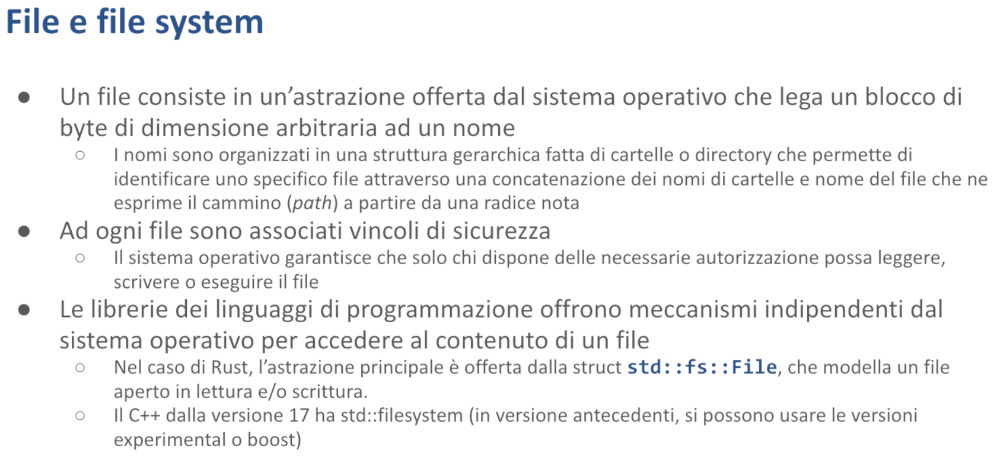

# File e I/O - Malnati 19 <!-- omit in toc -->

# Indice <!-- omit in toc -->
- [1. Introduzione](#1-introduzione)
- [2. Percorsi — `Path` e `PathBuf`](#2-percorsi--path-e-pathbuf)
- [3. Navigare il file system](#3-navigare-il-file-system)
- [4. Manipolare i file nel file system](#4-manipolare-i-file-nel-file-system)
- [5. I tratti relativi a I/O](#5-i-tratti-relativi-a-io)
  - [5.1 Il tratto `Read`](#51-il-tratto-read)
  - [5.2 Il tratto BufRead](#52-il-tratto-bufread)
    - [5.2.1 Esempio](#521-esempio)
  - [5.3 Il metodo `Write`](#53-il-metodo-write)
  - [5.4 Il tratto `Seek`](#54-il-tratto-seek)
- [6. Il framework `Serde`](#6-il-framework-serde)

# 1. Introduzione

Spessissimo le nostre applicazioni hanno l'**esigenza di mantenere nel tempo** delle informazioni.

Il modo base con cui i sistemi operativi offrono l'approccio alla persistenza è tramite il **concetto di file** e **Rust**, di conseguenza, attraverso la sua libreria standard, ci offre meccanismi per poter accedere ai file system.

Sapendo che i file system, pur concettualmente essendo presenti in *tutti i sistemi operativi*, sono praticamente diversi nelle loro varie installazioni.

Per cui, ad esempio, nel mondo **Windows** esistono molteplici file system che convivono parallelamente, per cui voi avete per ciascun volume in realtà una cartella radice che rappresenta quel disco, quindi i due punti, i due punti, ecc. — Sono in qualche modo separati.

Nel mondo **Unix**, viceversa, l'intero file system viene ricondotto a un'unica radice su cui eventualmente sono montati all'interno di particolari cartelle degli altri volumi, che però diventano parte di un'unica gerarchia.

Le notazioni usate nei file system sono simili ma diverse, banalmente i separatori di cartella nel mondo Unix sono basati sullo `/` (slash), in avanti nel mondo Windows sono basati sul `\` (backslash).

La natura dei nomi dei file nel tempo ha avuto delle manifestazioni.

Questi sono gli elementi *macroscopici* del file system, poi ci sono tutta una serie di dettagli ulteriori.

I singoli file all'interno del file system dispongono di **metadati**.

Esiste un **owner** di quel file lì, cioè quell'utente che è possessore del file stesso e che può avere, in quanto owner, certi *diritti di lettura, di scrittura, di esecuzione.*

Nel mondo Unix si aggiunge il concetto di ***gruppo***.
Quell'unico file lì appartiene anche a un certo gruppo, e di conseguenza tutti gli utenti che fanno parte del medesimo gruppo possono avere permessi dettagliati.

Poi ci sono tutti gli utenti che non sono né owner, né quelli che appartengono al gruppo di cui è dichiarato appartenere il file. Questi sono genericamente gli ***others***, che hanno ulteriori caratteristiche.

*Nel mondo Windows questa distinzione è molto più complessa, perché?*
Sebbene ci sia ancora l’owner, i privilegi di accesso ai file sono molto più complessi in quanto io posso aggiungere regole ad hoc che dicono *"Questo file lo vedono tutti tranne tizio"* oppure tranne quelli che hanno *certe caratteristiche*. 
Quindi andando a dare delle espressioni molto più articolate rispetto a quelle del sistema Unix e Unix-like.

Poi ci sono i *finti file*, ovvero delle cose che *appaiono* come elementi del file system, ma in realtà non sono dei veri file che risiedono sul disco, ma vengono fatti apparire come tali.
Ad esempio se avete una mattina Linux avete una cartella che si chiama `/proc`. Le cartelle presenti all'interno di `/proc` non sono veri file. I loro nomi sono numeri e corrispondono agli id dei processi in questo momento in funzione.

Per cui `/proc/3274` contiene degli altri finti file che danno informazioni ulteriori circa quello che sta facendo il processo 3274. Quindi ci trovate la mappa ad esempio della sua memoria, ci trovate i consumi che vengono fatti della CPU, tutta una serie di informazioni...
Se andiamo a guardare dentro il disco non c'è quella cartella, nel momento in cui il processo 3274 finisce, quella cartella svanisce.

Ci sono poi i file speciali. Di nuovo, il mondo Unix è pieno di queste cose qua:

- Alcuni file sono quelli presenti nella cartella `/dev`, ad esempio `/dev/tty` per esempio sembra un file ma in realtà mappa sulla porta seriale 1. Fisicamente se voi scrivete dei byte lì sopra e collegaste un dispositivo alla porta seriale vedreste i bit che salgono e scendono in concomitanza delle vostre scritture. Al contrario se cercate di leggere da quel file, leggete solo se qualcuno sta mandando dei byte a quella porta seriale altrimenti non ci leggete niente
- Poi ci sono i symbolic link, ovvero io posso dire che c'è nella cartella `alfa/beta` il file `gamma` che in realtà non è lui ma è un symbolic link al file che sta nella cartella `omega/zeta` e quindi tutte le volte che apro `alfa/beta/gamma` in realtà sto aprendo `omega/zeta`, questo però permette in certe situazioni di far sembrare una cosa che in realtà è un'altra

Questo ci dà l'idea che il concetto di file system e l'accesso alla persistenza è qualcosa di molto più elaborato di quanto normalmente possiamo pensare.

*Allora, Rust come ci dà accesso a queste cose qua?*

Di base l'idea di file è una pura astrazione che i sistemi operativi ci mettono a disposizione dicendo *"Io posso associare a un nome, più o meno articolato, un insieme di byte".* 

*Questo insieme di byte non rimane fisso nel tempo: ti fornisco degli strumenti per modificarlo in vari modi — sostituendolo completamente, aggiungendo contenuto alla fine, o modificando parti specifiche al suo interno.* E ti permetto anche di leggere questo insieme di byte

Quindi il file system sostanzialmente ci dà l'astrazione per poter, dato un nome articolato (lo chiamiamo path) che ci permette di riconoscere la sua posizione, accedere a questo blocco di byte che può avere una dimensione arbitraria molto più grande della massima quantità di spazio allocabile all'interno del processo — ciò che caratterizza i file è che tendenzialmente sono strutturati per poter contenere una quantità grande di informazione, che vuol dire che spesso e volentieri il nostro accesso al file avviene in una modalità di ***streaming,*** ovvero ne leggiamo un pezzo per volta e piano piano ne elaboriamo il contenuto.

Concettualmente i sistemi operativi ci permettono di raggruppare i file in cartelle e alle cartelle danno un meccanismo di accesso per cui io posso creare dei cammini per accedere a tali files, con alcune convenzioni che sono abbastanza standard.

Ad ogni file sono associati i vincoli di sicurezza che dicono *“Non tutti gli utenti della macchina possono accedere a questo file ma solo alcuni”* — *come?* I dettagli qua differiscono molto..

Tendenzialmente l'accesso al file system è uno di quelle zone che per prima ha avuto, nei vari linguaggi di programmazione, un meccanismo standardizzato multi piattaforma, per cui se voi in C dovete aprire un file usate la funzione `fopen` , se voi lo dovete fare in Java create un oggetto di tipo `FileInputStream` se lo leggete o `FileOutputStream` se lo volete scrivere e così via..

Ogni linguaggio ha trovato delle astrazioni che sono ragionevolmente indipendenti della piattaforma.
Anche Rust l’ha fatto e ci ha messo a disposizione sostanzialmente tutto un create che è `std::fs`.

All’interno di `std::fs` ci sono alcune astrazioni principali: una delle principali astrazioni che troviamo è l'astrazione che si chiama **`std::fs::File`** , che modella il concetto di file presente sul disco nel suo accesso sia in lettura che in scrittura.

Notate che mentre il singolo file è una cosa che standard lo è stata fin dall'inizio, il concetto di cartella e di accesso alla cartella *manco per idea.* 
Nel caso del C non c'è un bel niente: *come faccio a sapere quali file sono presenti in una cartella?*
Il C non mi da nessuna funzione sua standard della libreria per poterlo sapere, perché in Windows io devo cominciare a fare `FindFirstFile` e poi `FindFirstNext` tante altre volte finché non mi dice non ce ne sono altri, in Unix ho un altra api e così via… quindi i singoli stream operativi hanno delle funzioni che permettono di enumerare i file ma queste nel caso del C non sono state portate nella libreria standard.

Nel caso del C++ sono entrati nella libreria standard a partire dalla versione 17, quindi pochi anni fa. Viceversa, altrove fortunatamente, in Java ad esempio la classe `File` del package `java.utils` fin dalla versione 1.0 di Java aveva permesso di lavorare decentemente con le cartelle, per cui in Java la classe `java.utils.File` non modella i dati del file, ma modella l'entità file col suo nome e ci offre metodi come **`exists`** (per sapere se a quel nome ha associato o meno un file), ci offre il metodo **`erase`** (che ci consente di cancellarlo), ci permette di usare il metodo **`mkdir`** (che ci consente, se quel file non esiste già, di creare una cartella nella posizione indicata dal file con quel particolare nome) e così via.. 

Nel caso di di Rust noi abbiamo tutta una serie di classi che fanno parte di **`std::fs`** che ci aiutano.

# 2. Percorsi — `Path` e `PathBuf`

Siccome Rust pone tanta attenzione sulla **indipendenza dalla piattaforma** introduce un paio di classi che si chiamano **`Path`** e **`PathBuf`** che sono sostanzialmente analoghi per tante caratteristiche a `&str` (uno slice di caratteri) e un oggetto `String`.
L'oggetto `Path` rappresenta un cammino all'interno del file system che è accessibile in sola lettura, perché non lo possediamo.
Viceversa l'oggetto `PathBuf`, come `String`, rappresenta un cammino di cui abbiamo il possesso come contenuto e quindi lo possiamo modificare.

*Perché allora non sono stati usati* `&str` *e* `String`*?*
Sostanzialmente perché rispetto ad una stringa, che ha certe caratteristiche (una stringa ci offre i metodi tipo l’ `.upperCase` che sono molto generali e adatti a trattare il testo in quanto tale), gli oggetti di tipo **`Path`** e **`PathBuf`** ci offrono invece dei metodi che sono funzionali a navigare nelle cartelle. 

Quindi:

- **`Path`**, analogamente a `&str`, è un oggetto ***unsized:*** quindi di cui noi possediamo uno slice sostanzialmente e lo possiamo vedere solo in lettura
- **`PathBuf`** invece possediamo il contenuto e lo possiamo in qualche modo modificare.

Un oggetto di tipo file si distingue da una stringa anche per il fatto che noi concateniamo elementi in modo differente in base al sistema operativo: cioè col back slash piuttosto che col forward slash.

All'interno sono conservati una serie di metadati che di nuovo dipendono in qualche misura dal sistema operativo: tra i metadati importanti c'è l'***owner***, c'è la ***data di creazione*** ed ***ultima modifica.*** 

Questi ultimi due fattori sono molto interessanti nel contesto soprattutto della ***system integration*** cioè quando noi ci troviamo ad avere un pezzo di software che già esiste (che ha scritto qualcun altro e che fa delle cose) e abbiamo bisogno di fare in modo che *inter-operi* in qualche modo con un altro pezzo di software che ha scritto qualcun altro ancora che ha delle sue caratteristiche.

<aside>
💡 Spesso e volentieri i file sono un modo plausibile di ottenere una forma di system integration, perché se abbiamo, ad esempio, Word che crea i file .docx — io non so manipolare i file .docx, non so come word li generi eccetera.. però posso immaginare che mi metto a osservare una certa cartella e tutte le volte che vedo comparire un nuovo file .docx all'interno potrei decidere che quel file potrebbe magari servirmi da un'altra parte.
Quindi magari scrivo un programmino che me lo prende e lo copia su un disco, una cosa che sembra una cartella locale ma in realtà è google drive e quindi che ne so ho fatto l'archiviazione automatica dei miei file .docx.

Chiaramente in questo genere di operazioni sapere quando quel file è stato creato e quando è stato modificato è molto interessante perché pur non capendo niente della logica di come word aggiorna il file .docx, ma limitandomi a guardare l'oggetto file e monitorare la data di ultima modifica posso cercare di capire se quel file lì lo devo anche ricopiare da un'altra parte perché voglio farne il backup automatico oppure no. 

</aside>

Posso sapere anche che tipo di file ho in questione: un ***file semplice*** (cioè è associato ad un array di bytes di qualche genere), o se c'è un nome che rappresenta una ***cartella*** quindi un raggruppamento di altri file, o se è un ***collegamento simbolico*** (ovvero è un nome che in realtà è un alias di un file che è però da un'altra parte) etc… 

# 3. Navigare il file system

*Come facciamo a usare il sistema il file system?* 

Ci sono una serie di funzioni base che ci vengono esposte all'interno del crate `std::fs` che ci consentono di fare la maggior parte delle operazioni.

- **`read_dir`**
Accetta un riferimento a `Path`, e ci restituisce un iteratore a tutti file contenuti in una certa cartella. Siccome noi passiamo un `Path` e quel `Path` potrebbe anche non corrispondere a nulla (magari passiamo il percorso di una cartella che non esiste), la funzione non ci restituisce direttamente l’iteratore, ma ci restituisce un **`Result`** di un iteratore (in particolare un `io::Result`, una cosa che ci può dire *“Path not found”*).
- **`create_dir`**
Cerca di creare una nuova cartella nel Path che gli specifichiamo, e ritorna anche lei un `Result`.
- **`remove_dir`**
Cerca di eliminare una cartella tramite il `Path` che gli specifichiamo, e ritorna anche lei un `Result`.

Per poter eliminare una cartella, questa deve essere vuota e in più dobbiamo avere i diritti necessari, cioè dovremo essere noi gli **owner** della cartella stessa o avere i diritti di scrittura sulla cartella, altrimenti la funzione fallisce. 
Lo stesso vale per la creazione e anche per la lettura: la cartella potrebbe benissimo esistere ma noi non abbiamo i diritti di leggerla. 

# 4. Manipolare i file nel file system

Ci sono poi altre funzioni che facilitano proprio i concetti di system integration, in particolare la funzione **`copy`** che ci permette di copiare il file da un certo path ad un altro, se ci riesce ci dice quanti byte sono stati fisicamente copiati. 

La funzione **`rename`** viceversa sposta un file da una posizione a un'altra — a seconda dei sistemi operativi questo concetto di spostamento varia dal semplice *“Modifico alcune informazioni in una cartella”* al *“Lo copio fisicamente”.* 

In particolare, quando operiamo all'interno dello stesso file system, nella maggior parte dei casi viene semplicemente eliminata l'entry del file dalla cartella di partenza (ma il file rimane nella sua posizione con il suo inode e tutte le informazioni associate) e viene creata una nuova entry nella cartella di destinazione. Per questo motivo, l'operazione di ***rename*** all'interno dello stesso file system ha un costo computazionale molto basso.

Analogamente, se io lo rinomino nella stessa cartella, e da `/alpha/beta` lo voglio chiamare `/alpha/gamma` devo semplicemente cambiare la entry nella cartella `alpha` e cambiare da `beta` a `gamma`. 

Se invece io volessi spostare da `C:/alfa/beta` in `D:/gamma`, siccome `C:` e `D:` sono fisicamente due volumi disgiunti, è vero che faccio un rename ma quello equivale alla copia e poi alla cancellazione.

La funzione `remove_file` cerca di eliminare il file specificato tramite il path passato come parametro.

*Come facciamo a leggere e manipolare dei file?*
Nel momento in cui siamo interessati al contenuto del file (quindi non al file in quanto contenitore di byte generico che vogliamo spostare da una parte all'altra ma concentrandoci su un singolo file siamo interessati al contenuto) abbiamo vari meccanismi che ci consentono di accedere al contenuto del file o di cambiare il contenuto del file.

Di base c'è una struct che si chiama **`File`** che ci offre due metodi per essere istanziato: 

- **`open`** che prende un path in ingresso e restituisce un’istanza della struct `File` che corrisponde a un file che deve essere già presente all'interno del file system. Quindi serve fondamentalmente in quelle situazioni in cui noi vogliamo accedere a un file che esiste (prevalentemente per leggerlo ma in alcuni casi per scriverlo o per appendere)
- **`create`** che viceversa assume che quel file non ci sia e prova a crearne uno di dimensione zero, anche in questo caso con l'obiettivo di scriverlo. Se il file già esiste `create` butta via tutto quello che c'era dentro e quindi inizia con una *truncate*, quindi riporta il suo size a zero e da lì in avanti ci lascia operare

Di solito **`open`** ci dà la possibilità di aprire **in lettura**, ma possiamo cambiare queste cose attraverso la struct **`OpenOption`** che ci dà la possibilità di definire quale path vogliamo e quale modalità vogliamo usare.

Creare la struct `File` ci serve in quelle situazioni in cui pensiamo di dover lavorare col contenuto del file non *“tutto d'un colpo”* ma *“a pezzi”.*
Ad esempio, se questo file è molto grosso devo immaginare di poter aprirlo e leggerne un po’, farci delle cose, poi leggerne un altro po’, farci delle cose ecc.. 

Quando il file è piccolo (es. 100MB in un sistema desktop, non embedded dove già 100MB è “pesante”), allora magari è di una dimensione compatibile con lo spazio che posso allocare all'interno del mio processo.
In questo caso ho due funzioni che mi fanno la vita molto comoda: 

- **`read_to_string`** prende il file e mi restituisce il suo contenuto sotto forma di stringa
- **`write`** prende uno slice di byte (`&u8`) e lo scrive dentro il file, quindi quello che c'era nel file va perduto e viene sostituito dal blocco che io gli passo

Quindi in quelle situazioni in cui io so a priori che le cose che devo trattare stanno probabilmente nel mio spazio indirizzamento, con questi due metodi ho tutto quello che mi serve ed è molto più agile poi lavorare direttamente su una stringa o su uno slice di byte piuttosto che operare a pezzi su blocchi che devo capire come li segmento, come li congiungo e così via… 

<aside>
💡 Nell’esempio in slide, vediamo che **`read_to_string`** prende come argomento una variabile **`filename`** , che deve essere di tipo `&Path`.
Noi potremmo passarvi anche una stringa, ad esempio **`"C:/alpha/beta"`** perchè i `&str` (slice di caratteri) sono riconducibili ad un `Path`, perchè implementano il tratto **`From`** e quindi possiamo convertirli in automatico.

</aside>

Nelle situazioni invece in cui vogliamo scriverlo pian piano, posso popolare questo file in vari modi.

In questo esempio parto da un nome di un file `path = "lines.txt"`. 
Questo è un `&str` normalissimo. Lo passo alla funzione `file::create`. 

La funzione `file_create` mi restituisce un file aperto **in scrittura**. L'oggetto `output` è di tipo `File`, ed è `mut` perché devo avere la possibilità di modificarne il contenuto.

*Come faccio a scrivere dentro questo file?* 
Io posso scrivere, ad esempio, con la macro `write!`. 

`write!` è molto simile a `println!`, ha un parametro in più iniziale, che è l'oggetto `File` su cui devo fare la scrittura. Quindi `write!(output, ...)`, e poi ci metto una stringa, che potrebbe contenere delle graffe, con gli indicatori e dei parametri ulteriori, proprio come farei con la `println!`.

Fatto così, ho creato un file che ha esattamente quel contenuto. Ci sono anche altri modi di fare questa cosa. 

Se io lo volessi leggere a questo punto, probabilmente potrei usare la `read_to_string`, oppure posso cercare di leggerlo a pezzettini.

Un modo per leggerlo a pezzettini è usare un `BufReader`. 
`BufReader` è un particolare oggetto, un tipo di struttura, che mi permette di leggere un file **riga per riga**. 

In questo caso apro il file in lettura con **`File::open(path)?;`** (punto interrogativo perché quell'operazione potrebbe fallire), e a partire da questo oggetto `File` creo l'oggetto `BufReader` che è specializzato nel leggere da un file che gli passo al lato della costruzione e mi offre meccanismi per andarci all'interno.

Tra i meccanismi che mi offre c'è l’iteratore **`.lines()`**, metodo che mi dà le singole righe presenti all'interno e a questo punto, avendo **`for line in bufferd.lines()`,** per ciascuna riga presente all'interno faccio la stampa.

Va detto che la lettura della singola riga potrebbe sempre fallire così come anche l’iteratore che che mi fa vedere tutti file della cartella che gli ho specificato e cose del genere — sono tutti iteratori che ritornano un `Result`.

Siccome **`File`** implementa la strategia RAII *(Resource Acquisition Is Initialization)* automaticamente, quando la variabile esce di scope il file viene chiuso e quindi non mi devo occupare di chiudere il file esplicitamente. 

Se ho bisogno posso anticipare la sua uscita di scope facendo in modo esplicito il `drop` del mio oggetto file così che il suo distruttore viene invocato.

# 5. I tratti relativi a I/O

Esistono alcuni tratti fondamentali che semplificano l'implementazione e consentono di gestire le operazioni di I/O in modo analogo alle operazioni sulla memoria normale.
Quattro tratti in particolare sono essenziali: il tratto `Read`, il tratto `BufRead`, il tratto `Write` e il tratto `Seek`.

Questi tratti fanno parte del **preludio**, ma non del preludio standard completo. Di conseguenza, sono disponibili automaticamente se includiamo il preludio, altrimenti dobbiamo importarli separatamente.

In tutti i vari casi le operazioni che questi 4 tratti fanno restituiscono dei `Result`, che se sono positivi contengono di volta in volta un numero (quanti byte ho fisicamente letto/scritto piuttosto che un `void()` per dirmi che non c'era nessun risultato particolare o altro) nel caso di errore mi arriva un errore che è definito dalla struct **`ErrorKind`** .

Alcuni degli errori presenti in **`ErrorKind`** sono ingestibili, cioè posso solo arrendermi (es. il file non esiste). Ce n'è uno in particolare che è **`Interrupted`** che invece denota una situazione ***transitoria,*** cioè se il risultato è `Interrupted` potrebbe valer la pena metter in atto la strategia di riprovarci dopo un po’. 

Va detto che nella maggior parte delle situazioni la strategia di riprovarci è un bagno di sangue perché devo capire cosa devo riprovare e come lo riprovo, quindi anche se in linea di principio sarebbe gestibile, nella maggior parte delle situazioni non si gestisce e si preferisce lasciar perdere.

*Chi è che implementa il tratto* **`Read`** *?*
Il tratto `Read` è implementato da tre cose che sono molto diverse tra di loro: **`File`** implementa il tratto `Read` (posso leggere un blocco binario di dati da un file, ma anche dei caratteri, o delle stringhe etc...).

`Read` è implementato anche dalla struttura che si chiama **`Stdin`** che rappresenta il **flusso di default di ingresso** di un processo. Normalmente se noi non facciamo niente di particolare quel flusso di ingresso corrisponde con la tastiera e quindi quello che l'utente può digitare. Noi sappiamo però che quando attiviamo un processo possiamo ridirigere il suo standard input usando i comandi che la shell ci offre quindi con `>` con `|` o cose del genere per fargli entrare in ingresso altre cose.

Un altro oggetto che implementa lo stesso tratto `Read` è l'oggetto **`TcpStream`** che rappresenta invece una connessione di tipo TCP con un host. Notiamo che `TcpStream` rappresenta uno dei due endpoint — non sta dicendo nè che siamo server nè che siamo client perché una volta che la connessione TCP è stata stabilita, non c'è più nessuna differenza tra il server e client: la connessione è completamente bidirezionale. L'oggetto `TcpStream` rappresenta una connessione che è stata messa in piedi e a questo punto su questa connessione io posso leggere.

La lettura qua è una lettura che va a fare una system call (quindi interpella il sistema operativo) ogni volta che gli chiedo qualcosa; questo in alcuni casi va benissimo, in alcuni casi è un grosso problema: se ricordate in precedenza abbiamo parlato di come funzionano le cose abbiamo detto che io chiamo l'API del sistema operativo attraverso una funzione particolare (la system call) che mi innalza di privilegio e che in generale è un'operazione costosa — es. su un x86 la call normale costa 5 cicli macchina, mentre la system call ne costa 500.
Allora se io leggo un byte alla volta (perché sto leggendo tipo da tastiera), la lettura di quel byte mi costa 500. Ma io potrei piuttosto dire *“Leggimene all'ingrosso 500 e tieniteli lì in pancia, poi te li chiedo uno alla volta”.* In questo modo l'interazione col sistema operativo avviene molto più raramente: tutte le volte il sistema operativo dice *“Dammi i prossimi 500 byte se ce li hai, me li porto in pancia e poi al mio client (cioè il pezzo di sotto che ne ha bisogno) ne dò quelli che mi sta chiedendo”.*
Questo è fatto dal tratto **`BufRead`**, che dice *“Tra i dati che tu mi chiedi e quelli che io mia volta chiedo al sistema operativo interpongo un buffer”.*

*Quali sono le struct che implementano il tratto **`BufRead`** ?*
La struct **`BufReader`** è specializzata nel leggere da un file a **chunk grossi** dando poi i dati uno alla volta per come sono, perché vedete che **`BufRead`** è una specializzazione di **`Read`**, quindi ha **tutti i metodi** di `Read` e ci aggiunge i propri. 

`BufReader` offre funzionalità aggiuntive oltre ai metodi generali, come l'iteratore `.lines()`. Poiché carica molti dati in memoria in un colpo solo, può implementare efficacemente questo iteratore scorrendo il suo buffer interno. Quando trova un carattere di fine riga, restituisce la riga completa immediatamente. Alla richiesta successiva di `next()`, continuerà la ricerca dal punto in cui si era fermato. Se esaurisce i dati nel buffer, richiederà automaticamente altri dati al sistema operativo per riempire nuovamente il buffer.

C'è anche un altro oggetto che implementa `BufRead`: è **`Cursor`**, un oggetto un po’ particolare che mi permette di muovermi all'interno di uno slice di byte, che può essere fatto in vari modi. 

E poi c'è **`StdinLock`.** 
Da `Stdin` normale io leggo un byte alla volta i singoli caratteri che digito (*c i a o*) e se se fossimo in due a leggere io magari leggo (*c i*) e l'altro legge (*a o*) della parola *ciao,* perché nel momento in cui io chiedo il prossimo disponibile, questo viene **consumato.** Se io volessi leggere una sequenza devo prendere possesso di `Stdin`, e quindi **`StdinLock`** serve proprio a dire *“Ho preso in modo esclusivo l'accesso a standard input e adesso posso leggere, ce l'ho a blocchi e quindi posso fare read line”.*

Poi c'è invece il tratto **`Write`** che è implementato da tutta una serie di altre struct: la struct **`Stdout`** rappresenta il flusso di uscita standard di un processo (questo di solito coincide col terminale nell'applicazione basata su terminali ma può essere ridiretto verso un file, verso un altro processo e così via).
**`Stderr`** rappresenta il flusso di errore di un file.
Anche la struct **`File`** implementa `Write` proprio perché io ho la possibilità di mandare un byte o un chunk di byte verso un file.
Anche la struct **`TcpStream`** implementa `Write`, perché `TcpStream` è bidirezionale (posso leggere e posso scriverci).
Anche **`Vec<u8>`** implementa `Write`: posso trattare un vettore come il destinatario di un file — come tratterei un file in scrittura, cioè posso buttare lì dentro esclusivamente un vettore di byte. 
Infine **`BufWriter`** è una specializzazione del tratto `Write` e mi aggiunge la capacità di dire che *“i singoli byte che mi dai non li passo subito al sistema operativo come fanno normalmente tutti gli altri, ma me li tengo in pancia finché non ne ho abbastanza e quando ne ho abbastanza te li scrivo”* così da far sì che questa barriera tra il codice utente e il codice del kernel sia attraversata ogni tanto e non per ogni byte o cose del genere, che altrimenti diventa costosissimo.

## 5.1 Il tratto `Read`

Il tratto `Read` è implementato da tutti coloro i quali permettono di leggere, un byte alla volta o un chunk di byte alla volta. Di base l'operazione elementare che il tratto `Read` offre è il metodo **`read()`** che accetta un `&mut [u8]` (cioè un riferimento mutabile ad uno slice di byte) e mi dà la possibilità di leggere al suo interno sapendo che se quel buffer che ho passato contiene 100 byte lui proverà a leggerne 100 ma potrebbe riuscire a leggerene solo 32, o 27, o anche 0, e quindi come risultato mi dà un `Result` che contiene nel caso di `Ok` il numero di byte che ha effettivamente letto.

All'interno del tratto `Read` ci sono tanti altri metodi che sono definiti tutti quanti con una implementazione di default, e l'implementazione di default che è fornita di questi altri metodi è basata sul metodo `read()`, quindi se noi avessimo bisogno di implementare il tratto `Read` per una nostra struttura particolare l'unico vero bisogno che abbiamo è implementare il metodo `read()`. 

Poi ovviamente potremmo decidere di implementare anche qualche altro metodo, se avessimo per il nostro caso particolare delle ottimizzazioni possibili rispetto alla funzione di default, ma in termini strettamente funzionali non sarebbe necessario.

In generale, il metodo `read()` restituisce un risultato che, se negativo, contiene la descrizione dell'errore. Se positivo, il valore varia tra 0 e la lunghezza massima del buffer.

È importante capire che quando leggiamo e otteniamo **`Ok(0)`**, questo può verificarsi in due situazioni:

- La più frequente è quando raggiungiamo l'**end of file**. 
Questo accade solo se il buffer ha dimensione maggiore di 0.
- Quando il buffer passato ha dimensione 0.

<aside>
💡

**Nota**
Se passiamo uno slice di size 0 (cosa possibile), otterremo necessariamente `Ok(0)`, semplicemente perché non c'è spazio per leggere: in pratica ci dice *"ho letto 0 byte".*

</aside>

Ogni volta che chiamiamo `read()`, viene effettuata una system call che comporta un cambio di contesto (questo accade nella maggior parte dei casi). Questa system call è costosa, richiedendo 500 cicli macchina.

*Quali sono tutti gli altri metodi che il tratto* `Read` *mi offre (e che di conseguenza trovo dentro* `File`, **`Stdin`*,* `TcpStream` *etc...)?* ****

**`read_to_end`** → gli passo un `Vec<u8>` e lui mi riempie questo vettore col contenuto di tutto il file; chiaramente questo lo devo fare facendo attenzione che la dimensione del file sia compatibile con la memoria allocabile del vettore: se quel file lì è 200 giga non è detto che io riesca allocare 200 giga nel mio spazio di indirizzamento.

**`read_to_string`** → metodo che in questo caso prende come parametro un variabile tipo `String` e fa il medesimo giro con un controllo in più: mentre nella `read_to_end` i byte così come sono vanno bene (qualunque questi byte fossero), nel caso di `read_to_string` viene fatto il controllo che quei byte formino una stringa utf-8 ben formata e quindi nel caso in cui ci fossero sequenze impossibili mi generano un errore.

**`read_exact`** → molto simile a `read()` ma prova a leggere esattamente quel numero di byte di cui abbiamo passato il buffer; quindi io ho passato un buffer da 100 byte e lui cerca di riempirmeli tutti quanti; se non riesce a riempirmeli tutti quanti mi dà errore ***“Unexpected end of file”***. 

**`bytes`** → mi restituisce un iteratore che mi permette di tirare fuori i byte uno alla volta; questi byte mi escono non come singoli byte ma come `Result` dove in `Ok` ho un byte e nel caso contrario ho un **`io::Error`** di un qualche tipo.

**`chain`** → interessante perché mi permette di attaccare un `Read` a un altro `Read`, ad esempio io so che ho spaccato un file grosso in tre pezzi e ho messo l'inizio in file 1 la metà in file 2 e il resto in file 3 e quindi posso creare un oggetto `Read`, quindi apro per esempio un file col metodo `open` , su quel file li faccio **`.chain(file2).chain(file3)`** e a questo punto ho creato una struttura che è la concatenazione di tutto. Quando comincerò a farmi dare dei contenuti questi verranno prelevati da file 1 finché ce n'è, quando arrivo al fondo di file 1 verranno presi da file 2 finché ce n'è, e poi verranno presi da file 3 finché ce n’è.

**`take`** → mi dà un iteratore che prende al massimo il numero di byte che io gli dico, quindi mi permette di porre un limite a priori sulla quantità di byte che voglio andare a prendere. 

## 5.2 Il tratto BufRead

*Cosa mi aggiunge **`BufRead`**?* 

Gli oggetti che implementano il tratto `BufRead` (quindi `BufReader` oppure `StdinLock` ecc..) mi danno alcuni metodi ulteriori: in generale internamente si basa su due metodi fondamentali che sono **`fill_buf`** e **`consume`** . 
Sono metodi che lui usa per implementare gli altri metodi, e che noi di solito non chiamiamo in modo esplicito, perché ci interessano molto di più tutti gli altri che offre tra i quali c'è **`read_line`** che legge una singola riga di testo fino allo `/n`, o **`lines`** che ci dà l’iteratore che ci permette di prendere le righe una alla volta.

### 5.2.1 Esempio

Qui vediamo un esempio d'uso: prendo uno stdin, faccio `stdin.lock` e a questo punto trasforma il mio oggetto `stdin` che potrebbe essere usato da altri in contemporanea in un oggetto che appartiene solo a me e su cui ho il tratto **`BufRead`** . A questo punto posso usarlo per farci delle cose. 
Con **`handle.fill_buf().unwrap();`** stiamo chiedendo di prendere tutto quello che riesce all'interno del buffer che internamente lui si è allocato, lo stampo, mi chiedo anche quanto è grande e a questo punto quello l’ho consumato. Questo è il meccanismo che internamente i vari metodi implementati da `BufRead` usano per gestirsi le cose. Noi di solito queste chiamate però non le facciamo così perché è una seccatura; noi quando creiamo gli oggetti `BufRead` chiamiamo **`read_line()`** piuttosto che **`lines()`** che è molto più comodo. 

## 5.3 Il metodo `Write`

Il tratto **`Write`** è implementato da varie strutture (`File`, `Stdout`, `Stder` e così via..) e all'interno contiene due metodi: 

- **`write()`** che affida al sistema operativo un blocco e il sistema operativo saprà che dovrà recapitarlo al dispositivo di io corrispondente, ma non è obbligato a farlo subito
- **`flush()`** che viceversa è responsabile di garantire che il sistema operativo prende tutto quello che ha tenuto e fisicamente lo trasferisca fino in fondo così che se qualcuno va ad accedere sul device ci trova esattamente quello che io penso di averci messo

Oltre a questi due metodi ce ne sono altri qui che vale la pena di citare: **`write_all`** si prende uno slice come argomento, e garantisce che lo trasferisce per intero. Essenzialmente fa `write` e `flush` in un colpo solo.

## 5.4 Il tratto `Seek`

Fino ad adesso abbiamo visto i file come oggetti di tipo ***stream***, cioè oggetti in cui scriviamo aggiungendo sempre alla fine o da cui leggiamo i contenuti nell'ordine in cui sono stati scritti, dal primo all'ultimo byte. In questo modo manteniamo l'ordine sequenziale sia in scrittura che in lettura.

Ma in realtà un file è semplicemente un array di byte, e nulla ci impedisce di muoverci liberamente al suo interno. Questo funziona in modo diverso a seconda del tipo di file: su disco, dove il file è effettivamente un array di byte, ha senso spostarsi in modo casuale e dire *"alla posizione 32 scrivo questo, poi torno alla posizione 0 e scrivo quest'altro, poi vado alla posizione 150 e scrivo quest'altro"*.

Il file inteso come ***porta seriale***, invece, non può essere trattato in questo modo: anche se ci appare come un file, non è *seekable*. Questo perché la porta seriale è, come dice il nome, seriale, e i byte che vi inseriamo *"vanno a casa di qualcun altro"*. Non possiamo dire *"no scusa, torno indietro"*: il tempo scorre in una sola direzione.

Quindi di tutte quelle cose che a noi sembrano files, alcune sono ***seekable***, altre non lo sono. 
Per quelle che sono seekable però abbiamo la possibilità di farci delle operazioni abbastanza interessanti: abbiamo la possibilità di dire che noi leggiamo i contenuti di questo grosso byte array che il file modella, in un qualche ordine che possiamo andare a definire — di base l'operazione `read` o l'operazione `write` avviene su quella che è la ***posizione corrente del file.***

La posizione corrente è stabilita al lato dell'apertura: quando apriamo un file nella modalità read o nella modalità write, la posizione iniziale è zero e quindi `read` legge il primo, secondo, il terzo o quarto byte, nel `write` scrivo il primo, il secondo, il terzo o quarto byte. Quando apriamo un file nella modalità **append** la posizione iniziale è al fondo, e quindi `append` è una modalità di scrittura dove invece di sovrascrivere quello che c'è aggiungo dei pezzi.

Noi però possiamo muoverci anche tornando indietro ecc.. il tratto **`Seek`** ci consente fondamentalmente di muoverci dall'inizio, dalla fine o dalla posizione corrente di un certo ***delta***. 

Quindi ad esempio **`SeekFrom::Start`** diciamo *“a partire dalla posizione zero del file porta la posizione corrente avanti di tot posti”,* oppure dall'end invece **`SeekFrom::End`** partendo dal fondo del file torna indietro di tanti altri oppure **`SeekFrom::Current`** dice *“da dove sei adesso vai avanti o indietro di una certa quantità”.*

Notate che `SeekFrom::End` prende un numero **con segno** perché io potrei cercare di tornare indietro oppure potrei voler andare comunque avanti per allungare il file. **`SeekFrom::Start`** prende un `u64` perché dall'inizio non posso andare a “prima dell’inizio del file”. 

Ci sono tre metodi fondamentali che chi implementa il tratto **`Seek`** ci mette a disposizione: il metodo **`seek()`** stesso che mi permette di cambiare qual è la produzione corrente da cui vado a fare le letture o su cui vado a fare le scritture, **`rewind()`** che mi permette fondamentalmente di ritornare all'inizio del flusso (quindi equivale a **`SeekFrom::Start(0)`**) e infine c'è il metodo **`stream_position()`** che mi ritornà qual è l'attuale posizione di questo file.

*Come facciamo a leggere dei dati binari di qualche tipo?* 

Supponiamo volessimo aprire un **pdf**, che è un file che ha un formato binario al suo interno: certo ci sono anche delle parti stringa, ma ci sono anche *immagini*, *codici di formattazione*, *cose strane* etc. 

Per cui di per sé non abbiamo la garanzia che contenga dell'`utf-8` quindi dobbiamo leggere come array di byte. Qua proviamo a farlo: nell'esempio in realtà leggo (nel caso di Linux) dal device che si chiama ***urandom***, un particolare device che viene montato. È un finto file (infatti sta nella cartella `/dev`) che quando lo leggo mi genera dei byte a caso appoggiandosi a una qualche periferica che, attraverso un fenomeno fisico di qualche genere, prova a generare dei numeri che siano robustamente casuali.

<aside>
💡 Un modo per generare dei numeri robustamente casuali è fare lavorare un diodo zener in corrispondenza del punto di gomito della sua curva tensione corrente, che è una zona di grande aleatorietà dove, tenendo in quella posizione li, a volte leggo uno a volte leggo zero in un modo non controllabile. Siccome è un fenomeno fisico che dipende da tutta una serie di faccende varie, quella è una buona sorgente di variabilità e di conseguenza può essere messo all'interno della nostra CPU un chip che internamente fa questo mestiere, e quando leggiamo da ***urandom*** in realtà andiamo a interrogare questo chip che ci genera dei byte a caso.

In altre situazioni si usano dei sensori (dei muoni piuttosto che di altre particelle che ci arrivano dai raggi cosmici sostanzialmente) che di nuovo sono abbastanza impredicibili e tra l'altro sono rilevabili anche negli ambienti interni perché attraversano una serie di situazioni e quindi questi sono tutti fenomeni difficilmente caratterizzabili.

Perché è importante essere difficilmente caratterizzabile? 
I numeri random noi li possiamo usare per scopi molto diversi: li possiamo usare banalmente per pseudo simulazioni — fate un giochino, c'è il mostriciattolo che vi insegue che a volte gira destra e a volte gira a sinistra, va bene chi se ne frega.
Ma se invece di fare il giochino o la simulazione di qualcos'altro stiamo facendo la crittografia per proteggere una transazione bancaria, se l’algoritmo non è un vero random ma è uno pseudo random (che di fatto è assolutamente predicibile: qualcuno potrebbe aver studiato un po’ di bit precedenti e fare un ***educated guess*** su quali saranno i bit a venire) questo sarebbe rischiosissimo. Per questo motivo ci serve avere un generatore di numeri casuali che sia legato a fenomeni fuori dal controllo.

</aside>

In questo caso qui apriamo il device che si chiama `dev/urandom` e in questo caso noi sappiamo che questo ci dà un 32 bit, quindi prepariamo un buffer di 4 byte `let mut buff = [0;4]` — quello lì è un buff di 4 byte inizialmente tutti i posti a 0. E poi chiamiamo `f.read_exact(&mut buff)` , cioè riempimi questi 4 byte con il contenuto del file urandom. Se qualcosa va storto ritorna l'errore, dopo di che se invece non è un errore all'interno dell’array buff ho i 4 byte completamente random e quindi vado a vedere cosa succede e vedo: se in questo caso ne trovo uno tutto a 0 la pianto lì subito dicendo ok altrimenti provo a trasformare questo numero in un intero 32 bit e ci faccio qualcosa in questo caso lo stampo.

 

Altre volte, invece di leggere brutalmente un blocco di byte così com’è nel disco o code del genere, io ho bisogno di leggere dei dati che so essere strutturati: ad esempio un file csv che contiene qualche milionata di numeri. 
Posso farmi questa lettura a mano: faccio open, ci creo un BufReader sopra, a questo punto punto con .lines ho la linea, quella linea lì la devo spezzettare, faccio .split sulla virgola ottengo i singoli chunk, devo ricordarmi che il primo vuol dire una certa cosa, il secondo vuol dire un’altra cosa etc..

Si può fare, però è una seccatura: il giorno che quelli che hanno generato il .csv cambiano il formato e mi dicono devo mettermi lì e paccioccare ed essere sicuro di farlo bene.
Mi farebbe molto più comodo poter descrivere quelli che sono i campi e poi mi farebbe piacere avere qualcosa che me li trasforma per i fatti suoi, e qui ci viene in aiuto un crate che possiamo includere all'interno delle nostre progetti che si chiama **`Serde`** .

***Serde*** sta per ***serialization e deserialization***. 
Serialization è l'operazione di trasformare il dato dal formato interno di Rust a un formato esterno, e deserialization è l'operazione di trasformare dal formato esterno in quello interno di Rust. 

In realtà di formati esterni ce ne sono 20 mila possibili, .csv è solo uno di questi. Serde è un crate che definisce un framework generale e poi ha una serie di sottocrates che ne specializzano il comportamento in un modo o nell'altro. 
Di suo Serde ci offre due tratti: **`Serialize`** e **`Deserialize`**.
Perchè sia utile, possiamo includere la macro derive che ci dà la possibilità di creare in automatico le funzioni serialize e deserialize per le strutture dati che andiamo a definire per i fatti nostri.

# 6. Il framework `Serde`

Includendo serde nel Cargo.toml abbiamo ora disponibili il framework serde e la macro derive. Ma il framework serde è un framework di serializzazione generico: sa serializzare, ma cosa ci serve serializzare?
Allora dobbiamo includere le “specializzazioni”, dunque includiamo anche `serde_json`.