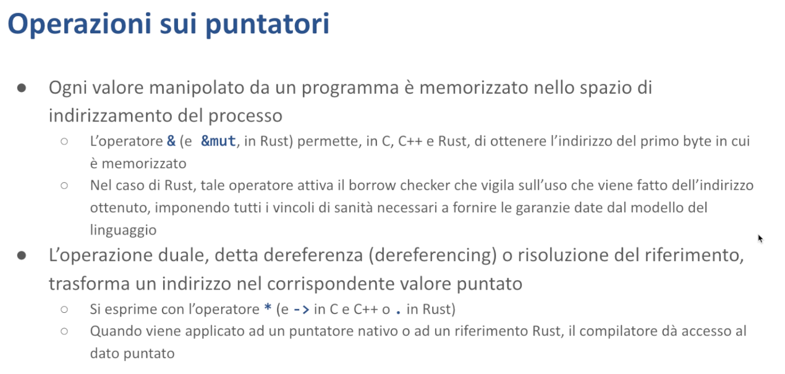

# Smart Pointer - Malnati 20-21 <!-- omit in toc -->

# Indice <!-- omit in toc -->
- [1. Introduzione](#1-introduzione)
  - [1.1 Smart pointer in C++](#11-smart-pointer-in-c)
    - [1.1.1 `unique_ptr`](#111-unique_ptr)
    - [1.1.2 `shared_ptr`](#112-shared_ptr)
    - [1.1.3 Dettagli implementativi di `unique_ptr`](#113-dettagli-implementativi-di-unique_ptr)
    - [1.1.4 Esempio `unique_ptr`](#114-esempio-unique_ptr)
    - [1.1.5 Dettagli implementativi di `shared_ptr`](#115-dettagli-implementativi-di-shared_ptr)
    - [1.1.6 Esempio `shared_ptr`](#116-esempio-shared_ptr)
    - [1.1.7 Dipendenze cicliche](#117-dipendenze-cicliche)
    - [1.1.8 `weak_ptr`](#118-weak_ptr)
- [2. Smart pointer in Rust](#2-smart-pointer-in-rust)
  - [2.1 I tratti `Deref` e `DerefMut`](#21-i-tratti-deref-e-derefmut)
  - [2.2 Box](#22-box)
    - [2.2.1 Esempio](#221-esempio)
  - [2.3 `Rc`](#23-rc)
    - [2.3.1 Esempio](#231-esempio)
    - [2.3.2 Esempio `Weak`](#232-esempio-weak)
  - [3.3 `Cell`](#33-cell)
    - [3.3.1 Esempio](#331-esempio)
    - [3.3.2 Metodi offerti da `Cell`](#332-metodi-offerti-da-cell)
  - [2.4 RefCell](#24-refcell)
    - [2.4.1 Esempio](#241-esempio)
  - [2.5 `Cow`](#25-cow)
- [3. Smart pointer e metodi](#3-smart-pointer-e-metodi)
- [4. Tabella riassuntiva](#4-tabella-riassuntiva)
- [5. Riferimenti](#5-riferimenti)

# 1. Introduzione

L'argomento che adesso introduciamo è un po’ più complesso — non è complessissimo, ma in realtà ha alcune caratteristiche che rendono la programmazione in C++ (dove per primo è stato introdotto) e in Rust particolarmente diverso da quello che succede altrove. Ed è alla base di moltissimi dei comportamenti che ci interessano, perché danno una correttezza semantica alle operazioni che andiamo a svolgere, lasciandoci la libertà di poter usare il concetto di puntatore in tutte le situazioni in cui ci serve.

Vediamo di capire di cosa stiamo parlando. 

Noi sappiamo che i dati su cui lavoriamo sono memorizzati nel contesto dello spazio di indirizzamento del nostro processo. In generale noi possiamo fare riferimento a questi dati se sono posseduti direttamente dalle variabili che li posseggono. Alternativamente abbiamo un modo efficiente in Rust, che è quello dell'uso dei **reference** o dei **refmut**, per poter accedere a un dato di cui non abbiamo il possesso, ma di cui otteniamo temporaneamente la possibilità di leggere o di scrivere.

Tuttavia, questo vale in Rust, vale in C, vale in C++. A differenza di quello che succede in C e C++, dove è sempre possibile recuperare il puntatore a un valore, anche quando quel valore potenzialmente non esiste più e così via, dando origine a una serie di problemi, in Rust abbiamo che il **borrow checker** ci garantisce che noi possiamo dereferenziare un riferimento solo quando lui è in grado di dimostrare logicamente (quindi attraverso un processo logico-matematico) che non c'è rischio ad accedere a quel particolare riferimento. 

Questa è la ragione principale della salvezza, nel senso che ci garantisce una correttezza di accessi e ci elimina tutti quei vari casi di *undefined behavior* che nascono nell'utilizzo del C e del C++.

Tuttavia, in alcuni casi, questo restringimento, questa forma di restrizione operata dal borrow checker, può essere più stringente di quello che noi vorremmo. 

*Perché?* Perché ci sono casi leciti in cui, a seguito di una serie di cose che il compilatore non riesce a dimostrare per i fatti suoi, noi potremmo comunque dereferenziare certi valori, ma lui non capisce e quindi ce lo proibirebbe.

In generale, noi sappiamo che se disponiamo di un puntatore, noi possiamo eseguire l'operazione chiamata **dereferenza**, o *risoluzione del riferimento*, applicandogli un asterisco. 
L'operatore asterisco applicato di fronte a un puntatore ci permette di accedere al contenuto della o delle celle, a cui quel puntatore fa riferimento. 

Nel caso di Rust si usa asterisco e basta, nel caso del C o del C++, a secondo della sintassi usiamo `*` oppure `->`. Freccia è un modo condensato per dire “dereferenza e offset”. 
Asterisco sostanzialmente si usa nel contesto di un campo, per cui `p->b`, se `b` è un campo all'interno di una certa struttura allora si trova ad un certo offset dal suo inizio, per cui `p->b` è uguale a `*p + offest_di_b` .

Tipicamente, se noi usiamo l'operatore asterisco nei confronti di un dato che è un puntatore, il compilatore fa per noi questo lavoro, generando l'istruzione assembler corrispondente a fare questo tipo di cosa. Tuttavia, sia in Rust sia in C++, noi abbiamo la possibilità di insegnare al compilatore che ci sono degli altri tipi che non sono di natura loro puntatori — sono tipi, che però noi vogliamo far sembrare puntatori.

Notate che questo meccanismo l'abbiamo già scoperto con le funzioni. Gli oggetti funzionali in C++ sono cose che non sono funzioni, ma siccome definiscono `operator()`, li possiamo usare come funzioni, con una serie di vantaggi aggiunti, perché avendo dei campi, all'interno di questi campi io posso conservare uno stato e quindi quelle funzioni che implementano si ricordano di quello che è capitato.

La stessa tecnica la posso utilizzare con i puntatori. Facendo **overload**, nel caso del C++, dell'**operatore asterisco** e dell'**operatore freccia**, che sono solo due variazioni sintattiche dello stesso concetto, io ho la possibilità di insegnare al compilatore che un certo mio dato si comporta sintatticamente come si comporterebbe un puntatore, ma dal punto di vista semantico può fare delle cose in più che un puntatore semplice non sarebbe in grado di fare.

E queste cose in più che mi possono dare sono, ad esempio, la **garanzia di inizializzazione** o di **rilascio**. Quando io ho una variabile in C, di tipo `int*`, non posso dire se è stata inizializzata, posso guardare se è uguale a `null` o a zero, ma supponendo che contenga un numero diverso da zero, io non so dire se quel numero diverso da zero è un indirizzo valido o è semplicemente del garbage, della spazzatura che è rimasta dentro perché nessuno gli ha attribuito qualche cosa.

Viceversa, uno **smart pointer**, un oggetto che *si veste da puntatore*, può garantirmi questo, ad esempio attraverso il fatto che io lo posso solo costruire attraverso un suo *costruttore* o una sua *funzione di inizializzazione* e questa si prende la briga di metterci dentro delle cose sensate. Così come posso garantire il rilascio, proprio perché quella struttura lì potrà avere un *distruttore* e di conseguenza il distruttore può prendersi la briga di garantirmi che il rilascio viene fatto.

Oppure potrei implementare delle politiche più sofisticate, come quelle di **conteggio dei riferimenti** che adesso vediamo. Oppure potrebbe garantirmi l'**accesso condiviso** da più parti ma mutuamente esclusivo nel tempo, ovvero io posso avere due o più che vogliono usare questo puntatore ma mai insieme, *perché?* Perché se cercassero di farlo insieme uno dei due sarebbe obbligato ad aspettare e passerebbe prima l'altro e solo quando l'altro avesse finito, allora chi si presenta dopo potrebbe entrare.

Quindi esistono diversi comportamenti possibili quando una struttura dati, oltre all'indirizzo di memoria (che è semplicemente un numero a `32` o `64` bit, a seconda dell'architettura), contiene anche altre informazioni. Queste informazioni aggiuntive vengono utilizzate per modificare il comportamento della struttura quando si comporta come puntatore.

Ragionando su queste cose qui, ad un certo punto nella storia del C++ è nata l'idea degli **smart pointer**. Rust l'ha fatta sua profondamente e ai tre smart pointer presenti nel C++ moderno ne ha aggiunti una serie che oggi vogliamo scoprire. Questi smart pointer sono utilissimi perché ci risolvono una serie di problemi. Va detto che nel C++ moderno c'è una delle regole fondamentali è proprio quella di dire “*non usare mai puntatori nativi ma usa solo smart pointer, che sono gli unici che ti danno garanzia”*.

Rust prende una strada più diretta: non espone i puntatori normali (accessibili solo in modalità unsafe) e offre invece i **reference** e i **refmut**. Questi sono garantiti corretti grazie a un uso limitato ai casi dimostrabili dal compilatore. In alternativa, Rust fornisce gli smart pointer che risolvono quelle situazioni dove i reference semplici non basterebbero, mantenendo comunque la correttezza dell'algoritmo. 

**Perché ci interessano i puntatori?** 
I puntatori ci interessano assolutamente perché se non avessimo i puntatori, certe strutture dati non le potremmo implementare in nessun modo. 
Una *linked list* non può esistere senza i puntatori, ma anche una *hash map* non riesce a esistere senza puntatori, e tante altre… Un *grafo* non lo posso rappresentare senza i puntatori perché il grafo è fatto di vertici e archi, e l'arco è proprio il puntatore che va da un vertice a un altro vertice.

Allora, i puntatori sono quindi **potentissimi** e sono alla base della maggior parte degli algoritmi che noi andiamo a utilizzare, però noi abbiamo abbondantemente detto e ripetuto che l'abuso dei puntatori è la fonte principale di disastro dei programmi e quindi dobbiamo trovare un modo plausibile di gestirlo.

Vediamo di introdurre prima nel C++ perché è più semplice e in qualche modo risponde a una storia anche che ci spiega perché sono nate alcune cose e poi ritroviamo questi concetti dall'altra parte in Rust. 

## 1.1 Smart pointer in C++

Il C++ fin dalle origini aveva un'idea, un oggetto strano nella sua libreria che si chiamava `std::auto_ptr`. È stato l'embrione della storia degli smart pointer ma `auto_ptr` soffriva di un problema enorme. Quando voi lo copiavate faceva delle cose strampalate che uno non si aspettava a fronte di una copia. Per questo motivo, cose che avevano la loro razionalità ma erano sufficientemente strane da mettere in motivo, quando nel 2011 è uscito il C++ moderno, contestualmente si è detto `auto_ptr` è bannato, e sono stati piuttosto introdotti tre oggetti che si chiamano `unique_ptr`, `shared_ptr` e `weak_ptr` che sono invece congruenti tra di loro, hanno una semantica sensata e ci danno una serie di garanzie.

### 1.1.1 `unique_ptr`

Il primo, `unique_ptr`, dice *“io sono un puntatore che non può essere copiato”*, esiste in un'unica copia. Questo non è molto diverso dai `refmut`, il `refmut` esiste in un'unica copia, tu lo puoi cedere a un altro perdendolo tu. Io non posso avere lo stesso `refmut` salvato in due variabili diverse. 
`unique_ptr` ha la stessa caratteristica, proprio come `refmut` è un puntatore, cioè se io vado a guardare quanto spazio consuma, consuma `4 byte` sull'architettura 32 bit, `8 byte` sull'architettura a 64, ma il compilatore del C++, proprio come fa Rust con il `refmut`, si fa garante che non venga copiato.

Piccolo problema, in Rust naturalmente l'assegnazione è un movimento, per cui quando io faccio `a = b`, a meno che la struttura dati goda del tratto `Copy`, `a = b` vuol dire prendi quello che c'è dentro `b`, copialo dentro `a`, ma `b` non è più accessibile. 
In C++ il concetto di movimento esiste, ma è esplicito. Allora, io non posso in C++ scrivere con unique_ptr `ptr1 = ptr2`, perché il compilatore me lo blocca, ma devo scrivere `ptr1 = std::move(ptr2)`, cioè devo in modo esplicito dire *“muovimelo”*. 

*Muovimelo* esattamente come succede in Rust, non è nient'altro che *“copialo e rendi l'originale inadeguato”*. 
Il modo che il C++ ha per rendere l'originale inadeguato, siccome non ha tutti i controlli del compilatore di Rust, è metterci un `null` dentro. Quindi quello lì perde il suo riferimento alla memoria e lo cede a quell'altro.

`unique_ptr` è un oggetto che può essere costruito in **due modi**:

- con l'operatore `new`, come tutti gli oggetti del C++, a partire da un puntatore semplice di cui prende il possesso
- tramite una funzione di creazione `make_unique` (`std::make_unique`), simile a quello che succede in Rust quando scriviamo `struct::new`

La funzione alloca sullo heap un blocco grande quanto serve, di cui l’oggetto è il possessore. Se verrà passato come parametro, dovrà cedere questo possesso usando `std::move` per indicare esplicitamente il trasferimento, diventando nullo.

Quindi `unique_ptr`, come dice il nome, è un puntatore che è **posseduto in un posto solo**. Quando esce di scope, viene chiamato il suo distruttore che rilascia la memoria allocata, garantendo il rilascio. Fa overload di `operator*` e `operator->`, permettendo di usarlo come un normale puntatore, ma con garanzie aggiuntive. Non potendo essere copiato, ce n'è uno e uno solo — al massimo può essere ceduto.

### 1.1.2 `shared_ptr`

In molte situazioni questo va benissimo. Ci sono casi però in cui serve che più riferimenti puntino allo stesso dato. Pensate a un *grafo*: un nodo deve poter essere, ad esempio, punto di arrivo di due archi diversi. Con `unique_ptr` questo non sarebbe possibile, perché un nodo conosciuto da un puntatore non potrebbe essere conosciuto da un altro.

Per questo è stata introdotta la seconda struttura: lo `shared_ptr`. È più complessa perché è "fat", proprio come in Rust. Gli slice e gli oggetti tratto in Rust sono "fat" — sembrano puntatori ma sono doppi: gli slice contengono puntatore e size, gli oggetti tratto contengono due puntatori.

Uno `shared_ptr` è un **puntatore doppio**:

- Da un lato punta al dato
- Dall'altro punta a una struttura di controllo contenente un contatore

Alla costruzione, vengono allocati dato e struttura di controllo, inizializzando il contatore a 1. Quando lo `shared_ptr` viene copiato (`ptr1 = ptr2`), si creano due puntatori che puntano agli stessi elementi, incrementando il contatore da 1 a 2. Per questo si chiama "shared" - è condiviso e tiene traccia delle condivisioni.

Nel momento in cui uno di questi due shared pointer dovesse morire, perché raggiunge la fine del suo scope, passa al suo distruttore, e il distruttore *che cosa fa?* Va sulla struttura di controllo e decrementa, quindi da 2 scende a 1. 
Siccome il risultato non è 0, dice *“ok, io ho decrementato, non c’è altro da fare”*. 

Quando anche quell'altro morirà, anche lui andrà sulla struttura di controllo, decrementerà (e da 1 diventa 0), e vedendo che il risultato è 0 dice, *“ah, ma questa cosa è finita, ero l'ultimo che la conosceva, quindi dealloco anche la memoria”*. 
Quindi uso la prima parte del puntatore per liberare la memoria.

In questo modo possiamo essere **abbastanza sicuri** che anche con 50 puntatori che fanno riferimento allo stesso dato, il contatore sarà 50. I puntatori possono essere distrutti in qualsiasi ordine — non ha importanza, poiché ognuno decrementando il contatore fa la sua parte. Quando l'ultimo viene deallocato, il contatore arriva a 0 e solo allora il blocco di memoria viene liberato. 

In questa maniera io ho la **certezza** che quella memoria non diventerà mai dangling, cioè il puntatore che ho a quel blocco di memoria non sarà mai dangling, perché finché c'è almeno uno che lo conosce vado bene.

**Creazione degli shared_ptr**
Anche questi, il modo preferenziale è attraverso la funzione `make_shared` — è una funzione base, quindi non è il metodo di un oggetto, ma è una funzione e basta che prende i parametri con cui voglio creare un oggetto, alloca questo oggetto sullo heap, passando al suo costruttore i parametri che diamo a `make_shared`. 
È una funzione generica e quindi ci dà la possibilità di specificare come andiamo a inizializzarla.

### 1.1.3 Dettagli implementativi di `unique_ptr`

Quindi di per sé `unique pointer` è banalissimo: è implementato di fatto come puntatore semplice. L'unica vera faccenda è che **non può essere copiato**. Siccome è stato definito come `deleted` l'operatore uguale, se io cercassi di assegnarlo a un altro puntatore o di passarlo come parametro, il compilatore mi blocca con un errore, non si può fare.

Al contrario, è presente l'implementazione dell'operatore di ***assegnazione per movimento***, che nella sintassi del C++ si esprime come `operator=(value reference && T)`.

*Cosa accade durante il movimento?* Il dato della sorgente viene copiato nella destinazione — in pratica, *"quel puntatore che aveva lei ora lo prendo io"* — mentre nella sorgente viene scritto `null`.

Questo era la base del comportamento di `auto_ptr`, solo che in `auto_ptr`, nel C++ che precedeva la versione 11, il concetto di movimento non c'era, e quindi lì c'era un'assegnazione che modificava l'originale, che è un casino. 
Nel movimento invece questo è ovvio, io muovo proprio perché mi prendo i suoi dati e lascio il vuoto dall'altra parte. 

In **Rust** non c'è la responsabilità di riempire il buco, perché Rust si fa garante che quello da cui ho mosso non potrà più essere acceduto, cioè se io provo ad andarci a leggere dentro, il borrow checker mi blocca, dice *"no, qui non puoi toccare, perché quello ormai l'hai mosso"*. E quindi chi se ne frega che sia rimasta spazzatura lì dentro. In C++ questa capacità del compilatore non c'è e di conseguenza occorre garantire che io lascio l'originale pulito mettendoci dentro un `null`.

Il distruttore di `unique_ptr` si occupa di rilasciare il blocco che vive sull’heap. 

Vediamo un esempio.

### 1.1.4 Esempio `unique_ptr`

Qui abbiamo un blocco dove dichiaro un puntatore `p` di tipo `std::unique_ptr`, e lo inizializzo con `make_unique` di 5. 

*Cosa succede?* 
Il momento in cui eseguo questa cosa qua, `p` esiste sullo stack, l'esecuzione di `make_unique` va sull'heap, alloca un blocco grande quanto mi serve per tenere un intero (32 bit), ci mette dentro 5, prende il puntatore, e lo salva dentro `p`.

Più avanti dico `int i = *p`, quindi accedo a `p` come un puntatore normalissimo, bene, prendo quel 5 che stava sull'heap, lo copio dentro la variabile `i` che sta sullo stack, questo non mi dà nessun fastidio. 

Posso scriverci `*p = 7`, benissimo. Uso `p` come puntatore, vado nella zona in cui punta, cambio il suo contenuto, ci metto 7, e va benissimo.

**Chiusa graffa.** 
Chiusa graffa comporta la contrazione dello stack. `i` va via, senza side effect, `p` va via, ma prima di andar via chiama il distruttore. 

*Cosa fa il distruttore?* **Rilascia**. 
E quindi l’heap resta pulito. Se quella cosa lì invece di essere un `make_unique` fosse stato un `int*`, il codice andava ancora bene perfettamente, ma l'effetto sarebbe stato che senza un'esplicita `delete` io sarei arrivato al chiusa graffa e nell'heap mi restava il 7, che invece usando `unique_ptr` è andato via.

Quindi `unique_ptr` mi dà questa garanzia, che è molto comoda. Non ho bisogno di ricordarmi.

Se per caso invece di buttare via `p` l'avessi ritornato, se quindi questa funzione avesse fatto `return p`, *cosa sarebbe successo?* 
Beh il mio `p` locale veniva mosso nel valore di ritorno, quindi dentro il mio `p` ci finiva un `null` e il distruttore non avrebbe fatto niente, ma la copia del puntatore era nel valore di ritorno che quindi restava vivo, chi lo riceveva ci faceva delle cose e quando chi l'avesse ricevuto fosse morto, fosse uscito dal suo scope, l'avrebbe automaticamente rilasciato. 
Cioè non c'è rischio con `unique_ptr` che quella memoria lì non venga rilasciata. 
E parimenti, se io ho fatto bene le cose, ho inizializzato il mio `unique_ptr`, contiene un dato e posso dereferenziarlo.

### 1.1.5 Dettagli implementativi di `shared_ptr`

**`shared_ptr`**, come dicevamo prima, è **fat**.

Mentre uno `unique_ptr` a tutti gli effetti è proprio solo un puntatore, uno `shared_ptr` è una struttura un po' più grossa, che si usa come un puntatore (quindi con asterisco, o con freccia), ma dentro di sé ha due puntatori: 

- ha il dato, che può essere grande a piacere
- ha la struttura di controllo

La struttura di controllo in realtà è un pelino più complessa di come accennato prima. 
Cioè non contiene soltanto il conteggio dei riferimenti.

***Perché?***
Perché il sistema del conteggio dei riferimenti ha un **buco logico gravissimo**. Immaginate di aver creato una semplicissima `LinkedList` (una lista doppiamente collegata), di quelle dove ciascun elemento punta in avanti e punta all'indietro. 

Inizialmente la vostra LinkedList contiene un solo elemento, quindi il suo puntatore in avanti è `null`, il suo puntatore all'indietro è `null`. E questo elemento qui è puntato dall'oggetto che conosce la lista.

A un certo punto, su questa lista aggiungete qualcosa, mettiamolo al fondo, ma non cambierebbe nulla. 

*Cosa succede?* 
Adesso il punto d'inizio è conosciuto dalla vostra variabilina che conosce l'inizio, dentro di sé avrebbe il back sempre a `null`, e il next al nuovo elemento che avete aggiunto. 

Ma il nuovo elemento che avete aggiunto punterebbe anche all'indietro, a quello che c'era già prima, che a questo punto avrebbe due riferimenti: 

- la lista stessa che gli dice *"inizi qua"*
- l'elemento che segue che punta all'indietro

L'elemento che viene dopo avrebbe un next `null`. 
Quindi il primo elemento ha un contatore pari a **2** e il secondo elemento ha un contatore pari a **1**.

**Ora, la testa della lista esce di scope. *Cosa succede?*** 
Lo smart pointer che punterebbe al primo degli elementi va sul blocco di controllo e lo decrementa, scende a 1. La testa della lista viene tolta dai piedi, ma il primo elemento non viene comunque dellocato, perché vale 1 il contatore. 
Il problema è che andando via la testa adesso mi ritrovo in una situazione in cui il primo elemento punta al secondo e lo tiene in vita, il secondo elemento punta al primo e lo tiene in vita, ma più nessuno conosce nel primo e nel secondo. Ho fatto un *buco nero*. 
E' un buco nero piccolino perché ci sono solo due cose, ma quella memoria lì non la libererà mai più nessuno. Non c'è modo di liberarla.

Se per caso invece di essere una lista di due fosse stata una lista di **20.000 elementi**, ciascuno teneva in vita quello successivo e viceversa, perché tutti si conoscono a coppie. Ma nessuno sa più dove sono, e quindi io ho perso in un colpo solo una cosa enorme. 

Quindi il concetto di `shared_ptr` è molto bello, *fin tanto che non ho dei cicli*. 
La difficoltà della lista è che, avendo il puntatore in avanti e anche all'indietro, crea dei cicli. Le strutture cicliche tendono a tenersi, con l'uso dei contatori e del conteggio dei riferimenti, si tengono in vita. Non c'è modo di liberarle. **Bisogna spaccare questo ciclo.**

Per questo motivo c'è un terzo tipo di puntatore che si chiama `weak_ptr`, che serve a chiudere i cicli, cioè a evitare che queste cose qua restino vive per l'eternità. 
Per questo motivo il blocco di controllo è un pochino più sofisticato. All'interno del blocco di controllo ci sono tre cose: 

- **il contatore dei riferimenti *hard*** 
Quanti altri `shared_ptr` conoscono il dato condiviso?
- **il contatore dei riferimenti *weak*** 
Quanti `weak_ptr` conoscono il dato condiviso e chiudono eventuali cicli?
- **il puntatore al dato condiviso**
Serve per poter rilasciare le cose nel momento giusto

Solo quando entrambi i due contatori scenderanno a zero, il contatore hard e il contatore weak, il blocco di controllo sarà liberabile.

Vediamo com'è fatta questa cosa. 

### 1.1.6 Esempio `shared_ptr`

Io qui sto creando uno `shared_ptr p`. 
Vedete che lo `shared_ptr p` è un oggetto che sta sullo stack, in questo caso punta al dato che è `5`. L'oggetto `p` dentro di sé è **fat,** ha due pezzi: un primo puntatore al blocco di controllo che è fatto di *tre caselline*, e un secondo pezzo che è il puntatore al dato vero e proprio, che contiene in questo caso il numero `5`. 

Inizialmente il blocco di controllo è fatto così: dice c'è un contatore *hard*, io so che c'è uno `shared_ptr` che conosce questo dato, è l'unico che ho messo. Zero *weak*, non c'è nessun altro, non c'è nessun `weak_ptr` che mi chiude eventuali cicli, benissimo. E dentro il blocco di controllo mi tengo anche il puntatore al dato stesso, che in questo caso è `5`.

*Cosa succede nel momento in cui creo un secondo smart pointer?*
`auto` è un modo che il C++ mi dà per fare la *type inference*, dice *“capisci da solo il tipo a partire da quello che ti metto dentro”.* 

Quindi `q` è un altro `shared_ptr` di `int`. 
In quanto altro `shared_ptr` di `int` è anche lui una cosa grossa, due singoli puntatori, che condividono il puntare sia al blocco di controllo sia il puntare al dato. 
Dentro `q`, guardando il lato del dato finisco sul numero `5`, guardando il lato del blocco di controllo finisco sulla stessa struttura di controllo di prima. 

Solo che nel momento in cui ho fatto `q = p` non ho solo duplicato i puntatori alle due parti, nel blocco di controllo ho incrementato il conteggio. Adesso ho **due** ***hard link*** e **zero** ***weak link***.

Usando `q` accedo al dato puntato e lo cambio: `*q = 3`. Questo è lecito, quindi uso `q` come puntatore, lo seguo, vado nella zona del dato e questo mi dice *"butta via quello che c'era prima, il 5, cambialo con 3"* — perfetto. Il blocco di controllo in questa operazione qua non ha nessun effetto. 

Questo è scritto dentro un'aperta graffa che mi riduce il tempo di vita di `q` fino alla chiusa graffa corrispondente.

Quando arrivo alla chiusa graffa corrispondente cosa succede? Beh, che quel `q` lì esce di scope, viene distrutto, quindi deve contrarsi lo stack. Ma prima che lo stack possa contrarsi, gira il suo distruttore. 

*Cosa fa il distruttore dello* `shared_ptr`*?* 
Così come durante la costruzione ha incrementato il contatore, così al momento della distruzione lo decrementa. Se il risultato non è zero, finisce lì 
E in effetti il risultato non è zero, era `2` ed è sceso a `1`. 

`p` continua a avere accesso, quindi posso usare `p`: `*p = 7`. Vado, seguo il ramo del dato, vado su quella casella lì, ci scrivo `7` — nessun problema.

E poi arrivo alla chiusa graffa finale. 

*Cosa succede a questo punto?*
Devo distruggere `p`. Quando il suo distruttore viene eseguito, controlla il blocco di controllo e decrementa il **contatore degli hard link**. Se questo arriva a 0, il dato viene distrutto. 
A questo punto il distruttore controlla anche il **contatore dei weak link** — se anche questo è a 0, viene distrutto il blocco di controllo. Se invece i weak link non fossero a `0`, il blocco di controllo rimarrebbe intatto.

In questo caso, quindi il distruttore ha **decrementato il numero degli hard link**, ha visto che era `0`, ha *liberato il dato*, ha verificato che i weaklink erano `0` anche loro, e quindi ha *liberato anche il blocco di controllo*. Esco da questa procedura e sullo heap non c'è più niente, e anche lo stack chiaramente si è svuotato.

Se per qualche motivo io avessi registrato il puntatore `p` dentro una struct di qualcun altro, l'avessi salvato dentro un vettore, avessi fatto delle cose, quello lì avrebbe mantenuto alto il conteggio dei riferimenti e quindi il mio dato sarebbe rimasto vivo. Quando l'ultimo a conoscere questo dato andrà via dai piedi, non importa chi sia, a quel punto il dato sarà rilasciato.

Quindi, un altro modo di vedere la struttura dello `shared_ptr`. 

Gli shared pointer sono **fat pointer** composti di due sottocampi:

- il puntatore al valore
- il puntatore ai metadati (o blocco di controllo)

Se ho più copie dello stesso shared pointer, tutte le copie sono apparentemente identiche, contengono lo stesso puntatore al dato o lo stesso puntatore al blocco di controllo. Quello che cambia è che quando aggiungo una copia il contatore nel blocco di controllo sale, quando rimuovo una copia il puntatore nel blocco di controllo diminuisce. 

### 1.1.7 Dipendenze cicliche

Però questo diventa problematico quando si crea una **dipendenza ciclica**. In presenza di un ciclo, la struttura si mantiene in vita da sola e diventa impossibile liberare la memoria.

*Come possiamo risolvere?*
Non esiste una soluzione automatica — è impossibile rilevare questi cicli, poiché possono essere di lunghezza `1`, `2`, `3`, `4`, o ancora più complessi. Quando un puntatore indica un blocco che contiene un altro puntatore che torna indietro, la struttura diventa difficile da analizzare. *Solo il programmatore può individuare e gestire queste situazioni.*

E quindi il programmatore deve scegliere come gestirla. Il programmatore, quando si trova a dover costruire una struttura ciclica — ad esempio la `LinkedList`, oppure un albero in cui ho il padre che punta ai figli, ma anche i figli che mi puntano indietro al padre, perché hanno bisogno di poter risalire lungo la catena — ha la responsabilità di decidere qual è il cammino principale che implementa con uno `shared_ptr` e qual è il cammino di ritorno che implementa con un `weak_ptr`. 

In base a come è fatto il mio algoritmo mi converrà avere, ad esempio, il padre che punta in modo *hard* ai figli e i figli in modo *weak* al padre o viceversa. Però io devo fare una scelta e organizzarmi per essere coerente di conseguenza.

### 1.1.8 `weak_ptr`

L'oggetto `weak_ptr` è fatto così. Serve a creare delle dipendenze cicliche che non vanno a incrementare il conteggio *hard*, ma incrementano l'altro campo, il conteggio *weak*. 

**Io creo uno `weak_ptr` a partire da uno `shared_ptr`.** 
Quindi io so che ho una struttura dati che è puntata da un certo shared pointer e gli dico *"ok, adesso dammi un altro puntatore a te, ma di tipo weak"*. 

*Cosa succede?* 
Questo puntatore weak, che è un puntatore *semplice*, punta solo al blocco di controllo in cui il conteggio dei weak viene aumentato.

Quel puntatore weak lì, quindi un puntatore semplice che non crea grosso problema, però non può essere usato direttamente: **richiede una promozione.** 
Quindi il weak pointer è una cosa che *potenzialmente* mi fa accedere, ma di suo arriva solo al blocco di controllo. Il blocco di controllo è sigillato, è tutto privato lì dentro, io quindi non posso direttamente usarlo per farci cose.

**Quando un weak pointer viene distrutto**, accede al suo blocco di controllo per decrementare il conteggio dei weak. Se *entrambi* i conteggi (weak e hard) sono a 0, il blocco di controllo viene deallocato. Altrimenti, se uno dei due conteggi non è 0, il weak pointer viene semplicemente rimosso.

Una caratteristica importante del weak pointer è la sua capacità di essere **promosso a shared pointer**. È un'operazione che può fallire e che in Rust implementeremo con un `Option`. 
Durante la promozione, il weak pointer verifica nel blocco di controllo se il dato esiste ancora (controllando il contatore degli hard). Se il dato è ancora valido, viene creato temporaneamente uno shared pointer che mantiene sia il puntatore al blocco di controllo che il puntatore al dato, quest'ultimo recuperato dal blocco di controllo stesso.

Questo spiega perché il blocco di controllo deve mantenere il puntatore al dato: è *essenziale* per la promozione da weak a shared. Durante questa promozione, il conteggio degli hard viene temporaneamente incrementato.

Per esempio, in una linked list, se dobbiamo navigare all'indietro dall'elemento i-esimo usando un weak pointer, dobbiamo: **1)** promuoverlo temporaneamente a shared, **2)** navigare indietro, **3)** eliminare lo shared pointer temporaneo. 
Questo meccanismo di promozione è fondamentale.

Questo concetto è stato introdotto nel 2011 con la prima versione del C++ moderno. Sebbene sia stato raffinato negli anni successivi con miglioramenti nell'overloading e maggiore flessibilità d'uso, l'idea di base è rimasta invariata — *così solida e efficace* che anche i creatori di Rust hanno deciso di adottarla.

# 2. Smart pointer in Rust

**In Rust**, gli sviluppatori hanno detto *"questa idea ci piace così tanto, che di smart pointer ne facciamo ben di più!"*, per cui ne abbiamo tre che assomigliano ai tre del C++: 

- **`Box`** è il corrispettivo di `unique_ptr`
- **`Rc`** (***resource count***) è l'equivalente di `shared_ptr`
- **`Weak`** è l'equivalente di `weak_ptr`

Queste sono i tre base che copiano tale quale il C++.

In realtà **`Rc`** esiste in due forme: esiste **`Rc`** ed esiste **`Arc`**. 

`Arc` *si usa multi-threaded*, perché incrementare quel conteggio dei riferimenti, se io lo faccio con un'operazione di increment semplice, in un contesto multi-threaded rischio di dire delle stupidaggini. Su due thread che in contemporanea cercano di fare `++` su un dato, il risultato è **unknown**. Escono numeri a caso.

Quindi non lo posso fare così, e allora devo usare **atomic increment**, solo che atomic increment costa un po' di più. Se increment normale mi costa 4 cicli su un x86, atomic increment me ne costa una trentina. 

E di conseguenza Rust dice *"Stai scrivendo un programma single thread? Perfetto,* `Rc` *fa per te*. *Stai scrivendo un programma multi-thread? Allora devi usare* `Arc`*, perché se usi `Rc` con i thread ti blocco.”*

E di conseguenza di weak ce ne sono due: c'è il `Weak` di `Rc` e il `Weak` di `Arc`. 
Si chiamano tutti e due `weak`, ma il loro namespace è diverso: uno si chiama `std::sync::Weak` e l'altro si chiama `std::rc::Weak`.

**Questi smart pointer sono quelli base.**

Poi **ce ne sono altri che sono un po' particolari. 

Uno si chiama **`Cell`** ed ha la mutabilità interna, l'altro si chiama **`RefCell`** ed ha una forma di mutabilità interna che sostanzialmente permette di dire *"ci sono casi in cui in un programma non concorrente,* `Cell` *e* `RefCell` *mi permettono di avere un ref semplice ad un dato che può cambiare"*.

Vìola un po' quello che sembrerebbe essere il principio fondamentale che abbiamo visto: se io ho un `ref`, sono certo che punto un dato, ma quel dato è immutabile. Piuttosto se ho un `ref mut`, io so che quel dato è mutabile, ma c'è uno solo che muta. 
Invece, nel caso di `Cell` e `RefCell`:

- `Cell` mi dà un dato che conosco tramite un riferimento immutabile, ma ho la possibilità di cambiarlo con un meccanismo che adesso vediamo: lo posso sostituire con qualcos'altro
- `RefCell` mi dà la possibilità di avere due ref mut a condizione di non usarli insieme. Dove, se io cerco di usarne uno mentre sto usando l'altro, il programma mi fa panic

Questi però mi aiutano perché mi risolvono *alcune* delle situazioni nelle quali di per sé io so che potrei scrivere un algoritmo giusto, ma il borrow checker è così restrittivo che me lo impedisce e quindi mi danno una soluzione per questo genere di casi senza compromettere il principio di fondo che è l'assenza di *undefined behavior*. 
Perché quello che succede è che se io faccio delle cose fuori dallo spazio giusto, loro panicano. Che è un po' meno bello di essere bloccati in fase di compilazione, ma almeno il programma può eseguire. 
Ed è sicuramente più bello panicare piuttosto che andare avanti facendo finta di nulla seminando mine che poi scoppiano dopo, che è quello che succede in C e C++.

Ci sono anche altri smart pointer specifici per la **programmazione concorrente**: `Mutex` e `RwLock`. 

`Mutex`, in modo analogo a `RefCell`, permette di trasformare un riferimento in sola lettura in uno mutabile. Ma questa volta uno alla volta, senza panicare, ma se due thread cercano di accedere contemporaneamente, il primo entra e fa le sue operazioni mentre l'altro aspetta. È come quando andate in bagno: se è occupato, aspettate fuori finché non si libera.
Questo garantisce l'accesso esclusivo alle risorse condivise, e quell’accesso lì è un accesso mutabile. 

`RwLock` è simile ma più sofisticato: distingue tra accessi in lettura e scrittura. Se vuoi leggere mentre qualcun altro sta già leggendo, puoi entrare — come due persone che usano il bagno contemporaneamente per lavarsi le mani e i denti. Le operazioni sono compatibili. Per altre operazioni, dovrai aspettare fuori.

`RwLock` quindi implementa un meccanismo dove **più lettori possono accedere contemporaneamente**, ma **un solo scrittore può operare alla volta**. Durante una scrittura, nessun altro thread può né leggere né scrivere. Al termine, il prossimo thread potrà entrare in base al tipo di accesso richiesto (da solo se in scrittura, insieme ad altri thread se in lettura).

Esiste anche `Cow` (***Copy on Write***), che gestisce intelligentemente i dati decidendo quando fare una copia e quando riutilizzare quella esistente. Questo permette ottimizzazioni automatiche, liberandoci dal dover gestire manualmente quando duplicare i dati.

Tutti questi sono **oggetti smart pointer** che, oltre ai puntatori interni, contengono informazioni aggiuntive. Sono utilizzabili grazie all'implementazione dei tratti `Deref` e `DerefMut`. 
`Deref` permette di usare una struttura come puntatore a dati condivisi, mentre `DerefMut` come puntatore a dati mutabili. 

## 2.1 I tratti `Deref` e `DerefMut`

I due tratti fondamentali sono:

- `Deref`: un singolo metodo che restituisce un `ref` a `Self::Target`
- `DerefMut`: restituisce un `ref mut` a  `Self::Target`

## 2.2 Box

Il più semplice della famiglia è `std::Box`. 
È l'equivalente di `unique_ptr` in C++: di fatto implementato come un singolo puntatore che punta necessariamente allo heap. Infatti, l'unico modo per crearlo è attraverso il costruttore `new`, che alloca spazio sullo heap per un valore e lo sposta nella posizione allocata.

Quindi `Box` possiede — prende possesso del valore, il costruttore `Box::new` prende il valore `v`, che noi gli passiamo come parametro, e ne trasferisce il possesso, quindi lo consuma, e trasferisce il possesso al `Box` stesso, che lo conserva all'interno dello **heap**. 
Lo tiene lì dentro fino a che l'oggetto `Box` non viene *droppato*, quando esce dallo stato di vita, e a quel punto la memoria viene rilasciata. 

In caso di movimento, `Box` non implementa `Copy`, però implementa assolutamente l'assegnazione per movimento, dunque il puntatore a questo blocco sullo **heap** viene spostato a casa dell'altro, e il vecchio `Box` diventa inaccessibile.

Il tipo `T` può avere una dimensione non nota durante la compilazione e quindi può non implementare il tratto `Sized`. In questo caso, il `Box` diventa un oggetto che contiene due elementi: il puntatore all'elemento e la dimensione dell'elemento stesso — similmente a un `&str` o a uno slice.

Vediamolo all'azione. 

### 2.2.1 Esempio

Qui ho una funzione che è responsabile di produrmi un dato, la cui durata io non so a priori, quindi voglio che mi allochi sullo **heap** un valore che deve restare vivo finché mi serve, e quindi lo incapsulo in un `Box` — `let b1 = produce(false)`. 

*Cosa succede quando inizio a eseguire questa cosa qua?* 
`b1` viene allocato sullo stack per ospitare quello che sarà il valore di ritorno, dopodiché invoco la funzione `produce`. 

Siccome gli ho passato un parametro, `false`, sullo stack inietto questo parametro, inietto l'indirizzo a cui dovrò ritornare, e poi mi trasferisco direttamente all'interno della funzione stessa.

All'interno della funzione stessa creo un `Box` — `let mut b = Box::new(0)`. 

Quindi `b` è un puntatore che punta allo **heap**, nello **heap** viene allocato un blocco, quanto mi serve per un intero, in quell'intero ci scrivo `0`, e va bene. 

Poi verifico se il parametro che ho ricevuto era `true`, ma io ho ricevuto `false` quindi non faccio niente. 

E poi `return b`.

**Cosa succede?** 
Quel puntatore che io avevo nel campo `b` viene trasferito nella casellina che avevo preparato per il ritorno, lo stack si contrae. 

Adesso il possessore del mio dato sullo **heap** è il `main`, che ce l'ha nella sua variabile `b1`, e quindi torno al `main`.

Posso quindi stampare `b1` senza problemi — è un puntatore, proprio come sarebbe un `ref`. Semplicemente che mentre un `ref` potrebbe puntare anche sullo stack, `b1` **sicuramente** punta sullo **heap**.

Poi richiamo `produce`, `b2 = produce(true)`. 

Dunque creo la variabile `b2`, inserisco `true` e l'indirizzo di ritorno sullo stack, chiamo la funzione `produce`, che si rialloca l'oggetto `b` che punterà di nuovo a `0`, questa volta la condizione dell’ `if` passa, e quindi dentro questa cosa qua ci scriverà `5`.

Poi di nuovo `return b`, e quindi muovo il dato `b` dentro la casellina che è stata preallocata per tenerlo. 

Finisco `produce`, lo stack si contrae, nessuno deve fare niente di particolare.

A questo punto posso eseguire `drop(b1)`. 

**Cosa capita facendo drop b1?** 
Niente di speciale: `b1` chiama il suo distruttore, e il distruttore di `b1` sa che `b1` possiede un dato dello **heap** e quindi fa la `free` o `delete` associata, insomma rilascia quel blocco lì. Facendo `drop` quel pezzo di memoria che stava sullo **heap** è evaporato, ma anche `b1` è evaporato insieme.

`b2` è ancora accessibile, lo posso tranquillamente stampare senza problemi.

Quando arriviamo alla chiusa graffa, questa comporta la contrazione dello stack. `b2` va via, passa al suo distruttore, rilascia, contraggo tutto, e la memoria è pulita.

>💡 **Nota**
>
>`b1` libera lo **heap**. Ci rimane `b1` con il suo vecchio valore, ma è inaccessibile. Se provi ad andarlo a leggere, il compilatore ti blocca — è rimasto il puntatore all'originale, ma non puoi scrivere del codice che ci va dentro a leggere, perché il compilatore ti blocca.
>
>Te lo garantisce perché è l'**analisi statica del codice** che dice: *“dopo la* `drop`*, il tuo valore* `b1` *non possiede più il dato, quindi non puoi accedervi”*. 
Questo avviene in compilazione.

>💡 **Nota 2**
>
>Esattamente come *unique pointer*, `Box` non può essere copiato, quindi non posso avere due diversi riferimenti allo stesso blocco sullo **heap**. 
>
>*Perché?* 
Perché altrimenti non si capirebbe chi lo possiede e non ci sarebbe più la regola del rilascio singolo, ma cadrei nel rischio del doppio rilascio o del non rilascio che è uno dei tanti *undefined behavior* di cui il C è affetto, con la sua idea di puntatori.

>💡 **La funzione `drop()`** 
>
>
>
>
>
>

>💡 **Smart pointers overview**
>
>Sono oggetti che dentro di sé contengono dei puntatori ma non sono dei puntatori, sono oggetti che li posseggono ma si presentano per Rust come fossero puntatori in quanto implementano a volte solo il tratto `Deref` a volte il tratto `DerefMut`. 
>
>La differenza tra i due tratti è che in un caso applicando asterisco di fronte a questo oggetto ottengo un riferimento condiviso, applicandolo per quelli che implementano `DerefMut` ottengo un riferimento mutabile e di conseguenza ho la possibilità di modificare il contenuto presente al suo interno. 

## 2.3 `Rc`

Ci sono situazioni in cui noi abbiamo bisogno di avere due diversi puntatori che condividono un qualche dato. 

Rust ci viene incontro mettendoci a disposizione due oggetti e due affiliati. I due oggetti si chiamano rispettivamente `Rc` (*reference counted*) e `Arc` (*atomic reference count*). Concettualmente fanno lo stesso mestiere. `Rc` è usabile solo in contesti monothread. `Arc` è usabile in tutti i contesti, quindi quelli monothread ma anche quelli multithread, e costa un po' di più.

*Perché?* 
Perché garantisce che il suo funzionamento — che fondamentalmente passa attraverso il criterio di *sapere quante copie ci sono di questo dato* — si basa su un **contatore interno**. Questi contatori sono incrementati con un'operazione di `atomic increment` o decrementati con un'operazione di `atomic decrement` che costa di più, proprio perché è ***atomic***, dell'operazione di decremento semplice. Per cui passiamo da 5-4 cicli macchina, dipende un po', a una **ventina di cicli macchina**.

Quindi, nei contesti dove siamo sicuri di lavorare **monothread**, possiamo usare tranquillamente `Rc`, perché è più efficiente (di poco, ma comunque più efficiente). Nei contesti multithread dovremo necessariamente utilizzare gli `Arc`. 
*Perché?* Perché con gli `Rc` il compilatore ci blocca dicendo: *"No, questo qui in un contesto multithread non lo puoi usare".*

I due tipi, quindi, `Rc` e `Arc`, stanno in package diversi. `Rc` sta in `std::`, `rc::`, `Rc`, l'altro sta in `std::sync::Arc`. Quindi non c'è manco il rischio di confonderli troppo. 
Entrambi sono associati a un altro tipo che si chiama `Weak`, in un caso `std::rc::Weak`, nell'altro caso `std::sync::Weak`. 

Fanno lo stesso mestiere che fanno i *shared pointer* del C++, ovvero, concettualmente, implementano il concetto di riferirmi a una struttura dati, nella quale io ho la possibilità di tenere traccia non solo del mio dato, ma anche di quanti sono a conoscere l'indirizzo di questo dato.

L'implementazione è un po' diversa. In C++ un *shared pointer* è un **fat pointer**, che è costituito da due puntatori paralleli, uno al dato e uno al blocco di controllo. Perché non c'è il vincolo che il blocco di controllo sia diacente al dato, può stare dove vuole. 
Qua, invece, la struttura è tutta tenuta compatta. Dato e blocco di controllo sono appiccicati.

E quindi `Rc<T>`, dove `T` è un tipo generico (quindi possiamo incapsulare dei numeri, delle stringhe, e qualsiasi altra cosa), contiene una struttura dati che ha due contatori, `strong` e `weak`, seguiti dal dato, dove il dato ha la lunghezza di cui ha bisogno. 

Gli oggetti di tipo `Rc` sono convertibili in riferimenti semplici, a condizione che il tipo `T` sia *sized*. Quindi, se quel tipo lì ha una lunghezza nota, non c'è problema. 
*Come faccio a procurarmi un riferimento semplice da un* `Rc`*?* 
Lo faccio con una notazione che sembra un po' strana: `&**rc`* — *perché `**r*c` **mi fa puntare al dato**, quindi mi fa vincere questa astrazione che lo smart pointer mette, dicendo "Fammi accedere al dato",* e quindi *`&**rc` mi dà il riferimento al dato dove sta. 
Quindi così posso prendere consapevolezza della posizione del mio dato.

Tendenzialmente, il meccanismo è che quando creo un oggetto di tipo `Rc` il contatore `strong` vale `1`, perché l'ho appena creato e quindi esiste un puntatore a questa informazione, e invece il contatore `weak` vale `0`, perché al momento non ho ancora creato nessun *weak pointer*. 

Gli oggetti di tipo `Rc` sono **clonabili**. 
Se io ho bisogno di avere due puntatori che conoscono questo dato, se ho il puntatore `p1`, quando faccio `p1.clone()` ottengo `p2`. 
`p2`, di fatto, punta allo stesso blocco, ma questa operazione `clone`, che non ha effetti di per sé sul puntatore in quanto tale che viene duplicato, ha effetti sul dato puntato, perché nel momento in cui io clono il campo `strong` viene incrementato di uno. 

Viceversa, gli oggetti di tipo `Rc` implementano il tratto `Drop`, e quando escono di scena, e quindi nel momento in cui raggiungono la loro fine sintattica, o qualcuno fa esplicitamente `drop` su di loro, il contatore `strong` descende di `1`. 
Per come sono implementati, il rilascio effettivo si avrà quando tutto è andato.

Vediamo un esempio molto semplice. 

### 2.3.1 Esempio

Vogliamo implementare una struttura in qualche modo ad albero, cosa che con i `Box` non potremmo fare. 
In questo caso abbiamo una lista di pezzi che ha vari punti di ingresso.

La struttura dati interna è definita da un `enum List` con due possibilità: o contiene un **numero** con un puntatore `Rc` al successivo elemento della lista, oppure non c’è **niente**. Questo ci permette di creare liste di lunghezza variabile — dalla lista vuota, a liste di uno, due o più elementi.

Alla base della struttura troviamo la lista più corta possibile: una **lista vuota** contenuta nel suo reference count. Questo reference count ha un `strong counter = 1` e un `weak counter = 0`, ed è noto solo a chi precede questa lista. Concatenando il valore `10` davanti ad essa, otteniamo il penultimo blocco: un altro `Rc` con `strong counter = 1` e `weak counter = 0` che incapsula il valore `10` e punta alla lista nulla.

In cima troviamo l'elemento `a`, definito nel main come `let a = Rc_new(...)`. Questo rappresenta l'elemento `5` concatenato con un `Rc` contenente l'elemento `10`. In sostanza, `a` è una lista di due elementi: `5` seguito da `10`. Fin qui nulla di straordinario — avremmo potuto ottenere lo stesso risultato usando un `Box`.

Se facessimo `drop(a)`, il conteggio (inizialmente `1`) scenderebbe a `0` (ignorando momentaneamente ciò che si vede in slide, dove `a` è conosciuto da altri due elementi) innescando una cascata di deallocazioni: la struttura `Cons` verrebbe eliminata, l'`Rc` contenuto provocherebbe la diminuzione del contatore dell'area puntata, portando il secondo elemento (contenente `10`) a `0`, causandone il rilascio. Questo porterebbe al rilascio dell'`Rc` in coda, completando così la deallocazione dell'intera struttura.

*In altre parole, quando eliminiamo la testa della catena (il punto di ingresso), l'intera struttura si disgrega a cascata.*

>💡 **Nota**
>
>Quando un oggetto esce di scope, richiama il tratto `Drop`. 
In questo caso il `Drop` di `Rc` provvede a decrementare il contatore successivo, che se scende a zero provoca il `drop` dell'elemento successivo.

In questo caso invece, anziché eliminare, allunghiamo la lista aggiungendo un nuovo elemento. Prepariamo `b`, anch'esso un reference count (`Rc::new`), che inizia con `3` e prosegue con un `clone()` di `a`. 

Non possiamo usare `a` direttamente poiché vogliamo mantenerlo disponibile, quindi lo cloniamo. L'effetto del clone è che il conteggio del blocco puntato da `a` sale a `2`.

Dopodiché, dico "*ma guarda, io ho un altro modo di far cominciare questa lista*". Invece di avere la lista, quella di `b`, che è `3, 5, 10`, io ho anche un'altra possibilità. Davanti ad `a`, invece di metterci `3`, ci voglio mettere un `4`. E quindi mi preparo `c`.

Allora, in questo modo ho costruito una sorta di **grafo**, perché ho vari punti di ingresso, e seguendo questi punti di ingresso posso camminare lì dentro. 

*Cosa succede nel momento in cui qualcuna di queste variabili va via?* 
*Niente. O meglio, solo dei piccoli pezzi.*

Nel momento in cui andasse via `b`, per esempio, si sbriciolerebbe il blocco a cui punta direttamente, perché il suo `ref count` scenderebbe da `1` a `0`. 
La distruzione dell'`Rc` contenuto al suo interno porterebbe solo al decremento del `reference count` di `a`, a cui anche punta `a`, che passerebbe da `3` a `2`, e lì si arresterebbe tutto. Nel momento in cui buttassi via `c`, anche lì l'elemento che contiene il `4` si sbriciolerebbe, compreso il suo `Rc`, che mi farebbe semplicemente discendere il contatore, a cui anche `a` punta ancora, ad `1`. Quando anche `a` uscirà di scope, si sbriciola tutto perchè il reference count passa da `1` a `0`.

Se questi elementi vengono rimossi in un ordine diverso — ad esempio, prima `a` (il contatore scende solo a `2`), poi `b` (sparisce l'elemento `3` ma il resto rimane), infine `c` (l'intera lista si disfa) — il risultato finale non cambia. Qualunque sia l'ordine di rimozione, abbiamo due garanzie: quando l'ultimo elemento esce di scena, l'intera struttura viene rilasciata; e finché anche un solo elemento rimane, mantiene l'accesso garantito al proprio dato.

Questa cosa funziona perché **non ci sono cicli**. Nel costruire questo grafo qua, siamo stati attenti a evitare dei cicli che tornassero indietro. Perché se creassi mai un ciclo, lui non se ne accorge, ma vado a realizzare una struttura che non viene più rilasciata. Quindi sta a me come programmatore capire che quando uso questo tipo di smart pointer, devo organizzarmi le cose in modo tale che i puntatori in un senso, *diciamo “in avanti”,* sono fatti sotto forma di `Rc`, e i puntatori *“all'indietro”* sono fatti sotto forma di `Weak`.

Il tipo `Rc` definisce un paio di funzioni. Nel suo blocco `impl` troviamo delle cose come `strong_count` e anche `weak_count`, che ci danno la possibilità di sapere quanto valgono questi contatori. Non li possiamo modificare, ma li possiamo leggere.

È interessante notare che queste funzioni sono state definite usando "`this`" invece del più comune `self`. 
*Perché questa scelta?* Si potrebbe usare anche `alfredo` — l'importante è non usare `self`, 
perchè se usassimo `self`, Rust interpreterebbe che, con `p` di tipo `Rc`, sarebbe valido scrivere `p.strong_count()`*, trattandolo come un metodo normale.*

Ma il **problema** nasce dal fatto che l'operatore punto causa anche la dereferenziazione dell'oggetto. Se l'oggetto contenuto nel nostro `Rc` avesse un proprio metodo chiamato `strong_count` (improbabile ma possibile, dato che deve funzionare con qualsiasi tipo), *cosa accadrebbe?* Si creerebbe un'ambiguità.

Quando faccio `p.strong_count`, non è chiaro se mi riferisco al `strong_count` di `p` inteso come reference pointer (`Rc`) nudo e crudo, oppure se quel punto mi fa mettere un asterisco davanti, facendomi leggere `*p` (il dato a cui punto, cioè il dato `T`) seguito da `strong_count`.

E quindi non andrebbe bene. Per togliere questo genere di problema, la definizione dei metodi `strong_count`, `weak_count`, eccetera, presenti all'interno, ha visto usare una variabile completamente diversa. E per affinità con tutti gli altri linguaggi l'ha chiamata semplicemente `this`. Questo vuol dire che noi non possiamo chiamare il metodo `strong_count` così come è con `p.strong_count`, perché il compilatore ci dice "*non lo trovo*". Dobbiamo chiamarlo nella sua notazione base, come in realtà il compilatore trasforma i metodi, cioè `Rc::strong_count(&rc)`.

Questo è l'unico criterio che va un po' saputo, è un criterio puramente sintattico e serve a garantire che non facciamo casino. Lo troveremo anche in qualche altro luogo. Ci sono altre situazioni delle API di Rust dove, proprio per il fatto che in automatico lui quando trova la notazione punto mette tanti asterischi finché basta, in certe situazioni questo può portare ad ambiguità. Allora, per togliere l'ambiguità è stato fatto così.

**Importante:** Come abbiamo già anche detto, `Rc` non è thread safe. Non gode del tratto `Send`, quindi non può essere condiviso tra due thread differenti. Se noi provassimo a usarlo in un contesto multi-threaded e creassimo le condizioni per cui una variabile di tipo `Rc` sia visibile contemporaneamente a due thread distinti, il compilatore ci bloccherebbe, perché un'eventuale operazione di clonatura o di distruzione che porterebbe l'incremento o al decremento del contatore avverrebbe facendo un increment semplice che è unsafe. E quindi poi non sono più sicuro del risultato.

Nell’esempio di prima accennavamo al problema dei cicli, e della necessità di usare i `Weak` come puntatori *“all’indietro”*.

Esattamente come si è risolto in C++, dicendo "*Guarda, i puntatori in avanti della struttura dati li modelliamo con degli* `Rc`, *i puntatori che tornano indietro li modelli con* `Weak`". 

`Weak` è ambiguo come nome, esiste `std::rc::Weak`, è il weak che fa coppia con `std:rc::Rc`, e poi c'è `std::sync::Weak` che fa copia con `std::sync::Rc`, che quindi che fa coppia con l'altro `Rc`, però mediamente non c'è casino.

***Come facciamo un* `Weak`*?***
Mentre in C++ si crea un oggetto `weak pointer` a partire da uno `shared`, anche qui facciamo così, però non con il costruttore, ma mediante il metodo `downgrade`.

Se abbiamo già uno `shared pointer` di qualche tipo che rappresenta il punto di ritorno, per creare un `weak pointer` che punti allo stesso luogo useremo `std::rc::downgrade(&p)`, perché per lo stesso motivo di prima si chiama `this`.

***Quest'operazione qui che cosa fa?***
Prende l'`rc` che avevamo precedentemente, che aveva il suo contatore **strong** e il suo contatore **weak**, lo duplica, ma invece di andare a incrementare il campo strong, incrementa il campo weak. In modo molto semplice. Questo va benissimo, di per sé funziona sempre. 
**Piccolo problema:** l'oggetto `Weak` non implementa `Deref`, quindi se mentre abbiamo il puntatore `p` di tipo `Rc`, possiamo fare `*p` per accedere al dato, se noi abbiamo l'oggetto `w` di tipo `Weak`, se facessimo `*w` non andremmo da nessuna parte, perché `Weak` non implementa `Deref`.

***E cosa ce ne facciamo allora di un* `Weak`*?***
Quando ci serve, dobbiamo provare a riportarlo a essere un `Rc` completo. 
*Come?* Invocando il metodo `upgrade`, che prova a farlo salire. 

*Cosa succede?* Banalmente il mio `Weak`, che punta allo stesso blocco di controllo visto prima, quando chiamo `upgrade`, verifica se il contatore degli strong è maggiore di 0. Se è maggiore di 0 vuol dire che il dato c'è ancora, e di conseguenza incrementa il conteggio (fa l'effetto di una `clone` di fatto), e mi ritorna come risultato un nuovo shared pointer. Quindi il contatore dei weak resta quello che era, il contatore degli strong sale di un'unità, e mi viene ritornato l'`Rc` corrispondente.

Io lo uso, a questo punto questo `Rc` ha a tutti gli effetti quello che mi serve, e quando lo butterò via scende di nuovo il conteggio degli strong e sono a posto. 

Siccome è possibile che `upgrade` funzioni, e siccome è anche possibile che `upgrade` non funzioni, perché potrebbe darsi che in realtà il contatore sia già 0, e quindi il dato non ci sia più, mentre `downgrade` ritorna sempre un `Weak`, `upgrade` restituisce un `Option<Rc<T>>`. 
Cioè a volte c'è, quindi `Some(p)`, e allora a quel punto ce l'ho, oppure `None`, non c'è.

### 2.3.2 Esempio `Weak`

Qui vediamo un esempio banale di questa cosa. 

Creiamo un numero 5, che viene salvato nello heap, e di cui ci prendiamo il puntatore, lo chiamiamo `five`. Quindi 5 è un normalissimo puntatore, che punta a un blocco sullo heap, che è grande un po': un `usize` (quindi 4 o 8 byte) di **strong counter**, che vale 1, un `usize` di **weak counter**, che vale 0, e un `i32` (4 byte) che contiene il 5. 
Quindi in tutto ci sono 20 byte lì dentro (supponendo architettura 64 bit). 
Dentro `five` c'è questo puntatore a questo blocco di 20 byte. 

Dopodiché dico `weak_five`. 
*Cos'è* `weak_five`? `weak_five` è un puntatore che ottengo facendo il `downgrade` di `five`. 

Fare il `downgrade` di `five` vuol dire che duplico il puntatore, e quindi `weak_five` se lo vado a leggere è identico a `five` — lì c'era scritto `0x7f5b9e714`, e anche di là c'è la stessa sequenza, paro paro.

Facendo `downgrade`, quello che è successo è che quei due blocchi che stavano davanti al numero 5, che prima erano **1** e **0**, dopo l'operazione di `downgrade` diventano **1** e **1**. Adesso ho sia uno **strong** che un **weak**.

A questo punto, usando il `Weak`, vorrei andare a leggere il numero 5. Di per sé non potrei direttamente leggere il numero 5: se io facessi `*weak_five` non vedrei un bel niente, il compilatore mi segna un errore — non accedo al dato. 
L'unico modo che ho per accedere al dato è provare a fare l’upgrade di `weak_five`, con `weak_five.upgrade`. 

Nel momento in cui lo faccio (supponendo che `five` non sia stato droppato nel frattempo, e che quindi il contatore valga almeno **1**) quello che succede è che il punto `upgrade` ha successo. 
In questo momento c'era scritto **`1, 1`**, e facendo l'`upgrade` diventa **`2, 1`**. Perché posseggo `five` originale, posseggo questo nuovo `Rc`, `strong_five`, e poi c'è sempre `weak_five` che resta lì.

>💡 **Rc — downgrade & upgrade**
>
>
>
>
>
>

Poi c'è un `assert`, `strong_five.is_some`, che serve per verificare che abbiamo ricevuto qualcosa di valido. Potrei usarlo per leggere il 5, ad esempio con `println!("*strong_5")`, ma per ora ci basta sapere che funziona. 

A un certo punto lo **droppo**. Con il `drop` il contatore scende da 2 a 1. Nessun problema. Se faccio anche `drop` di `five`, il contatore degli **strong** scende da 1 a 0.

*Cosa succede?* Che del nostro blocco di 20 byte sullo heap, gli ultimi 4 (l’`i32`) vengono rilasciati. *Perché?* Non ci sono più riferimenti **strong**, quindi quel dato viene eliminato. 
È importante questo rilascio perché, anche se in questo esempio il guadagno è minimo, queste strutture vengono usate tipicamente per puntare a oggetti molto più grandi — come un'immagine o una tabella di IA con milioni di numeri, che vanno condivisi tra diverse parti del programma e rilasciati quando quelle parti del programma terminano e non vi fanno più riferimento.

**Rimane solo il blocco di controllo di 16 byte**, allocato in modo consecutivo. 
Il contatore ora è **`0, 1`**. 
`strong_five` è stato eliminato (il compilatore garantisce che non ci accedo), `five` è stato eliminato (e anche qui, il compilatore garantisce che non ci accedo), e rimane solo `weak_five` che punta alla sequenza **`0, 1`**. Se provassi a fare `weak_five.upgrade()`, il metodo controllerebbe il contatore strong, vedrebbe 0 e restituirebbe `None`. Non c'è più possibilità di accesso.

Questo meccanismo garantisce che i **weak pointer** possano chiudere dei cicli: possiamo creare catene in avanti e chiuderle all'indietro come vogliamo, sia in anelli completi che in catene di piccoli anelli. I puntatori **weak** non creano problemi per la gestione della memoria, perché il dato viene rilasciato quando spariscono tutti i riferimenti **strong**. C'è quindi una direzione preferenziale: quando vengono eliminate tutte le "teste" che conoscono l'inizio della catena, questa si sbriciola pezzo per pezzo. I **weak** possono rimanere ma non causano problemi, non mantengono nulla in vita e vengono eliminati tranquillamente.

>💡 **Ma, `Clone` non fa la copia in profondità?**
>
>Nel caso di `Rc`, `Clone` non fa la copia in profondità. 
Quello che fa è duplicare il puntatore semplice e incrementare il conteggio dei riferimenti. 
>
>*Quindi, noi abbiamo detto in modo generico che* `Clone` *fa la copia in profondità, ma non è sempre così.*
>
>Mi dà la **garanzia** di avere una copia della struttura: quando clono un `Rc` , ad esempio clonando `a` nell’esempio di prima, ottenendo `b`, ottengo lo stesso puntatore che ora si trova in `a`. I due sono completamente equivalenti — entrambi vedono lo stesso blocco formato da struttura di controllo e dato posseduto. 
>
>È come se la struttura fosse stata duplicata, anche se in realtà non ce n'è bisogno. L'obiettivo è garantirmi che vedo un duplicato completo, e infatti lo vedo, ma mi gestisce questa cosa non duplicando veramente i dati, ma incrementando un contatore e lasciando le cose come stanno, che è un buon guadagno in termini di memoria, prestazioni e sicurezza di condivisione!

## 3.3 `Cell`

**È semplice, è un meccanismo tranquillo**. È esattamente la riproposizione di quello che la comunità del C++ ha impiegato un po' di anni a distillare. Rust ha *adottato le stesse scelte*, cambiando giusto due nomi e messo a posto alcuni dettagli che gli venivano più comodi per la sua implementazione, ma concettualmente siamo perfettamente allineati.

**Solo che nel mondo C++ gli smart pointer finiscono lì.** 
Rust dice "*Caspita, quest'idea degli smart pointer è potente. Ci sono anche altri casi in cui possiamo sfruttare questo concetto*". E introduce delle cose che non hanno nessun corrispettivo dall'altra parte. Vediamole un pezzo per volta.

Una delle prime faccende è che **Rust è potente**, il `borrow checker` ci protegge in tantissime situazioni. Ma il borrow checker, di fronte a una situazione che *forse potrebbe essere giusta, ma potrebbe anche essere sbagliata*, sceglie sempre di essere **pessimista** — ce lo proibisce. Questo, in buona misura, va bene.

Ci sono alcuni casi però un po' stringenti, dove è un impiccio. E vorremmo allentare le maglie. Premesso che un modo di allentare le maglie c'è sempre: faccio un blocco `unsafe`, trasformo un riferimento non mutabile in un puntatore mutabile e faccio quello mi pare. 
Solo che quando faccio così e metto `unsafe` (e quindi passo a usare i puntatori così come li userei in C) devo essere sicuro che faccio proprio solo delle cose giuste. 

Per evitare di dover spesso fare azioni del genere, Rust dice "*Guarda, riconosco che c'è un gruppo di situazioni che tendono a presentarsi con una certa frequenza in cui capita di fare certe cose”,* in particolare **capita di dover modificare un dato di cui ho solo un riferimento normale.**

*Come faccio?*
Beh, se io ho solo un riferimento normale, uno **shared reference** (`&T`), non posso modificarlo, il **borrow checker** me lo impedisce. 
E allora, Rust dice *"guarda, io ti creo un tipo che chiamo* `Cell`*",* la ***cella***. 

È un tipo generico: inquadri all'interno di questa cella un dato che ti pare. 

*Com'è fatto sto tipo?* 
È il dato. Non ha niente di suo, è solo il dato, come possiamo vedere nella rappresentazione in slide. 
`Cell<T>` è fatto con un blocco di memoria dentro cui c'è `T`, nient'altro che `T`.

È solo un modo per far digerire al compilatore che quel `T` lì, oltre ad avere le caratteristiche del tipo `T` che avrebbe per i fatti suoi, gli vogliamo dare una marcia in più. 

*E qual è la marcia in più che gli vogliamo dare?* 
Gli vogliamo dare la possibilità di **cambiare il valore a partire dal suo riferimento condiviso**.

Quindi, mentre normalmente quando io ho un `&T` non ci posso fare nient'altro, quando ho un `&Cell<T>` (e alla fine `&Cell<T>` coincide con `&T` perché appunto quello è: non c'è nient'altro), il compilatore mi lascia fare alcune limitate operazioni, e sa che alla fine, anche se lui implementa tramite blocchi `unsafe`, sono *safe* intrinsecamente, perché non è possibile che ne venga fuori qualcosa di storto.

In particolare, quello che mi permette di fare è di ***sostituire il suo contenuto con qualcos'altro***. Quindi mi offre alcuni metodi, come `set`, che butta via il vecchio valore e lo sostituisce con uno nuovo, oppure come `replace`, che fa una cosa più o meno simile, oppure posso sostituire il valore con il risultato di una funzione che sia compatibile con quel valore lì.

### 3.3.1 Esempio

Nell'esempio qua sopra, abbiamo preparato una `struct` che ha due campi che di per sé sono identici. Il primo è un `u8`, l'altro è un `Cell<u8>`, ognuno occupa sempre un byte, ma diversa è l'interpretazione che il compilatore gli dà. 

Li popoliamo con `let my_struct = SomeStruct {...}` dove `a` vale `0` e `b` vale `Cell::new(1)`. `Cell::new(1)` non fa nient'altro che mettere un `1` lì dentro, in quegli 8 bit. Perfetto. Fino qua niente di strano.

`my_struct` non è mutabile. Se io provo a fare `my_struct.a = 100`, il compilatore mi blocca. Anche se cercassi di fare `my_struct.b = *qualcosa_altro*` mi blocca, perché quello di per sé è un dato, e io non lo posso toccare.

Ma se dico `my_struct.b`, fino a qui sto facendo riferimento al suo campo immutabile, posso comunque usare i metodi che `Cell` mi aggiunge, come `my_struct.b.set` (nota: il campo `u8` non ha il metodo `set`, ma il campo `u8` dentro un `Cell` sì!). 
*Cosa fa il metodo set di Cell?* Trasforma il self, che sarebbe un riferimento semplice, in un puntatore nativo, esegue l'operazione e termina. 
Quindi `my_struct.b.set(100)` ha successo, proprio perché `Cell` permette questo tipo di operazioni.

E quindi, pur io avendo accesso a un dato che è **apparentemente immutabile** (in questo caso ho una variabile che possiede, ma che possiede senza mutabilità), ho possibilità di **cambiare l'interno**. E lo stesso lo potrei fare se io a `my_struct` avessi una reference, o qualcosa del genere. 
*Perché?* Perché ciò che guadagna in termini di mutabilità è il fatto che il compilatore dice "*quello lì non è un byte da solo, è un byte **visto nell'involucro di una cella***" — in termini di memoria è un byte, ma in termini di capacità del compilatore, il compilatore assegna a quel byte lì, oltre ai metodi che tutti gli `u8` avrebbero per i fatti loro, mi aggiunge un gruppo di metodi che sono quelli di `Cell`. In particolare il metodo `set` mi dà la possibilità di cambiarlo.

Nel caso specifico, siccome `u8` è `Copy`, posso anche chiamare `get`. 
`get` mi dà una copia della cosa, è chiamabile solo se il tipo `T` che mettiamo dentro `my_struct` è un tipo `Copy`, altrimenti non andrebbe bene.

### 3.3.2 Metodi offerti da `Cell`

- `get` **mi dà la possibilità di avere una copia di quello che c'è dentro la cella.**
- `take` **sostituisce il contenuto della cella (di cui io divento il padrone, quindi mi sbriciola, e mi tira fuori quel dato lì), e al posto di quel dato lì mette il *default*.** 
Questo si può fare solo nel momento in cui tipo `T`, gode del tratto `Default`. 
Di nuovo, nel caso di `u8`, ad esempio, lo potrei fare perché i byte, tutti gli interi, tutti i numeri, hanno come default zero. Quindi al momento in cui io facessi `.take`, mi prendo il valore corrente e lascio al suo posto zero.
- `replace` **sostituisce il contenuto della cella con quello passato come parametro, e restituisce il valore originale.**
Alla fine `take` non fa nient'altro che fare una `replace` con il `default`.
- **`into_inner` sbriciola la cella e mi dà l'accesso direttamente al suo contenuto.** 
Chiaramente non lo posso fare nell'esempio visto prima. 
*Perché?* Perché la cella è parte della `struct` più ampia. Quindi potrei fare un `into_inner` solo nel momento in cui smontassi tutta la `struct`, non posso distruggerne dei pezzi singolarmente.

## 2.4 RefCell

Tuttavia, `Cell` mi dà *alcuni* **vantaggi** (la possibilità di sostituire il dato contenuto con un altro), ma mi dà anche delle **penalizzazioni** — se no sarebbe tutto troppo facile! 

Quello che `Cell` **non** mi permette di fare è di avere un riferimento a cosa c'è dentro la cella, di avere un riferimento a cosa ci sta dentro. Quindi io posso prendere possesso del suo contenuto. Posso cercare di copiare il suo contenuto. Però, così come da un lato mi regala dei metodi che non avevo, dall'altro mi toglie delle cose che avevo, e in particolare mi impedisce di prendere un riferimento. 
Se ci provo il compilatore mi dice "*No, guarda, non si fa*". *Perché?* Perchè `Cell` non implementa il tratto `Ref`.

Allora Rust dice "*Ci sono delle situazioni in cui invece ti verrebbe comodo avere questo*", e ci introduce un altro tipo di *aggeggio*, che si chiama `RefCell`. 

*Cos'è un* `RefCell`*?* 
È un contenitore simile a `Cell`, ma un po' più sofisticato. Mentre `Cell` contiene solo il dato, questo contiene anche un **flag**. 

*E cosa mi dice quel flag?* 
Quel flag mi dice "*Hai già creato dei riferimenti a questo dato? E se li hai creati, li hai creati in lettura o li hai creati in scrittura?*"

**L'idea è questa:** 
Normalmente il Borrow Checker, per le variabili normali, ci lascia prendere il riferimento, tutti quelli di cui abbiamo bisogno se sono riferimenti semplici, *un solo riferimento mutabile per volta*. E questa verifica è fatta a **compile time**. In certe situazioni noi abbiamo bisogno di permettere a **runtime** di incapsulare il dato in una cella, ma anche averne il riferimento, che di volta in volta può essere un riferimento mutabile o non mutabile. Mentre con i dati nativi, l'esistenza del riferimento mutabile è garantita a compile time essere singola, e se non è singola il compilatore non fa compilare, quindi il programma neanche esiste, nel caso di `RefCell` questa valutazione è spostata a runtime.

Ovvero dice *“Io ti lascio prendere il tuo dato e te lo metti lì dentro, va bene. Se hai bisogno di crearti un riferimento a questo dato, io ti offro, nel caso di `RefCell`, un paio di metodi”*. Il metodo `borrow`, ad esempio, serve per richiedere un riferimento al dato. 
A quel punto che cosa fa il metodo `borrow`? Verifica il flag, e dice, *“se ancora non è dato a nessuno, lo do a te, e segno che c'è un riferimento semplice. Se un altro mi chiede `borrow`, dico va bene, e segno che ci sono due riferimenti semplici.”*

Quello che otteniamo tramite il metodo `borrow` non è direttamente il riferimento al dato, ma piuttosto un oggetto che implementa il tratto `Ref` (quindi praticamente uno **smart pointer**), che quindi usiamo come fosse un `ref`, ma che ha il tratto `Drop` integrato. Quindi, quando quel riferimento lì finisce di esistere, il flag dentro `RefCell` viene decrementato. 
Quando il flag arriva a 0 sono tranquillo, nessun altro conosce il dato.

Se ci servisse un `ref mut` a questo dato, lo otteniamo con `borrow_mut`. 
A questo punto io lì dentro ci metto -1, o FFF, o comunque un codice qualunque che sia sufficientemente protetto rispetto al resto, e che so distinguere. Quello è il riferimento mutabile. Nel momento in cui mi verrà restituito, lo riporto a 0. Se mentre quella cosa lì vale -1, arrivasse un altro che mi chiede un altro riferimento mutabile, lo proibisco. **Come?** Panicando. 
**Cioè si fa garante a runtime che non possono esistere due riferimenti mutabili** — e l'unico modo che ha di essere garante di questo è panicare.

Parallelamente se invece, mentre c'è già un riferimento mutabile, arrivasse uno che vuole un riferimento semplice, panica lo stesso, perché **non può succedere**. 
Oppure se mentre ci sono dei riferimenti semplici, arriva uno che lo vuole mutabile, panica. 
Quindi in generale i metodi `borrow` e `borrow_mut`, se va bene ci danno una cosa che sembra un riferimento o un riferimento mutabile, che però è uno smart pointer, e cioè ha un `drop` associato che rimetta a posto le cose. Se le condizioni non sussistono, genera un panic.

**Importante:** Sia `Cell` che `RefCell` hanno un *vincolo fondamentale* — non possono operare in contesti multi-thread. In un contesto multi-thread, questi meccanismi perdono la loro efficacia poiché non possono garantire l'assenza di conflitti tra un istante e l'altro.

Vediamo un esempio pratico. 

>💡 **Nota**
>
>Il dato `RC`, come smart pointer, incapsula il dato `T` come *immutabile*. A differenza di `Box` che possiede e può modificare il suo valore, `RC`, essendo condiviso, non può contenere un valore mutabile. Questo previene scenari problematici: immaginiamo di essere in due a conoscere lo stesso dato. Se ad esempio io opero basandomi sul valore "5" mentre tu lo modifichi in "10", la mia logica risulterebbe errata, portando a potenziali problemi.
>
>**Per questo motivo sia `Rc` che `Arc` incapsulano dati immutabili**. Sebbene questo sia restrittivo, possiamo comunque modificare i dati prendendoci la responsabilità. *Come?* Nei contesti single-thread, creiamo strutture `Rc` contenenti `RefCell` che a loro volta contengono il dato. Talvolta usiamo `Cell`, ma `RefCell` è generalmente più pratico. **Questa è una strategia efficace.**
>
>In contesti multi-thread, invece, utilizziamo **`Arc`** (equivalenti a `Rc`) che, non potendo contenere `RefCell`, contengono **`Mutex`** con il dato all'interno. Il `Mutex`, un altro tipo di smart pointer che approfondiremo parlando di concorrenza, permette di *prendere possesso temporaneo del dato* (e quindi poterlo mutare) uno alla volta. Se altri thread richiedono l'accesso contemporaneamente, dovranno attendere. Una volta completate le operazioni necessarie, rilasciamo il `Mutex` permettendo ad altri di utilizzare il dato.
>
>Quindi, usiamo in modo **concatenato** queste strutture, cioè *ciascuna è un'astrazione che mi dà un pezzettino che è a beneficio di qualcos'altro in un quadro più complesso*. Questa idea degli smart pointer non è proprio così banale, perché i meccanismi elementari sono stupidi — ad esempio il meccanismo dei contatori etc… **Quello che non è banale sono le conseguenze, come li usiamo**. Questi hanno un senso usati in modo concatenato, secondo dei pattern. E quei pattern lì bisogna provare a giocarci. *Sono pensati per permetterci di uscire un po' dal seminato, ma non così tanto da rischiare.*

### 2.4.1 Esempio

Qui creiamo un oggetto `RefCell` che contiene `5` come valore. Provo a farmi dare un riferimento mutabile: `let m = c.borrow_mut()`. Se va bene, `m` è di tipo `RefMut<i32>`. Questa prima operazione funziona.

Oltre al metodo `borrow` ho il metodo `try_borrow`. Mentre `borrow` lo fa e basta e se non può panica, `try_borrow` mi restituisce un `Result`. Se va bene contiene il dato (`RefMut`), se va male contiene l'`Error`. Ho quindi due strategie tra cui scegliere.

Ne ho preso una volta e il contatore è sceso a `-1`. Se a questo punto provassi a fare `try_borrow`, lui direbbe "*no, non puoi farlo perché dovrei portare il contatore a -2, e non va bene*". Mentre sul `+` può salire a piacere (posso avere quanti reference condivisi voglio), di reference mutabili ne posso avere uno solo. Quindi se è già `-1`, un altro non lo fai. E quindi `assert!(c.try_borrow().is_err())`.

`m`, che è il `borrow_mut` ottenuto prima, lo posso usare normalmente: `*m = 6`. A questo punto dentro `c` c'è scritto nel suo flag `-1` (ce l'ho in prestito) e come valore c'è `6`. Alla chiusa graffa `m` esce dallo scope. `m` sembra un `ref mut`, ma è uno smart pointer con un `drop` associato. Cosa fa quel `drop`? Rimette `0` nel flag. Il mio `RefCell` diventa quindi `0` come flag e `6` come valore.

Apro un'altra graffa, rifaccio un `m` e prendo un **borrow semplice**. Questa volta nella struttura del `RefCell`, se la andassi a guardare col debugger, vedrei che il flag vale `1` e il dato è ancora `6`. Ho ottenuto dentro `m` una cosa che sembra un puntatore e quando la guardo come puntatore mi fa puntare al `6`. Ma mi fa puntare in *sola lettura*.

A questo punto se io provassi a fare `try_borrow`, che cosa succederebbe? Succederebbe che effettivamente lui me lo lascia fare. Il conteggio salirebbe a `2`. Questo conteggio che sale a `2` viene incapsulato all'interno del `Result`, ma poi come esco dal blocco `assert`, quel `Result` lì che non uso in altro modo se non per verificare che sia `ok`, viene droppato e venendo droppato torna a `1`. 

Dopodiché faccio l'asserzione che `*m` valga `6`. 
Dopodiché incontro la chiusa graffa e la chiusa graffa mi fa scendere il contatore che era `1` a `0`. A questo punto `c`, che è il `RefCell`, continua ad avere flag `0`, cioè è libero, in questo momento nessuno lo conosce, e il dato vale al momento `6`.

Quindi usando il `RefCell` ho la possibilità di creare questa *interior mutability*. 

Sia `Cell` che `RefCell` mi danno l'interior mutability, ma lo danno in modo diverso. 

- `Cell` ***per sostituzione*** — togli quello che c'è e in cambio metti un'altra cosa, ma non puoi avere l'accesso come reference.
- `RefCell` ***mi dà l'accesso come reference grazie al fatto che ciò che mi restituisce è uno*** ***smart pointer***, cioè una cosa che si comporta come un reference ma ha un tratto `Drop`, che serve a rimettere a posto le cose.

## 2.5 `Cow`

C'è un altro interessante oggetto chiamato `Cow` (*Clone on Write*). 

Serve in quelle situazioni in cui noi abbiamo un dato che può essere conosciuto da tanti e ogni tanto potrebbe capitare che qualcuno lo vuole cambiare, **ma se lo cambia non deve cambiare per tutti, deve cambiare solo per sé**. 

Per esempio, supponiamo di accedere ad un sito web — ci viene assegnato un profilo standard che specifica il colore bianco, un font medio, una certa spaziatura e altre impostazioni.
Con 2000 utenti del sito web, non serve avere 2000 copie identiche di queste impostazioni. **Finché nessuno le modifica**, è sufficiente far riferimento a un'unica struttura dati che contiene queste informazioni comuni. Tuttavia, poiché ogni utente ha esigenze diverse, quando qualcuno modifica le impostazioni, è opportuno duplicare l'oggetto solo per quell'utente specifico, mantenendo la modifica separata. → **Clone on write**: finché leggo i dati, faccio riferimento alla parte condivisa. *Solo quando provo a modificarli, li separo creandone una copia.*

Fondamentalmente, al suo interno, questo è ottenuto implementando un `enum`, che ha due versioni. O è `borrowed`, e in questo caso è semplicemente un riferimento condiviso, e in capsula `&b`, un riferimento al dato `b`, che ha un suo certo tempo di vita. Altrimenti, nel momento in cui io cercassi di fare un'operazione che modifica questo dato qua, lui dice "A*spetta un attimo, faccio un clone della struttura* `b`*, di cui divento possessore, e a questo punto la struttura* `b` *è mia, e quindi ci scrivo dentro quello che voglio. Ho perso il legame con quell'altro*".

Si crea a partire da `Cow::from`, e il compilatore sceglie in base a cosa gli do, se gli do un reference me lo mette dentro il `borrowed`, se gli do un valore pieno invece me lo mette nell'`owned`. 

# 3. Smart pointer e metodi

**Rust comprende bene il concetto di smart pointer**, e me lo fa usare anche con l'accesso ai metodi.

In particolare, se io dispongo di una variabile, ad esempio di tipo `Box<String>`, questo è un puntatore a una `String`, proprio come sarebbe un `&String`. Se io avessi `&String`, chiamiamolo chiamiamolo `s`, potrei fare `s.toUpperCase`. 
Lo posso fare anche se quell'`s`, invece di essere un `ref` o un `ref mut`, fosse un `Box`. Quindi il compilatore in automatico, se io ho un `Box`, o un `Arc`, o un `Rc`, me lo fa tranquillamente usare, quindi l'accesso ai metodi avviene normalmente. *Perché?* Perché sia `Box`, che `Arc`, che `Rc` implementano il tratto `Ref`, che mi restituisce il riferimento al dato puntato. E quindi io lo uso normalmente lì dentro.

Quello che **non posso agevolmente fare** invece è imporre che un metodo possa applicarsi soltanto non a partire da un `&self` o da un `&mut self`, ma possa applicarsi soltanto a un `Box<Self>`. 
Ovvero, per farlo sono obbligato a usare la *sintassi esplicita*. Avevamo già visto in precedenza che nei metodi del blocco `impl` di una struttura, quando scriviamo ad esempio il metodo `m(&self, ...)`, quel `&self` il compilatore lo trasforma in `self: &Self`. 
E se scriviamo `&mut self` piccolo, lo trasforma in `self: &mut Self`.

Con gli `Arc`, con gli `Rc`, con i `Box`, viceversa, **questo automatismo non esiste**. 
E quindi possiamo scrivere che abbiamo un certo metodo che impone necessariamente di partire da uno di questi puntatori, ma siamo obbligati a usare la sintassi esplicita. Ad esempio nella slide, stiamo introducendo all'interno di un'ipotetica struttura chiamata `Node` un metodo chiamato `append_to`, che può solo applicarsi se io di questo `Node` ho un `Rc`. 
Quindi lo devono definire così, `self: Rc<Self>`. Da questo momento in avanti, se io ho un `Rc<Node>`, posso fare `rc.append_to`, altrimenti non ci riesco. 
**Quindi mi serve a poter esprimere che alcuni metodi sono applicabili soltanto se io conosco l'identità della mia struttura dati attraverso uno *specifico smart pointer*.**

# 4. Tabella riassuntiva

In questa **tabella riassuntiva** si cerca di mettere in evidenza la struttura dei tanti smart pointer che Rust ci mette a disposizione, mescolata anche alle strutture di altre informazioni. 

Dall'alto trovate il `Box`. Il `Box` è un *puntatore* che, a secondo dell'architettura (32 o 64 bit), vale 4 o 8 byte, e necessariamente punta un blocco che sta sullo heap. Quel blocco deve essere `Sized`.

Potresti avere un `Box` che punta uno `slice`. In questo caso, il box diventa un **fat pointer**, perché ha:

- la sua parte a 32/64 bit di puntatore
- la sua parte di size, che indica quanti elementi di slice sono presenti

Il `Vec` è anch'esso uno smart pointer, ma con un blocco che può espandersi o contrarsi, mentre il `Box` è puntatore a un blocco di dimensione fissa.

Potrei avere un `Box<dyn Trait>`. In questo caso è un `Box` che punta a un oggetto tratto, diventando anche qui un **fat pointer**:

- La prima parte punta all'oggetto
- La seconda parte punta alla `vtable`, contenente i dati dell'oggetto tratto

Un `Box` di un oggetto tratto può essere convertito in un riferimento a un oggetto tratto, essendo equivalenti. La differenza sta nella mutabilità: il riferimento semplice non è mutabile, mentre `ref mut` lo è. 

>💡 **Da ChatGPT**
>
>
>
>
>
>

Analogamente, il `Vec` può essere convertito in un `Box` dello slice dei dati che possiede, solo non mutabile.

L'`Rc` è un puntatore semplicissimo che punta sull’heap a un blocco che comincia con due numeri e prosegue col dato. È allocato in modo tale che possa essere rilasciato il dato separatamente dal blocco. 

L'`Arc` è esattamente la stessa cosa. L'unica differenza è l'istruzione macchina che viene usata per fare l'incremento o il decremento del contatore. 
In questo caso è un *atomic increment* che viene implementato in modi vari e secondo di quanti core ci sono, eccetera.

Il `Mutex` è un altro smart pointer composto da vari elementi. Di base il `Mutex` incapsula il dato `T`. Contiene un flag chiamato `poison`, che serve a gestire il caso in cui un thread termini in modo anomalo mentre possiede il dato. Questo flag indica la possibilità che il contenuto sia corrotto, poiché il thread è terminato durante l'elaborazione senza completare le operazioni. Oltre al flag `poison`, il Mutex include un puntatore a una struttura fornita dal sistema operativo che garantisce l'accesso sequenziale — una funzionalità che sarebbe impossibile implementare senza questa primitiva del sistema operativo.

E poi ci sono il `Cell` e il `RefCell`. 

Il `Cell` coincide col dato e sta dove sta: posso avere un `Cell` sullo heap, posso avere un `Cell` sullo stack, non ci sono vincoli. 

Il `RefCell` coincide col flag, diciamo il contatore, che vale:

- -1: lo sto dando in `mut`
- 0: è libero
- numero positivo: lo sto dando in *shared*

seguito dal dato stesso. Poi gli altri sono tipi più o meno semplici che dovreste già conoscere.

# 5. Riferimenti

